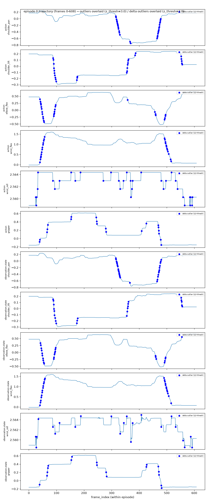

# Outlier Report -- so101_teleop_real

- keys checked: action, observation.state, timestamp
- total frames: 9022
- total episodes: 17
- mean/std source: `TeamRobotDataset.compute_custom_stats()` (reused as-is, not recomputed here)

> Detection + reporting only. No frames/episodes are filtered or removed by this script (out of v0.2 scope, spec section 8).

**요약 (CLAUDE.md 14절)**: 값 기준(`detect_outliers()`)과 delta 기준(`detect_outliers_delta()`)은 서로 다른 유형의 이상을 탐지하는 상호보완적 도구입니다 -- 값 기준은 평균에서 오래 벗어난 상태(지속적 극값)를, delta 기준은 직전 프레임 대비 급격한 변화(간헐적 전환)를 잡습니다. 하나로 통합하지 않고 둘 다 병행 유지합니다.

## Value-based outliers (`detect_outliers()`)

- z-score threshold: |z| > 3.0

## Episode-level summary (derived from frame-level results)

| episode_index | outlier frame count |
|---|---|
| 5 | 17 |
| 16 | 24 |

## Frame-level detail

| frame_idx | episode_index | key | dim | joint_name | value | mean | std | z |
|---|---|---|---|---|---|---|---|---|
| 823 | 5 | timestamp | () | None | 27.4333 | 9.4183 | 6.0034 | +3.001 |
| 824 | 5 | timestamp | () | None | 27.4667 | 9.4183 | 6.0034 | +3.006 |
| 825 | 5 | timestamp | () | None | 27.5000 | 9.4183 | 6.0034 | +3.012 |
| 826 | 5 | timestamp | () | None | 27.5333 | 9.4183 | 6.0034 | +3.017 |
| 827 | 5 | timestamp | () | None | 27.5667 | 9.4183 | 6.0034 | +3.023 |
| 828 | 5 | timestamp | () | None | 27.6000 | 9.4183 | 6.0034 | +3.029 |
| 829 | 5 | timestamp | () | None | 27.6333 | 9.4183 | 6.0034 | +3.034 |
| 830 | 5 | timestamp | () | None | 27.6667 | 9.4183 | 6.0034 | +3.040 |
| 831 | 5 | timestamp | () | None | 27.7000 | 9.4183 | 6.0034 | +3.045 |
| 832 | 5 | timestamp | () | None | 27.7333 | 9.4183 | 6.0034 | +3.051 |
| 833 | 5 | timestamp | () | None | 27.7667 | 9.4183 | 6.0034 | +3.056 |
| 834 | 5 | timestamp | () | None | 27.8000 | 9.4183 | 6.0034 | +3.062 |
| 835 | 5 | timestamp | () | None | 27.8333 | 9.4183 | 6.0034 | +3.067 |
| 836 | 5 | timestamp | () | None | 27.8667 | 9.4183 | 6.0034 | +3.073 |
| 837 | 5 | timestamp | () | None | 27.9000 | 9.4183 | 6.0034 | +3.079 |
| 838 | 5 | timestamp | () | None | 27.9333 | 9.4183 | 6.0034 | +3.084 |
| 839 | 5 | timestamp | () | None | 27.9667 | 9.4183 | 6.0034 | +3.090 |
| 42 | 16 | action | 1 | shoulder_lift | -0.5271 | 0.0524 | 0.1819 | -3.186 |
| 42 | 16 | observation.state | 1 | shoulder_lift | -0.5121 | 0.0523 | 0.1816 | -3.109 |
| 43 | 16 | action | 1 | shoulder_lift | -0.5667 | 0.0524 | 0.1819 | -3.404 |
| 43 | 16 | observation.state | 1 | shoulder_lift | -0.5532 | 0.0523 | 0.1816 | -3.335 |
| 44 | 16 | action | 1 | shoulder_lift | -0.5865 | 0.0524 | 0.1819 | -3.513 |
| 44 | 16 | observation.state | 1 | shoulder_lift | -0.5726 | 0.0523 | 0.1816 | -3.442 |
| 45 | 16 | action | 1 | shoulder_lift | -0.6148 | 0.0524 | 0.1819 | -3.669 |
| 45 | 16 | observation.state | 1 | shoulder_lift | -0.6049 | 0.0523 | 0.1816 | -3.620 |
| 46 | 16 | action | 1 | shoulder_lift | -0.6374 | 0.0524 | 0.1819 | -3.793 |
| 46 | 16 | observation.state | 1 | shoulder_lift | -0.6321 | 0.0523 | 0.1816 | -3.769 |
| 47 | 16 | action | 1 | shoulder_lift | -0.6445 | 0.0524 | 0.1819 | -3.832 |
| 47 | 16 | observation.state | 1 | shoulder_lift | -0.6389 | 0.0523 | 0.1816 | -3.807 |
| 48 | 16 | action | 1 | shoulder_lift | -0.6445 | 0.0524 | 0.1819 | -3.832 |
| 48 | 16 | observation.state | 1 | shoulder_lift | -0.6455 | 0.0523 | 0.1816 | -3.843 |
| 49 | 16 | action | 1 | shoulder_lift | -0.6403 | 0.0524 | 0.1819 | -3.809 |
| 49 | 16 | observation.state | 1 | shoulder_lift | -0.6404 | 0.0523 | 0.1816 | -3.815 |
| 50 | 16 | action | 1 | shoulder_lift | -0.6388 | 0.0524 | 0.1819 | -3.801 |
| 50 | 16 | observation.state | 1 | shoulder_lift | -0.6403 | 0.0523 | 0.1816 | -3.815 |
| 51 | 16 | action | 1 | shoulder_lift | -0.6388 | 0.0524 | 0.1819 | -3.801 |
| 51 | 16 | observation.state | 1 | shoulder_lift | -0.6392 | 0.0523 | 0.1816 | -3.809 |
| 52 | 16 | action | 1 | shoulder_lift | -0.6388 | 0.0524 | 0.1819 | -3.801 |
| 52 | 16 | observation.state | 1 | shoulder_lift | -0.6387 | 0.0523 | 0.1816 | -3.806 |
| 53 | 16 | action | 1 | shoulder_lift | -0.6374 | 0.0524 | 0.1819 | -3.793 |
| 53 | 16 | observation.state | 1 | shoulder_lift | -0.6386 | 0.0523 | 0.1816 | -3.805 |
| 54 | 16 | action | 1 | shoulder_lift | -0.6360 | 0.0524 | 0.1819 | -3.785 |
| 54 | 16 | observation.state | 1 | shoulder_lift | -0.6374 | 0.0523 | 0.1816 | -3.799 |
| 55 | 16 | action | 1 | shoulder_lift | -0.6318 | 0.0524 | 0.1819 | -3.762 |
| 55 | 16 | observation.state | 1 | shoulder_lift | -0.6341 | 0.0523 | 0.1816 | -3.780 |
| 56 | 16 | action | 1 | shoulder_lift | -0.6289 | 0.0524 | 0.1819 | -3.746 |
| 56 | 16 | observation.state | 1 | shoulder_lift | -0.6307 | 0.0523 | 0.1816 | -3.762 |
| 57 | 16 | action | 1 | shoulder_lift | -0.6219 | 0.0524 | 0.1819 | -3.708 |
| 57 | 16 | observation.state | 1 | shoulder_lift | -0.6233 | 0.0523 | 0.1816 | -3.721 |
| 58 | 16 | action | 1 | shoulder_lift | -0.6134 | 0.0524 | 0.1819 | -3.661 |
| 58 | 16 | observation.state | 1 | shoulder_lift | -0.6162 | 0.0523 | 0.1816 | -3.682 |
| 59 | 16 | action | 1 | shoulder_lift | -0.6063 | 0.0524 | 0.1819 | -3.622 |
| 59 | 16 | observation.state | 1 | shoulder_lift | -0.6121 | 0.0523 | 0.1816 | -3.659 |
| 60 | 16 | action | 1 | shoulder_lift | -0.5893 | 0.0524 | 0.1819 | -3.529 |
| 60 | 16 | observation.state | 1 | shoulder_lift | -0.5953 | 0.0523 | 0.1816 | -3.567 |
| 61 | 16 | action | 1 | shoulder_lift | -0.5695 | 0.0524 | 0.1819 | -3.420 |
| 61 | 16 | observation.state | 1 | shoulder_lift | -0.5766 | 0.0523 | 0.1816 | -3.464 |
| 62 | 16 | action | 1 | shoulder_lift | -0.5568 | 0.0524 | 0.1819 | -3.350 |
| 62 | 16 | observation.state | 1 | shoulder_lift | -0.5668 | 0.0523 | 0.1816 | -3.410 |
| 63 | 16 | action | 1 | shoulder_lift | -0.5299 | 0.0524 | 0.1819 | -3.202 |
| 63 | 16 | observation.state | 1 | shoulder_lift | -0.5400 | 0.0523 | 0.1816 | -3.262 |
| 64 | 16 | action | 1 | shoulder_lift | -0.5058 | 0.0524 | 0.1819 | -3.070 |
| 64 | 16 | observation.state | 1 | shoulder_lift | -0.5133 | 0.0523 | 0.1816 | -3.115 |
| 65 | 16 | observation.state | 1 | shoulder_lift | -0.5030 | 0.0523 | 0.1816 | -3.058 |

## Delta-based outliers (`detect_outliers_delta()`)

- z-score threshold: |z| > 3.0
- delta = value[frame] - value[previous frame] within the same episode (never computed across an episode boundary; each episode's first frame has no delta and cannot be flagged)

## Episode-level summary (derived from frame-level results)

| episode_index | outlier frame count |
|---|---|
| 0 | 171 |
| 1 | 169 |
| 2 | 148 |
| 3 | 113 |
| 4 | 136 |
| 5 | 237 |
| 6 | 119 |
| 7 | 168 |
| 8 | 205 |
| 9 | 171 |
| 10 | 148 |
| 12 | 7 |
| 13 | 19 |
| 14 | 16 |
| 15 | 134 |
| 16 | 150 |

## Frame-level detail

| frame_idx | episode_index | key | dim | joint_name | value | mean | std | z |
|---|---|---|---|---|---|---|---|---|
| 25 | 0 | action | 4 | wrist_roll | 0.0014 | -0.0000 | 0.0004 | +3.341 |
| 25 | 0 | observation.state | 4 | wrist_roll | 0.0017 | -0.0000 | 0.0005 | +3.543 |
| 27 | 0 | action | 4 | wrist_roll | -0.0014 | -0.0000 | 0.0004 | -3.340 |
| 27 | 0 | observation.state | 4 | wrist_roll | -0.0016 | -0.0000 | 0.0005 | -3.401 |
| 28 | 0 | action | 4 | wrist_roll | 0.0014 | -0.0000 | 0.0004 | +3.341 |
| 28 | 0 | observation.state | 4 | wrist_roll | 0.0021 | -0.0000 | 0.0005 | +4.421 |
| 32 | 0 | action | 4 | wrist_roll | 0.0014 | -0.0000 | 0.0004 | +3.341 |
| 33 | 0 | action | 4 | wrist_roll | 0.0027 | -0.0000 | 0.0004 | +6.681 |
| 34 | 0 | observation.state | 4 | wrist_roll | 0.0027 | -0.0000 | 0.0005 | +5.571 |
| 39 | 0 | action | 5 | gripper | 0.0479 | 0.0000 | 0.0152 | +3.147 |
| 39 | 0 | observation.state | 5 | gripper | 0.0519 | 0.0000 | 0.0157 | +3.315 |
| 40 | 0 | action | 2 | elbow_flex | -0.0509 | 0.0000 | 0.0138 | -3.682 |
| 40 | 0 | action | 3 | wrist_flex | 0.0731 | -0.0000 | 0.0166 | +4.420 |
| 40 | 0 | action | 5 | gripper | 0.0525 | 0.0000 | 0.0152 | +3.451 |
| 40 | 0 | observation.state | 3 | wrist_flex | 0.0508 | -0.0000 | 0.0169 | +3.008 |
| 42 | 0 | action | 2 | elbow_flex | -0.0617 | 0.0000 | 0.0138 | -4.462 |
| 42 | 0 | action | 3 | wrist_flex | 0.0953 | -0.0000 | 0.0166 | +5.761 |
| 42 | 0 | observation.state | 2 | elbow_flex | -0.0496 | 0.0000 | 0.0141 | -3.530 |
| 42 | 0 | observation.state | 3 | wrist_flex | 0.0927 | -0.0000 | 0.0169 | +5.495 |
| 43 | 0 | action | 2 | elbow_flex | -0.0664 | 0.0000 | 0.0138 | -4.797 |
| 43 | 0 | action | 3 | wrist_flex | 0.0940 | -0.0000 | 0.0166 | +5.682 |
| 43 | 0 | observation.state | 2 | elbow_flex | -0.0713 | 0.0000 | 0.0141 | -5.070 |
| 43 | 0 | observation.state | 3 | wrist_flex | 0.0968 | -0.0000 | 0.0169 | +5.734 |
| 44 | 0 | action | 2 | elbow_flex | -0.0432 | 0.0000 | 0.0138 | -3.124 |
| 44 | 0 | action | 3 | wrist_flex | 0.0601 | -0.0000 | 0.0166 | +3.631 |
| 45 | 0 | action | 2 | elbow_flex | -0.0772 | 0.0000 | 0.0138 | -5.577 |
| 45 | 0 | action | 3 | wrist_flex | 0.1006 | -0.0000 | 0.0166 | +6.077 |
| 45 | 0 | observation.state | 2 | elbow_flex | -0.0837 | 0.0000 | 0.0141 | -5.948 |
| 45 | 0 | observation.state | 3 | wrist_flex | 0.1160 | -0.0000 | 0.0169 | +6.874 |
| 46 | 0 | action | 2 | elbow_flex | -0.0710 | 0.0000 | 0.0138 | -5.131 |
| 46 | 0 | action | 3 | wrist_flex | 0.0953 | -0.0000 | 0.0166 | +5.761 |
| 46 | 0 | observation.state | 2 | elbow_flex | -0.0749 | 0.0000 | 0.0141 | -5.323 |
| 46 | 0 | observation.state | 3 | wrist_flex | 0.0961 | -0.0000 | 0.0169 | +5.698 |
| 48 | 0 | action | 2 | elbow_flex | -0.0772 | 0.0000 | 0.0138 | -5.577 |
| 48 | 0 | action | 3 | wrist_flex | 0.0940 | -0.0000 | 0.0166 | +5.682 |
| 48 | 0 | observation.state | 2 | elbow_flex | -0.0790 | 0.0000 | 0.0141 | -5.617 |
| 48 | 0 | observation.state | 3 | wrist_flex | 0.1038 | -0.0000 | 0.0169 | +6.151 |
| 49 | 0 | action | 2 | elbow_flex | -0.0741 | 0.0000 | 0.0138 | -5.354 |
| 49 | 0 | action | 3 | wrist_flex | 0.0927 | -0.0000 | 0.0166 | +5.604 |
| 49 | 0 | observation.state | 2 | elbow_flex | -0.0772 | 0.0000 | 0.0141 | -5.490 |
| 49 | 0 | observation.state | 3 | wrist_flex | 0.0906 | -0.0000 | 0.0169 | +5.370 |
| 51 | 0 | action | 2 | elbow_flex | -0.0695 | 0.0000 | 0.0138 | -5.019 |
| 51 | 0 | action | 3 | wrist_flex | 0.0888 | -0.0000 | 0.0166 | +5.367 |
| 51 | 0 | observation.state | 2 | elbow_flex | -0.0665 | 0.0000 | 0.0141 | -4.728 |
| 51 | 0 | observation.state | 3 | wrist_flex | 0.0882 | -0.0000 | 0.0169 | +5.227 |
| 52 | 0 | action | 2 | elbow_flex | -0.0586 | 0.0000 | 0.0138 | -4.239 |
| 52 | 0 | action | 3 | wrist_flex | 0.0888 | -0.0000 | 0.0166 | +5.367 |
| 52 | 0 | observation.state | 2 | elbow_flex | -0.0688 | 0.0000 | 0.0141 | -4.887 |
| 52 | 0 | observation.state | 3 | wrist_flex | 0.0902 | -0.0000 | 0.0169 | +5.346 |
| 54 | 0 | action | 2 | elbow_flex | -0.0478 | 0.0000 | 0.0138 | -3.459 |
| 54 | 0 | action | 3 | wrist_flex | 0.0718 | -0.0000 | 0.0166 | +4.341 |
| 54 | 0 | observation.state | 2 | elbow_flex | -0.0533 | 0.0000 | 0.0141 | -3.788 |
| 54 | 0 | observation.state | 3 | wrist_flex | 0.0773 | -0.0000 | 0.0169 | +4.579 |
| 55 | 0 | action | 2 | elbow_flex | -0.0494 | 0.0000 | 0.0138 | -3.570 |
| 55 | 0 | action | 3 | wrist_flex | 0.0784 | -0.0000 | 0.0166 | +4.735 |
| 55 | 0 | observation.state | 2 | elbow_flex | -0.0456 | 0.0000 | 0.0141 | -3.243 |
| 55 | 0 | observation.state | 3 | wrist_flex | 0.0732 | -0.0000 | 0.0169 | +4.341 |
| 57 | 0 | action | 3 | wrist_flex | 0.0692 | -0.0000 | 0.0166 | +4.183 |
| 57 | 0 | observation.state | 3 | wrist_flex | 0.0714 | -0.0000 | 0.0169 | +4.229 |
| 58 | 0 | observation.state | 3 | wrist_flex | 0.0594 | -0.0000 | 0.0169 | +3.519 |
| 66 | 0 | action | 5 | gripper | 0.0803 | 0.0000 | 0.0152 | +5.279 |
| 66 | 0 | observation.state | 5 | gripper | 0.0779 | 0.0000 | 0.0157 | +4.976 |
| 67 | 0 | action | 5 | gripper | 0.0695 | 0.0000 | 0.0152 | +4.568 |
| 67 | 0 | observation.state | 5 | gripper | 0.0846 | 0.0000 | 0.0157 | +5.402 |
| 69 | 0 | action | 5 | gripper | 0.0680 | 0.0000 | 0.0152 | +4.467 |
| 69 | 0 | observation.state | 5 | gripper | 0.0693 | 0.0000 | 0.0157 | +4.424 |
| 70 | 0 | observation.state | 5 | gripper | 0.0550 | 0.0000 | 0.0157 | +3.515 |
| 87 | 0 | action | 4 | wrist_roll | -0.0014 | -0.0000 | 0.0004 | -3.340 |
| 87 | 0 | observation.state | 4 | wrist_roll | -0.0018 | -0.0000 | 0.0005 | -3.665 |
| 88 | 0 | action | 1 | shoulder_lift | -0.0382 | -0.0000 | 0.0057 | -6.654 |
| 88 | 0 | observation.state | 1 | shoulder_lift | -0.0250 | -0.0000 | 0.0059 | -4.229 |
| 89 | 0 | action | 1 | shoulder_lift | -0.0283 | -0.0000 | 0.0057 | -4.928 |
| 89 | 0 | observation.state | 1 | shoulder_lift | -0.0241 | -0.0000 | 0.0059 | -4.073 |
| 90 | 0 | action | 1 | shoulder_lift | -0.0665 | -0.0000 | 0.0057 | -11.586 |
| 90 | 0 | action | 2 | elbow_flex | 0.0556 | 0.0000 | 0.0138 | +4.011 |
| 90 | 0 | observation.state | 1 | shoulder_lift | -0.0615 | -0.0000 | 0.0059 | -10.409 |
| 90 | 0 | observation.state | 2 | elbow_flex | 0.0520 | 0.0000 | 0.0141 | +3.691 |
| 91 | 0 | action | 1 | shoulder_lift | -0.0693 | -0.0000 | 0.0057 | -12.079 |
| 91 | 0 | action | 2 | elbow_flex | 0.0602 | 0.0000 | 0.0138 | +4.345 |
| 91 | 0 | observation.state | 1 | shoulder_lift | -0.0714 | -0.0000 | 0.0059 | -12.075 |
| 91 | 0 | observation.state | 2 | elbow_flex | 0.0590 | 0.0000 | 0.0141 | +4.188 |
| 92 | 0 | action | 1 | shoulder_lift | -0.0396 | -0.0000 | 0.0057 | -6.901 |
| 92 | 0 | action | 2 | elbow_flex | 0.0417 | 0.0000 | 0.0138 | +3.007 |
| 92 | 0 | observation.state | 1 | shoulder_lift | -0.0352 | -0.0000 | 0.0059 | -5.954 |
| 93 | 0 | action | 1 | shoulder_lift | -0.0410 | -0.0000 | 0.0057 | -7.147 |
| 93 | 0 | action | 2 | elbow_flex | 0.0602 | 0.0000 | 0.0138 | +4.345 |
| 93 | 0 | observation.state | 1 | shoulder_lift | -0.0672 | -0.0000 | 0.0059 | -11.364 |
| 93 | 0 | observation.state | 2 | elbow_flex | 0.0779 | 0.0000 | 0.0141 | +5.531 |
| 94 | 0 | action | 1 | shoulder_lift | -0.0354 | -0.0000 | 0.0057 | -6.161 |
| 94 | 0 | action | 2 | elbow_flex | 0.0787 | 0.0000 | 0.0138 | +5.683 |
| 94 | 0 | action | 4 | wrist_roll | -0.0014 | -0.0000 | 0.0004 | -3.340 |
| 94 | 0 | observation.state | 2 | elbow_flex | 0.0548 | 0.0000 | 0.0141 | +3.889 |
| 95 | 0 | observation.state | 1 | shoulder_lift | -0.0304 | -0.0000 | 0.0059 | -5.134 |
| 95 | 0 | observation.state | 2 | elbow_flex | 0.0520 | 0.0000 | 0.0141 | +3.691 |
| 95 | 0 | observation.state | 4 | wrist_roll | -0.0017 | -0.0000 | 0.0005 | -3.558 |
| 96 | 0 | action | 1 | shoulder_lift | -0.0255 | -0.0000 | 0.0057 | -4.435 |
| 96 | 0 | action | 2 | elbow_flex | 0.0679 | 0.0000 | 0.0138 | +4.903 |
| 96 | 0 | observation.state | 2 | elbow_flex | 0.0727 | 0.0000 | 0.0141 | +5.159 |
| 97 | 0 | action | 1 | shoulder_lift | -0.0269 | -0.0000 | 0.0057 | -4.681 |
| 97 | 0 | action | 2 | elbow_flex | 0.0540 | 0.0000 | 0.0138 | +3.899 |
| 97 | 0 | observation.state | 1 | shoulder_lift | -0.0313 | -0.0000 | 0.0059 | -5.295 |
| 97 | 0 | observation.state | 2 | elbow_flex | 0.0602 | 0.0000 | 0.0141 | +4.273 |
| 99 | 0 | action | 1 | shoulder_lift | -0.0212 | -0.0000 | 0.0057 | -3.695 |
| 99 | 0 | observation.state | 1 | shoulder_lift | -0.0264 | -0.0000 | 0.0059 | -4.459 |
| 111 | 0 | action | 4 | wrist_roll | 0.0014 | -0.0000 | 0.0004 | +3.341 |
| 111 | 0 | observation.state | 4 | wrist_roll | 0.0018 | -0.0000 | 0.0005 | +3.755 |
| 153 | 0 | action | 4 | wrist_roll | 0.0014 | -0.0000 | 0.0004 | +3.341 |
| 153 | 0 | action | 5 | gripper | 0.0494 | 0.0000 | 0.0152 | +3.248 |
| 154 | 0 | action | 5 | gripper | 0.0556 | 0.0000 | 0.0152 | +3.654 |
| 154 | 0 | observation.state | 5 | gripper | 0.0547 | 0.0000 | 0.0157 | +3.494 |
| 156 | 0 | observation.state | 5 | gripper | 0.0480 | 0.0000 | 0.0157 | +3.069 |
| 168 | 0 | action | 4 | wrist_roll | -0.0014 | -0.0000 | 0.0004 | -3.340 |
| 168 | 0 | observation.state | 4 | wrist_roll | -0.0018 | -0.0000 | 0.0005 | -3.744 |
| 174 | 0 | action | 1 | shoulder_lift | 0.0340 | -0.0000 | 0.0057 | +5.923 |
| 174 | 0 | observation.state | 1 | shoulder_lift | 0.0319 | -0.0000 | 0.0059 | +5.403 |
| 175 | 0 | action | 1 | shoulder_lift | 0.0368 | -0.0000 | 0.0057 | +6.416 |
| 175 | 0 | observation.state | 1 | shoulder_lift | 0.0410 | -0.0000 | 0.0059 | +6.941 |
| 176 | 0 | action | 1 | shoulder_lift | 0.0184 | -0.0000 | 0.0057 | +3.210 |
| 177 | 0 | observation.state | 1 | shoulder_lift | 0.0240 | -0.0000 | 0.0059 | +4.062 |
| 187 | 0 | action | 4 | wrist_roll | 0.0014 | -0.0000 | 0.0004 | +3.341 |
| 188 | 0 | observation.state | 4 | wrist_roll | 0.0018 | -0.0000 | 0.0005 | +3.764 |
| 244 | 0 | action | 5 | gripper | -0.0587 | 0.0000 | 0.0152 | -3.857 |
| 246 | 0 | action | 5 | gripper | -0.0633 | 0.0000 | 0.0152 | -4.162 |
| 246 | 0 | observation.state | 5 | gripper | -0.0640 | 0.0000 | 0.0157 | -4.086 |
| 247 | 0 | action | 5 | gripper | -0.0618 | 0.0000 | 0.0152 | -4.061 |
| 247 | 0 | observation.state | 5 | gripper | -0.0604 | 0.0000 | 0.0157 | -3.861 |
| 270 | 0 | action | 4 | wrist_roll | -0.0014 | -0.0000 | 0.0004 | -3.340 |
| 279 | 0 | action | 5 | gripper | -0.0541 | 0.0000 | 0.0152 | -3.553 |
| 280 | 0 | action | 5 | gripper | -0.0788 | 0.0000 | 0.0152 | -5.177 |
| 280 | 0 | observation.state | 5 | gripper | -0.0664 | 0.0000 | 0.0157 | -4.244 |
| 282 | 0 | observation.state | 5 | gripper | -0.0643 | 0.0000 | 0.0157 | -4.110 |
| 298 | 0 | action | 4 | wrist_roll | 0.0014 | -0.0000 | 0.0004 | +3.341 |
| 299 | 0 | observation.state | 4 | wrist_roll | 0.0017 | -0.0000 | 0.0005 | +3.648 |
| 315 | 0 | action | 0 | shoulder_pan | -0.0380 | -0.0000 | 0.0094 | -4.034 |
| 315 | 0 | observation.state | 0 | shoulder_pan | -0.0377 | -0.0000 | 0.0099 | -3.796 |
| 316 | 0 | action | 0 | shoulder_pan | -0.0333 | -0.0000 | 0.0094 | -3.529 |
| 316 | 0 | observation.state | 0 | shoulder_pan | -0.0342 | -0.0000 | 0.0099 | -3.440 |
| 318 | 0 | action | 0 | shoulder_pan | -0.0412 | -0.0000 | 0.0094 | -4.370 |
| 318 | 0 | observation.state | 0 | shoulder_pan | -0.0481 | -0.0000 | 0.0099 | -4.837 |
| 319 | 0 | action | 0 | shoulder_pan | -0.0459 | -0.0000 | 0.0094 | -4.874 |
| 319 | 0 | observation.state | 0 | shoulder_pan | -0.0357 | -0.0000 | 0.0099 | -3.589 |
| 320 | 0 | action | 0 | shoulder_pan | -0.0285 | -0.0000 | 0.0094 | -3.025 |
| 320 | 0 | observation.state | 0 | shoulder_pan | -0.0312 | -0.0000 | 0.0099 | -3.143 |
| 321 | 0 | action | 0 | shoulder_pan | -0.0428 | -0.0000 | 0.0094 | -4.538 |
| 321 | 0 | observation.state | 0 | shoulder_pan | -0.0473 | -0.0000 | 0.0099 | -4.760 |
| 322 | 0 | action | 0 | shoulder_pan | -0.0412 | -0.0000 | 0.0094 | -4.370 |
| 322 | 0 | observation.state | 0 | shoulder_pan | -0.0379 | -0.0000 | 0.0099 | -3.812 |
| 323 | 0 | action | 0 | shoulder_pan | -0.0285 | -0.0000 | 0.0094 | -3.025 |
| 324 | 0 | action | 0 | shoulder_pan | -0.0475 | -0.0000 | 0.0094 | -5.042 |
| 324 | 0 | observation.state | 0 | shoulder_pan | -0.0581 | -0.0000 | 0.0099 | -5.840 |
| 325 | 0 | action | 0 | shoulder_pan | -0.0507 | -0.0000 | 0.0094 | -5.378 |
| 325 | 0 | observation.state | 0 | shoulder_pan | -0.0414 | -0.0000 | 0.0099 | -4.162 |
| 326 | 0 | action | 4 | wrist_roll | -0.0014 | -0.0000 | 0.0004 | -3.340 |
| 326 | 0 | observation.state | 0 | shoulder_pan | -0.0311 | -0.0000 | 0.0099 | -3.130 |
| 327 | 0 | action | 0 | shoulder_pan | -0.0396 | -0.0000 | 0.0094 | -4.202 |
| 327 | 0 | observation.state | 0 | shoulder_pan | -0.0468 | -0.0000 | 0.0099 | -4.710 |
| 328 | 0 | action | 0 | shoulder_pan | -0.0475 | -0.0000 | 0.0094 | -5.042 |
| 328 | 0 | observation.state | 0 | shoulder_pan | -0.0347 | -0.0000 | 0.0099 | -3.491 |
| 329 | 0 | observation.state | 0 | shoulder_pan | -0.0342 | -0.0000 | 0.0099 | -3.441 |
| 330 | 0 | action | 0 | shoulder_pan | -0.0412 | -0.0000 | 0.0094 | -4.370 |
| 330 | 0 | observation.state | 0 | shoulder_pan | -0.0356 | -0.0000 | 0.0099 | -3.577 |
| 331 | 0 | action | 4 | wrist_roll | -0.0014 | -0.0000 | 0.0004 | -3.340 |
| 331 | 0 | observation.state | 0 | shoulder_pan | -0.0344 | -0.0000 | 0.0099 | -3.455 |
| 331 | 0 | observation.state | 4 | wrist_roll | -0.0017 | -0.0000 | 0.0005 | -3.542 |
| 343 | 0 | action | 4 | wrist_roll | 0.0014 | -0.0000 | 0.0004 | +3.341 |
| 344 | 0 | observation.state | 4 | wrist_roll | 0.0018 | -0.0000 | 0.0005 | +3.747 |
| 355 | 0 | action | 1 | shoulder_lift | 0.0283 | -0.0000 | 0.0057 | +4.936 |
| 355 | 0 | action | 4 | wrist_roll | 0.0014 | -0.0000 | 0.0004 | +3.341 |
| 355 | 0 | observation.state | 1 | shoulder_lift | 0.0206 | -0.0000 | 0.0059 | +3.493 |
| 355 | 0 | observation.state | 4 | wrist_roll | 0.0017 | -0.0000 | 0.0005 | +3.543 |
| 356 | 0 | action | 1 | shoulder_lift | 0.0255 | -0.0000 | 0.0057 | +4.443 |
| 357 | 0 | action | 1 | shoulder_lift | 0.0509 | -0.0000 | 0.0057 | +8.882 |
| 357 | 0 | observation.state | 1 | shoulder_lift | 0.0533 | -0.0000 | 0.0059 | +9.031 |
| 358 | 0 | action | 1 | shoulder_lift | 0.0552 | -0.0000 | 0.0057 | +9.622 |
| 358 | 0 | action | 2 | elbow_flex | -0.0525 | 0.0000 | 0.0138 | -3.793 |
| 358 | 0 | observation.state | 1 | shoulder_lift | 0.0543 | -0.0000 | 0.0059 | +9.194 |
| 359 | 0 | action | 1 | shoulder_lift | 0.0283 | -0.0000 | 0.0057 | +4.936 |
| 359 | 0 | observation.state | 1 | shoulder_lift | 0.0297 | -0.0000 | 0.0059 | +5.035 |
| 360 | 0 | action | 1 | shoulder_lift | 0.0354 | -0.0000 | 0.0057 | +6.169 |
| 360 | 0 | observation.state | 1 | shoulder_lift | 0.0408 | -0.0000 | 0.0059 | +6.915 |
| 361 | 0 | action | 1 | shoulder_lift | 0.0241 | -0.0000 | 0.0057 | +4.196 |
| 361 | 0 | observation.state | 1 | shoulder_lift | 0.0320 | -0.0000 | 0.0059 | +5.415 |
| 366 | 0 | observation.state | 0 | shoulder_pan | -0.0337 | -0.0000 | 0.0099 | -3.385 |
| 367 | 0 | action | 0 | shoulder_pan | -0.0317 | -0.0000 | 0.0094 | -3.361 |
| 369 | 0 | action | 0 | shoulder_pan | -0.0301 | -0.0000 | 0.0094 | -3.193 |
| 369 | 0 | action | 4 | wrist_roll | -0.0014 | -0.0000 | 0.0004 | -3.340 |
| 370 | 0 | action | 4 | wrist_roll | -0.0027 | -0.0000 | 0.0004 | -6.681 |
| 370 | 0 | observation.state | 4 | wrist_roll | -0.0048 | -0.0000 | 0.0005 | -9.966 |
| 374 | 0 | action | 4 | wrist_roll | 0.0014 | -0.0000 | 0.0004 | +3.341 |
| 376 | 0 | action | 4 | wrist_roll | 0.0014 | -0.0000 | 0.0004 | +3.341 |
| 376 | 0 | observation.state | 4 | wrist_roll | 0.0019 | -0.0000 | 0.0005 | +3.914 |
| 385 | 0 | action | 1 | shoulder_lift | 0.0184 | -0.0000 | 0.0057 | +3.210 |
| 387 | 0 | action | 1 | shoulder_lift | 0.0184 | -0.0000 | 0.0057 | +3.210 |
| 407 | 0 | action | 4 | wrist_roll | 0.0014 | -0.0000 | 0.0004 | +3.341 |
| 408 | 0 | observation.state | 4 | wrist_roll | 0.0016 | -0.0000 | 0.0005 | +3.371 |
| 409 | 0 | action | 5 | gripper | 0.0541 | 0.0000 | 0.0152 | +3.553 |
| 426 | 0 | action | 5 | gripper | 0.0571 | 0.0000 | 0.0152 | +3.756 |
| 426 | 0 | observation.state | 5 | gripper | 0.0618 | 0.0000 | 0.0157 | +3.949 |
| 427 | 0 | observation.state | 5 | gripper | 0.0491 | 0.0000 | 0.0157 | +3.135 |
| 457 | 0 | action | 2 | elbow_flex | -0.0432 | 0.0000 | 0.0138 | -3.124 |
| 459 | 0 | action | 2 | elbow_flex | -0.0478 | 0.0000 | 0.0138 | -3.459 |
| 459 | 0 | observation.state | 2 | elbow_flex | -0.0508 | 0.0000 | 0.0141 | -3.611 |
| 460 | 0 | action | 2 | elbow_flex | -0.0432 | 0.0000 | 0.0138 | -3.124 |
| 460 | 0 | observation.state | 2 | elbow_flex | -0.0439 | 0.0000 | 0.0141 | -3.121 |
| 462 | 0 | observation.state | 2 | elbow_flex | -0.0451 | 0.0000 | 0.0141 | -3.204 |
| 465 | 0 | action | 0 | shoulder_pan | 0.0459 | -0.0000 | 0.0094 | +4.875 |
| 465 | 0 | observation.state | 0 | shoulder_pan | 0.0445 | -0.0000 | 0.0099 | +4.479 |
| 466 | 0 | action | 0 | shoulder_pan | 0.0507 | -0.0000 | 0.0094 | +5.379 |
| 466 | 0 | observation.state | 0 | shoulder_pan | 0.0496 | -0.0000 | 0.0099 | +4.987 |
| 467 | 0 | action | 0 | shoulder_pan | 0.0317 | -0.0000 | 0.0094 | +3.362 |
| 468 | 0 | action | 0 | shoulder_pan | 0.0618 | -0.0000 | 0.0094 | +6.556 |
| 468 | 0 | observation.state | 0 | shoulder_pan | 0.0645 | -0.0000 | 0.0099 | +6.489 |
| 469 | 0 | action | 0 | shoulder_pan | 0.0491 | -0.0000 | 0.0094 | +5.211 |
| 469 | 0 | action | 5 | gripper | -0.0618 | 0.0000 | 0.0152 | -4.061 |
| 469 | 0 | observation.state | 0 | shoulder_pan | 0.0587 | -0.0000 | 0.0099 | +5.902 |
| 469 | 0 | observation.state | 5 | gripper | -0.0543 | 0.0000 | 0.0157 | -3.471 |
| 470 | 0 | action | 0 | shoulder_pan | 0.0285 | -0.0000 | 0.0094 | +3.026 |
| 470 | 0 | action | 5 | gripper | -0.0510 | 0.0000 | 0.0152 | -3.350 |
| 471 | 0 | action | 0 | shoulder_pan | 0.0412 | -0.0000 | 0.0094 | +4.371 |
| 471 | 0 | action | 5 | gripper | -0.0788 | 0.0000 | 0.0152 | -5.177 |
| 471 | 0 | observation.state | 0 | shoulder_pan | 0.0553 | -0.0000 | 0.0099 | +5.567 |
| 471 | 0 | observation.state | 5 | gripper | -0.0940 | 0.0000 | 0.0157 | -6.005 |
| 472 | 0 | action | 0 | shoulder_pan | 0.0570 | -0.0000 | 0.0094 | +6.051 |
| 472 | 0 | action | 5 | gripper | -0.0726 | 0.0000 | 0.0152 | -4.771 |
| 472 | 0 | observation.state | 0 | shoulder_pan | 0.0336 | -0.0000 | 0.0099 | +3.378 |
| 472 | 0 | observation.state | 5 | gripper | -0.0775 | 0.0000 | 0.0157 | -4.953 |
| 473 | 0 | action | 0 | shoulder_pan | 0.0317 | -0.0000 | 0.0094 | +3.362 |
| 473 | 0 | observation.state | 0 | shoulder_pan | 0.0376 | -0.0000 | 0.0099 | +3.781 |
| 474 | 0 | action | 0 | shoulder_pan | 0.0633 | -0.0000 | 0.0094 | +6.724 |
| 474 | 0 | observation.state | 0 | shoulder_pan | 0.0703 | -0.0000 | 0.0099 | +7.074 |
| 475 | 0 | action | 0 | shoulder_pan | 0.0586 | -0.0000 | 0.0094 | +6.220 |
| 475 | 0 | observation.state | 0 | shoulder_pan | 0.0558 | -0.0000 | 0.0099 | +5.615 |
| 476 | 0 | action | 0 | shoulder_pan | 0.0301 | -0.0000 | 0.0094 | +3.194 |
| 477 | 0 | action | 0 | shoulder_pan | 0.0554 | -0.0000 | 0.0094 | +5.883 |
| 477 | 0 | observation.state | 0 | shoulder_pan | 0.0608 | -0.0000 | 0.0099 | +6.119 |
| 478 | 0 | action | 0 | shoulder_pan | 0.0380 | -0.0000 | 0.0094 | +4.034 |
| 478 | 0 | action | 5 | gripper | -0.0463 | 0.0000 | 0.0152 | -3.045 |
| 478 | 0 | observation.state | 0 | shoulder_pan | 0.0451 | -0.0000 | 0.0099 | +4.534 |
| 480 | 0 | action | 4 | wrist_roll | -0.0014 | -0.0000 | 0.0004 | -3.340 |
| 480 | 0 | action | 5 | gripper | -0.0880 | 0.0000 | 0.0152 | -5.786 |
| 480 | 0 | observation.state | 0 | shoulder_pan | 0.0377 | -0.0000 | 0.0099 | +3.790 |
| 480 | 0 | observation.state | 4 | wrist_roll | -0.0017 | -0.0000 | 0.0005 | -3.593 |
| 480 | 0 | observation.state | 5 | gripper | -0.0817 | 0.0000 | 0.0157 | -5.219 |
| 481 | 0 | observation.state | 5 | gripper | -0.0646 | 0.0000 | 0.0157 | -4.125 |
| 482 | 0 | timestamp | () | None | 0.0333 | 0.0333 | 0.0000 | +3.113 |
| 486 | 0 | timestamp | () | None | 0.0333 | 0.0333 | 0.0000 | +3.113 |
| 488 | 0 | action | 4 | wrist_roll | -0.0014 | -0.0000 | 0.0004 | -3.340 |
| 490 | 0 | observation.state | 3 | wrist_flex | -0.0520 | -0.0000 | 0.0169 | -3.081 |
| 490 | 0 | timestamp | () | None | 0.0333 | 0.0333 | 0.0000 | +3.113 |
| 492 | 0 | action | 2 | elbow_flex | 0.0617 | 0.0000 | 0.0138 | +4.457 |
| 492 | 0 | action | 3 | wrist_flex | -0.0771 | -0.0000 | 0.0166 | -4.655 |
| 492 | 0 | observation.state | 2 | elbow_flex | 0.0648 | 0.0000 | 0.0141 | +4.600 |
| 492 | 0 | observation.state | 3 | wrist_flex | -0.0769 | -0.0000 | 0.0169 | -4.554 |
| 493 | 0 | action | 2 | elbow_flex | 0.0602 | 0.0000 | 0.0138 | +4.345 |
| 493 | 0 | action | 3 | wrist_flex | -0.0679 | -0.0000 | 0.0166 | -4.103 |
| 493 | 0 | observation.state | 2 | elbow_flex | 0.0589 | 0.0000 | 0.0141 | +4.183 |
| 493 | 0 | observation.state | 3 | wrist_flex | -0.0739 | -0.0000 | 0.0169 | -4.379 |
| 494 | 0 | timestamp | () | None | 0.0333 | 0.0333 | 0.0000 | +3.113 |
| 495 | 0 | action | 2 | elbow_flex | 0.0525 | 0.0000 | 0.0138 | +3.788 |
| 495 | 0 | action | 3 | wrist_flex | -0.0718 | -0.0000 | 0.0166 | -4.340 |
| 495 | 0 | observation.state | 2 | elbow_flex | 0.0549 | 0.0000 | 0.0141 | +3.898 |
| 495 | 0 | observation.state | 3 | wrist_flex | -0.0785 | -0.0000 | 0.0169 | -4.652 |
| 496 | 0 | action | 2 | elbow_flex | 0.0417 | 0.0000 | 0.0138 | +3.007 |
| 496 | 0 | action | 3 | wrist_flex | -0.0679 | -0.0000 | 0.0166 | -4.103 |
| 496 | 0 | observation.state | 2 | elbow_flex | 0.0455 | 0.0000 | 0.0141 | +3.230 |
| 496 | 0 | observation.state | 3 | wrist_flex | -0.0652 | -0.0000 | 0.0169 | -3.861 |
| 497 | 0 | action | 4 | wrist_roll | 0.0014 | -0.0000 | 0.0004 | +3.341 |
| 497 | 0 | timestamp | () | None | 0.0333 | 0.0333 | 0.0000 | +3.113 |
| 498 | 0 | action | 3 | wrist_flex | -0.0666 | -0.0000 | 0.0166 | -4.024 |
| 498 | 0 | observation.state | 3 | wrist_flex | -0.0688 | -0.0000 | 0.0169 | -4.077 |
| 499 | 0 | action | 3 | wrist_flex | -0.0614 | -0.0000 | 0.0166 | -3.708 |
| 499 | 0 | observation.state | 3 | wrist_flex | -0.0635 | -0.0000 | 0.0169 | -3.761 |
| 501 | 0 | action | 3 | wrist_flex | -0.0653 | -0.0000 | 0.0166 | -3.945 |
| 501 | 0 | observation.state | 3 | wrist_flex | -0.0568 | -0.0000 | 0.0169 | -3.364 |
| 501 | 0 | timestamp | () | None | 0.0333 | 0.0333 | 0.0000 | +3.113 |
| 502 | 0 | action | 3 | wrist_flex | -0.0640 | -0.0000 | 0.0166 | -3.866 |
| 502 | 0 | observation.state | 3 | wrist_flex | -0.0691 | -0.0000 | 0.0169 | -4.096 |
| 504 | 0 | action | 3 | wrist_flex | -0.0549 | -0.0000 | 0.0166 | -3.314 |
| 504 | 0 | observation.state | 3 | wrist_flex | -0.0638 | -0.0000 | 0.0169 | -3.782 |
| 505 | 0 | timestamp | () | None | 0.0333 | 0.0333 | 0.0000 | +3.113 |
| 507 | 0 | action | 3 | wrist_flex | -0.0535 | -0.0000 | 0.0166 | -3.235 |
| 507 | 0 | observation.state | 3 | wrist_flex | -0.0581 | -0.0000 | 0.0169 | -3.444 |
| 509 | 0 | timestamp | () | None | 0.0333 | 0.0333 | 0.0000 | +3.113 |
| 512 | 0 | timestamp | () | None | 0.0333 | 0.0333 | 0.0000 | +3.113 |
| 514 | 0 | action | 3 | wrist_flex | -0.0588 | -0.0000 | 0.0166 | -3.550 |
| 516 | 0 | action | 3 | wrist_flex | -0.0562 | -0.0000 | 0.0166 | -3.393 |
| 516 | 0 | observation.state | 3 | wrist_flex | -0.0694 | -0.0000 | 0.0169 | -4.109 |
| 516 | 0 | timestamp | () | None | 0.0333 | 0.0333 | 0.0000 | +3.113 |
| 517 | 0 | action | 4 | wrist_roll | 0.0014 | -0.0000 | 0.0004 | +3.341 |
| 517 | 0 | observation.state | 4 | wrist_roll | 0.0017 | -0.0000 | 0.0005 | +3.554 |
| 520 | 0 | timestamp | () | None | 0.0333 | 0.0333 | 0.0000 | +3.113 |
| 524 | 0 | timestamp | () | None | 0.0333 | 0.0333 | 0.0000 | +3.113 |
| 527 | 0 | timestamp | () | None | 0.0333 | 0.0333 | 0.0000 | +3.113 |
| 531 | 0 | timestamp | () | None | 0.0333 | 0.0333 | 0.0000 | +3.113 |
| 532 | 0 | action | 4 | wrist_roll | -0.0014 | -0.0000 | 0.0004 | -3.340 |
| 532 | 0 | observation.state | 4 | wrist_roll | -0.0018 | -0.0000 | 0.0005 | -3.736 |
| 535 | 0 | timestamp | () | None | 0.0333 | 0.0333 | 0.0000 | +3.113 |
| 539 | 0 | action | 4 | wrist_roll | -0.0014 | -0.0000 | 0.0004 | -3.340 |
| 539 | 0 | timestamp | () | None | 0.0333 | 0.0333 | 0.0000 | +3.113 |
| 542 | 0 | timestamp | () | None | 0.0333 | 0.0333 | 0.0000 | +3.113 |
| 546 | 0 | timestamp | () | None | 0.0333 | 0.0333 | 0.0000 | +3.113 |
| 550 | 0 | timestamp | () | None | 0.0333 | 0.0333 | 0.0000 | +3.113 |
| 552 | 0 | action | 1 | shoulder_lift | -0.0368 | -0.0000 | 0.0057 | -6.407 |
| 552 | 0 | observation.state | 1 | shoulder_lift | -0.0314 | -0.0000 | 0.0059 | -5.313 |
| 553 | 0 | action | 1 | shoulder_lift | -0.0424 | -0.0000 | 0.0057 | -7.394 |
| 553 | 0 | observation.state | 1 | shoulder_lift | -0.0421 | -0.0000 | 0.0059 | -7.120 |
| 554 | 0 | action | 1 | shoulder_lift | -0.0340 | -0.0000 | 0.0057 | -5.914 |
| 554 | 0 | observation.state | 1 | shoulder_lift | -0.0228 | -0.0000 | 0.0059 | -3.847 |
| 554 | 0 | timestamp | () | None | 0.0333 | 0.0333 | 0.0000 | +3.113 |
| 555 | 0 | action | 1 | shoulder_lift | -0.0382 | -0.0000 | 0.0057 | -6.654 |
| 555 | 0 | observation.state | 1 | shoulder_lift | -0.0577 | -0.0000 | 0.0059 | -9.758 |
| 555 | 0 | observation.state | 2 | elbow_flex | 0.0440 | 0.0000 | 0.0141 | +3.124 |
| 556 | 0 | action | 1 | shoulder_lift | -0.0184 | -0.0000 | 0.0057 | -3.202 |
| 556 | 0 | observation.state | 1 | shoulder_lift | -0.0202 | -0.0000 | 0.0059 | -3.411 |
| 557 | 0 | timestamp | () | None | 0.0333 | 0.0333 | 0.0000 | +3.113 |
| 559 | 0 | action | 4 | wrist_roll | -0.0014 | -0.0000 | 0.0004 | -3.340 |
| 559 | 0 | observation.state | 4 | wrist_roll | -0.0017 | -0.0000 | 0.0005 | -3.563 |
| 561 | 0 | timestamp | () | None | 0.0333 | 0.0333 | 0.0000 | +3.113 |
| 565 | 0 | action | 4 | wrist_roll | -0.0014 | -0.0000 | 0.0004 | -3.340 |
| 565 | 0 | observation.state | 4 | wrist_roll | -0.0017 | -0.0000 | 0.0005 | -3.561 |
| 565 | 0 | timestamp | () | None | 0.0333 | 0.0333 | 0.0000 | +3.113 |
| 569 | 0 | timestamp | () | None | 0.0333 | 0.0333 | 0.0000 | +3.113 |
| 572 | 0 | timestamp | () | None | 0.0333 | 0.0333 | 0.0000 | +3.113 |
| 576 | 0 | timestamp | () | None | 0.0333 | 0.0333 | 0.0000 | +3.113 |
| 580 | 0 | timestamp | () | None | 0.0333 | 0.0333 | 0.0000 | +3.113 |
| 584 | 0 | action | 4 | wrist_roll | 0.0014 | -0.0000 | 0.0004 | +3.341 |
| 584 | 0 | timestamp | () | None | 0.0333 | 0.0333 | 0.0000 | +3.113 |
| 585 | 0 | action | 4 | wrist_roll | -0.0014 | -0.0000 | 0.0004 | -3.340 |
| 586 | 0 | action | 4 | wrist_roll | 0.0014 | -0.0000 | 0.0004 | +3.341 |
| 587 | 0 | observation.state | 4 | wrist_roll | 0.0018 | -0.0000 | 0.0005 | +3.813 |
| 587 | 0 | timestamp | () | None | 0.0333 | 0.0333 | 0.0000 | +3.113 |
| 591 | 0 | timestamp | () | None | 0.0333 | 0.0333 | 0.0000 | +3.113 |
| 592 | 0 | action | 4 | wrist_roll | -0.0014 | -0.0000 | 0.0004 | -3.340 |
| 592 | 0 | observation.state | 4 | wrist_roll | -0.0018 | -0.0000 | 0.0005 | -3.769 |
| 593 | 0 | action | 4 | wrist_roll | 0.0014 | -0.0000 | 0.0004 | +3.341 |
| 595 | 0 | timestamp | () | None | 0.0333 | 0.0333 | 0.0000 | +3.113 |
| 599 | 0 | timestamp | () | None | 0.0333 | 0.0333 | 0.0000 | +3.113 |
| 602 | 0 | timestamp | () | None | 0.0333 | 0.0333 | 0.0000 | +3.113 |
| 606 | 0 | timestamp | () | None | 0.0333 | 0.0333 | 0.0000 | +3.113 |
| 19 | 1 | action | 4 | wrist_roll | -0.0014 | -0.0000 | 0.0004 | -3.340 |
| 20 | 1 | action | 4 | wrist_roll | 0.0014 | -0.0000 | 0.0004 | +3.341 |
| 20 | 1 | observation.state | 4 | wrist_roll | -0.0018 | -0.0000 | 0.0005 | -3.745 |
| 21 | 1 | action | 4 | wrist_roll | -0.0014 | -0.0000 | 0.0004 | -3.340 |
| 21 | 1 | observation.state | 4 | wrist_roll | 0.0016 | -0.0000 | 0.0005 | +3.379 |
| 24 | 1 | action | 4 | wrist_roll | 0.0014 | -0.0000 | 0.0004 | +3.341 |
| 24 | 1 | observation.state | 4 | wrist_roll | 0.0018 | -0.0000 | 0.0005 | +3.686 |
| 25 | 1 | action | 4 | wrist_roll | -0.0027 | -0.0000 | 0.0004 | -6.681 |
| 25 | 1 | observation.state | 4 | wrist_roll | -0.0038 | -0.0000 | 0.0005 | -7.977 |
| 28 | 1 | action | 4 | wrist_roll | 0.0055 | -0.0000 | 0.0004 | +13.362 |
| 28 | 1 | observation.state | 4 | wrist_roll | 0.0035 | -0.0000 | 0.0005 | +7.271 |
| 29 | 1 | observation.state | 4 | wrist_roll | 0.0026 | -0.0000 | 0.0005 | +5.415 |
| 34 | 1 | action | 0 | shoulder_pan | 0.0285 | -0.0000 | 0.0094 | +3.026 |
| 34 | 1 | observation.state | 0 | shoulder_pan | 0.0326 | -0.0000 | 0.0099 | +3.282 |
| 36 | 1 | action | 2 | elbow_flex | -0.0417 | 0.0000 | 0.0138 | -3.013 |
| 36 | 1 | action | 3 | wrist_flex | 0.0718 | -0.0000 | 0.0166 | +4.341 |
| 36 | 1 | observation.state | 3 | wrist_flex | 0.0612 | -0.0000 | 0.0169 | +3.627 |
| 37 | 1 | action | 2 | elbow_flex | -0.0648 | 0.0000 | 0.0138 | -4.685 |
| 37 | 1 | action | 3 | wrist_flex | 0.1032 | -0.0000 | 0.0166 | +6.235 |
| 37 | 1 | observation.state | 2 | elbow_flex | -0.0536 | 0.0000 | 0.0141 | -3.812 |
| 37 | 1 | observation.state | 3 | wrist_flex | 0.0852 | -0.0000 | 0.0169 | +5.050 |
| 38 | 1 | action | 2 | elbow_flex | -0.0432 | 0.0000 | 0.0138 | -3.124 |
| 38 | 1 | action | 3 | wrist_flex | 0.0692 | -0.0000 | 0.0166 | +4.183 |
| 38 | 1 | observation.state | 3 | wrist_flex | 0.0593 | -0.0000 | 0.0169 | +3.515 |
| 39 | 1 | action | 2 | elbow_flex | -0.0864 | 0.0000 | 0.0138 | -6.246 |
| 39 | 1 | action | 3 | wrist_flex | 0.1189 | -0.0000 | 0.0166 | +7.182 |
| 39 | 1 | observation.state | 2 | elbow_flex | -0.0824 | 0.0000 | 0.0141 | -5.856 |
| 39 | 1 | observation.state | 3 | wrist_flex | 0.1276 | -0.0000 | 0.0169 | +7.560 |
| 40 | 1 | action | 2 | elbow_flex | -0.0895 | 0.0000 | 0.0138 | -6.469 |
| 40 | 1 | action | 3 | wrist_flex | 0.1110 | -0.0000 | 0.0166 | +6.708 |
| 40 | 1 | observation.state | 2 | elbow_flex | -0.0895 | 0.0000 | 0.0141 | -6.363 |
| 40 | 1 | observation.state | 3 | wrist_flex | 0.1195 | -0.0000 | 0.0169 | +7.082 |
| 41 | 1 | action | 2 | elbow_flex | -0.0494 | 0.0000 | 0.0138 | -3.570 |
| 41 | 1 | action | 3 | wrist_flex | 0.0549 | -0.0000 | 0.0166 | +3.315 |
| 41 | 1 | observation.state | 2 | elbow_flex | -0.0449 | 0.0000 | 0.0141 | -3.195 |
| 41 | 1 | observation.state | 3 | wrist_flex | 0.0512 | -0.0000 | 0.0169 | +3.036 |
| 42 | 1 | action | 2 | elbow_flex | -0.0864 | 0.0000 | 0.0138 | -6.246 |
| 42 | 1 | action | 3 | wrist_flex | 0.0980 | -0.0000 | 0.0166 | +5.919 |
| 42 | 1 | observation.state | 2 | elbow_flex | -0.0963 | 0.0000 | 0.0141 | -6.843 |
| 42 | 1 | observation.state | 3 | wrist_flex | 0.1060 | -0.0000 | 0.0169 | +6.284 |
| 43 | 1 | action | 2 | elbow_flex | -0.0818 | 0.0000 | 0.0138 | -5.911 |
| 43 | 1 | action | 3 | wrist_flex | 0.0862 | -0.0000 | 0.0166 | +5.209 |
| 43 | 1 | observation.state | 2 | elbow_flex | -0.0848 | 0.0000 | 0.0141 | -6.029 |
| 43 | 1 | observation.state | 3 | wrist_flex | 0.0951 | -0.0000 | 0.0169 | +5.637 |
| 44 | 1 | action | 2 | elbow_flex | -0.0432 | 0.0000 | 0.0138 | -3.124 |
| 45 | 1 | action | 2 | elbow_flex | -0.0679 | 0.0000 | 0.0138 | -4.908 |
| 45 | 1 | action | 3 | wrist_flex | 0.0640 | -0.0000 | 0.0166 | +3.867 |
| 45 | 1 | observation.state | 2 | elbow_flex | -0.0779 | 0.0000 | 0.0141 | -5.538 |
| 45 | 1 | observation.state | 3 | wrist_flex | 0.0756 | -0.0000 | 0.0169 | +4.479 |
| 46 | 1 | action | 2 | elbow_flex | -0.0571 | 0.0000 | 0.0138 | -4.128 |
| 46 | 1 | action | 3 | wrist_flex | 0.0509 | -0.0000 | 0.0166 | +3.078 |
| 46 | 1 | observation.state | 2 | elbow_flex | -0.0613 | 0.0000 | 0.0141 | -4.354 |
| 46 | 1 | observation.state | 3 | wrist_flex | 0.0539 | -0.0000 | 0.0169 | +3.194 |
| 48 | 1 | observation.state | 0 | shoulder_pan | -0.0324 | -0.0000 | 0.0099 | -3.255 |
| 48 | 1 | observation.state | 3 | wrist_flex | 0.0516 | -0.0000 | 0.0169 | +3.057 |
| 49 | 1 | action | 0 | shoulder_pan | -0.0317 | -0.0000 | 0.0094 | -3.361 |
| 49 | 1 | action | 4 | wrist_roll | 0.0014 | -0.0000 | 0.0004 | +3.341 |
| 50 | 1 | observation.state | 4 | wrist_roll | 0.0017 | -0.0000 | 0.0005 | +3.565 |
| 51 | 1 | action | 0 | shoulder_pan | -0.0443 | -0.0000 | 0.0094 | -4.706 |
| 51 | 1 | observation.state | 0 | shoulder_pan | -0.0472 | -0.0000 | 0.0099 | -4.751 |
| 52 | 1 | action | 0 | shoulder_pan | -0.0380 | -0.0000 | 0.0094 | -4.034 |
| 52 | 1 | observation.state | 0 | shoulder_pan | -0.0390 | -0.0000 | 0.0099 | -3.925 |
| 54 | 1 | observation.state | 0 | shoulder_pan | -0.0399 | -0.0000 | 0.0099 | -4.013 |
| 55 | 1 | action | 5 | gripper | 0.0571 | 0.0000 | 0.0152 | +3.756 |
| 56 | 1 | action | 5 | gripper | 0.0479 | 0.0000 | 0.0152 | +3.147 |
| 57 | 1 | action | 5 | gripper | 0.0819 | 0.0000 | 0.0152 | +5.380 |
| 57 | 1 | observation.state | 5 | gripper | 0.0879 | 0.0000 | 0.0157 | +5.617 |
| 58 | 1 | action | 5 | gripper | 0.0819 | 0.0000 | 0.0152 | +5.380 |
| 58 | 1 | observation.state | 5 | gripper | 0.0800 | 0.0000 | 0.0157 | +5.110 |
| 60 | 1 | action | 5 | gripper | 0.0587 | 0.0000 | 0.0152 | +3.857 |
| 60 | 1 | observation.state | 5 | gripper | 0.0754 | 0.0000 | 0.0157 | +4.816 |
| 61 | 1 | action | 5 | gripper | 0.0525 | 0.0000 | 0.0152 | +3.451 |
| 91 | 1 | action | 1 | shoulder_lift | 0.0198 | -0.0000 | 0.0057 | +3.457 |
| 93 | 1 | action | 1 | shoulder_lift | 0.0241 | -0.0000 | 0.0057 | +4.196 |
| 93 | 1 | observation.state | 1 | shoulder_lift | 0.0291 | -0.0000 | 0.0059 | +4.924 |
| 94 | 1 | action | 1 | shoulder_lift | 0.0269 | -0.0000 | 0.0057 | +4.690 |
| 94 | 1 | observation.state | 1 | shoulder_lift | 0.0224 | -0.0000 | 0.0059 | +3.801 |
| 96 | 1 | action | 1 | shoulder_lift | 0.0241 | -0.0000 | 0.0057 | +4.196 |
| 96 | 1 | observation.state | 1 | shoulder_lift | 0.0245 | -0.0000 | 0.0059 | +4.144 |
| 97 | 1 | observation.state | 1 | shoulder_lift | 0.0207 | -0.0000 | 0.0059 | +3.503 |
| 117 | 1 | action | 4 | wrist_roll | -0.0014 | -0.0000 | 0.0004 | -3.340 |
| 145 | 1 | action | 5 | gripper | -0.0587 | 0.0000 | 0.0152 | -3.857 |
| 145 | 1 | observation.state | 5 | gripper | -0.0485 | 0.0000 | 0.0157 | -3.097 |
| 147 | 1 | action | 5 | gripper | -0.0479 | 0.0000 | 0.0152 | -3.147 |
| 147 | 1 | observation.state | 5 | gripper | -0.0609 | 0.0000 | 0.0157 | -3.892 |
| 150 | 1 | action | 4 | wrist_roll | -0.0014 | -0.0000 | 0.0004 | -3.340 |
| 154 | 1 | action | 4 | wrist_roll | 0.0014 | -0.0000 | 0.0004 | +3.341 |
| 154 | 1 | observation.state | 4 | wrist_roll | 0.0018 | -0.0000 | 0.0005 | +3.742 |
| 160 | 1 | action | 5 | gripper | 0.0556 | 0.0000 | 0.0152 | +3.654 |
| 162 | 1 | action | 5 | gripper | 0.0710 | 0.0000 | 0.0152 | +4.670 |
| 162 | 1 | observation.state | 5 | gripper | 0.0755 | 0.0000 | 0.0157 | +4.823 |
| 163 | 1 | observation.state | 5 | gripper | 0.0548 | 0.0000 | 0.0157 | +3.502 |
| 184 | 1 | action | 1 | shoulder_lift | 0.0255 | -0.0000 | 0.0057 | +4.443 |
| 184 | 1 | observation.state | 1 | shoulder_lift | 0.0214 | -0.0000 | 0.0059 | +3.629 |
| 186 | 1 | action | 1 | shoulder_lift | 0.0283 | -0.0000 | 0.0057 | +4.936 |
| 186 | 1 | observation.state | 1 | shoulder_lift | 0.0290 | -0.0000 | 0.0059 | +4.913 |
| 187 | 1 | action | 1 | shoulder_lift | 0.0184 | -0.0000 | 0.0057 | +3.210 |
| 187 | 1 | observation.state | 1 | shoulder_lift | 0.0242 | -0.0000 | 0.0059 | +4.098 |
| 249 | 1 | action | 5 | gripper | -0.0602 | 0.0000 | 0.0152 | -3.959 |
| 249 | 1 | observation.state | 5 | gripper | -0.0614 | 0.0000 | 0.0157 | -3.923 |
| 250 | 1 | action | 4 | wrist_roll | -0.0014 | -0.0000 | 0.0004 | -3.340 |
| 250 | 1 | action | 5 | gripper | -0.0541 | 0.0000 | 0.0152 | -3.553 |
| 250 | 1 | observation.state | 4 | wrist_roll | -0.0018 | -0.0000 | 0.0005 | -3.763 |
| 250 | 1 | observation.state | 5 | gripper | -0.0568 | 0.0000 | 0.0157 | -3.626 |
| 261 | 1 | action | 4 | wrist_roll | -0.0014 | -0.0000 | 0.0004 | -3.340 |
| 261 | 1 | observation.state | 4 | wrist_roll | -0.0018 | -0.0000 | 0.0005 | -3.726 |
| 262 | 1 | action | 4 | wrist_roll | -0.0014 | -0.0000 | 0.0004 | -3.340 |
| 263 | 1 | observation.state | 4 | wrist_roll | -0.0017 | -0.0000 | 0.0005 | -3.596 |
| 265 | 1 | action | 4 | wrist_roll | 0.0014 | -0.0000 | 0.0004 | +3.341 |
| 265 | 1 | observation.state | 4 | wrist_roll | 0.0018 | -0.0000 | 0.0005 | +3.740 |
| 267 | 1 | action | 4 | wrist_roll | 0.0014 | -0.0000 | 0.0004 | +3.341 |
| 267 | 1 | observation.state | 4 | wrist_roll | 0.0019 | -0.0000 | 0.0005 | +3.897 |
| 268 | 1 | action | 4 | wrist_roll | 0.0014 | -0.0000 | 0.0004 | +3.341 |
| 269 | 1 | observation.state | 4 | wrist_roll | 0.0017 | -0.0000 | 0.0005 | +3.602 |
| 292 | 1 | action | 5 | gripper | -0.0525 | 0.0000 | 0.0152 | -3.451 |
| 294 | 1 | action | 4 | wrist_roll | -0.0014 | -0.0000 | 0.0004 | -3.340 |
| 294 | 1 | observation.state | 4 | wrist_roll | -0.0018 | -0.0000 | 0.0005 | -3.745 |
| 294 | 1 | observation.state | 5 | gripper | -0.0540 | 0.0000 | 0.0157 | -3.448 |
| 299 | 1 | action | 4 | wrist_roll | -0.0014 | -0.0000 | 0.0004 | -3.340 |
| 321 | 1 | action | 4 | wrist_roll | 0.0014 | -0.0000 | 0.0004 | +3.341 |
| 321 | 1 | observation.state | 4 | wrist_roll | 0.0018 | -0.0000 | 0.0005 | +3.745 |
| 322 | 1 | action | 4 | wrist_roll | 0.0014 | -0.0000 | 0.0004 | +3.341 |
| 327 | 1 | observation.state | 2 | elbow_flex | -0.0425 | 0.0000 | 0.0141 | -3.023 |
| 349 | 1 | action | 4 | wrist_roll | -0.0014 | -0.0000 | 0.0004 | -3.340 |
| 349 | 1 | observation.state | 4 | wrist_roll | -0.0018 | -0.0000 | 0.0005 | -3.784 |
| 351 | 1 | action | 4 | wrist_roll | -0.0014 | -0.0000 | 0.0004 | -3.340 |
| 351 | 1 | observation.state | 4 | wrist_roll | -0.0019 | -0.0000 | 0.0005 | -3.915 |
| 358 | 1 | action | 4 | wrist_roll | -0.0014 | -0.0000 | 0.0004 | -3.340 |
| 358 | 1 | observation.state | 4 | wrist_roll | -0.0017 | -0.0000 | 0.0005 | -3.561 |
| 360 | 1 | action | 4 | wrist_roll | -0.0014 | -0.0000 | 0.0004 | -3.340 |
| 360 | 1 | observation.state | 4 | wrist_roll | -0.0019 | -0.0000 | 0.0005 | -3.916 |
| 366 | 1 | action | 4 | wrist_roll | -0.0014 | -0.0000 | 0.0004 | -3.340 |
| 366 | 1 | observation.state | 4 | wrist_roll | -0.0017 | -0.0000 | 0.0005 | -3.565 |
| 401 | 1 | action | 4 | wrist_roll | 0.0014 | -0.0000 | 0.0004 | +3.341 |
| 408 | 1 | action | 4 | wrist_roll | 0.0014 | -0.0000 | 0.0004 | +3.341 |
| 408 | 1 | observation.state | 4 | wrist_roll | 0.0017 | -0.0000 | 0.0005 | +3.545 |
| 411 | 1 | action | 5 | gripper | 0.0494 | 0.0000 | 0.0152 | +3.248 |
| 417 | 1 | action | 4 | wrist_roll | 0.0014 | -0.0000 | 0.0004 | +3.341 |
| 417 | 1 | observation.state | 4 | wrist_roll | 0.0017 | -0.0000 | 0.0005 | +3.521 |
| 423 | 1 | action | 5 | gripper | 0.0649 | 0.0000 | 0.0152 | +4.264 |
| 423 | 1 | observation.state | 5 | gripper | 0.0797 | 0.0000 | 0.0157 | +5.090 |
| 424 | 1 | observation.state | 5 | gripper | 0.0482 | 0.0000 | 0.0157 | +3.078 |
| 427 | 1 | action | 4 | wrist_roll | 0.0014 | -0.0000 | 0.0004 | +3.341 |
| 428 | 1 | observation.state | 4 | wrist_roll | 0.0017 | -0.0000 | 0.0005 | +3.625 |
| 432 | 1 | action | 4 | wrist_roll | -0.0014 | -0.0000 | 0.0004 | -3.340 |
| 439 | 1 | action | 4 | wrist_roll | 0.0014 | -0.0000 | 0.0004 | +3.341 |
| 439 | 1 | observation.state | 4 | wrist_roll | 0.0017 | -0.0000 | 0.0005 | +3.620 |
| 444 | 1 | action | 4 | wrist_roll | 0.0014 | -0.0000 | 0.0004 | +3.341 |
| 444 | 1 | observation.state | 4 | wrist_roll | 0.0018 | -0.0000 | 0.0005 | +3.719 |
| 478 | 1 | action | 4 | wrist_roll | 0.0014 | -0.0000 | 0.0004 | +3.341 |
| 479 | 1 | observation.state | 4 | wrist_roll | 0.0017 | -0.0000 | 0.0005 | +3.580 |
| 482 | 1 | timestamp | () | None | 0.0333 | 0.0333 | 0.0000 | +3.113 |
| 486 | 1 | timestamp | () | None | 0.0333 | 0.0333 | 0.0000 | +3.113 |
| 490 | 1 | timestamp | () | None | 0.0333 | 0.0333 | 0.0000 | +3.113 |
| 494 | 1 | timestamp | () | None | 0.0333 | 0.0333 | 0.0000 | +3.113 |
| 497 | 1 | timestamp | () | None | 0.0333 | 0.0333 | 0.0000 | +3.113 |
| 501 | 1 | timestamp | () | None | 0.0333 | 0.0333 | 0.0000 | +3.113 |
| 504 | 1 | action | 0 | shoulder_pan | 0.0301 | -0.0000 | 0.0094 | +3.194 |
| 504 | 1 | observation.state | 0 | shoulder_pan | 0.0327 | -0.0000 | 0.0099 | +3.286 |
| 505 | 1 | action | 0 | shoulder_pan | 0.0380 | -0.0000 | 0.0094 | +4.034 |
| 505 | 1 | observation.state | 0 | shoulder_pan | 0.0335 | -0.0000 | 0.0099 | +3.370 |
| 505 | 1 | timestamp | () | None | 0.0333 | 0.0333 | 0.0000 | +3.113 |
| 507 | 1 | action | 0 | shoulder_pan | 0.0348 | -0.0000 | 0.0094 | +3.698 |
| 507 | 1 | observation.state | 0 | shoulder_pan | 0.0375 | -0.0000 | 0.0099 | +3.777 |
| 508 | 1 | action | 0 | shoulder_pan | 0.0380 | -0.0000 | 0.0094 | +4.034 |
| 508 | 1 | observation.state | 0 | shoulder_pan | 0.0311 | -0.0000 | 0.0099 | +3.129 |
| 509 | 1 | timestamp | () | None | 0.0333 | 0.0333 | 0.0000 | +3.113 |
| 510 | 1 | action | 0 | shoulder_pan | 0.0507 | -0.0000 | 0.0094 | +5.379 |
| 510 | 1 | observation.state | 0 | shoulder_pan | 0.0480 | -0.0000 | 0.0099 | +4.829 |
| 511 | 1 | action | 0 | shoulder_pan | 0.0554 | -0.0000 | 0.0094 | +5.883 |
| 511 | 1 | observation.state | 0 | shoulder_pan | 0.0556 | -0.0000 | 0.0099 | +5.592 |
| 512 | 1 | action | 0 | shoulder_pan | 0.0333 | -0.0000 | 0.0094 | +3.530 |
| 512 | 1 | timestamp | () | None | 0.0333 | 0.0333 | 0.0000 | +3.113 |
| 513 | 1 | action | 0 | shoulder_pan | 0.0523 | -0.0000 | 0.0094 | +5.547 |
| 513 | 1 | action | 5 | gripper | -0.0618 | 0.0000 | 0.0152 | -4.061 |
| 513 | 1 | observation.state | 0 | shoulder_pan | 0.0627 | -0.0000 | 0.0099 | +6.311 |
| 513 | 1 | observation.state | 5 | gripper | -0.0559 | 0.0000 | 0.0157 | -3.569 |
| 514 | 1 | action | 0 | shoulder_pan | 0.0412 | -0.0000 | 0.0094 | +4.371 |
| 514 | 1 | action | 5 | gripper | -0.0741 | 0.0000 | 0.0152 | -4.873 |
| 514 | 1 | observation.state | 0 | shoulder_pan | 0.0422 | -0.0000 | 0.0099 | +4.250 |
| 514 | 1 | observation.state | 5 | gripper | -0.0672 | 0.0000 | 0.0157 | -4.294 |
| 516 | 1 | action | 0 | shoulder_pan | 0.0428 | -0.0000 | 0.0094 | +4.539 |
| 516 | 1 | action | 5 | gripper | -0.0849 | 0.0000 | 0.0152 | -5.583 |
| 516 | 1 | observation.state | 0 | shoulder_pan | 0.0494 | -0.0000 | 0.0099 | +4.970 |
| 516 | 1 | observation.state | 5 | gripper | -0.0863 | 0.0000 | 0.0157 | -5.515 |
| 516 | 1 | timestamp | () | None | 0.0333 | 0.0333 | 0.0000 | +3.113 |
| 517 | 1 | action | 0 | shoulder_pan | 0.0428 | -0.0000 | 0.0094 | +4.539 |
| 517 | 1 | action | 5 | gripper | -0.0587 | 0.0000 | 0.0152 | -3.857 |
| 517 | 1 | observation.state | 0 | shoulder_pan | 0.0358 | -0.0000 | 0.0099 | +3.598 |
| 517 | 1 | observation.state | 5 | gripper | -0.0755 | 0.0000 | 0.0157 | -4.823 |
| 518 | 1 | action | 0 | shoulder_pan | 0.0285 | -0.0000 | 0.0094 | +3.026 |
| 519 | 1 | action | 0 | shoulder_pan | 0.0412 | -0.0000 | 0.0094 | +4.371 |
| 519 | 1 | observation.state | 0 | shoulder_pan | 0.0597 | -0.0000 | 0.0099 | +6.003 |
| 520 | 1 | action | 0 | shoulder_pan | 0.0428 | -0.0000 | 0.0094 | +4.539 |
| 520 | 1 | timestamp | () | None | 0.0333 | 0.0333 | 0.0000 | +3.113 |
| 521 | 1 | observation.state | 0 | shoulder_pan | 0.0316 | -0.0000 | 0.0099 | +3.184 |
| 522 | 1 | action | 0 | shoulder_pan | 0.0317 | -0.0000 | 0.0094 | +3.362 |
| 522 | 1 | action | 4 | wrist_roll | -0.0014 | -0.0000 | 0.0004 | -3.340 |
| 522 | 1 | observation.state | 0 | shoulder_pan | 0.0317 | -0.0000 | 0.0099 | +3.193 |
| 522 | 1 | observation.state | 4 | wrist_roll | -0.0018 | -0.0000 | 0.0005 | -3.749 |
| 523 | 1 | action | 0 | shoulder_pan | 0.0285 | -0.0000 | 0.0094 | +3.026 |
| 523 | 1 | action | 5 | gripper | -0.0602 | 0.0000 | 0.0152 | -3.959 |
| 523 | 1 | observation.state | 0 | shoulder_pan | 0.0373 | -0.0000 | 0.0099 | +3.751 |
| 523 | 1 | observation.state | 5 | gripper | -0.0483 | 0.0000 | 0.0157 | -3.086 |
| 524 | 1 | timestamp | () | None | 0.0333 | 0.0333 | 0.0000 | +3.113 |
| 525 | 1 | action | 5 | gripper | -0.0510 | 0.0000 | 0.0152 | -3.350 |
| 525 | 1 | observation.state | 5 | gripper | -0.0695 | 0.0000 | 0.0157 | -4.439 |
| 527 | 1 | action | 4 | wrist_roll | -0.0014 | -0.0000 | 0.0004 | -3.340 |
| 527 | 1 | timestamp | () | None | 0.0333 | 0.0333 | 0.0000 | +3.113 |
| 529 | 1 | action | 4 | wrist_roll | -0.0014 | -0.0000 | 0.0004 | -3.340 |
| 529 | 1 | observation.state | 4 | wrist_roll | -0.0019 | -0.0000 | 0.0005 | -3.911 |
| 531 | 1 | action | 4 | wrist_roll | -0.0014 | -0.0000 | 0.0004 | -3.340 |
| 531 | 1 | timestamp | () | None | 0.0333 | 0.0333 | 0.0000 | +3.113 |
| 533 | 1 | action | 4 | wrist_roll | -0.0014 | -0.0000 | 0.0004 | -3.340 |
| 535 | 1 | timestamp | () | None | 0.0333 | 0.0333 | 0.0000 | +3.113 |
| 539 | 1 | timestamp | () | None | 0.0333 | 0.0333 | 0.0000 | +3.113 |
| 540 | 1 | action | 4 | wrist_roll | -0.0014 | -0.0000 | 0.0004 | -3.340 |
| 540 | 1 | observation.state | 4 | wrist_roll | -0.0017 | -0.0000 | 0.0005 | -3.561 |
| 542 | 1 | timestamp | () | None | 0.0333 | 0.0333 | 0.0000 | +3.113 |
| 546 | 1 | observation.state | 1 | shoulder_lift | -0.0194 | -0.0000 | 0.0059 | -3.272 |
| 546 | 1 | timestamp | () | None | 0.0333 | 0.0333 | 0.0000 | +3.113 |
| 549 | 1 | action | 1 | shoulder_lift | -0.0340 | -0.0000 | 0.0057 | -5.914 |
| 549 | 1 | observation.state | 1 | shoulder_lift | -0.0378 | -0.0000 | 0.0059 | -6.403 |
| 550 | 1 | action | 1 | shoulder_lift | -0.0382 | -0.0000 | 0.0057 | -6.654 |
| 550 | 1 | observation.state | 1 | shoulder_lift | -0.0291 | -0.0000 | 0.0059 | -4.929 |
| 550 | 1 | timestamp | () | None | 0.0333 | 0.0333 | 0.0000 | +3.113 |
| 551 | 1 | action | 1 | shoulder_lift | -0.0184 | -0.0000 | 0.0057 | -3.202 |
| 551 | 1 | observation.state | 1 | shoulder_lift | -0.0256 | -0.0000 | 0.0059 | -4.332 |
| 552 | 1 | action | 1 | shoulder_lift | -0.0283 | -0.0000 | 0.0057 | -4.928 |
| 552 | 1 | observation.state | 1 | shoulder_lift | -0.0324 | -0.0000 | 0.0059 | -5.478 |
| 553 | 1 | action | 1 | shoulder_lift | -0.0212 | -0.0000 | 0.0057 | -3.695 |
| 553 | 1 | observation.state | 1 | shoulder_lift | -0.0217 | -0.0000 | 0.0059 | -3.673 |
| 554 | 1 | timestamp | () | None | 0.0333 | 0.0333 | 0.0000 | +3.113 |
| 555 | 1 | observation.state | 1 | shoulder_lift | -0.0208 | -0.0000 | 0.0059 | -3.522 |
| 556 | 1 | action | 2 | elbow_flex | 0.0679 | 0.0000 | 0.0138 | +4.903 |
| 556 | 1 | action | 3 | wrist_flex | -0.0575 | -0.0000 | 0.0166 | -3.472 |
| 556 | 1 | observation.state | 2 | elbow_flex | 0.0491 | 0.0000 | 0.0141 | +3.482 |
| 557 | 1 | action | 2 | elbow_flex | 0.0417 | 0.0000 | 0.0138 | +3.007 |
| 557 | 1 | timestamp | () | None | 0.0333 | 0.0333 | 0.0000 | +3.113 |
| 558 | 1 | action | 2 | elbow_flex | 0.0972 | 0.0000 | 0.0138 | +7.021 |
| 558 | 1 | action | 3 | wrist_flex | -0.0953 | -0.0000 | 0.0166 | -5.760 |
| 558 | 1 | observation.state | 2 | elbow_flex | 0.0887 | 0.0000 | 0.0141 | +6.296 |
| 558 | 1 | observation.state | 3 | wrist_flex | -0.0784 | -0.0000 | 0.0169 | -4.644 |
| 559 | 1 | action | 2 | elbow_flex | 0.1065 | 0.0000 | 0.0138 | +7.690 |
| 559 | 1 | action | 3 | wrist_flex | -0.1084 | -0.0000 | 0.0166 | -6.549 |
| 559 | 1 | observation.state | 1 | shoulder_lift | -0.0181 | -0.0000 | 0.0059 | -3.058 |
| 559 | 1 | observation.state | 2 | elbow_flex | 0.1046 | 0.0000 | 0.0141 | +7.425 |
| 559 | 1 | observation.state | 3 | wrist_flex | -0.1103 | -0.0000 | 0.0169 | -6.535 |
| 560 | 1 | action | 2 | elbow_flex | 0.0556 | 0.0000 | 0.0138 | +4.011 |
| 560 | 1 | action | 3 | wrist_flex | -0.0575 | -0.0000 | 0.0166 | -3.472 |
| 560 | 1 | observation.state | 2 | elbow_flex | 0.0548 | 0.0000 | 0.0141 | +3.887 |
| 560 | 1 | observation.state | 3 | wrist_flex | -0.0560 | -0.0000 | 0.0169 | -3.319 |
| 561 | 1 | action | 1 | shoulder_lift | -0.0198 | -0.0000 | 0.0057 | -3.448 |
| 561 | 1 | action | 2 | elbow_flex | 0.1080 | 0.0000 | 0.0138 | +7.801 |
| 561 | 1 | action | 3 | wrist_flex | -0.1189 | -0.0000 | 0.0166 | -7.181 |
| 561 | 1 | action | 4 | wrist_roll | 0.0014 | -0.0000 | 0.0004 | +3.341 |
| 561 | 1 | observation.state | 1 | shoulder_lift | -0.0236 | -0.0000 | 0.0059 | -3.998 |
| 561 | 1 | observation.state | 2 | elbow_flex | 0.1111 | 0.0000 | 0.0141 | +7.889 |
| 561 | 1 | observation.state | 3 | wrist_flex | -0.1086 | -0.0000 | 0.0169 | -6.437 |
| 561 | 1 | timestamp | () | None | 0.0333 | 0.0333 | 0.0000 | +3.113 |
| 562 | 1 | action | 1 | shoulder_lift | -0.0184 | -0.0000 | 0.0057 | -3.202 |
| 562 | 1 | action | 2 | elbow_flex | 0.0926 | 0.0000 | 0.0138 | +6.686 |
| 562 | 1 | action | 3 | wrist_flex | -0.1149 | -0.0000 | 0.0166 | -6.944 |
| 562 | 1 | observation.state | 2 | elbow_flex | 0.1063 | 0.0000 | 0.0141 | +7.550 |
| 562 | 1 | observation.state | 3 | wrist_flex | -0.1272 | -0.0000 | 0.0169 | -7.535 |
| 563 | 1 | action | 3 | wrist_flex | -0.0535 | -0.0000 | 0.0166 | -3.235 |
| 563 | 1 | observation.state | 3 | wrist_flex | -0.0557 | -0.0000 | 0.0169 | -3.299 |
| 564 | 1 | action | 2 | elbow_flex | 0.0602 | 0.0000 | 0.0138 | +4.345 |
| 564 | 1 | action | 3 | wrist_flex | -0.0849 | -0.0000 | 0.0166 | -5.129 |
| 564 | 1 | action | 4 | wrist_roll | 0.0014 | -0.0000 | 0.0004 | +3.341 |
| 564 | 1 | observation.state | 2 | elbow_flex | 0.0692 | 0.0000 | 0.0141 | +4.912 |
| 564 | 1 | observation.state | 3 | wrist_flex | -0.0996 | -0.0000 | 0.0169 | -5.903 |
| 565 | 1 | action | 2 | elbow_flex | 0.0602 | 0.0000 | 0.0138 | +4.345 |
| 565 | 1 | action | 3 | wrist_flex | -0.0914 | -0.0000 | 0.0166 | -5.523 |
| 565 | 1 | observation.state | 2 | elbow_flex | 0.0557 | 0.0000 | 0.0141 | +3.955 |
| 565 | 1 | observation.state | 3 | wrist_flex | -0.0782 | -0.0000 | 0.0169 | -4.635 |
| 565 | 1 | timestamp | () | None | 0.0333 | 0.0333 | 0.0000 | +3.113 |
| 566 | 1 | observation.state | 3 | wrist_flex | -0.0530 | -0.0000 | 0.0169 | -3.139 |
| 567 | 1 | action | 2 | elbow_flex | 0.0463 | 0.0000 | 0.0138 | +3.342 |
| 567 | 1 | action | 3 | wrist_flex | -0.0940 | -0.0000 | 0.0166 | -5.681 |
| 567 | 1 | observation.state | 3 | wrist_flex | -0.0749 | -0.0000 | 0.0169 | -4.436 |
| 568 | 1 | action | 3 | wrist_flex | -0.0993 | -0.0000 | 0.0166 | -5.997 |
| 568 | 1 | observation.state | 2 | elbow_flex | 0.0524 | 0.0000 | 0.0141 | +3.720 |
| 568 | 1 | observation.state | 3 | wrist_flex | -0.1072 | -0.0000 | 0.0169 | -6.349 |
| 569 | 1 | action | 3 | wrist_flex | -0.0549 | -0.0000 | 0.0166 | -3.314 |
| 569 | 1 | observation.state | 3 | wrist_flex | -0.0539 | -0.0000 | 0.0169 | -3.195 |
| 569 | 1 | timestamp | () | None | 0.0333 | 0.0333 | 0.0000 | +3.113 |
| 570 | 1 | action | 2 | elbow_flex | 0.0525 | 0.0000 | 0.0138 | +3.788 |
| 570 | 1 | action | 3 | wrist_flex | -0.0927 | -0.0000 | 0.0166 | -5.602 |
| 570 | 1 | observation.state | 2 | elbow_flex | 0.0557 | 0.0000 | 0.0141 | +3.958 |
| 570 | 1 | observation.state | 3 | wrist_flex | -0.0962 | -0.0000 | 0.0169 | -5.699 |
| 571 | 1 | action | 2 | elbow_flex | 0.0571 | 0.0000 | 0.0138 | +4.122 |
| 571 | 1 | action | 3 | wrist_flex | -0.0797 | -0.0000 | 0.0166 | -4.813 |
| 571 | 1 | observation.state | 2 | elbow_flex | 0.0539 | 0.0000 | 0.0141 | +3.825 |
| 571 | 1 | observation.state | 3 | wrist_flex | -0.0903 | -0.0000 | 0.0169 | -5.348 |
| 572 | 1 | timestamp | () | None | 0.0333 | 0.0333 | 0.0000 | +3.113 |
| 573 | 1 | action | 2 | elbow_flex | 0.0525 | 0.0000 | 0.0138 | +3.788 |
| 573 | 1 | action | 3 | wrist_flex | -0.0718 | -0.0000 | 0.0166 | -4.340 |
| 573 | 1 | observation.state | 2 | elbow_flex | 0.0631 | 0.0000 | 0.0141 | +4.482 |
| 573 | 1 | observation.state | 3 | wrist_flex | -0.0842 | -0.0000 | 0.0169 | -4.987 |
| 574 | 1 | action | 3 | wrist_flex | -0.0522 | -0.0000 | 0.0166 | -3.156 |
| 574 | 1 | observation.state | 3 | wrist_flex | -0.0566 | -0.0000 | 0.0169 | -3.351 |
| 576 | 1 | action | 4 | wrist_roll | 0.0014 | -0.0000 | 0.0004 | +3.341 |
| 576 | 1 | observation.state | 4 | wrist_roll | 0.0017 | -0.0000 | 0.0005 | +3.571 |
| 576 | 1 | timestamp | () | None | 0.0333 | 0.0333 | 0.0000 | +3.113 |
| 577 | 1 | action | 4 | wrist_roll | 0.0014 | -0.0000 | 0.0004 | +3.341 |
| 580 | 1 | timestamp | () | None | 0.0333 | 0.0333 | 0.0000 | +3.113 |
| 581 | 1 | action | 4 | wrist_roll | -0.0014 | -0.0000 | 0.0004 | -3.340 |
| 584 | 1 | timestamp | () | None | 0.0333 | 0.0333 | 0.0000 | +3.113 |
| 587 | 1 | timestamp | () | None | 0.0333 | 0.0333 | 0.0000 | +3.113 |
| 591 | 1 | action | 4 | wrist_roll | -0.0014 | -0.0000 | 0.0004 | -3.340 |
| 591 | 1 | timestamp | () | None | 0.0333 | 0.0333 | 0.0000 | +3.113 |
| 594 | 1 | action | 4 | wrist_roll | -0.0014 | -0.0000 | 0.0004 | -3.340 |
| 594 | 1 | observation.state | 4 | wrist_roll | -0.0017 | -0.0000 | 0.0005 | -3.601 |
| 595 | 1 | timestamp | () | None | 0.0333 | 0.0333 | 0.0000 | +3.113 |
| 599 | 1 | timestamp | () | None | 0.0333 | 0.0333 | 0.0000 | +3.113 |
| 602 | 1 | timestamp | () | None | 0.0333 | 0.0333 | 0.0000 | +3.113 |
| 606 | 1 | timestamp | () | None | 0.0333 | 0.0333 | 0.0000 | +3.113 |
| 610 | 1 | timestamp | () | None | 0.0333 | 0.0333 | 0.0000 | +3.113 |
| 614 | 1 | timestamp | () | None | 0.0333 | 0.0333 | 0.0000 | +3.113 |
| 617 | 1 | timestamp | () | None | 0.0333 | 0.0333 | 0.0000 | +3.113 |
| 621 | 1 | timestamp | () | None | 0.0333 | 0.0333 | 0.0000 | +3.113 |
| 625 | 1 | timestamp | () | None | 0.0333 | 0.0333 | 0.0000 | +3.113 |
| 629 | 1 | timestamp | () | None | 0.0333 | 0.0333 | 0.0000 | +3.113 |
| 632 | 1 | timestamp | () | None | 0.0333 | 0.0333 | 0.0000 | +3.113 |
| 636 | 1 | timestamp | () | None | 0.0333 | 0.0333 | 0.0000 | +3.113 |
| 639 | 1 | action | 4 | wrist_roll | -0.0014 | -0.0000 | 0.0004 | -3.340 |
| 640 | 1 | timestamp | () | None | 0.0333 | 0.0333 | 0.0000 | +3.113 |
| 644 | 1 | timestamp | () | None | 0.0333 | 0.0333 | 0.0000 | +3.113 |
| 647 | 1 | timestamp | () | None | 0.0333 | 0.0333 | 0.0000 | +3.113 |
| 651 | 1 | timestamp | () | None | 0.0333 | 0.0333 | 0.0000 | +3.113 |
| 655 | 1 | timestamp | () | None | 0.0333 | 0.0333 | 0.0000 | +3.113 |
| 659 | 1 | timestamp | () | None | 0.0333 | 0.0333 | 0.0000 | +3.113 |
| 662 | 1 | timestamp | () | None | 0.0333 | 0.0333 | 0.0000 | +3.113 |
| 19 | 2 | action | 4 | wrist_roll | 0.0014 | -0.0000 | 0.0004 | +3.341 |
| 19 | 2 | observation.state | 4 | wrist_roll | 0.0018 | -0.0000 | 0.0005 | +3.744 |
| 25 | 2 | action | 4 | wrist_roll | 0.0027 | -0.0000 | 0.0004 | +6.681 |
| 26 | 2 | action | 4 | wrist_roll | 0.0014 | -0.0000 | 0.0004 | +3.341 |
| 26 | 2 | observation.state | 4 | wrist_roll | 0.0034 | -0.0000 | 0.0005 | +7.103 |
| 27 | 2 | action | 4 | wrist_roll | 0.0014 | -0.0000 | 0.0004 | +3.341 |
| 30 | 2 | observation.state | 0 | shoulder_pan | 0.0323 | -0.0000 | 0.0099 | +3.248 |
| 36 | 2 | action | 2 | elbow_flex | -0.0586 | 0.0000 | 0.0138 | -4.239 |
| 36 | 2 | action | 3 | wrist_flex | 0.0666 | -0.0000 | 0.0166 | +4.025 |
| 36 | 2 | observation.state | 2 | elbow_flex | -0.0518 | 0.0000 | 0.0141 | -3.680 |
| 36 | 2 | observation.state | 3 | wrist_flex | 0.0621 | -0.0000 | 0.0169 | +3.683 |
| 37 | 2 | action | 2 | elbow_flex | -0.0911 | 0.0000 | 0.0138 | -6.580 |
| 37 | 2 | action | 3 | wrist_flex | 0.1071 | -0.0000 | 0.0166 | +6.472 |
| 37 | 2 | observation.state | 2 | elbow_flex | -0.0678 | 0.0000 | 0.0141 | -4.818 |
| 37 | 2 | observation.state | 3 | wrist_flex | 0.0753 | -0.0000 | 0.0169 | +4.464 |
| 38 | 2 | action | 2 | elbow_flex | -0.0494 | 0.0000 | 0.0138 | -3.570 |
| 38 | 2 | action | 3 | wrist_flex | 0.0535 | -0.0000 | 0.0166 | +3.236 |
| 38 | 2 | observation.state | 2 | elbow_flex | -0.0510 | 0.0000 | 0.0141 | -3.625 |
| 38 | 2 | observation.state | 3 | wrist_flex | 0.0625 | -0.0000 | 0.0169 | +3.702 |
| 39 | 2 | action | 2 | elbow_flex | -0.0957 | 0.0000 | 0.0138 | -6.915 |
| 39 | 2 | action | 3 | wrist_flex | 0.1071 | -0.0000 | 0.0166 | +6.472 |
| 39 | 2 | observation.state | 2 | elbow_flex | -0.1022 | 0.0000 | 0.0141 | -7.263 |
| 39 | 2 | observation.state | 3 | wrist_flex | 0.1135 | -0.0000 | 0.0169 | +6.727 |
| 40 | 2 | action | 2 | elbow_flex | -0.1127 | 0.0000 | 0.0138 | -8.141 |
| 40 | 2 | action | 3 | wrist_flex | 0.1228 | -0.0000 | 0.0166 | +7.419 |
| 40 | 2 | observation.state | 2 | elbow_flex | -0.0946 | 0.0000 | 0.0141 | -6.725 |
| 40 | 2 | observation.state | 3 | wrist_flex | 0.1043 | -0.0000 | 0.0169 | +6.179 |
| 41 | 2 | action | 2 | elbow_flex | -0.0633 | 0.0000 | 0.0138 | -4.574 |
| 41 | 2 | action | 3 | wrist_flex | 0.0679 | -0.0000 | 0.0166 | +4.104 |
| 41 | 2 | observation.state | 2 | elbow_flex | -0.0617 | 0.0000 | 0.0141 | -4.386 |
| 41 | 2 | observation.state | 3 | wrist_flex | 0.0702 | -0.0000 | 0.0169 | +4.161 |
| 42 | 2 | action | 2 | elbow_flex | -0.1173 | 0.0000 | 0.0138 | -8.476 |
| 42 | 2 | action | 3 | wrist_flex | 0.1202 | -0.0000 | 0.0166 | +7.261 |
| 42 | 2 | observation.state | 2 | elbow_flex | -0.1259 | 0.0000 | 0.0141 | -8.949 |
| 42 | 2 | observation.state | 3 | wrist_flex | 0.1326 | -0.0000 | 0.0169 | +7.855 |
| 43 | 2 | action | 2 | elbow_flex | -0.1111 | 0.0000 | 0.0138 | -8.030 |
| 43 | 2 | action | 3 | wrist_flex | 0.1097 | -0.0000 | 0.0166 | +6.629 |
| 43 | 2 | observation.state | 2 | elbow_flex | -0.1165 | 0.0000 | 0.0141 | -8.278 |
| 43 | 2 | observation.state | 3 | wrist_flex | 0.1137 | -0.0000 | 0.0169 | +6.737 |
| 44 | 2 | action | 2 | elbow_flex | -0.0586 | 0.0000 | 0.0138 | -4.239 |
| 44 | 2 | action | 3 | wrist_flex | 0.0562 | -0.0000 | 0.0166 | +3.394 |
| 44 | 2 | observation.state | 2 | elbow_flex | -0.0535 | 0.0000 | 0.0141 | -3.806 |
| 44 | 2 | observation.state | 3 | wrist_flex | 0.0524 | -0.0000 | 0.0169 | +3.104 |
| 45 | 2 | action | 2 | elbow_flex | -0.0911 | 0.0000 | 0.0138 | -6.580 |
| 45 | 2 | action | 3 | wrist_flex | 0.0927 | -0.0000 | 0.0166 | +5.604 |
| 45 | 2 | observation.state | 2 | elbow_flex | -0.1078 | 0.0000 | 0.0141 | -7.661 |
| 45 | 2 | observation.state | 3 | wrist_flex | 0.1066 | -0.0000 | 0.0169 | +6.316 |
| 46 | 2 | action | 2 | elbow_flex | -0.0741 | 0.0000 | 0.0138 | -5.354 |
| 46 | 2 | action | 3 | wrist_flex | 0.0731 | -0.0000 | 0.0166 | +4.420 |
| 46 | 2 | observation.state | 2 | elbow_flex | -0.0818 | 0.0000 | 0.0141 | -5.815 |
| 46 | 2 | observation.state | 3 | wrist_flex | 0.0796 | -0.0000 | 0.0169 | +4.717 |
| 48 | 2 | action | 2 | elbow_flex | -0.0432 | 0.0000 | 0.0138 | -3.124 |
| 48 | 2 | observation.state | 2 | elbow_flex | -0.0634 | 0.0000 | 0.0141 | -4.504 |
| 48 | 2 | observation.state | 3 | wrist_flex | 0.0677 | -0.0000 | 0.0169 | +4.015 |
| 50 | 2 | action | 4 | wrist_roll | -0.0014 | -0.0000 | 0.0004 | -3.340 |
| 54 | 2 | action | 4 | wrist_roll | -0.0014 | -0.0000 | 0.0004 | -3.340 |
| 57 | 2 | action | 4 | wrist_roll | -0.0014 | -0.0000 | 0.0004 | -3.340 |
| 58 | 2 | action | 4 | wrist_roll | 0.0041 | -0.0000 | 0.0004 | +10.021 |
| 58 | 2 | observation.state | 4 | wrist_roll | 0.0040 | -0.0000 | 0.0005 | +8.277 |
| 59 | 2 | observation.state | 4 | wrist_roll | -0.0015 | -0.0000 | 0.0005 | -3.073 |
| 61 | 2 | action | 5 | gripper | 0.0757 | 0.0000 | 0.0152 | +4.974 |
| 61 | 2 | observation.state | 5 | gripper | 0.0552 | 0.0000 | 0.0157 | +3.526 |
| 62 | 2 | action | 5 | gripper | 0.0633 | 0.0000 | 0.0152 | +4.162 |
| 63 | 2 | action | 5 | gripper | 0.1282 | 0.0000 | 0.0152 | +8.426 |
| 63 | 2 | observation.state | 5 | gripper | 0.1241 | 0.0000 | 0.0157 | +7.928 |
| 64 | 2 | action | 5 | gripper | 0.1622 | 0.0000 | 0.0152 | +10.659 |
| 64 | 2 | observation.state | 5 | gripper | 0.1453 | 0.0000 | 0.0157 | +9.283 |
| 65 | 2 | action | 5 | gripper | 0.0803 | 0.0000 | 0.0152 | +5.279 |
| 65 | 2 | observation.state | 5 | gripper | 0.0823 | 0.0000 | 0.0157 | +5.256 |
| 66 | 2 | action | 5 | gripper | 0.0865 | 0.0000 | 0.0152 | +5.685 |
| 66 | 2 | observation.state | 5 | gripper | 0.1507 | 0.0000 | 0.0157 | +9.630 |
| 67 | 2 | action | 5 | gripper | 0.0834 | 0.0000 | 0.0152 | +5.482 |
| 67 | 2 | observation.state | 5 | gripper | 0.0525 | 0.0000 | 0.0157 | +3.356 |
| 68 | 2 | action | 4 | wrist_roll | -0.0014 | -0.0000 | 0.0004 | -3.340 |
| 68 | 2 | observation.state | 5 | gripper | 0.0505 | 0.0000 | 0.0157 | +3.227 |
| 69 | 2 | action | 4 | wrist_roll | -0.0014 | -0.0000 | 0.0004 | -3.340 |
| 71 | 2 | action | 4 | wrist_roll | -0.0014 | -0.0000 | 0.0004 | -3.340 |
| 73 | 2 | action | 4 | wrist_roll | 0.0014 | -0.0000 | 0.0004 | +3.341 |
| 74 | 2 | action | 4 | wrist_roll | 0.0014 | -0.0000 | 0.0004 | +3.341 |
| 74 | 2 | observation.state | 4 | wrist_roll | 0.0018 | -0.0000 | 0.0005 | +3.756 |
| 76 | 2 | action | 4 | wrist_roll | 0.0014 | -0.0000 | 0.0004 | +3.341 |
| 77 | 2 | observation.state | 4 | wrist_roll | 0.0018 | -0.0000 | 0.0005 | +3.674 |
| 81 | 2 | action | 0 | shoulder_pan | -0.0412 | -0.0000 | 0.0094 | -4.370 |
| 81 | 2 | observation.state | 0 | shoulder_pan | -0.0408 | -0.0000 | 0.0099 | -4.101 |
| 82 | 2 | action | 0 | shoulder_pan | -0.0348 | -0.0000 | 0.0094 | -3.697 |
| 82 | 2 | observation.state | 0 | shoulder_pan | -0.0371 | -0.0000 | 0.0099 | -3.735 |
| 84 | 2 | action | 0 | shoulder_pan | -0.0443 | -0.0000 | 0.0094 | -4.706 |
| 84 | 2 | observation.state | 0 | shoulder_pan | -0.0510 | -0.0000 | 0.0099 | -5.133 |
| 84 | 2 | observation.state | 2 | elbow_flex | 0.0433 | 0.0000 | 0.0141 | +3.072 |
| 85 | 2 | action | 0 | shoulder_pan | -0.0380 | -0.0000 | 0.0094 | -4.034 |
| 85 | 2 | observation.state | 0 | shoulder_pan | -0.0373 | -0.0000 | 0.0099 | -3.752 |
| 87 | 2 | observation.state | 0 | shoulder_pan | -0.0323 | -0.0000 | 0.0099 | -3.246 |
| 108 | 2 | action | 4 | wrist_roll | 0.0014 | -0.0000 | 0.0004 | +3.341 |
| 108 | 2 | observation.state | 4 | wrist_roll | 0.0017 | -0.0000 | 0.0005 | +3.548 |
| 111 | 2 | observation.state | 0 | shoulder_pan | -0.0320 | -0.0000 | 0.0099 | -3.214 |
| 118 | 2 | action | 1 | shoulder_lift | 0.0269 | -0.0000 | 0.0057 | +4.690 |
| 118 | 2 | observation.state | 1 | shoulder_lift | 0.0219 | -0.0000 | 0.0059 | +3.716 |
| 119 | 2 | action | 1 | shoulder_lift | 0.0184 | -0.0000 | 0.0057 | +3.210 |
| 120 | 2 | action | 1 | shoulder_lift | 0.0439 | -0.0000 | 0.0057 | +7.649 |
| 120 | 2 | observation.state | 1 | shoulder_lift | 0.0415 | -0.0000 | 0.0059 | +7.021 |
| 121 | 2 | action | 1 | shoulder_lift | 0.0495 | -0.0000 | 0.0057 | +8.635 |
| 121 | 2 | observation.state | 1 | shoulder_lift | 0.0489 | -0.0000 | 0.0059 | +8.278 |
| 122 | 2 | action | 1 | shoulder_lift | 0.0283 | -0.0000 | 0.0057 | +4.936 |
| 122 | 2 | observation.state | 1 | shoulder_lift | 0.0236 | -0.0000 | 0.0059 | +3.994 |
| 123 | 2 | action | 1 | shoulder_lift | 0.0410 | -0.0000 | 0.0057 | +7.156 |
| 123 | 2 | observation.state | 1 | shoulder_lift | 0.0570 | -0.0000 | 0.0059 | +9.655 |
| 124 | 2 | observation.state | 1 | shoulder_lift | 0.0185 | -0.0000 | 0.0059 | +3.143 |
| 182 | 2 | action | 4 | wrist_roll | -0.0014 | -0.0000 | 0.0004 | -3.340 |
| 217 | 2 | action | 4 | wrist_roll | -0.0014 | -0.0000 | 0.0004 | -3.340 |
| 217 | 2 | action | 5 | gripper | -0.0556 | 0.0000 | 0.0152 | -3.654 |
| 217 | 2 | observation.state | 4 | wrist_roll | -0.0016 | -0.0000 | 0.0005 | -3.262 |
| 219 | 2 | action | 5 | gripper | -0.0479 | 0.0000 | 0.0152 | -3.147 |
| 219 | 2 | observation.state | 5 | gripper | -0.0475 | 0.0000 | 0.0157 | -3.035 |
| 225 | 2 | action | 4 | wrist_roll | -0.0014 | -0.0000 | 0.0004 | -3.340 |
| 252 | 2 | action | 4 | wrist_roll | 0.0014 | -0.0000 | 0.0004 | +3.341 |
| 252 | 2 | observation.state | 4 | wrist_roll | 0.0017 | -0.0000 | 0.0005 | +3.511 |
| 258 | 2 | action | 4 | wrist_roll | 0.0014 | -0.0000 | 0.0004 | +3.341 |
| 269 | 2 | observation.state | 0 | shoulder_pan | 0.0329 | -0.0000 | 0.0099 | +3.311 |
| 270 | 2 | observation.state | 0 | shoulder_pan | 0.1183 | -0.0000 | 0.0099 | +11.901 |
| 270 | 2 | observation.state | 3 | wrist_flex | -0.1338 | -0.0000 | 0.0169 | -7.926 |
| 271 | 2 | observation.state | 0 | shoulder_pan | 0.1320 | -0.0000 | 0.0099 | +13.275 |
| 273 | 2 | observation.state | 0 | shoulder_pan | -0.0555 | -0.0000 | 0.0099 | -5.580 |
| 285 | 2 | observation.state | 0 | shoulder_pan | -0.0313 | -0.0000 | 0.0099 | -3.150 |
| 288 | 2 | action | 0 | shoulder_pan | -0.0317 | -0.0000 | 0.0094 | -3.361 |
| 289 | 2 | action | 0 | shoulder_pan | -0.0333 | -0.0000 | 0.0094 | -3.529 |
| 289 | 2 | observation.state | 0 | shoulder_pan | -0.0337 | -0.0000 | 0.0099 | -3.385 |
| 291 | 2 | action | 0 | shoulder_pan | -0.0348 | -0.0000 | 0.0094 | -3.697 |
| 291 | 2 | observation.state | 0 | shoulder_pan | -0.0415 | -0.0000 | 0.0099 | -4.170 |
| 292 | 2 | action | 0 | shoulder_pan | -0.0301 | -0.0000 | 0.0094 | -3.193 |
| 304 | 2 | action | 4 | wrist_roll | -0.0027 | -0.0000 | 0.0004 | -6.681 |
| 304 | 2 | observation.state | 4 | wrist_roll | -0.0018 | -0.0000 | 0.0005 | -3.775 |
| 309 | 2 | action | 4 | wrist_roll | 0.0014 | -0.0000 | 0.0004 | +3.341 |
| 310 | 2 | action | 0 | shoulder_pan | -0.0285 | -0.0000 | 0.0094 | -3.025 |
| 311 | 2 | action | 4 | wrist_roll | -0.0014 | -0.0000 | 0.0004 | -3.340 |
| 313 | 2 | action | 4 | wrist_roll | -0.0014 | -0.0000 | 0.0004 | -3.340 |
| 313 | 2 | observation.state | 4 | wrist_roll | -0.0019 | -0.0000 | 0.0005 | -3.914 |
| 319 | 2 | action | 4 | wrist_roll | -0.0014 | -0.0000 | 0.0004 | -3.340 |
| 319 | 2 | observation.state | 4 | wrist_roll | -0.0017 | -0.0000 | 0.0005 | -3.570 |
| 325 | 2 | action | 4 | wrist_roll | -0.0014 | -0.0000 | 0.0004 | -3.340 |
| 326 | 2 | observation.state | 4 | wrist_roll | -0.0017 | -0.0000 | 0.0005 | -3.565 |
| 330 | 2 | action | 4 | wrist_roll | 0.0014 | -0.0000 | 0.0004 | +3.341 |
| 339 | 2 | action | 4 | wrist_roll | 0.0014 | -0.0000 | 0.0004 | +3.341 |
| 349 | 2 | action | 5 | gripper | 0.0680 | 0.0000 | 0.0152 | +4.467 |
| 351 | 2 | action | 5 | gripper | 0.0788 | 0.0000 | 0.0152 | +5.177 |
| 351 | 2 | observation.state | 5 | gripper | 0.0670 | 0.0000 | 0.0157 | +4.280 |
| 352 | 2 | action | 5 | gripper | 0.0463 | 0.0000 | 0.0152 | +3.045 |
| 352 | 2 | observation.state | 5 | gripper | 0.0876 | 0.0000 | 0.0157 | +5.594 |
| 361 | 2 | action | 4 | wrist_roll | 0.0014 | -0.0000 | 0.0004 | +3.341 |
| 361 | 2 | observation.state | 4 | wrist_roll | 0.0016 | -0.0000 | 0.0005 | +3.243 |
| 362 | 2 | action | 4 | wrist_roll | 0.0014 | -0.0000 | 0.0004 | +3.341 |
| 365 | 2 | action | 4 | wrist_roll | 0.0014 | -0.0000 | 0.0004 | +3.341 |
| 385 | 2 | action | 2 | elbow_flex | -0.0417 | 0.0000 | 0.0138 | -3.013 |
| 387 | 2 | action | 2 | elbow_flex | -0.0463 | 0.0000 | 0.0138 | -3.347 |
| 387 | 2 | observation.state | 2 | elbow_flex | -0.0462 | 0.0000 | 0.0141 | -3.282 |
| 388 | 2 | action | 2 | elbow_flex | -0.0448 | 0.0000 | 0.0138 | -3.236 |
| 388 | 2 | observation.state | 2 | elbow_flex | -0.0458 | 0.0000 | 0.0141 | -3.254 |
| 391 | 2 | action | 2 | elbow_flex | -0.0432 | 0.0000 | 0.0138 | -3.124 |
| 394 | 2 | action | 0 | shoulder_pan | 0.0380 | -0.0000 | 0.0094 | +4.034 |
| 394 | 2 | observation.state | 0 | shoulder_pan | 0.0311 | -0.0000 | 0.0099 | +3.134 |
| 395 | 2 | action | 0 | shoulder_pan | 0.0285 | -0.0000 | 0.0094 | +3.026 |
| 396 | 2 | action | 0 | shoulder_pan | 0.0538 | -0.0000 | 0.0094 | +5.715 |
| 396 | 2 | observation.state | 0 | shoulder_pan | 0.0568 | -0.0000 | 0.0099 | +5.711 |
| 397 | 2 | action | 0 | shoulder_pan | 0.0554 | -0.0000 | 0.0094 | +5.883 |
| 397 | 2 | observation.state | 0 | shoulder_pan | 0.0530 | -0.0000 | 0.0099 | +5.335 |
| 398 | 2 | action | 0 | shoulder_pan | 0.0333 | -0.0000 | 0.0094 | +3.530 |
| 399 | 2 | action | 0 | shoulder_pan | 0.0618 | -0.0000 | 0.0094 | +6.556 |
| 399 | 2 | action | 5 | gripper | -0.1097 | 0.0000 | 0.0152 | -7.207 |
| 399 | 2 | observation.state | 0 | shoulder_pan | 0.0681 | -0.0000 | 0.0099 | +6.855 |
| 399 | 2 | observation.state | 5 | gripper | -0.0966 | 0.0000 | 0.0157 | -6.174 |
| 400 | 2 | action | 0 | shoulder_pan | 0.0633 | -0.0000 | 0.0094 | +6.724 |
| 400 | 2 | action | 5 | gripper | -0.1158 | 0.0000 | 0.0152 | -7.613 |
| 400 | 2 | observation.state | 0 | shoulder_pan | 0.0620 | -0.0000 | 0.0099 | +6.233 |
| 400 | 2 | observation.state | 5 | gripper | -0.1239 | 0.0000 | 0.0157 | -7.915 |
| 401 | 2 | action | 0 | shoulder_pan | 0.0348 | -0.0000 | 0.0094 | +3.698 |
| 401 | 2 | action | 5 | gripper | -0.0571 | 0.0000 | 0.0152 | -3.756 |
| 401 | 2 | observation.state | 0 | shoulder_pan | 0.0315 | -0.0000 | 0.0099 | +3.174 |
| 401 | 2 | observation.state | 5 | gripper | -0.0575 | 0.0000 | 0.0157 | -3.676 |
| 402 | 2 | action | 0 | shoulder_pan | 0.0554 | -0.0000 | 0.0094 | +5.883 |
| 402 | 2 | action | 5 | gripper | -0.0896 | 0.0000 | 0.0152 | -5.888 |
| 402 | 2 | observation.state | 0 | shoulder_pan | 0.0651 | -0.0000 | 0.0099 | +6.549 |
| 402 | 2 | observation.state | 5 | gripper | -0.1029 | 0.0000 | 0.0157 | -6.572 |
| 403 | 2 | action | 0 | shoulder_pan | 0.0538 | -0.0000 | 0.0094 | +5.715 |
| 403 | 2 | action | 5 | gripper | -0.0726 | 0.0000 | 0.0152 | -4.771 |
| 403 | 2 | observation.state | 0 | shoulder_pan | 0.0510 | -0.0000 | 0.0099 | +5.129 |
| 403 | 2 | observation.state | 5 | gripper | -0.0807 | 0.0000 | 0.0157 | -5.156 |
| 405 | 2 | action | 0 | shoulder_pan | 0.0348 | -0.0000 | 0.0094 | +3.698 |
| 405 | 2 | observation.state | 0 | shoulder_pan | 0.0416 | -0.0000 | 0.0099 | +4.189 |
| 406 | 2 | action | 0 | shoulder_pan | 0.0285 | -0.0000 | 0.0094 | +3.026 |
| 408 | 2 | action | 0 | shoulder_pan | 0.0285 | -0.0000 | 0.0094 | +3.026 |
| 408 | 2 | action | 4 | wrist_roll | -0.0014 | -0.0000 | 0.0004 | -3.340 |
| 408 | 2 | action | 5 | gripper | -0.0556 | 0.0000 | 0.0152 | -3.654 |
| 408 | 2 | observation.state | 0 | shoulder_pan | 0.0325 | -0.0000 | 0.0099 | +3.275 |
| 408 | 2 | observation.state | 5 | gripper | -0.0757 | 0.0000 | 0.0157 | -4.835 |
| 411 | 2 | action | 4 | wrist_roll | -0.0014 | -0.0000 | 0.0004 | -3.340 |
| 411 | 2 | observation.state | 4 | wrist_roll | -0.0017 | -0.0000 | 0.0005 | -3.605 |
| 417 | 2 | action | 4 | wrist_roll | -0.0014 | -0.0000 | 0.0004 | -3.340 |
| 417 | 2 | observation.state | 5 | gripper | -0.0497 | 0.0000 | 0.0157 | -3.177 |
| 420 | 2 | action | 4 | wrist_roll | -0.0014 | -0.0000 | 0.0004 | -3.340 |
| 420 | 2 | observation.state | 4 | wrist_roll | -0.0017 | -0.0000 | 0.0005 | -3.607 |
| 423 | 2 | action | 3 | wrist_flex | -0.0549 | -0.0000 | 0.0166 | -3.314 |
| 424 | 2 | action | 3 | wrist_flex | -0.0771 | -0.0000 | 0.0166 | -4.655 |
| 424 | 2 | observation.state | 3 | wrist_flex | -0.0670 | -0.0000 | 0.0169 | -3.971 |
| 426 | 2 | action | 2 | elbow_flex | 0.0432 | 0.0000 | 0.0138 | +3.119 |
| 426 | 2 | action | 3 | wrist_flex | -0.0758 | -0.0000 | 0.0166 | -4.576 |
| 426 | 2 | observation.state | 2 | elbow_flex | 0.0527 | 0.0000 | 0.0141 | +3.739 |
| 426 | 2 | observation.state | 3 | wrist_flex | -0.0884 | -0.0000 | 0.0169 | -5.235 |
| 427 | 2 | action | 2 | elbow_flex | 0.0525 | 0.0000 | 0.0138 | +3.788 |
| 427 | 2 | action | 3 | wrist_flex | -0.0927 | -0.0000 | 0.0166 | -5.602 |
| 427 | 2 | observation.state | 3 | wrist_flex | -0.0708 | -0.0000 | 0.0169 | -4.195 |
| 428 | 2 | action | 4 | wrist_roll | 0.0014 | -0.0000 | 0.0004 | +3.341 |
| 428 | 2 | observation.state | 3 | wrist_flex | -0.0552 | -0.0000 | 0.0169 | -3.272 |
| 429 | 2 | action | 2 | elbow_flex | 0.0509 | 0.0000 | 0.0138 | +3.676 |
| 429 | 2 | action | 3 | wrist_flex | -0.0718 | -0.0000 | 0.0166 | -4.340 |
| 429 | 2 | observation.state | 2 | elbow_flex | 0.0624 | 0.0000 | 0.0141 | +4.428 |
| 429 | 2 | observation.state | 3 | wrist_flex | -0.0900 | -0.0000 | 0.0169 | -5.331 |
| 430 | 2 | action | 2 | elbow_flex | 0.0617 | 0.0000 | 0.0138 | +4.457 |
| 430 | 2 | action | 3 | wrist_flex | -0.0914 | -0.0000 | 0.0166 | -5.523 |
| 430 | 2 | action | 4 | wrist_roll | 0.0014 | -0.0000 | 0.0004 | +3.341 |
| 430 | 2 | observation.state | 3 | wrist_flex | -0.0562 | -0.0000 | 0.0169 | -3.332 |
| 431 | 2 | observation.state | 3 | wrist_flex | -0.0540 | -0.0000 | 0.0169 | -3.200 |
| 431 | 2 | observation.state | 4 | wrist_roll | 0.0017 | -0.0000 | 0.0005 | +3.554 |
| 432 | 2 | action | 2 | elbow_flex | 0.0432 | 0.0000 | 0.0138 | +3.119 |
| 432 | 2 | action | 3 | wrist_flex | -0.0666 | -0.0000 | 0.0166 | -4.024 |
| 432 | 2 | action | 4 | wrist_roll | 0.0014 | -0.0000 | 0.0004 | +3.341 |
| 432 | 2 | observation.state | 2 | elbow_flex | 0.0511 | 0.0000 | 0.0141 | +3.629 |
| 432 | 2 | observation.state | 3 | wrist_flex | -0.0967 | -0.0000 | 0.0169 | -5.730 |
| 433 | 2 | action | 3 | wrist_flex | -0.0744 | -0.0000 | 0.0166 | -4.497 |
| 435 | 2 | action | 3 | wrist_flex | -0.0614 | -0.0000 | 0.0166 | -3.708 |
| 435 | 2 | observation.state | 3 | wrist_flex | -0.0653 | -0.0000 | 0.0169 | -3.869 |
| 436 | 2 | action | 3 | wrist_flex | -0.0549 | -0.0000 | 0.0166 | -3.314 |
| 436 | 2 | observation.state | 3 | wrist_flex | -0.0529 | -0.0000 | 0.0169 | -3.134 |
| 442 | 2 | action | 1 | shoulder_lift | 0.0283 | -0.0000 | 0.0057 | +4.936 |
| 442 | 2 | observation.state | 1 | shoulder_lift | 0.0235 | -0.0000 | 0.0059 | +3.974 |
| 443 | 2 | action | 1 | shoulder_lift | 0.0226 | -0.0000 | 0.0057 | +3.950 |
| 444 | 2 | action | 1 | shoulder_lift | 0.0368 | -0.0000 | 0.0057 | +6.416 |
| 444 | 2 | observation.state | 1 | shoulder_lift | 0.0450 | -0.0000 | 0.0059 | +7.625 |
| 444 | 2 | observation.state | 3 | wrist_flex | -0.0590 | -0.0000 | 0.0169 | -3.496 |
| 445 | 2 | action | 1 | shoulder_lift | 0.0283 | -0.0000 | 0.0057 | +4.936 |
| 445 | 2 | action | 4 | wrist_roll | 0.0014 | -0.0000 | 0.0004 | +3.341 |
| 445 | 2 | observation.state | 1 | shoulder_lift | 0.0287 | -0.0000 | 0.0059 | +4.867 |
| 446 | 2 | observation.state | 4 | wrist_roll | 0.0017 | -0.0000 | 0.0005 | +3.530 |
| 458 | 2 | action | 4 | wrist_roll | -0.0014 | -0.0000 | 0.0004 | -3.340 |
| 460 | 2 | action | 4 | wrist_roll | -0.0014 | -0.0000 | 0.0004 | -3.340 |
| 460 | 2 | observation.state | 4 | wrist_roll | -0.0019 | -0.0000 | 0.0005 | -3.917 |
| 463 | 2 | action | 4 | wrist_roll | -0.0014 | -0.0000 | 0.0004 | -3.340 |
| 464 | 2 | observation.state | 4 | wrist_roll | -0.0017 | -0.0000 | 0.0005 | -3.563 |
| 469 | 2 | action | 4 | wrist_roll | 0.0014 | -0.0000 | 0.0004 | +3.341 |
| 469 | 2 | observation.state | 4 | wrist_roll | 0.0018 | -0.0000 | 0.0005 | +3.744 |
| 470 | 2 | action | 4 | wrist_roll | 0.0014 | -0.0000 | 0.0004 | +3.341 |
| 481 | 2 | action | 4 | wrist_roll | 0.0014 | -0.0000 | 0.0004 | +3.341 |
| 481 | 2 | observation.state | 4 | wrist_roll | 0.0017 | -0.0000 | 0.0005 | +3.528 |
| 482 | 2 | timestamp | () | None | 0.0333 | 0.0333 | 0.0000 | +3.113 |
| 486 | 2 | timestamp | () | None | 0.0333 | 0.0333 | 0.0000 | +3.113 |
| 490 | 2 | timestamp | () | None | 0.0333 | 0.0333 | 0.0000 | +3.113 |
| 491 | 2 | action | 1 | shoulder_lift | -0.0212 | -0.0000 | 0.0057 | -3.695 |
| 492 | 2 | action | 1 | shoulder_lift | -0.0566 | -0.0000 | 0.0057 | -9.860 |
| 492 | 2 | action | 2 | elbow_flex | 0.0463 | 0.0000 | 0.0138 | +3.342 |
| 492 | 2 | observation.state | 1 | shoulder_lift | -0.0508 | -0.0000 | 0.0059 | -8.589 |
| 492 | 2 | observation.state | 2 | elbow_flex | 0.0437 | 0.0000 | 0.0141 | +3.099 |
| 493 | 2 | action | 1 | shoulder_lift | -0.0665 | -0.0000 | 0.0057 | -11.586 |
| 493 | 2 | action | 2 | elbow_flex | 0.0525 | 0.0000 | 0.0138 | +3.788 |
| 493 | 2 | action | 4 | wrist_roll | -0.0014 | -0.0000 | 0.0004 | -3.340 |
| 493 | 2 | observation.state | 1 | shoulder_lift | -0.0635 | -0.0000 | 0.0059 | -10.753 |
| 493 | 2 | observation.state | 2 | elbow_flex | 0.0515 | 0.0000 | 0.0141 | +3.653 |
| 494 | 2 | action | 1 | shoulder_lift | -0.0354 | -0.0000 | 0.0057 | -6.161 |
| 494 | 2 | observation.state | 1 | shoulder_lift | -0.0318 | -0.0000 | 0.0059 | -5.379 |
| 494 | 2 | observation.state | 4 | wrist_roll | -0.0018 | -0.0000 | 0.0005 | -3.737 |
| 494 | 2 | timestamp | () | None | 0.0333 | 0.0333 | 0.0000 | +3.113 |
| 495 | 2 | action | 1 | shoulder_lift | -0.0580 | -0.0000 | 0.0057 | -10.106 |
| 495 | 2 | action | 4 | wrist_roll | -0.0014 | -0.0000 | 0.0004 | -3.340 |
| 495 | 2 | observation.state | 1 | shoulder_lift | -0.0751 | -0.0000 | 0.0059 | -12.700 |
| 496 | 2 | action | 1 | shoulder_lift | -0.0297 | -0.0000 | 0.0057 | -5.174 |
| 496 | 2 | observation.state | 1 | shoulder_lift | -0.0366 | -0.0000 | 0.0059 | -6.199 |
| 497 | 2 | timestamp | () | None | 0.0333 | 0.0333 | 0.0000 | +3.113 |
| 501 | 2 | timestamp | () | None | 0.0333 | 0.0333 | 0.0000 | +3.113 |
| 502 | 2 | action | 4 | wrist_roll | -0.0014 | -0.0000 | 0.0004 | -3.340 |
| 503 | 2 | observation.state | 4 | wrist_roll | -0.0017 | -0.0000 | 0.0005 | -3.523 |
| 505 | 2 | action | 4 | wrist_roll | -0.0014 | -0.0000 | 0.0004 | -3.340 |
| 505 | 2 | observation.state | 4 | wrist_roll | -0.0017 | -0.0000 | 0.0005 | -3.609 |
| 505 | 2 | timestamp | () | None | 0.0333 | 0.0333 | 0.0000 | +3.113 |
| 509 | 2 | timestamp | () | None | 0.0333 | 0.0333 | 0.0000 | +3.113 |
| 512 | 2 | timestamp | () | None | 0.0333 | 0.0333 | 0.0000 | +3.113 |
| 516 | 2 | timestamp | () | None | 0.0333 | 0.0333 | 0.0000 | +3.113 |
| 520 | 2 | timestamp | () | None | 0.0333 | 0.0333 | 0.0000 | +3.113 |
| 521 | 2 | action | 4 | wrist_roll | 0.0014 | -0.0000 | 0.0004 | +3.341 |
| 524 | 2 | timestamp | () | None | 0.0333 | 0.0333 | 0.0000 | +3.113 |
| 527 | 2 | timestamp | () | None | 0.0333 | 0.0333 | 0.0000 | +3.113 |
| 531 | 2 | timestamp | () | None | 0.0333 | 0.0333 | 0.0000 | +3.113 |
| 535 | 2 | timestamp | () | None | 0.0333 | 0.0333 | 0.0000 | +3.113 |
| 22 | 3 | action | 4 | wrist_roll | -0.0014 | -0.0000 | 0.0004 | -3.340 |
| 23 | 3 | observation.state | 4 | wrist_roll | -0.0018 | -0.0000 | 0.0005 | -3.763 |
| 25 | 3 | action | 4 | wrist_roll | 0.0055 | -0.0000 | 0.0004 | +13.362 |
| 25 | 3 | observation.state | 4 | wrist_roll | 0.0052 | -0.0000 | 0.0005 | +10.942 |
| 31 | 3 | action | 0 | shoulder_pan | 0.0364 | -0.0000 | 0.0094 | +3.866 |
| 31 | 3 | observation.state | 0 | shoulder_pan | 0.0425 | -0.0000 | 0.0099 | +4.279 |
| 33 | 3 | action | 0 | shoulder_pan | 0.0301 | -0.0000 | 0.0094 | +3.194 |
| 33 | 3 | observation.state | 0 | shoulder_pan | 0.0337 | -0.0000 | 0.0099 | +3.392 |
| 37 | 3 | action | 2 | elbow_flex | -0.0478 | 0.0000 | 0.0138 | -3.459 |
| 37 | 3 | action | 3 | wrist_flex | 0.0810 | -0.0000 | 0.0166 | +4.893 |
| 37 | 3 | observation.state | 3 | wrist_flex | 0.0678 | -0.0000 | 0.0169 | +4.019 |
| 38 | 3 | action | 3 | wrist_flex | 0.0535 | -0.0000 | 0.0166 | +3.236 |
| 39 | 3 | action | 2 | elbow_flex | -0.0787 | 0.0000 | 0.0138 | -5.688 |
| 39 | 3 | action | 3 | wrist_flex | 0.1123 | -0.0000 | 0.0166 | +6.787 |
| 39 | 3 | observation.state | 2 | elbow_flex | -0.0706 | 0.0000 | 0.0141 | -5.021 |
| 39 | 3 | observation.state | 3 | wrist_flex | 0.1075 | -0.0000 | 0.0169 | +6.370 |
| 40 | 3 | action | 2 | elbow_flex | -0.0787 | 0.0000 | 0.0138 | -5.688 |
| 40 | 3 | action | 3 | wrist_flex | 0.1071 | -0.0000 | 0.0166 | +6.472 |
| 40 | 3 | observation.state | 2 | elbow_flex | -0.0824 | 0.0000 | 0.0141 | -5.853 |
| 40 | 3 | observation.state | 3 | wrist_flex | 0.1161 | -0.0000 | 0.0169 | +6.883 |
| 41 | 3 | action | 2 | elbow_flex | -0.0432 | 0.0000 | 0.0138 | -3.124 |
| 41 | 3 | action | 3 | wrist_flex | 0.0535 | -0.0000 | 0.0166 | +3.236 |
| 42 | 3 | action | 2 | elbow_flex | -0.1049 | 0.0000 | 0.0138 | -7.584 |
| 42 | 3 | action | 3 | wrist_flex | 0.1267 | -0.0000 | 0.0166 | +7.655 |
| 42 | 3 | observation.state | 2 | elbow_flex | -0.0914 | 0.0000 | 0.0141 | -6.497 |
| 42 | 3 | observation.state | 3 | wrist_flex | 0.1099 | -0.0000 | 0.0169 | +6.514 |
| 43 | 3 | action | 2 | elbow_flex | -0.1142 | 0.0000 | 0.0138 | -8.253 |
| 43 | 3 | action | 3 | wrist_flex | 0.1241 | -0.0000 | 0.0166 | +7.497 |
| 43 | 3 | observation.state | 2 | elbow_flex | -0.1184 | 0.0000 | 0.0141 | -8.416 |
| 43 | 3 | observation.state | 3 | wrist_flex | 0.1401 | -0.0000 | 0.0169 | +8.301 |
| 44 | 3 | action | 2 | elbow_flex | -0.0509 | 0.0000 | 0.0138 | -3.682 |
| 44 | 3 | action | 3 | wrist_flex | 0.0575 | -0.0000 | 0.0166 | +3.473 |
| 44 | 3 | observation.state | 2 | elbow_flex | -0.0577 | 0.0000 | 0.0141 | -4.103 |
| 44 | 3 | observation.state | 3 | wrist_flex | 0.0613 | -0.0000 | 0.0169 | +3.635 |
| 45 | 3 | action | 2 | elbow_flex | -0.0864 | 0.0000 | 0.0138 | -6.246 |
| 45 | 3 | action | 3 | wrist_flex | 0.0966 | -0.0000 | 0.0166 | +5.840 |
| 45 | 3 | observation.state | 2 | elbow_flex | -0.0970 | 0.0000 | 0.0141 | -6.894 |
| 45 | 3 | observation.state | 3 | wrist_flex | 0.1023 | -0.0000 | 0.0169 | +6.065 |
| 46 | 3 | action | 2 | elbow_flex | -0.0633 | 0.0000 | 0.0138 | -4.574 |
| 46 | 3 | action | 3 | wrist_flex | 0.0771 | -0.0000 | 0.0166 | +4.657 |
| 46 | 3 | observation.state | 2 | elbow_flex | -0.0748 | 0.0000 | 0.0141 | -5.315 |
| 46 | 3 | observation.state | 3 | wrist_flex | 0.0899 | -0.0000 | 0.0169 | +5.326 |
| 48 | 3 | action | 0 | shoulder_pan | -0.0301 | -0.0000 | 0.0094 | -3.193 |
| 48 | 3 | action | 3 | wrist_flex | 0.0627 | -0.0000 | 0.0166 | +3.789 |
| 48 | 3 | action | 5 | gripper | 0.0741 | 0.0000 | 0.0152 | +4.873 |
| 48 | 3 | observation.state | 2 | elbow_flex | -0.0440 | 0.0000 | 0.0141 | -3.129 |
| 48 | 3 | observation.state | 3 | wrist_flex | 0.0663 | -0.0000 | 0.0169 | +3.931 |
| 48 | 3 | observation.state | 5 | gripper | 0.0597 | 0.0000 | 0.0157 | +3.816 |
| 49 | 3 | action | 5 | gripper | 0.0757 | 0.0000 | 0.0152 | +4.974 |
| 49 | 3 | observation.state | 0 | shoulder_pan | -0.0317 | -0.0000 | 0.0099 | -3.187 |
| 49 | 3 | observation.state | 3 | wrist_flex | 0.0569 | -0.0000 | 0.0169 | +3.371 |
| 49 | 3 | observation.state | 5 | gripper | 0.0866 | 0.0000 | 0.0157 | +5.534 |
| 50 | 3 | action | 5 | gripper | 0.0510 | 0.0000 | 0.0152 | +3.350 |
| 51 | 3 | action | 0 | shoulder_pan | -0.0348 | -0.0000 | 0.0094 | -3.697 |
| 51 | 3 | action | 5 | gripper | 0.0726 | 0.0000 | 0.0152 | +4.771 |
| 51 | 3 | observation.state | 0 | shoulder_pan | -0.0419 | -0.0000 | 0.0099 | -4.212 |
| 51 | 3 | observation.state | 3 | wrist_flex | 0.0522 | -0.0000 | 0.0169 | +3.096 |
| 51 | 3 | observation.state | 5 | gripper | 0.0899 | 0.0000 | 0.0157 | +5.742 |
| 52 | 3 | action | 0 | shoulder_pan | -0.0301 | -0.0000 | 0.0094 | -3.193 |
| 52 | 3 | action | 5 | gripper | 0.0602 | 0.0000 | 0.0152 | +3.959 |
| 52 | 3 | observation.state | 5 | gripper | 0.0598 | 0.0000 | 0.0157 | +3.823 |
| 54 | 3 | action | 5 | gripper | 0.0680 | 0.0000 | 0.0152 | +4.467 |
| 54 | 3 | observation.state | 5 | gripper | 0.0718 | 0.0000 | 0.0157 | +4.586 |
| 55 | 3 | action | 5 | gripper | 0.0633 | 0.0000 | 0.0152 | +4.162 |
| 55 | 3 | observation.state | 5 | gripper | 0.0656 | 0.0000 | 0.0157 | +4.189 |
| 57 | 3 | action | 5 | gripper | 0.0958 | 0.0000 | 0.0152 | +6.294 |
| 57 | 3 | observation.state | 5 | gripper | 0.0880 | 0.0000 | 0.0157 | +5.619 |
| 58 | 3 | action | 5 | gripper | 0.0819 | 0.0000 | 0.0152 | +5.380 |
| 58 | 3 | observation.state | 5 | gripper | 0.1015 | 0.0000 | 0.0157 | +6.483 |
| 60 | 3 | observation.state | 5 | gripper | 0.0681 | 0.0000 | 0.0157 | +4.348 |
| 65 | 3 | action | 4 | wrist_roll | -0.0014 | -0.0000 | 0.0004 | -3.340 |
| 67 | 3 | action | 4 | wrist_roll | -0.0014 | -0.0000 | 0.0004 | -3.340 |
| 68 | 3 | observation.state | 4 | wrist_roll | -0.0017 | -0.0000 | 0.0005 | -3.575 |
| 73 | 3 | action | 4 | wrist_roll | 0.0014 | -0.0000 | 0.0004 | +3.341 |
| 73 | 3 | observation.state | 4 | wrist_roll | 0.0018 | -0.0000 | 0.0005 | +3.751 |
| 75 | 3 | action | 4 | wrist_roll | 0.0014 | -0.0000 | 0.0004 | +3.341 |
| 116 | 3 | action | 4 | wrist_roll | -0.0014 | -0.0000 | 0.0004 | -3.340 |
| 120 | 3 | action | 4 | wrist_roll | -0.0014 | -0.0000 | 0.0004 | -3.340 |
| 124 | 3 | action | 4 | wrist_roll | -0.0014 | -0.0000 | 0.0004 | -3.340 |
| 125 | 3 | observation.state | 4 | wrist_roll | -0.0017 | -0.0000 | 0.0005 | -3.564 |
| 132 | 3 | action | 4 | wrist_roll | 0.0014 | -0.0000 | 0.0004 | +3.341 |
| 132 | 3 | observation.state | 4 | wrist_roll | 0.0018 | -0.0000 | 0.0005 | +3.752 |
| 133 | 3 | action | 4 | wrist_roll | 0.0014 | -0.0000 | 0.0004 | +3.341 |
| 134 | 3 | observation.state | 4 | wrist_roll | 0.0017 | -0.0000 | 0.0005 | +3.614 |
| 139 | 3 | action | 4 | wrist_roll | 0.0014 | -0.0000 | 0.0004 | +3.341 |
| 140 | 3 | observation.state | 4 | wrist_roll | 0.0017 | -0.0000 | 0.0005 | +3.553 |
| 162 | 3 | action | 5 | gripper | -0.0618 | 0.0000 | 0.0152 | -4.061 |
| 162 | 3 | observation.state | 5 | gripper | -0.0676 | 0.0000 | 0.0157 | -4.317 |
| 163 | 3 | action | 4 | wrist_roll | -0.0014 | -0.0000 | 0.0004 | -3.340 |
| 163 | 3 | action | 5 | gripper | -0.0741 | 0.0000 | 0.0152 | -4.873 |
| 163 | 3 | observation.state | 4 | wrist_roll | -0.0018 | -0.0000 | 0.0005 | -3.747 |
| 163 | 3 | observation.state | 5 | gripper | -0.0619 | 0.0000 | 0.0157 | -3.954 |
| 165 | 3 | action | 5 | gripper | -0.0525 | 0.0000 | 0.0152 | -3.451 |
| 165 | 3 | observation.state | 5 | gripper | -0.0635 | 0.0000 | 0.0157 | -4.055 |
| 169 | 3 | action | 5 | gripper | -0.0494 | 0.0000 | 0.0152 | -3.248 |
| 171 | 3 | observation.state | 5 | gripper | -0.0496 | 0.0000 | 0.0157 | -3.172 |
| 177 | 3 | action | 4 | wrist_roll | -0.0014 | -0.0000 | 0.0004 | -3.340 |
| 177 | 3 | observation.state | 4 | wrist_roll | -0.0017 | -0.0000 | 0.0005 | -3.634 |
| 193 | 3 | action | 4 | wrist_roll | 0.0014 | -0.0000 | 0.0004 | +3.341 |
| 193 | 3 | observation.state | 4 | wrist_roll | 0.0017 | -0.0000 | 0.0005 | +3.653 |
| 195 | 3 | action | 4 | wrist_roll | 0.0014 | -0.0000 | 0.0004 | +3.341 |
| 207 | 3 | observation.state | 2 | elbow_flex | -0.0478 | 0.0000 | 0.0141 | -3.396 |
| 213 | 3 | action | 0 | shoulder_pan | -0.0285 | -0.0000 | 0.0094 | -3.025 |
| 214 | 3 | action | 0 | shoulder_pan | -0.0364 | -0.0000 | 0.0094 | -3.866 |
| 214 | 3 | observation.state | 0 | shoulder_pan | -0.0312 | -0.0000 | 0.0099 | -3.138 |
| 216 | 3 | action | 0 | shoulder_pan | -0.0364 | -0.0000 | 0.0094 | -3.866 |
| 216 | 3 | action | 4 | wrist_roll | -0.0014 | -0.0000 | 0.0004 | -3.340 |
| 216 | 3 | observation.state | 0 | shoulder_pan | -0.0397 | -0.0000 | 0.0099 | -3.992 |
| 217 | 3 | action | 0 | shoulder_pan | -0.0285 | -0.0000 | 0.0094 | -3.025 |
| 217 | 3 | observation.state | 0 | shoulder_pan | -0.0304 | -0.0000 | 0.0099 | -3.061 |
| 221 | 3 | action | 4 | wrist_roll | -0.0014 | -0.0000 | 0.0004 | -3.340 |
| 224 | 3 | action | 4 | wrist_roll | 0.0014 | -0.0000 | 0.0004 | +3.341 |
| 228 | 3 | action | 4 | wrist_roll | -0.0014 | -0.0000 | 0.0004 | -3.340 |
| 235 | 3 | action | 4 | wrist_roll | 0.0014 | -0.0000 | 0.0004 | +3.341 |
| 235 | 3 | observation.state | 4 | wrist_roll | 0.0018 | -0.0000 | 0.0005 | +3.767 |
| 240 | 3 | action | 4 | wrist_roll | -0.0014 | -0.0000 | 0.0004 | -3.340 |
| 240 | 3 | observation.state | 4 | wrist_roll | -0.0018 | -0.0000 | 0.0005 | -3.771 |
| 256 | 3 | action | 4 | wrist_roll | 0.0014 | -0.0000 | 0.0004 | +3.341 |
| 257 | 3 | observation.state | 4 | wrist_roll | 0.0018 | -0.0000 | 0.0005 | +3.768 |
| 258 | 3 | action | 4 | wrist_roll | 0.0014 | -0.0000 | 0.0004 | +3.341 |
| 274 | 3 | action | 4 | wrist_roll | -0.0014 | -0.0000 | 0.0004 | -3.340 |
| 274 | 3 | observation.state | 4 | wrist_roll | -0.0018 | -0.0000 | 0.0005 | -3.745 |
| 277 | 3 | action | 4 | wrist_roll | 0.0014 | -0.0000 | 0.0004 | +3.341 |
| 278 | 3 | observation.state | 4 | wrist_roll | 0.0017 | -0.0000 | 0.0005 | +3.520 |
| 285 | 3 | action | 5 | gripper | 0.0510 | 0.0000 | 0.0152 | +3.350 |
| 286 | 3 | action | 5 | gripper | 0.0556 | 0.0000 | 0.0152 | +3.654 |
| 297 | 3 | action | 5 | gripper | 0.0618 | 0.0000 | 0.0152 | +4.060 |
| 297 | 3 | observation.state | 5 | gripper | 0.0679 | 0.0000 | 0.0157 | +4.338 |
| 298 | 3 | action | 5 | gripper | 0.0587 | 0.0000 | 0.0152 | +3.857 |
| 298 | 3 | observation.state | 5 | gripper | 0.0543 | 0.0000 | 0.0157 | +3.468 |
| 300 | 3 | observation.state | 5 | gripper | 0.0546 | 0.0000 | 0.0157 | +3.488 |
| 317 | 3 | action | 4 | wrist_roll | 0.0014 | -0.0000 | 0.0004 | +3.341 |
| 330 | 3 | observation.state | 2 | elbow_flex | -0.0442 | 0.0000 | 0.0141 | -3.139 |
| 334 | 3 | action | 0 | shoulder_pan | 0.0364 | -0.0000 | 0.0094 | +3.866 |
| 334 | 3 | observation.state | 0 | shoulder_pan | 0.0320 | -0.0000 | 0.0099 | +3.224 |
| 336 | 3 | action | 0 | shoulder_pan | 0.0443 | -0.0000 | 0.0094 | +4.707 |
| 336 | 3 | observation.state | 0 | shoulder_pan | 0.0426 | -0.0000 | 0.0099 | +4.289 |
| 337 | 3 | action | 0 | shoulder_pan | 0.0428 | -0.0000 | 0.0094 | +4.539 |
| 337 | 3 | observation.state | 0 | shoulder_pan | 0.0444 | -0.0000 | 0.0099 | +4.462 |
| 339 | 3 | action | 0 | shoulder_pan | 0.0396 | -0.0000 | 0.0094 | +4.203 |
| 339 | 3 | observation.state | 0 | shoulder_pan | 0.0499 | -0.0000 | 0.0099 | +5.019 |
| 340 | 3 | action | 0 | shoulder_pan | 0.0428 | -0.0000 | 0.0094 | +4.539 |
| 340 | 3 | action | 5 | gripper | -0.0803 | 0.0000 | 0.0152 | -5.279 |
| 340 | 3 | observation.state | 0 | shoulder_pan | 0.0325 | -0.0000 | 0.0099 | +3.266 |
| 340 | 3 | observation.state | 5 | gripper | -0.0592 | 0.0000 | 0.0157 | -3.780 |
| 341 | 3 | action | 0 | shoulder_pan | 0.0301 | -0.0000 | 0.0094 | +3.194 |
| 341 | 3 | action | 5 | gripper | -0.0602 | 0.0000 | 0.0152 | -3.959 |
| 341 | 3 | observation.state | 5 | gripper | -0.0501 | 0.0000 | 0.0157 | -3.202 |
| 342 | 3 | action | 0 | shoulder_pan | 0.0507 | -0.0000 | 0.0094 | +5.379 |
| 342 | 3 | action | 4 | wrist_roll | -0.0014 | -0.0000 | 0.0004 | -3.340 |
| 342 | 3 | action | 5 | gripper | -0.0989 | 0.0000 | 0.0152 | -6.497 |
| 342 | 3 | observation.state | 0 | shoulder_pan | 0.0564 | -0.0000 | 0.0099 | +5.677 |
| 342 | 3 | observation.state | 5 | gripper | -0.1143 | 0.0000 | 0.0157 | -7.300 |
| 343 | 3 | action | 0 | shoulder_pan | 0.0443 | -0.0000 | 0.0094 | +4.707 |
| 343 | 3 | action | 5 | gripper | -0.0726 | 0.0000 | 0.0152 | -4.771 |
| 343 | 3 | observation.state | 0 | shoulder_pan | 0.0451 | -0.0000 | 0.0099 | +4.537 |
| 343 | 3 | observation.state | 5 | gripper | -0.0893 | 0.0000 | 0.0157 | -5.708 |
| 345 | 3 | action | 0 | shoulder_pan | 0.0317 | -0.0000 | 0.0094 | +3.362 |
| 345 | 3 | observation.state | 0 | shoulder_pan | 0.0327 | -0.0000 | 0.0099 | +3.293 |
| 346 | 3 | action | 0 | shoulder_pan | 0.0285 | -0.0000 | 0.0094 | +3.026 |
| 348 | 3 | observation.state | 0 | shoulder_pan | 0.0303 | -0.0000 | 0.0099 | +3.049 |
| 355 | 3 | action | 4 | wrist_roll | -0.0014 | -0.0000 | 0.0004 | -3.340 |
| 355 | 3 | observation.state | 4 | wrist_roll | -0.0017 | -0.0000 | 0.0005 | -3.545 |
| 358 | 3 | action | 4 | wrist_roll | -0.0014 | -0.0000 | 0.0004 | -3.340 |
| 359 | 3 | action | 4 | wrist_roll | -0.0014 | -0.0000 | 0.0004 | -3.340 |
| 359 | 3 | observation.state | 4 | wrist_roll | -0.0017 | -0.0000 | 0.0005 | -3.569 |
| 361 | 3 | action | 4 | wrist_roll | 0.0014 | -0.0000 | 0.0004 | +3.341 |
| 362 | 3 | observation.state | 4 | wrist_roll | 0.0017 | -0.0000 | 0.0005 | +3.645 |
| 365 | 3 | action | 4 | wrist_roll | 0.0014 | -0.0000 | 0.0004 | +3.341 |
| 369 | 3 | action | 2 | elbow_flex | 0.0417 | 0.0000 | 0.0138 | +3.007 |
| 369 | 3 | action | 3 | wrist_flex | -0.0549 | -0.0000 | 0.0166 | -3.314 |
| 369 | 3 | observation.state | 2 | elbow_flex | 0.0426 | 0.0000 | 0.0141 | +3.023 |
| 369 | 3 | observation.state | 3 | wrist_flex | -0.0569 | -0.0000 | 0.0169 | -3.369 |
| 370 | 3 | action | 3 | wrist_flex | -0.0562 | -0.0000 | 0.0166 | -3.393 |
| 370 | 3 | observation.state | 3 | wrist_flex | -0.0513 | -0.0000 | 0.0169 | -3.040 |
| 372 | 3 | action | 3 | wrist_flex | -0.0562 | -0.0000 | 0.0166 | -3.393 |
| 372 | 3 | observation.state | 2 | elbow_flex | 0.0536 | 0.0000 | 0.0141 | +3.804 |
| 372 | 3 | observation.state | 3 | wrist_flex | -0.0746 | -0.0000 | 0.0169 | -4.420 |
| 375 | 3 | action | 4 | wrist_roll | 0.0014 | -0.0000 | 0.0004 | +3.341 |
| 379 | 3 | action | 1 | shoulder_lift | 0.0269 | -0.0000 | 0.0057 | +4.690 |
| 379 | 3 | observation.state | 1 | shoulder_lift | 0.0244 | -0.0000 | 0.0059 | +4.126 |
| 381 | 3 | action | 1 | shoulder_lift | 0.0340 | -0.0000 | 0.0057 | +5.923 |
| 381 | 3 | observation.state | 1 | shoulder_lift | 0.0309 | -0.0000 | 0.0059 | +5.228 |
| 382 | 3 | action | 1 | shoulder_lift | 0.0368 | -0.0000 | 0.0057 | +6.416 |
| 382 | 3 | observation.state | 1 | shoulder_lift | 0.0420 | -0.0000 | 0.0059 | +7.113 |
| 384 | 3 | action | 1 | shoulder_lift | 0.0184 | -0.0000 | 0.0057 | +3.210 |
| 384 | 3 | observation.state | 1 | shoulder_lift | 0.0210 | -0.0000 | 0.0059 | +3.555 |
| 394 | 3 | action | 4 | wrist_roll | -0.0014 | -0.0000 | 0.0004 | -3.340 |
| 395 | 3 | action | 4 | wrist_roll | -0.0014 | -0.0000 | 0.0004 | -3.340 |
| 395 | 3 | observation.state | 4 | wrist_roll | -0.0018 | -0.0000 | 0.0005 | -3.747 |
| 414 | 3 | action | 4 | wrist_roll | -0.0014 | -0.0000 | 0.0004 | -3.340 |
| 414 | 3 | observation.state | 4 | wrist_roll | -0.0018 | -0.0000 | 0.0005 | -3.666 |
| 422 | 3 | action | 4 | wrist_roll | -0.0014 | -0.0000 | 0.0004 | -3.340 |
| 429 | 3 | action | 4 | wrist_roll | 0.0014 | -0.0000 | 0.0004 | +3.341 |
| 429 | 3 | observation.state | 4 | wrist_roll | 0.0018 | -0.0000 | 0.0005 | +3.745 |
| 446 | 3 | action | 4 | wrist_roll | -0.0014 | -0.0000 | 0.0004 | -3.340 |
| 447 | 3 | action | 1 | shoulder_lift | -0.0325 | -0.0000 | 0.0057 | -5.668 |
| 447 | 3 | action | 4 | wrist_roll | -0.0014 | -0.0000 | 0.0004 | -3.340 |
| 447 | 3 | observation.state | 1 | shoulder_lift | -0.0377 | -0.0000 | 0.0059 | -6.373 |
| 448 | 3 | action | 1 | shoulder_lift | -0.0325 | -0.0000 | 0.0057 | -5.668 |
| 448 | 3 | observation.state | 1 | shoulder_lift | -0.0310 | -0.0000 | 0.0059 | -5.247 |
| 450 | 3 | observation.state | 1 | shoulder_lift | -0.0194 | -0.0000 | 0.0059 | -3.277 |
| 451 | 3 | action | 3 | wrist_flex | -0.0562 | -0.0000 | 0.0166 | -3.393 |
| 451 | 3 | action | 4 | wrist_roll | 0.0041 | -0.0000 | 0.0004 | +10.021 |
| 451 | 3 | observation.state | 3 | wrist_flex | -0.0542 | -0.0000 | 0.0169 | -3.213 |
| 451 | 3 | observation.state | 4 | wrist_roll | 0.0035 | -0.0000 | 0.0005 | +7.344 |
| 453 | 3 | action | 4 | wrist_roll | 0.0014 | -0.0000 | 0.0004 | +3.341 |
| 460 | 3 | action | 4 | wrist_roll | -0.0014 | -0.0000 | 0.0004 | -3.340 |
| 461 | 3 | observation.state | 4 | wrist_roll | -0.0018 | -0.0000 | 0.0005 | -3.773 |
| 462 | 3 | action | 4 | wrist_roll | -0.0014 | -0.0000 | 0.0004 | -3.340 |
| 466 | 3 | action | 4 | wrist_roll | -0.0014 | -0.0000 | 0.0004 | -3.340 |
| 466 | 3 | observation.state | 4 | wrist_roll | -0.0017 | -0.0000 | 0.0005 | -3.521 |
| 482 | 3 | timestamp | () | None | 0.0333 | 0.0333 | 0.0000 | +3.113 |
| 486 | 3 | timestamp | () | None | 0.0333 | 0.0333 | 0.0000 | +3.113 |
| 490 | 3 | timestamp | () | None | 0.0333 | 0.0333 | 0.0000 | +3.113 |
| 23 | 4 | action | 4 | wrist_roll | 0.0014 | -0.0000 | 0.0004 | +3.341 |
| 28 | 4 | action | 4 | wrist_roll | -0.0014 | -0.0000 | 0.0004 | -3.340 |
| 28 | 4 | observation.state | 4 | wrist_roll | -0.0018 | -0.0000 | 0.0005 | -3.764 |
| 36 | 4 | action | 4 | wrist_roll | 0.0014 | -0.0000 | 0.0004 | +3.341 |
| 36 | 4 | observation.state | 4 | wrist_roll | 0.0018 | -0.0000 | 0.0005 | +3.765 |
| 37 | 4 | action | 4 | wrist_roll | 0.0014 | -0.0000 | 0.0004 | +3.341 |
| 38 | 4 | action | 4 | wrist_roll | 0.0014 | -0.0000 | 0.0004 | +3.341 |
| 40 | 4 | action | 4 | wrist_roll | 0.0014 | -0.0000 | 0.0004 | +3.341 |
| 40 | 4 | observation.state | 4 | wrist_roll | 0.0019 | -0.0000 | 0.0005 | +3.913 |
| 45 | 4 | action | 5 | gripper | 0.0525 | 0.0000 | 0.0152 | +3.451 |
| 45 | 4 | observation.state | 5 | gripper | 0.0518 | 0.0000 | 0.0157 | +3.307 |
| 46 | 4 | action | 5 | gripper | 0.0494 | 0.0000 | 0.0152 | +3.248 |
| 46 | 4 | observation.state | 5 | gripper | 0.0518 | 0.0000 | 0.0157 | +3.309 |
| 51 | 4 | action | 1 | shoulder_lift | -0.0184 | -0.0000 | 0.0057 | -3.202 |
| 52 | 4 | action | 1 | shoulder_lift | -0.0311 | -0.0000 | 0.0057 | -5.421 |
| 52 | 4 | action | 3 | wrist_flex | 0.0535 | -0.0000 | 0.0166 | +3.236 |
| 52 | 4 | observation.state | 1 | shoulder_lift | -0.0277 | -0.0000 | 0.0059 | -4.681 |
| 53 | 4 | action | 1 | shoulder_lift | -0.0226 | -0.0000 | 0.0057 | -3.941 |
| 54 | 4 | action | 1 | shoulder_lift | -0.0580 | -0.0000 | 0.0057 | -10.106 |
| 54 | 4 | action | 3 | wrist_flex | 0.0810 | -0.0000 | 0.0166 | +4.893 |
| 54 | 4 | observation.state | 1 | shoulder_lift | -0.0510 | -0.0000 | 0.0059 | -8.625 |
| 54 | 4 | observation.state | 3 | wrist_flex | 0.0785 | -0.0000 | 0.0169 | +4.650 |
| 55 | 4 | action | 1 | shoulder_lift | -0.0538 | -0.0000 | 0.0057 | -9.367 |
| 55 | 4 | action | 3 | wrist_flex | 0.0705 | -0.0000 | 0.0166 | +4.262 |
| 55 | 4 | observation.state | 1 | shoulder_lift | -0.0639 | -0.0000 | 0.0059 | -10.812 |
| 55 | 4 | observation.state | 3 | wrist_flex | 0.0812 | -0.0000 | 0.0169 | +4.810 |
| 56 | 4 | action | 1 | shoulder_lift | -0.0241 | -0.0000 | 0.0057 | -4.188 |
| 56 | 4 | observation.state | 1 | shoulder_lift | -0.0212 | -0.0000 | 0.0059 | -3.584 |
| 57 | 4 | action | 1 | shoulder_lift | -0.0509 | -0.0000 | 0.0057 | -8.873 |
| 57 | 4 | action | 3 | wrist_flex | 0.0627 | -0.0000 | 0.0166 | +3.789 |
| 57 | 4 | observation.state | 1 | shoulder_lift | -0.0488 | -0.0000 | 0.0059 | -8.249 |
| 57 | 4 | observation.state | 3 | wrist_flex | 0.0587 | -0.0000 | 0.0169 | +3.479 |
| 58 | 4 | action | 1 | shoulder_lift | -0.0439 | -0.0000 | 0.0057 | -7.640 |
| 58 | 4 | action | 3 | wrist_flex | 0.0575 | -0.0000 | 0.0166 | +3.473 |
| 58 | 4 | observation.state | 1 | shoulder_lift | -0.0506 | -0.0000 | 0.0059 | -8.562 |
| 58 | 4 | observation.state | 3 | wrist_flex | 0.0636 | -0.0000 | 0.0169 | +3.772 |
| 59 | 4 | action | 1 | shoulder_lift | -0.0255 | -0.0000 | 0.0057 | -4.435 |
| 59 | 4 | observation.state | 1 | shoulder_lift | -0.0190 | -0.0000 | 0.0059 | -3.205 |
| 60 | 4 | action | 1 | shoulder_lift | -0.0382 | -0.0000 | 0.0057 | -6.654 |
| 60 | 4 | action | 3 | wrist_flex | 0.0562 | -0.0000 | 0.0166 | +3.394 |
| 60 | 4 | observation.state | 1 | shoulder_lift | -0.0497 | -0.0000 | 0.0059 | -8.409 |
| 60 | 4 | observation.state | 3 | wrist_flex | 0.0712 | -0.0000 | 0.0169 | +4.219 |
| 61 | 4 | action | 1 | shoulder_lift | -0.0396 | -0.0000 | 0.0057 | -6.901 |
| 61 | 4 | action | 3 | wrist_flex | 0.0679 | -0.0000 | 0.0166 | +4.104 |
| 61 | 4 | observation.state | 1 | shoulder_lift | -0.0247 | -0.0000 | 0.0059 | -4.176 |
| 62 | 4 | action | 1 | shoulder_lift | -0.0184 | -0.0000 | 0.0057 | -3.202 |
| 62 | 4 | observation.state | 1 | shoulder_lift | -0.0308 | -0.0000 | 0.0059 | -5.216 |
| 63 | 4 | action | 1 | shoulder_lift | -0.0226 | -0.0000 | 0.0057 | -3.941 |
| 63 | 4 | observation.state | 1 | shoulder_lift | -0.0278 | -0.0000 | 0.0059 | -4.702 |
| 63 | 4 | observation.state | 3 | wrist_flex | 0.0578 | -0.0000 | 0.0169 | +3.425 |
| 76 | 4 | action | 5 | gripper | 0.0618 | 0.0000 | 0.0152 | +4.060 |
| 76 | 4 | observation.state | 5 | gripper | 0.0491 | 0.0000 | 0.0157 | +3.139 |
| 78 | 4 | action | 5 | gripper | 0.0680 | 0.0000 | 0.0152 | +4.467 |
| 78 | 4 | observation.state | 5 | gripper | 0.0872 | 0.0000 | 0.0157 | +5.572 |
| 79 | 4 | action | 5 | gripper | 0.0510 | 0.0000 | 0.0152 | +3.350 |
| 79 | 4 | observation.state | 5 | gripper | 0.0513 | 0.0000 | 0.0157 | +3.278 |
| 153 | 4 | action | 1 | shoulder_lift | 0.0410 | -0.0000 | 0.0057 | +7.156 |
| 153 | 4 | observation.state | 1 | shoulder_lift | 0.0397 | -0.0000 | 0.0059 | +6.720 |
| 154 | 4 | action | 1 | shoulder_lift | 0.0467 | -0.0000 | 0.0057 | +8.142 |
| 154 | 4 | observation.state | 1 | shoulder_lift | 0.0439 | -0.0000 | 0.0059 | +7.428 |
| 155 | 4 | action | 1 | shoulder_lift | 0.0184 | -0.0000 | 0.0057 | +3.210 |
| 155 | 4 | observation.state | 1 | shoulder_lift | 0.0226 | -0.0000 | 0.0059 | +3.832 |
| 156 | 4 | action | 1 | shoulder_lift | 0.0354 | -0.0000 | 0.0057 | +6.169 |
| 156 | 4 | observation.state | 1 | shoulder_lift | 0.0407 | -0.0000 | 0.0059 | +6.895 |
| 157 | 4 | observation.state | 1 | shoulder_lift | 0.0205 | -0.0000 | 0.0059 | +3.479 |
| 182 | 4 | action | 4 | wrist_roll | -0.0014 | -0.0000 | 0.0004 | -3.340 |
| 187 | 4 | action | 4 | wrist_roll | -0.0014 | -0.0000 | 0.0004 | -3.340 |
| 188 | 4 | observation.state | 4 | wrist_roll | -0.0017 | -0.0000 | 0.0005 | -3.547 |
| 194 | 4 | action | 4 | wrist_roll | 0.0014 | -0.0000 | 0.0004 | +3.341 |
| 202 | 4 | action | 4 | wrist_roll | 0.0014 | -0.0000 | 0.0004 | +3.341 |
| 203 | 4 | observation.state | 4 | wrist_roll | 0.0017 | -0.0000 | 0.0005 | +3.542 |
| 216 | 4 | action | 1 | shoulder_lift | 0.0255 | -0.0000 | 0.0057 | +4.443 |
| 216 | 4 | observation.state | 1 | shoulder_lift | 0.0292 | -0.0000 | 0.0059 | +4.954 |
| 217 | 4 | action | 1 | shoulder_lift | 0.0226 | -0.0000 | 0.0057 | +3.950 |
| 217 | 4 | action | 4 | wrist_roll | -0.0014 | -0.0000 | 0.0004 | -3.340 |
| 217 | 4 | observation.state | 1 | shoulder_lift | 0.0222 | -0.0000 | 0.0059 | +3.762 |
| 217 | 4 | observation.state | 4 | wrist_roll | -0.0018 | -0.0000 | 0.0005 | -3.743 |
| 229 | 4 | action | 4 | wrist_roll | 0.0014 | -0.0000 | 0.0004 | +3.341 |
| 229 | 4 | observation.state | 4 | wrist_roll | 0.0018 | -0.0000 | 0.0005 | +3.745 |
| 242 | 4 | action | 4 | wrist_roll | -0.0014 | -0.0000 | 0.0004 | -3.340 |
| 256 | 4 | action | 4 | wrist_roll | -0.0014 | -0.0000 | 0.0004 | -3.340 |
| 257 | 4 | observation.state | 4 | wrist_roll | -0.0016 | -0.0000 | 0.0005 | -3.417 |
| 279 | 4 | action | 4 | wrist_roll | -0.0014 | -0.0000 | 0.0004 | -3.340 |
| 285 | 4 | observation.state | 0 | shoulder_pan | 0.0576 | -0.0000 | 0.0099 | +5.795 |
| 288 | 4 | action | 4 | wrist_roll | 0.0014 | -0.0000 | 0.0004 | +3.341 |
| 288 | 4 | observation.state | 4 | wrist_roll | 0.0017 | -0.0000 | 0.0005 | +3.557 |
| 307 | 4 | action | 4 | wrist_roll | -0.0014 | -0.0000 | 0.0004 | -3.340 |
| 307 | 4 | observation.state | 4 | wrist_roll | -0.0018 | -0.0000 | 0.0005 | -3.708 |
| 318 | 4 | action | 5 | gripper | -0.0973 | 0.0000 | 0.0152 | -6.395 |
| 318 | 4 | observation.state | 5 | gripper | -0.0815 | 0.0000 | 0.0157 | -5.206 |
| 319 | 4 | action | 5 | gripper | -0.0849 | 0.0000 | 0.0152 | -5.583 |
| 319 | 4 | observation.state | 5 | gripper | -0.1079 | 0.0000 | 0.0157 | -6.892 |
| 320 | 4 | action | 4 | wrist_roll | -0.0014 | -0.0000 | 0.0004 | -3.340 |
| 321 | 4 | action | 5 | gripper | -0.0463 | 0.0000 | 0.0152 | -3.045 |
| 321 | 4 | observation.state | 5 | gripper | -0.0557 | 0.0000 | 0.0157 | -3.558 |
| 332 | 4 | action | 4 | wrist_roll | 0.0014 | -0.0000 | 0.0004 | +3.341 |
| 333 | 4 | action | 4 | wrist_roll | 0.0014 | -0.0000 | 0.0004 | +3.341 |
| 336 | 4 | action | 4 | wrist_roll | 0.0014 | -0.0000 | 0.0004 | +3.341 |
| 336 | 4 | observation.state | 4 | wrist_roll | 0.0017 | -0.0000 | 0.0005 | +3.562 |
| 343 | 4 | action | 4 | wrist_roll | -0.0014 | -0.0000 | 0.0004 | -3.340 |
| 343 | 4 | observation.state | 4 | wrist_roll | -0.0018 | -0.0000 | 0.0005 | -3.742 |
| 346 | 4 | action | 4 | wrist_roll | 0.0014 | -0.0000 | 0.0004 | +3.341 |
| 346 | 4 | observation.state | 4 | wrist_roll | 0.0018 | -0.0000 | 0.0005 | +3.758 |
| 351 | 4 | action | 4 | wrist_roll | 0.0014 | -0.0000 | 0.0004 | +3.341 |
| 351 | 4 | observation.state | 4 | wrist_roll | 0.0017 | -0.0000 | 0.0005 | +3.546 |
| 354 | 4 | action | 2 | elbow_flex | -0.0448 | 0.0000 | 0.0138 | -3.236 |
| 355 | 4 | action | 2 | elbow_flex | -0.0448 | 0.0000 | 0.0138 | -3.236 |
| 355 | 4 | observation.state | 2 | elbow_flex | -0.0451 | 0.0000 | 0.0141 | -3.207 |
| 358 | 4 | action | 0 | shoulder_pan | -0.0285 | -0.0000 | 0.0094 | -3.025 |
| 360 | 4 | action | 0 | shoulder_pan | -0.0428 | -0.0000 | 0.0094 | -4.538 |
| 361 | 4 | action | 0 | shoulder_pan | -0.0364 | -0.0000 | 0.0094 | -3.866 |
| 361 | 4 | observation.state | 0 | shoulder_pan | -0.0483 | -0.0000 | 0.0099 | -4.858 |
| 363 | 4 | action | 0 | shoulder_pan | -0.0396 | -0.0000 | 0.0094 | -4.202 |
| 363 | 4 | observation.state | 0 | shoulder_pan | -0.0465 | -0.0000 | 0.0099 | -4.679 |
| 364 | 4 | action | 0 | shoulder_pan | -0.0380 | -0.0000 | 0.0094 | -4.034 |
| 364 | 4 | observation.state | 0 | shoulder_pan | -0.0339 | -0.0000 | 0.0099 | -3.413 |
| 366 | 4 | action | 0 | shoulder_pan | -0.0364 | -0.0000 | 0.0094 | -3.866 |
| 366 | 4 | observation.state | 0 | shoulder_pan | -0.0329 | -0.0000 | 0.0099 | -3.310 |
| 367 | 4 | action | 0 | shoulder_pan | -0.0333 | -0.0000 | 0.0094 | -3.529 |
| 367 | 4 | observation.state | 0 | shoulder_pan | -0.0364 | -0.0000 | 0.0099 | -3.663 |
| 369 | 4 | action | 0 | shoulder_pan | -0.0348 | -0.0000 | 0.0094 | -3.697 |
| 369 | 4 | observation.state | 0 | shoulder_pan | -0.0360 | -0.0000 | 0.0099 | -3.626 |
| 370 | 4 | action | 0 | shoulder_pan | -0.0333 | -0.0000 | 0.0094 | -3.529 |
| 370 | 4 | observation.state | 0 | shoulder_pan | -0.0340 | -0.0000 | 0.0099 | -3.419 |
| 372 | 4 | action | 0 | shoulder_pan | -0.0301 | -0.0000 | 0.0094 | -3.193 |
| 372 | 4 | observation.state | 0 | shoulder_pan | -0.0383 | -0.0000 | 0.0099 | -3.850 |
| 375 | 4 | action | 0 | shoulder_pan | -0.0285 | -0.0000 | 0.0094 | -3.025 |
| 391 | 4 | action | 1 | shoulder_lift | 0.0212 | -0.0000 | 0.0057 | +3.703 |
| 393 | 4 | action | 1 | shoulder_lift | 0.0354 | -0.0000 | 0.0057 | +6.169 |
| 393 | 4 | observation.state | 1 | shoulder_lift | 0.0354 | -0.0000 | 0.0059 | +5.996 |
| 394 | 4 | action | 1 | shoulder_lift | 0.0396 | -0.0000 | 0.0057 | +6.909 |
| 394 | 4 | observation.state | 1 | shoulder_lift | 0.0386 | -0.0000 | 0.0059 | +6.535 |
| 395 | 4 | action | 1 | shoulder_lift | 0.0198 | -0.0000 | 0.0057 | +3.457 |
| 395 | 4 | action | 4 | wrist_roll | -0.0014 | -0.0000 | 0.0004 | -3.340 |
| 395 | 4 | observation.state | 1 | shoulder_lift | 0.0204 | -0.0000 | 0.0059 | +3.454 |
| 396 | 4 | action | 1 | shoulder_lift | 0.0241 | -0.0000 | 0.0057 | +4.196 |
| 396 | 4 | observation.state | 1 | shoulder_lift | 0.0311 | -0.0000 | 0.0059 | +5.271 |
| 398 | 4 | action | 4 | wrist_roll | 0.0014 | -0.0000 | 0.0004 | +3.341 |
| 400 | 4 | action | 0 | shoulder_pan | -0.0285 | -0.0000 | 0.0094 | -3.025 |
| 402 | 4 | action | 0 | shoulder_pan | -0.0380 | -0.0000 | 0.0094 | -4.034 |
| 402 | 4 | action | 4 | wrist_roll | -0.0014 | -0.0000 | 0.0004 | -3.340 |
| 402 | 4 | observation.state | 4 | wrist_roll | -0.0019 | -0.0000 | 0.0005 | -3.875 |
| 403 | 4 | action | 0 | shoulder_pan | -0.0285 | -0.0000 | 0.0094 | -3.025 |
| 403 | 4 | action | 4 | wrist_roll | -0.0014 | -0.0000 | 0.0004 | -3.340 |
| 405 | 4 | action | 4 | wrist_roll | -0.0014 | -0.0000 | 0.0004 | -3.340 |
| 405 | 4 | observation.state | 4 | wrist_roll | -0.0016 | -0.0000 | 0.0005 | -3.414 |
| 409 | 4 | observation.state | 0 | shoulder_pan | -0.0766 | -0.0000 | 0.0099 | -7.702 |
| 411 | 4 | observation.state | 0 | shoulder_pan | 0.0378 | -0.0000 | 0.0099 | +3.807 |
| 412 | 4 | action | 4 | wrist_roll | 0.0014 | -0.0000 | 0.0004 | +3.341 |
| 413 | 4 | observation.state | 4 | wrist_roll | 0.0018 | -0.0000 | 0.0005 | +3.671 |
| 431 | 4 | action | 4 | wrist_roll | -0.0014 | -0.0000 | 0.0004 | -3.340 |
| 438 | 4 | action | 4 | wrist_roll | -0.0014 | -0.0000 | 0.0004 | -3.340 |
| 447 | 4 | action | 4 | wrist_roll | 0.0014 | -0.0000 | 0.0004 | +3.341 |
| 451 | 4 | action | 4 | wrist_roll | 0.0014 | -0.0000 | 0.0004 | +3.341 |
| 451 | 4 | observation.state | 4 | wrist_roll | 0.0017 | -0.0000 | 0.0005 | +3.548 |
| 453 | 4 | action | 2 | elbow_flex | -0.0432 | 0.0000 | 0.0138 | -3.124 |
| 453 | 4 | observation.state | 0 | shoulder_pan | 0.0370 | -0.0000 | 0.0099 | +3.722 |
| 454 | 4 | observation.state | 2 | elbow_flex | -0.0454 | 0.0000 | 0.0141 | -3.229 |
| 456 | 4 | action | 2 | elbow_flex | -0.0509 | 0.0000 | 0.0138 | -3.682 |
| 456 | 4 | observation.state | 2 | elbow_flex | -0.0528 | 0.0000 | 0.0141 | -3.751 |
| 457 | 4 | action | 2 | elbow_flex | -0.0525 | 0.0000 | 0.0138 | -3.793 |
| 457 | 4 | observation.state | 2 | elbow_flex | -0.0500 | 0.0000 | 0.0141 | -3.557 |
| 459 | 4 | action | 2 | elbow_flex | -0.0417 | 0.0000 | 0.0138 | -3.013 |
| 459 | 4 | observation.state | 2 | elbow_flex | -0.0422 | 0.0000 | 0.0141 | -3.001 |
| 468 | 4 | action | 0 | shoulder_pan | 0.0396 | -0.0000 | 0.0094 | +4.203 |
| 468 | 4 | observation.state | 0 | shoulder_pan | 0.0377 | -0.0000 | 0.0099 | +3.790 |
| 469 | 4 | action | 0 | shoulder_pan | 0.0412 | -0.0000 | 0.0094 | +4.371 |
| 469 | 4 | observation.state | 0 | shoulder_pan | 0.0396 | -0.0000 | 0.0099 | +3.987 |
| 471 | 4 | action | 0 | shoulder_pan | 0.0523 | -0.0000 | 0.0094 | +5.547 |
| 471 | 4 | observation.state | 0 | shoulder_pan | 0.0545 | -0.0000 | 0.0099 | +5.481 |
| 472 | 4 | action | 0 | shoulder_pan | 0.0523 | -0.0000 | 0.0094 | +5.547 |
| 472 | 4 | observation.state | 0 | shoulder_pan | 0.0520 | -0.0000 | 0.0099 | +5.236 |
| 473 | 4 | action | 4 | wrist_roll | 0.0014 | -0.0000 | 0.0004 | +3.341 |
| 474 | 4 | action | 0 | shoulder_pan | 0.0523 | -0.0000 | 0.0094 | +5.547 |
| 474 | 4 | observation.state | 0 | shoulder_pan | 0.0484 | -0.0000 | 0.0099 | +4.869 |
| 475 | 4 | action | 0 | shoulder_pan | 0.0491 | -0.0000 | 0.0094 | +5.211 |
| 475 | 4 | observation.state | 0 | shoulder_pan | 0.0548 | -0.0000 | 0.0099 | +5.517 |
| 477 | 4 | action | 0 | shoulder_pan | 0.0459 | -0.0000 | 0.0094 | +4.875 |
| 477 | 4 | observation.state | 0 | shoulder_pan | 0.0473 | -0.0000 | 0.0099 | +4.760 |
| 478 | 4 | action | 0 | shoulder_pan | 0.0380 | -0.0000 | 0.0094 | +4.034 |
| 478 | 4 | action | 4 | wrist_roll | -0.0014 | -0.0000 | 0.0004 | -3.340 |
| 478 | 4 | observation.state | 0 | shoulder_pan | 0.0453 | -0.0000 | 0.0099 | +4.557 |
| 479 | 4 | observation.state | 4 | wrist_roll | -0.0018 | -0.0000 | 0.0005 | -3.760 |
| 480 | 4 | action | 0 | shoulder_pan | 0.0333 | -0.0000 | 0.0094 | +3.530 |
| 480 | 4 | observation.state | 0 | shoulder_pan | 0.0405 | -0.0000 | 0.0099 | +4.078 |
| 481 | 4 | action | 0 | shoulder_pan | 0.0333 | -0.0000 | 0.0094 | +3.530 |
| 482 | 4 | timestamp | () | None | 0.0333 | 0.0333 | 0.0000 | +3.113 |
| 483 | 4 | action | 5 | gripper | -0.0649 | 0.0000 | 0.0152 | -4.264 |
| 483 | 4 | observation.state | 5 | gripper | -0.0577 | 0.0000 | 0.0157 | -3.688 |
| 484 | 4 | action | 4 | wrist_roll | 0.0014 | -0.0000 | 0.0004 | +3.341 |
| 484 | 4 | action | 5 | gripper | -0.0618 | 0.0000 | 0.0152 | -4.061 |
| 484 | 4 | observation.state | 5 | gripper | -0.0719 | 0.0000 | 0.0157 | -4.596 |
| 485 | 4 | observation.state | 4 | wrist_roll | 0.0018 | -0.0000 | 0.0005 | +3.763 |
| 486 | 4 | action | 0 | shoulder_pan | 0.0285 | -0.0000 | 0.0094 | +3.026 |
| 486 | 4 | timestamp | () | None | 0.0333 | 0.0333 | 0.0000 | +3.113 |
| 487 | 4 | action | 0 | shoulder_pan | 0.0301 | -0.0000 | 0.0094 | +3.194 |
| 487 | 4 | observation.state | 0 | shoulder_pan | 0.0300 | -0.0000 | 0.0099 | +3.015 |
| 489 | 4 | action | 0 | shoulder_pan | 0.0333 | -0.0000 | 0.0094 | +3.530 |
| 489 | 4 | observation.state | 0 | shoulder_pan | 0.0365 | -0.0000 | 0.0099 | +3.677 |
| 490 | 4 | action | 0 | shoulder_pan | 0.0301 | -0.0000 | 0.0094 | +3.194 |
| 490 | 4 | timestamp | () | None | 0.0333 | 0.0333 | 0.0000 | +3.113 |
| 494 | 4 | timestamp | () | None | 0.0333 | 0.0333 | 0.0000 | +3.113 |
| 497 | 4 | timestamp | () | None | 0.0333 | 0.0333 | 0.0000 | +3.113 |
| 501 | 4 | timestamp | () | None | 0.0333 | 0.0333 | 0.0000 | +3.113 |
| 502 | 4 | action | 3 | wrist_flex | -0.0575 | -0.0000 | 0.0166 | -3.472 |
| 504 | 4 | action | 3 | wrist_flex | -0.0575 | -0.0000 | 0.0166 | -3.472 |
| 504 | 4 | observation.state | 3 | wrist_flex | -0.0551 | -0.0000 | 0.0169 | -3.263 |
| 505 | 4 | action | 3 | wrist_flex | -0.0640 | -0.0000 | 0.0166 | -3.866 |
| 505 | 4 | observation.state | 3 | wrist_flex | -0.0612 | -0.0000 | 0.0169 | -3.627 |
| 505 | 4 | timestamp | () | None | 0.0333 | 0.0333 | 0.0000 | +3.113 |
| 507 | 4 | action | 2 | elbow_flex | 0.0417 | 0.0000 | 0.0138 | +3.007 |
| 507 | 4 | action | 3 | wrist_flex | -0.0679 | -0.0000 | 0.0166 | -4.103 |
| 507 | 4 | observation.state | 2 | elbow_flex | 0.0463 | 0.0000 | 0.0141 | +3.289 |
| 507 | 4 | observation.state | 3 | wrist_flex | -0.0742 | -0.0000 | 0.0169 | -4.397 |
| 508 | 4 | action | 3 | wrist_flex | -0.0562 | -0.0000 | 0.0166 | -3.393 |
| 508 | 4 | action | 4 | wrist_roll | -0.0014 | -0.0000 | 0.0004 | -3.340 |
| 508 | 4 | observation.state | 3 | wrist_flex | -0.0603 | -0.0000 | 0.0169 | -3.573 |
| 509 | 4 | observation.state | 4 | wrist_roll | -0.0018 | -0.0000 | 0.0005 | -3.760 |
| 509 | 4 | timestamp | () | None | 0.0333 | 0.0333 | 0.0000 | +3.113 |
| 510 | 4 | action | 3 | wrist_flex | -0.0522 | -0.0000 | 0.0166 | -3.156 |
| 510 | 4 | observation.state | 3 | wrist_flex | -0.0602 | -0.0000 | 0.0169 | -3.564 |
| 511 | 4 | action | 3 | wrist_flex | -0.0509 | -0.0000 | 0.0166 | -3.077 |
| 512 | 4 | timestamp | () | None | 0.0333 | 0.0333 | 0.0000 | +3.113 |
| 516 | 4 | timestamp | () | None | 0.0333 | 0.0333 | 0.0000 | +3.113 |
| 520 | 4 | timestamp | () | None | 0.0333 | 0.0333 | 0.0000 | +3.113 |
| 524 | 4 | timestamp | () | None | 0.0333 | 0.0333 | 0.0000 | +3.113 |
| 527 | 4 | timestamp | () | None | 0.0333 | 0.0333 | 0.0000 | +3.113 |
| 529 | 4 | action | 4 | wrist_roll | -0.0014 | -0.0000 | 0.0004 | -3.340 |
| 529 | 4 | observation.state | 4 | wrist_roll | -0.0017 | -0.0000 | 0.0005 | -3.542 |
| 531 | 4 | timestamp | () | None | 0.0333 | 0.0333 | 0.0000 | +3.113 |
| 534 | 4 | action | 4 | wrist_roll | -0.0014 | -0.0000 | 0.0004 | -3.340 |
| 534 | 4 | observation.state | 4 | wrist_roll | -0.0017 | -0.0000 | 0.0005 | -3.564 |
| 535 | 4 | timestamp | () | None | 0.0333 | 0.0333 | 0.0000 | +3.113 |
| 539 | 4 | timestamp | () | None | 0.0333 | 0.0333 | 0.0000 | +3.113 |
| 542 | 4 | timestamp | () | None | 0.0333 | 0.0333 | 0.0000 | +3.113 |
| 546 | 4 | timestamp | () | None | 0.0333 | 0.0333 | 0.0000 | +3.113 |
| 550 | 4 | timestamp | () | None | 0.0333 | 0.0333 | 0.0000 | +3.113 |
| 554 | 4 | timestamp | () | None | 0.0333 | 0.0333 | 0.0000 | +3.113 |
| 19 | 5 | action | 4 | wrist_roll | 0.0014 | -0.0000 | 0.0004 | +3.341 |
| 20 | 5 | observation.state | 4 | wrist_roll | 0.0018 | -0.0000 | 0.0005 | +3.745 |
| 27 | 5 | action | 4 | wrist_roll | 0.0014 | -0.0000 | 0.0004 | +3.341 |
| 29 | 5 | action | 4 | wrist_roll | 0.0014 | -0.0000 | 0.0004 | +3.341 |
| 31 | 5 | action | 4 | wrist_roll | 0.0014 | -0.0000 | 0.0004 | +3.341 |
| 31 | 5 | observation.state | 4 | wrist_roll | 0.0019 | -0.0000 | 0.0005 | +3.914 |
| 36 | 5 | action | 1 | shoulder_lift | -0.0311 | -0.0000 | 0.0057 | -5.421 |
| 36 | 5 | action | 3 | wrist_flex | 0.0509 | -0.0000 | 0.0166 | +3.078 |
| 36 | 5 | observation.state | 1 | shoulder_lift | -0.0234 | -0.0000 | 0.0059 | -3.961 |
| 37 | 5 | action | 1 | shoulder_lift | -0.0340 | -0.0000 | 0.0057 | -5.914 |
| 37 | 5 | action | 3 | wrist_flex | 0.0692 | -0.0000 | 0.0166 | +4.183 |
| 37 | 5 | observation.state | 1 | shoulder_lift | -0.0363 | -0.0000 | 0.0059 | -6.145 |
| 37 | 5 | observation.state | 3 | wrist_flex | 0.0681 | -0.0000 | 0.0169 | +4.033 |
| 38 | 5 | action | 1 | shoulder_lift | -0.0212 | -0.0000 | 0.0057 | -3.695 |
| 39 | 5 | action | 1 | shoulder_lift | -0.0439 | -0.0000 | 0.0057 | -7.640 |
| 39 | 5 | action | 3 | wrist_flex | 0.0927 | -0.0000 | 0.0166 | +5.604 |
| 39 | 5 | observation.state | 1 | shoulder_lift | -0.0452 | -0.0000 | 0.0059 | -7.643 |
| 39 | 5 | observation.state | 3 | wrist_flex | 0.0896 | -0.0000 | 0.0169 | +5.312 |
| 40 | 5 | action | 1 | shoulder_lift | -0.0311 | -0.0000 | 0.0057 | -5.421 |
| 40 | 5 | action | 3 | wrist_flex | 0.0784 | -0.0000 | 0.0166 | +4.735 |
| 40 | 5 | observation.state | 1 | shoulder_lift | -0.0323 | -0.0000 | 0.0059 | -5.455 |
| 40 | 5 | observation.state | 3 | wrist_flex | 0.0913 | -0.0000 | 0.0169 | +5.414 |
| 42 | 5 | action | 1 | shoulder_lift | -0.0325 | -0.0000 | 0.0057 | -5.668 |
| 42 | 5 | action | 3 | wrist_flex | 0.0758 | -0.0000 | 0.0166 | +4.578 |
| 42 | 5 | observation.state | 1 | shoulder_lift | -0.0400 | -0.0000 | 0.0059 | -6.758 |
| 42 | 5 | observation.state | 3 | wrist_flex | 0.0805 | -0.0000 | 0.0169 | +4.769 |
| 43 | 5 | action | 1 | shoulder_lift | -0.0255 | -0.0000 | 0.0057 | -4.435 |
| 43 | 5 | action | 3 | wrist_flex | 0.0614 | -0.0000 | 0.0166 | +3.710 |
| 43 | 5 | observation.state | 1 | shoulder_lift | -0.0255 | -0.0000 | 0.0059 | -4.314 |
| 43 | 5 | observation.state | 3 | wrist_flex | 0.0682 | -0.0000 | 0.0169 | +4.041 |
| 45 | 5 | action | 1 | shoulder_lift | -0.0212 | -0.0000 | 0.0057 | -3.695 |
| 45 | 5 | action | 3 | wrist_flex | 0.0549 | -0.0000 | 0.0166 | +3.315 |
| 45 | 5 | observation.state | 1 | shoulder_lift | -0.0240 | -0.0000 | 0.0059 | -4.055 |
| 45 | 5 | observation.state | 3 | wrist_flex | 0.0584 | -0.0000 | 0.0169 | +3.462 |
| 46 | 5 | action | 1 | shoulder_lift | -0.0212 | -0.0000 | 0.0057 | -3.695 |
| 46 | 5 | action | 3 | wrist_flex | 0.0575 | -0.0000 | 0.0166 | +3.473 |
| 46 | 5 | observation.state | 1 | shoulder_lift | -0.0206 | -0.0000 | 0.0059 | -3.484 |
| 46 | 5 | observation.state | 3 | wrist_flex | 0.0545 | -0.0000 | 0.0169 | +3.233 |
| 48 | 5 | action | 1 | shoulder_lift | -0.0212 | -0.0000 | 0.0057 | -3.695 |
| 48 | 5 | action | 3 | wrist_flex | 0.0653 | -0.0000 | 0.0166 | +3.946 |
| 48 | 5 | observation.state | 1 | shoulder_lift | -0.0286 | -0.0000 | 0.0059 | -4.829 |
| 48 | 5 | observation.state | 2 | elbow_flex | -0.0473 | 0.0000 | 0.0141 | -3.362 |
| 48 | 5 | observation.state | 3 | wrist_flex | 0.0731 | -0.0000 | 0.0169 | +4.331 |
| 49 | 5 | action | 3 | wrist_flex | 0.0509 | -0.0000 | 0.0166 | +3.078 |
| 49 | 5 | observation.state | 3 | wrist_flex | 0.0524 | -0.0000 | 0.0169 | +3.104 |
| 56 | 5 | action | 4 | wrist_roll | -0.0014 | -0.0000 | 0.0004 | -3.340 |
| 66 | 5 | action | 5 | gripper | 0.0803 | 0.0000 | 0.0152 | +5.279 |
| 66 | 5 | observation.state | 5 | gripper | 0.0746 | 0.0000 | 0.0157 | +4.764 |
| 67 | 5 | action | 5 | gripper | 0.0927 | 0.0000 | 0.0152 | +6.091 |
| 67 | 5 | observation.state | 5 | gripper | 0.0885 | 0.0000 | 0.0157 | +5.651 |
| 68 | 5 | action | 5 | gripper | 0.0479 | 0.0000 | 0.0152 | +3.147 |
| 68 | 5 | observation.state | 5 | gripper | 0.0489 | 0.0000 | 0.0157 | +3.125 |
| 69 | 5 | action | 5 | gripper | 0.0865 | 0.0000 | 0.0152 | +5.685 |
| 69 | 5 | observation.state | 5 | gripper | 0.0930 | 0.0000 | 0.0157 | +5.942 |
| 70 | 5 | action | 5 | gripper | 0.0649 | 0.0000 | 0.0152 | +4.264 |
| 70 | 5 | observation.state | 5 | gripper | 0.0752 | 0.0000 | 0.0157 | +4.803 |
| 72 | 5 | action | 4 | wrist_roll | 0.0014 | -0.0000 | 0.0004 | +3.341 |
| 72 | 5 | observation.state | 5 | gripper | 0.0533 | 0.0000 | 0.0157 | +3.403 |
| 75 | 5 | observation.state | 2 | elbow_flex | 0.0551 | 0.0000 | 0.0141 | +3.909 |
| 75 | 5 | observation.state | 3 | wrist_flex | -0.0521 | -0.0000 | 0.0169 | -3.087 |
| 87 | 5 | action | 1 | shoulder_lift | 0.0311 | -0.0000 | 0.0057 | +5.429 |
| 87 | 5 | observation.state | 1 | shoulder_lift | 0.0305 | -0.0000 | 0.0059 | +5.175 |
| 88 | 5 | action | 1 | shoulder_lift | 0.0481 | -0.0000 | 0.0057 | +8.389 |
| 88 | 5 | observation.state | 1 | shoulder_lift | 0.0365 | -0.0000 | 0.0059 | +6.176 |
| 89 | 5 | action | 1 | shoulder_lift | 0.0354 | -0.0000 | 0.0057 | +6.169 |
| 89 | 5 | action | 4 | wrist_roll | 0.0014 | -0.0000 | 0.0004 | +3.341 |
| 89 | 5 | observation.state | 1 | shoulder_lift | 0.0313 | -0.0000 | 0.0059 | +5.301 |
| 90 | 5 | action | 1 | shoulder_lift | 0.0580 | -0.0000 | 0.0057 | +10.115 |
| 90 | 5 | observation.state | 1 | shoulder_lift | 0.0679 | -0.0000 | 0.0059 | +11.495 |
| 91 | 5 | action | 1 | shoulder_lift | 0.0467 | -0.0000 | 0.0057 | +8.142 |
| 91 | 5 | observation.state | 1 | shoulder_lift | 0.0521 | -0.0000 | 0.0059 | +8.830 |
| 92 | 5 | action | 1 | shoulder_lift | 0.0269 | -0.0000 | 0.0057 | +4.690 |
| 93 | 5 | action | 1 | shoulder_lift | 0.0368 | -0.0000 | 0.0057 | +6.416 |
| 93 | 5 | action | 2 | elbow_flex | -0.0463 | 0.0000 | 0.0138 | -3.347 |
| 93 | 5 | observation.state | 1 | shoulder_lift | 0.0557 | -0.0000 | 0.0059 | +9.436 |
| 93 | 5 | observation.state | 2 | elbow_flex | -0.0562 | 0.0000 | 0.0141 | -3.995 |
| 94 | 5 | action | 1 | shoulder_lift | 0.0255 | -0.0000 | 0.0057 | +4.443 |
| 94 | 5 | action | 2 | elbow_flex | -0.0448 | 0.0000 | 0.0138 | -3.236 |
| 95 | 5 | observation.state | 1 | shoulder_lift | 0.0204 | -0.0000 | 0.0059 | +3.455 |
| 115 | 5 | action | 5 | gripper | 0.0556 | 0.0000 | 0.0152 | +3.654 |
| 117 | 5 | action | 5 | gripper | 0.0494 | 0.0000 | 0.0152 | +3.248 |
| 117 | 5 | observation.state | 5 | gripper | 0.0806 | 0.0000 | 0.0157 | +5.147 |
| 182 | 5 | action | 4 | wrist_roll | -0.0014 | -0.0000 | 0.0004 | -3.340 |
| 211 | 5 | action | 5 | gripper | -0.0541 | 0.0000 | 0.0152 | -3.553 |
| 213 | 5 | action | 5 | gripper | -0.0525 | 0.0000 | 0.0152 | -3.451 |
| 213 | 5 | observation.state | 5 | gripper | -0.0583 | 0.0000 | 0.0157 | -3.726 |
| 264 | 5 | action | 5 | gripper | 0.0849 | 0.0000 | 0.0152 | +5.583 |
| 264 | 5 | observation.state | 5 | gripper | 0.0719 | 0.0000 | 0.0157 | +4.592 |
| 265 | 5 | action | 5 | gripper | 0.0865 | 0.0000 | 0.0152 | +5.685 |
| 265 | 5 | observation.state | 5 | gripper | 0.0942 | 0.0000 | 0.0157 | +6.019 |
| 267 | 5 | action | 5 | gripper | 0.0541 | 0.0000 | 0.0152 | +3.553 |
| 267 | 5 | observation.state | 5 | gripper | 0.0649 | 0.0000 | 0.0157 | +4.145 |
| 277 | 5 | action | 4 | wrist_roll | 0.0014 | -0.0000 | 0.0004 | +3.341 |
| 277 | 5 | observation.state | 4 | wrist_roll | 0.0017 | -0.0000 | 0.0005 | +3.527 |
| 309 | 5 | action | 1 | shoulder_lift | 0.0226 | -0.0000 | 0.0057 | +3.950 |
| 309 | 5 | observation.state | 1 | shoulder_lift | 0.0292 | -0.0000 | 0.0059 | +4.944 |
| 310 | 5 | action | 1 | shoulder_lift | 0.0184 | -0.0000 | 0.0057 | +3.210 |
| 328 | 5 | action | 5 | gripper | 0.0525 | 0.0000 | 0.0152 | +3.451 |
| 328 | 5 | observation.state | 5 | gripper | 0.0513 | 0.0000 | 0.0157 | +3.276 |
| 345 | 5 | action | 1 | shoulder_lift | 0.0283 | -0.0000 | 0.0057 | +4.936 |
| 345 | 5 | observation.state | 1 | shoulder_lift | 0.0206 | -0.0000 | 0.0059 | +3.489 |
| 346 | 5 | action | 1 | shoulder_lift | 0.0368 | -0.0000 | 0.0057 | +6.416 |
| 346 | 5 | observation.state | 1 | shoulder_lift | 0.0345 | -0.0000 | 0.0059 | +5.842 |
| 347 | 5 | observation.state | 1 | shoulder_lift | 0.0190 | -0.0000 | 0.0059 | +3.227 |
| 348 | 5 | action | 1 | shoulder_lift | 0.0255 | -0.0000 | 0.0057 | +4.443 |
| 348 | 5 | observation.state | 1 | shoulder_lift | 0.0284 | -0.0000 | 0.0059 | +4.818 |
| 349 | 5 | observation.state | 1 | shoulder_lift | 0.0200 | -0.0000 | 0.0059 | +3.382 |
| 373 | 5 | action | 4 | wrist_roll | -0.0014 | -0.0000 | 0.0004 | -3.340 |
| 374 | 5 | observation.state | 4 | wrist_roll | -0.0018 | -0.0000 | 0.0005 | -3.732 |
| 402 | 5 | action | 5 | gripper | -0.0726 | 0.0000 | 0.0152 | -4.771 |
| 402 | 5 | observation.state | 5 | gripper | -0.0573 | 0.0000 | 0.0157 | -3.662 |
| 403 | 5 | action | 5 | gripper | -0.0710 | 0.0000 | 0.0152 | -4.670 |
| 403 | 5 | observation.state | 5 | gripper | -0.0837 | 0.0000 | 0.0157 | -5.345 |
| 405 | 5 | action | 5 | gripper | -0.0525 | 0.0000 | 0.0152 | -3.451 |
| 405 | 5 | observation.state | 5 | gripper | -0.0613 | 0.0000 | 0.0157 | -3.917 |
| 406 | 5 | action | 4 | wrist_roll | -0.0014 | -0.0000 | 0.0004 | -3.340 |
| 407 | 5 | observation.state | 4 | wrist_roll | -0.0018 | -0.0000 | 0.0005 | -3.726 |
| 411 | 5 | action | 4 | wrist_roll | -0.0014 | -0.0000 | 0.0004 | -3.340 |
| 429 | 5 | action | 4 | wrist_roll | 0.0014 | -0.0000 | 0.0004 | +3.341 |
| 431 | 5 | action | 4 | wrist_roll | 0.0014 | -0.0000 | 0.0004 | +3.341 |
| 441 | 5 | action | 5 | gripper | 0.0788 | 0.0000 | 0.0152 | +5.177 |
| 441 | 5 | observation.state | 5 | gripper | 0.0651 | 0.0000 | 0.0157 | +4.160 |
| 442 | 5 | action | 5 | gripper | 0.0911 | 0.0000 | 0.0152 | +5.989 |
| 442 | 5 | observation.state | 5 | gripper | 0.0899 | 0.0000 | 0.0157 | +5.743 |
| 443 | 5 | action | 5 | gripper | 0.0525 | 0.0000 | 0.0152 | +3.451 |
| 444 | 5 | action | 5 | gripper | 0.0587 | 0.0000 | 0.0152 | +3.857 |
| 444 | 5 | observation.state | 5 | gripper | 0.0929 | 0.0000 | 0.0157 | +5.937 |
| 458 | 5 | action | 1 | shoulder_lift | 0.0184 | -0.0000 | 0.0057 | +3.210 |
| 459 | 5 | action | 1 | shoulder_lift | 0.0269 | -0.0000 | 0.0057 | +4.690 |
| 459 | 5 | observation.state | 1 | shoulder_lift | 0.0346 | -0.0000 | 0.0059 | +5.867 |
| 460 | 5 | action | 1 | shoulder_lift | 0.0212 | -0.0000 | 0.0057 | +3.703 |
| 460 | 5 | observation.state | 1 | shoulder_lift | 0.0186 | -0.0000 | 0.0059 | +3.161 |
| 480 | 5 | action | 4 | wrist_roll | -0.0014 | -0.0000 | 0.0004 | -3.340 |
| 481 | 5 | action | 4 | wrist_roll | -0.0014 | -0.0000 | 0.0004 | -3.340 |
| 482 | 5 | observation.state | 4 | wrist_roll | -0.0019 | -0.0000 | 0.0005 | -3.983 |
| 482 | 5 | timestamp | () | None | 0.0333 | 0.0333 | 0.0000 | +3.113 |
| 484 | 5 | action | 4 | wrist_roll | -0.0014 | -0.0000 | 0.0004 | -3.340 |
| 485 | 5 | observation.state | 4 | wrist_roll | -0.0017 | -0.0000 | 0.0005 | -3.521 |
| 486 | 5 | action | 5 | gripper | -0.0510 | 0.0000 | 0.0152 | -3.350 |
| 486 | 5 | timestamp | () | None | 0.0333 | 0.0333 | 0.0000 | +3.113 |
| 487 | 5 | action | 5 | gripper | -0.0710 | 0.0000 | 0.0152 | -4.670 |
| 487 | 5 | observation.state | 5 | gripper | -0.0677 | 0.0000 | 0.0157 | -4.324 |
| 489 | 5 | action | 5 | gripper | -0.0726 | 0.0000 | 0.0152 | -4.771 |
| 489 | 5 | observation.state | 5 | gripper | -0.0748 | 0.0000 | 0.0157 | -4.775 |
| 490 | 5 | action | 5 | gripper | -0.0680 | 0.0000 | 0.0152 | -4.467 |
| 490 | 5 | observation.state | 5 | gripper | -0.0777 | 0.0000 | 0.0157 | -4.966 |
| 490 | 5 | timestamp | () | None | 0.0333 | 0.0333 | 0.0000 | +3.113 |
| 492 | 5 | observation.state | 5 | gripper | -0.0519 | 0.0000 | 0.0157 | -3.318 |
| 494 | 5 | timestamp | () | None | 0.0333 | 0.0333 | 0.0000 | +3.113 |
| 496 | 5 | action | 4 | wrist_roll | -0.0014 | -0.0000 | 0.0004 | -3.340 |
| 496 | 5 | observation.state | 4 | wrist_roll | -0.0017 | -0.0000 | 0.0005 | -3.592 |
| 497 | 5 | timestamp | () | None | 0.0333 | 0.0333 | 0.0000 | +3.113 |
| 501 | 5 | timestamp | () | None | 0.0333 | 0.0333 | 0.0000 | +3.113 |
| 503 | 5 | action | 4 | wrist_roll | 0.0014 | -0.0000 | 0.0004 | +3.341 |
| 504 | 5 | action | 4 | wrist_roll | 0.0014 | -0.0000 | 0.0004 | +3.341 |
| 505 | 5 | action | 4 | wrist_roll | 0.0014 | -0.0000 | 0.0004 | +3.341 |
| 505 | 5 | timestamp | () | None | 0.0333 | 0.0333 | 0.0000 | +3.113 |
| 506 | 5 | observation.state | 4 | wrist_roll | 0.0019 | -0.0000 | 0.0005 | +3.989 |
| 507 | 5 | action | 4 | wrist_roll | 0.0014 | -0.0000 | 0.0004 | +3.341 |
| 509 | 5 | timestamp | () | None | 0.0333 | 0.0333 | 0.0000 | +3.113 |
| 512 | 5 | timestamp | () | None | 0.0333 | 0.0333 | 0.0000 | +3.113 |
| 516 | 5 | observation.state | 0 | shoulder_pan | -0.0311 | -0.0000 | 0.0099 | -3.124 |
| 516 | 5 | timestamp | () | None | 0.0333 | 0.0333 | 0.0000 | +3.113 |
| 520 | 5 | timestamp | () | None | 0.0333 | 0.0333 | 0.0000 | +3.113 |
| 524 | 5 | timestamp | () | None | 0.0333 | 0.0333 | 0.0000 | +3.113 |
| 525 | 5 | action | 0 | shoulder_pan | -0.0285 | -0.0000 | 0.0094 | -3.025 |
| 525 | 5 | observation.state | 0 | shoulder_pan | -0.0300 | -0.0000 | 0.0099 | -3.019 |
| 526 | 5 | action | 0 | shoulder_pan | -0.0333 | -0.0000 | 0.0094 | -3.529 |
| 526 | 5 | action | 4 | wrist_roll | -0.0014 | -0.0000 | 0.0004 | -3.340 |
| 527 | 5 | observation.state | 4 | wrist_roll | -0.0018 | -0.0000 | 0.0005 | -3.739 |
| 527 | 5 | timestamp | () | None | 0.0333 | 0.0333 | 0.0000 | +3.113 |
| 528 | 5 | action | 0 | shoulder_pan | -0.0301 | -0.0000 | 0.0094 | -3.193 |
| 528 | 5 | observation.state | 0 | shoulder_pan | -0.0307 | -0.0000 | 0.0099 | -3.091 |
| 529 | 5 | action | 0 | shoulder_pan | -0.0285 | -0.0000 | 0.0094 | -3.025 |
| 531 | 5 | action | 4 | wrist_roll | -0.0014 | -0.0000 | 0.0004 | -3.340 |
| 531 | 5 | observation.state | 0 | shoulder_pan | -0.0321 | -0.0000 | 0.0099 | -3.224 |
| 531 | 5 | timestamp | () | None | 0.0333 | 0.0333 | 0.0000 | +3.113 |
| 532 | 5 | action | 4 | wrist_roll | -0.0014 | -0.0000 | 0.0004 | -3.340 |
| 533 | 5 | observation.state | 4 | wrist_roll | -0.0019 | -0.0000 | 0.0005 | -3.975 |
| 534 | 5 | action | 4 | wrist_roll | 0.0014 | -0.0000 | 0.0004 | +3.341 |
| 535 | 5 | timestamp | () | None | 0.0333 | 0.0333 | 0.0000 | +3.113 |
| 538 | 5 | action | 4 | wrist_roll | -0.0014 | -0.0000 | 0.0004 | -3.340 |
| 538 | 5 | observation.state | 4 | wrist_roll | -0.0018 | -0.0000 | 0.0005 | -3.755 |
| 539 | 5 | timestamp | () | None | 0.0333 | 0.0333 | 0.0000 | +3.113 |
| 541 | 5 | action | 4 | wrist_roll | 0.0014 | -0.0000 | 0.0004 | +3.341 |
| 542 | 5 | observation.state | 4 | wrist_roll | 0.0018 | -0.0000 | 0.0005 | +3.764 |
| 542 | 5 | timestamp | () | None | 0.0333 | 0.0333 | 0.0000 | +3.113 |
| 546 | 5 | timestamp | () | None | 0.0333 | 0.0333 | 0.0000 | +3.113 |
| 548 | 5 | action | 4 | wrist_roll | -0.0014 | -0.0000 | 0.0004 | -3.340 |
| 549 | 5 | action | 4 | wrist_roll | -0.0014 | -0.0000 | 0.0004 | -3.340 |
| 550 | 5 | timestamp | () | None | 0.0333 | 0.0333 | 0.0000 | +3.113 |
| 554 | 5 | timestamp | () | None | 0.0333 | 0.0333 | 0.0000 | +3.113 |
| 557 | 5 | timestamp | () | None | 0.0333 | 0.0333 | 0.0000 | +3.113 |
| 559 | 5 | action | 4 | wrist_roll | 0.0014 | -0.0000 | 0.0004 | +3.341 |
| 559 | 5 | observation.state | 4 | wrist_roll | 0.0017 | -0.0000 | 0.0005 | +3.561 |
| 561 | 5 | timestamp | () | None | 0.0333 | 0.0333 | 0.0000 | +3.113 |
| 564 | 5 | action | 4 | wrist_roll | -0.0014 | -0.0000 | 0.0004 | -3.340 |
| 564 | 5 | observation.state | 4 | wrist_roll | -0.0018 | -0.0000 | 0.0005 | -3.666 |
| 565 | 5 | timestamp | () | None | 0.0333 | 0.0333 | 0.0000 | +3.113 |
| 569 | 5 | timestamp | () | None | 0.0333 | 0.0333 | 0.0000 | +3.113 |
| 572 | 5 | timestamp | () | None | 0.0333 | 0.0333 | 0.0000 | +3.113 |
| 576 | 5 | timestamp | () | None | 0.0333 | 0.0333 | 0.0000 | +3.113 |
| 577 | 5 | action | 4 | wrist_roll | -0.0014 | -0.0000 | 0.0004 | -3.340 |
| 578 | 5 | observation.state | 4 | wrist_roll | -0.0017 | -0.0000 | 0.0005 | -3.538 |
| 579 | 5 | action | 5 | gripper | 0.0741 | 0.0000 | 0.0152 | +4.873 |
| 579 | 5 | observation.state | 5 | gripper | 0.0782 | 0.0000 | 0.0157 | +4.998 |
| 580 | 5 | action | 5 | gripper | 0.0587 | 0.0000 | 0.0152 | +3.857 |
| 580 | 5 | observation.state | 5 | gripper | 0.0767 | 0.0000 | 0.0157 | +4.900 |
| 580 | 5 | timestamp | () | None | 0.0333 | 0.0333 | 0.0000 | +3.113 |
| 582 | 5 | action | 4 | wrist_roll | 0.0014 | -0.0000 | 0.0004 | +3.341 |
| 582 | 5 | observation.state | 4 | wrist_roll | 0.0017 | -0.0000 | 0.0005 | +3.447 |
| 584 | 5 | action | 4 | wrist_roll | 0.0014 | -0.0000 | 0.0004 | +3.341 |
| 584 | 5 | timestamp | () | None | 0.0333 | 0.0333 | 0.0000 | +3.113 |
| 585 | 5 | action | 4 | wrist_roll | 0.0027 | -0.0000 | 0.0004 | +6.681 |
| 585 | 5 | observation.state | 4 | wrist_roll | 0.0028 | -0.0000 | 0.0005 | +5.946 |
| 587 | 5 | timestamp | () | None | 0.0333 | 0.0333 | 0.0000 | +3.113 |
| 591 | 5 | action | 4 | wrist_roll | 0.0014 | -0.0000 | 0.0004 | +3.341 |
| 591 | 5 | observation.state | 4 | wrist_roll | 0.0028 | -0.0000 | 0.0005 | +5.879 |
| 591 | 5 | timestamp | () | None | 0.0333 | 0.0333 | 0.0000 | +3.113 |
| 595 | 5 | timestamp | () | None | 0.0333 | 0.0333 | 0.0000 | +3.113 |
| 599 | 5 | timestamp | () | None | 0.0333 | 0.0333 | 0.0000 | +3.113 |
| 602 | 5 | timestamp | () | None | 0.0333 | 0.0333 | 0.0000 | +3.113 |
| 606 | 5 | timestamp | () | None | 0.0333 | 0.0333 | 0.0000 | +3.113 |
| 610 | 5 | timestamp | () | None | 0.0333 | 0.0333 | 0.0000 | +3.113 |
| 614 | 5 | timestamp | () | None | 0.0333 | 0.0333 | 0.0000 | +3.113 |
| 617 | 5 | timestamp | () | None | 0.0333 | 0.0333 | 0.0000 | +3.113 |
| 621 | 5 | timestamp | () | None | 0.0333 | 0.0333 | 0.0000 | +3.113 |
| 625 | 5 | timestamp | () | None | 0.0333 | 0.0333 | 0.0000 | +3.113 |
| 629 | 5 | timestamp | () | None | 0.0333 | 0.0333 | 0.0000 | +3.113 |
| 632 | 5 | timestamp | () | None | 0.0333 | 0.0333 | 0.0000 | +3.113 |
| 636 | 5 | timestamp | () | None | 0.0333 | 0.0333 | 0.0000 | +3.113 |
| 640 | 5 | timestamp | () | None | 0.0333 | 0.0333 | 0.0000 | +3.113 |
| 643 | 5 | action | 5 | gripper | 0.0541 | 0.0000 | 0.0152 | +3.553 |
| 643 | 5 | observation.state | 5 | gripper | 0.0519 | 0.0000 | 0.0157 | +3.318 |
| 644 | 5 | timestamp | () | None | 0.0333 | 0.0333 | 0.0000 | +3.113 |
| 647 | 5 | timestamp | () | None | 0.0333 | 0.0333 | 0.0000 | +3.113 |
| 649 | 5 | action | 4 | wrist_roll | -0.0014 | -0.0000 | 0.0004 | -3.340 |
| 650 | 5 | action | 4 | wrist_roll | -0.0014 | -0.0000 | 0.0004 | -3.340 |
| 650 | 5 | observation.state | 4 | wrist_roll | -0.0018 | -0.0000 | 0.0005 | -3.659 |
| 651 | 5 | timestamp | () | None | 0.0333 | 0.0333 | 0.0000 | +3.113 |
| 652 | 5 | action | 4 | wrist_roll | -0.0014 | -0.0000 | 0.0004 | -3.340 |
| 653 | 5 | observation.state | 4 | wrist_roll | -0.0018 | -0.0000 | 0.0005 | -3.660 |
| 654 | 5 | action | 4 | wrist_roll | -0.0014 | -0.0000 | 0.0004 | -3.340 |
| 655 | 5 | action | 4 | wrist_roll | -0.0014 | -0.0000 | 0.0004 | -3.340 |
| 655 | 5 | timestamp | () | None | 0.0333 | 0.0333 | 0.0000 | +3.113 |
| 659 | 5 | timestamp | () | None | 0.0333 | 0.0333 | 0.0000 | +3.113 |
| 662 | 5 | timestamp | () | None | 0.0333 | 0.0333 | 0.0000 | +3.113 |
| 664 | 5 | action | 4 | wrist_roll | 0.0014 | -0.0000 | 0.0004 | +3.341 |
| 665 | 5 | action | 4 | wrist_roll | 0.0027 | -0.0000 | 0.0004 | +6.681 |
| 665 | 5 | observation.state | 4 | wrist_roll | 0.0018 | -0.0000 | 0.0005 | +3.784 |
| 666 | 5 | action | 4 | wrist_roll | 0.0027 | -0.0000 | 0.0004 | +6.681 |
| 666 | 5 | action | 5 | gripper | 0.0618 | 0.0000 | 0.0152 | +4.060 |
| 666 | 5 | observation.state | 4 | wrist_roll | 0.0039 | -0.0000 | 0.0005 | +8.217 |
| 666 | 5 | observation.state | 5 | gripper | 0.0542 | 0.0000 | 0.0157 | +3.462 |
| 666 | 5 | timestamp | () | None | 0.0333 | 0.0333 | 0.0000 | +3.113 |
| 667 | 5 | action | 5 | gripper | 0.1174 | 0.0000 | 0.0152 | +7.715 |
| 667 | 5 | observation.state | 5 | gripper | 0.0700 | 0.0000 | 0.0157 | +4.474 |
| 668 | 5 | action | 5 | gripper | 0.0633 | 0.0000 | 0.0152 | +4.162 |
| 668 | 5 | observation.state | 5 | gripper | 0.0616 | 0.0000 | 0.0157 | +3.936 |
| 669 | 5 | action | 5 | gripper | 0.0942 | 0.0000 | 0.0152 | +6.192 |
| 669 | 5 | observation.state | 5 | gripper | 0.1478 | 0.0000 | 0.0157 | +9.439 |
| 670 | 5 | action | 5 | gripper | 0.0556 | 0.0000 | 0.0152 | +3.654 |
| 670 | 5 | observation.state | 5 | gripper | 0.0614 | 0.0000 | 0.0157 | +3.921 |
| 670 | 5 | timestamp | () | None | 0.0333 | 0.0333 | 0.0000 | +3.113 |
| 674 | 5 | timestamp | () | None | 0.0333 | 0.0333 | 0.0000 | +3.113 |
| 677 | 5 | timestamp | () | None | 0.0333 | 0.0333 | 0.0000 | +3.113 |
| 681 | 5 | timestamp | () | None | 0.0333 | 0.0333 | 0.0000 | +3.113 |
| 685 | 5 | action | 5 | gripper | -0.0510 | 0.0000 | 0.0152 | -3.350 |
| 685 | 5 | timestamp | () | None | 0.0333 | 0.0333 | 0.0000 | +3.113 |
| 687 | 5 | action | 5 | gripper | -0.0571 | 0.0000 | 0.0152 | -3.756 |
| 687 | 5 | observation.state | 5 | gripper | -0.0740 | 0.0000 | 0.0157 | -4.724 |
| 689 | 5 | timestamp | () | None | 0.0333 | 0.0333 | 0.0000 | +3.113 |
| 692 | 5 | timestamp | () | None | 0.0333 | 0.0333 | 0.0000 | +3.113 |
| 696 | 5 | timestamp | () | None | 0.0333 | 0.0333 | 0.0000 | +3.113 |
| 700 | 5 | timestamp | () | None | 0.0333 | 0.0333 | 0.0000 | +3.113 |
| 704 | 5 | timestamp | () | None | 0.0333 | 0.0333 | 0.0000 | +3.113 |
| 707 | 5 | timestamp | () | None | 0.0333 | 0.0333 | 0.0000 | +3.113 |
| 711 | 5 | timestamp | () | None | 0.0333 | 0.0333 | 0.0000 | +3.113 |
| 712 | 5 | action | 0 | shoulder_pan | 0.0285 | -0.0000 | 0.0094 | +3.026 |
| 714 | 5 | action | 0 | shoulder_pan | 0.0333 | -0.0000 | 0.0094 | +3.530 |
| 714 | 5 | observation.state | 0 | shoulder_pan | 0.0399 | -0.0000 | 0.0099 | +4.015 |
| 715 | 5 | action | 0 | shoulder_pan | 0.0285 | -0.0000 | 0.0094 | +3.026 |
| 715 | 5 | timestamp | () | None | 0.0333 | 0.0333 | 0.0000 | +3.113 |
| 717 | 5 | action | 0 | shoulder_pan | 0.0333 | -0.0000 | 0.0094 | +3.530 |
| 717 | 5 | observation.state | 0 | shoulder_pan | 0.0377 | -0.0000 | 0.0099 | +3.793 |
| 719 | 5 | timestamp | () | None | 0.0333 | 0.0333 | 0.0000 | +3.113 |
| 722 | 5 | timestamp | () | None | 0.0333 | 0.0333 | 0.0000 | +3.113 |
| 726 | 5 | timestamp | () | None | 0.0333 | 0.0333 | 0.0000 | +3.113 |
| 730 | 5 | timestamp | () | None | 0.0333 | 0.0333 | 0.0000 | +3.113 |
| 734 | 5 | timestamp | () | None | 0.0333 | 0.0333 | 0.0000 | +3.113 |
| 735 | 5 | action | 0 | shoulder_pan | 0.0317 | -0.0000 | 0.0094 | +3.362 |
| 737 | 5 | timestamp | () | None | 0.0333 | 0.0333 | 0.0000 | +3.113 |
| 739 | 5 | action | 5 | gripper | -0.0633 | 0.0000 | 0.0152 | -4.162 |
| 739 | 5 | observation.state | 5 | gripper | -0.0522 | 0.0000 | 0.0157 | -3.337 |
| 740 | 5 | action | 4 | wrist_roll | -0.0014 | -0.0000 | 0.0004 | -3.340 |
| 740 | 5 | action | 5 | gripper | -0.0494 | 0.0000 | 0.0152 | -3.248 |
| 741 | 5 | action | 5 | gripper | -0.0819 | 0.0000 | 0.0152 | -5.380 |
| 741 | 5 | observation.state | 5 | gripper | -0.0953 | 0.0000 | 0.0157 | -6.087 |
| 741 | 5 | timestamp | () | None | 0.0333 | 0.0333 | 0.0000 | +3.113 |
| 742 | 5 | action | 5 | gripper | -0.0942 | 0.0000 | 0.0152 | -6.192 |
| 742 | 5 | observation.state | 5 | gripper | -0.0817 | 0.0000 | 0.0157 | -5.220 |
| 743 | 5 | action | 5 | gripper | -0.0541 | 0.0000 | 0.0152 | -3.553 |
| 743 | 5 | observation.state | 5 | gripper | -0.0518 | 0.0000 | 0.0157 | -3.307 |
| 744 | 5 | action | 4 | wrist_roll | -0.0014 | -0.0000 | 0.0004 | -3.340 |
| 744 | 5 | action | 5 | gripper | -0.1019 | 0.0000 | 0.0152 | -6.700 |
| 744 | 5 | observation.state | 5 | gripper | -0.1050 | 0.0000 | 0.0157 | -6.708 |
| 745 | 5 | action | 5 | gripper | -0.0911 | 0.0000 | 0.0152 | -5.989 |
| 745 | 5 | observation.state | 5 | gripper | -0.0980 | 0.0000 | 0.0157 | -6.263 |
| 745 | 5 | timestamp | () | None | 0.0333 | 0.0333 | 0.0000 | +3.113 |
| 746 | 5 | action | 5 | gripper | -0.0587 | 0.0000 | 0.0152 | -3.857 |
| 747 | 5 | observation.state | 3 | wrist_flex | -0.0533 | -0.0000 | 0.0169 | -3.158 |
| 747 | 5 | observation.state | 5 | gripper | -0.1008 | 0.0000 | 0.0157 | -6.441 |
| 749 | 5 | timestamp | () | None | 0.0333 | 0.0333 | 0.0000 | +3.113 |
| 751 | 5 | action | 4 | wrist_roll | -0.0014 | -0.0000 | 0.0004 | -3.340 |
| 751 | 5 | observation.state | 4 | wrist_roll | -0.0017 | -0.0000 | 0.0005 | -3.565 |
| 752 | 5 | timestamp | () | None | 0.0333 | 0.0333 | 0.0000 | +3.113 |
| 756 | 5 | timestamp | () | None | 0.0333 | 0.0333 | 0.0000 | +3.113 |
| 760 | 5 | timestamp | () | None | 0.0333 | 0.0333 | 0.0000 | +3.113 |
| 761 | 5 | action | 4 | wrist_roll | 0.0014 | -0.0000 | 0.0004 | +3.341 |
| 763 | 5 | action | 4 | wrist_roll | 0.0014 | -0.0000 | 0.0004 | +3.341 |
| 764 | 5 | observation.state | 4 | wrist_roll | 0.0017 | -0.0000 | 0.0005 | +3.559 |
| 764 | 5 | timestamp | () | None | 0.0333 | 0.0333 | 0.0000 | +3.113 |
| 767 | 5 | timestamp | () | None | 0.0333 | 0.0333 | 0.0000 | +3.113 |
| 769 | 5 | action | 4 | wrist_roll | -0.0014 | -0.0000 | 0.0004 | -3.340 |
| 769 | 5 | observation.state | 4 | wrist_roll | -0.0018 | -0.0000 | 0.0005 | -3.736 |
| 770 | 5 | action | 4 | wrist_roll | -0.0014 | -0.0000 | 0.0004 | -3.340 |
| 771 | 5 | timestamp | () | None | 0.0333 | 0.0333 | 0.0000 | +3.113 |
| 774 | 5 | action | 1 | shoulder_lift | -0.0354 | -0.0000 | 0.0057 | -6.161 |
| 774 | 5 | observation.state | 1 | shoulder_lift | -0.0321 | -0.0000 | 0.0059 | -5.427 |
| 775 | 5 | action | 1 | shoulder_lift | -0.0439 | -0.0000 | 0.0057 | -7.640 |
| 775 | 5 | observation.state | 1 | shoulder_lift | -0.0376 | -0.0000 | 0.0059 | -6.360 |
| 775 | 5 | timestamp | () | None | 0.0333 | 0.0333 | 0.0000 | +3.113 |
| 776 | 5 | action | 1 | shoulder_lift | -0.0325 | -0.0000 | 0.0057 | -5.668 |
| 776 | 5 | observation.state | 1 | shoulder_lift | -0.0240 | -0.0000 | 0.0059 | -4.051 |
| 777 | 5 | action | 1 | shoulder_lift | -0.0524 | -0.0000 | 0.0057 | -9.120 |
| 777 | 5 | observation.state | 1 | shoulder_lift | -0.0643 | -0.0000 | 0.0059 | -10.881 |
| 778 | 5 | action | 1 | shoulder_lift | -0.0481 | -0.0000 | 0.0057 | -8.380 |
| 778 | 5 | action | 2 | elbow_flex | 0.0417 | 0.0000 | 0.0138 | +3.007 |
| 778 | 5 | observation.state | 1 | shoulder_lift | -0.0479 | -0.0000 | 0.0059 | -8.098 |
| 779 | 5 | action | 1 | shoulder_lift | -0.0354 | -0.0000 | 0.0057 | -6.161 |
| 779 | 5 | observation.state | 1 | shoulder_lift | -0.0235 | -0.0000 | 0.0059 | -3.972 |
| 779 | 5 | timestamp | () | None | 0.0333 | 0.0333 | 0.0000 | +3.113 |
| 780 | 5 | action | 1 | shoulder_lift | -0.0608 | -0.0000 | 0.0057 | -10.600 |
| 780 | 5 | action | 2 | elbow_flex | 0.0525 | 0.0000 | 0.0138 | +3.788 |
| 780 | 5 | observation.state | 1 | shoulder_lift | -0.0599 | -0.0000 | 0.0059 | -10.140 |
| 780 | 5 | observation.state | 2 | elbow_flex | 0.0605 | 0.0000 | 0.0141 | +4.292 |
| 781 | 5 | action | 1 | shoulder_lift | -0.0538 | -0.0000 | 0.0057 | -9.367 |
| 781 | 5 | action | 2 | elbow_flex | 0.0509 | 0.0000 | 0.0138 | +3.676 |
| 781 | 5 | observation.state | 1 | shoulder_lift | -0.0681 | -0.0000 | 0.0059 | -11.518 |
| 782 | 5 | action | 1 | shoulder_lift | -0.0226 | -0.0000 | 0.0057 | -3.941 |
| 782 | 5 | observation.state | 1 | shoulder_lift | -0.0194 | -0.0000 | 0.0059 | -3.285 |
| 782 | 5 | timestamp | () | None | 0.0333 | 0.0333 | 0.0000 | +3.113 |
| 783 | 5 | action | 1 | shoulder_lift | -0.0396 | -0.0000 | 0.0057 | -6.901 |
| 783 | 5 | action | 4 | wrist_roll | -0.0014 | -0.0000 | 0.0004 | -3.340 |
| 783 | 5 | observation.state | 1 | shoulder_lift | -0.0462 | -0.0000 | 0.0059 | -7.822 |
| 783 | 5 | observation.state | 4 | wrist_roll | -0.0017 | -0.0000 | 0.0005 | -3.522 |
| 784 | 5 | action | 1 | shoulder_lift | -0.0212 | -0.0000 | 0.0057 | -3.695 |
| 784 | 5 | action | 4 | wrist_roll | -0.0014 | -0.0000 | 0.0004 | -3.340 |
| 784 | 5 | observation.state | 1 | shoulder_lift | -0.0298 | -0.0000 | 0.0059 | -5.036 |
| 786 | 5 | action | 3 | wrist_flex | -0.0522 | -0.0000 | 0.0166 | -3.156 |
| 786 | 5 | timestamp | () | None | 0.0333 | 0.0333 | 0.0000 | +3.113 |
| 787 | 5 | action | 3 | wrist_flex | -0.0653 | -0.0000 | 0.0166 | -3.945 |
| 787 | 5 | observation.state | 3 | wrist_flex | -0.0587 | -0.0000 | 0.0169 | -3.480 |
| 789 | 5 | action | 2 | elbow_flex | 0.0540 | 0.0000 | 0.0138 | +3.899 |
| 789 | 5 | action | 3 | wrist_flex | -0.0731 | -0.0000 | 0.0166 | -4.419 |
| 789 | 5 | observation.state | 2 | elbow_flex | 0.0502 | 0.0000 | 0.0141 | +3.566 |
| 789 | 5 | observation.state | 3 | wrist_flex | -0.0760 | -0.0000 | 0.0169 | -4.503 |
| 790 | 5 | action | 2 | elbow_flex | 0.0602 | 0.0000 | 0.0138 | +4.345 |
| 790 | 5 | action | 3 | wrist_flex | -0.0901 | -0.0000 | 0.0166 | -5.444 |
| 790 | 5 | action | 4 | wrist_roll | 0.0014 | -0.0000 | 0.0004 | +3.341 |
| 790 | 5 | observation.state | 2 | elbow_flex | 0.0613 | 0.0000 | 0.0141 | +4.350 |
| 790 | 5 | observation.state | 3 | wrist_flex | -0.0772 | -0.0000 | 0.0169 | -4.575 |
| 790 | 5 | observation.state | 4 | wrist_roll | 0.0018 | -0.0000 | 0.0005 | +3.787 |
| 790 | 5 | timestamp | () | None | 0.0333 | 0.0333 | 0.0000 | +3.113 |
| 791 | 5 | action | 4 | wrist_roll | 0.0014 | -0.0000 | 0.0004 | +3.341 |
| 791 | 5 | observation.state | 3 | wrist_flex | -0.0541 | -0.0000 | 0.0169 | -3.207 |
| 792 | 5 | action | 2 | elbow_flex | 0.0494 | 0.0000 | 0.0138 | +3.565 |
| 792 | 5 | action | 3 | wrist_flex | -0.0705 | -0.0000 | 0.0166 | -4.261 |
| 792 | 5 | observation.state | 2 | elbow_flex | 0.0477 | 0.0000 | 0.0141 | +3.384 |
| 792 | 5 | observation.state | 3 | wrist_flex | -0.0687 | -0.0000 | 0.0169 | -4.071 |
| 793 | 5 | action | 4 | wrist_roll | 0.0014 | -0.0000 | 0.0004 | +3.341 |
| 793 | 5 | observation.state | 2 | elbow_flex | 0.0447 | 0.0000 | 0.0141 | +3.171 |
| 793 | 5 | observation.state | 3 | wrist_flex | -0.0605 | -0.0000 | 0.0169 | -3.587 |
| 793 | 5 | observation.state | 4 | wrist_roll | 0.0019 | -0.0000 | 0.0005 | +3.918 |
| 794 | 5 | timestamp | () | None | 0.0333 | 0.0333 | 0.0000 | +3.113 |
| 797 | 5 | timestamp | () | None | 0.0333 | 0.0333 | 0.0000 | +3.113 |
| 798 | 5 | action | 4 | wrist_roll | 0.0014 | -0.0000 | 0.0004 | +3.341 |
| 801 | 5 | timestamp | () | None | 0.0333 | 0.0333 | 0.0000 | +3.113 |
| 805 | 5 | timestamp | () | None | 0.0333 | 0.0333 | 0.0000 | +3.113 |
| 809 | 5 | timestamp | () | None | 0.0333 | 0.0333 | 0.0000 | +3.113 |
| 812 | 5 | timestamp | () | None | 0.0333 | 0.0333 | 0.0000 | +3.113 |
| 816 | 5 | action | 4 | wrist_roll | -0.0014 | -0.0000 | 0.0004 | -3.340 |
| 816 | 5 | observation.state | 4 | wrist_roll | -0.0018 | -0.0000 | 0.0005 | -3.747 |
| 816 | 5 | timestamp | () | None | 0.0333 | 0.0333 | 0.0000 | +3.113 |
| 817 | 5 | action | 4 | wrist_roll | -0.0014 | -0.0000 | 0.0004 | -3.340 |
| 818 | 5 | observation.state | 4 | wrist_roll | -0.0017 | -0.0000 | 0.0005 | -3.596 |
| 820 | 5 | action | 4 | wrist_roll | -0.0014 | -0.0000 | 0.0004 | -3.340 |
| 820 | 5 | observation.state | 4 | wrist_roll | -0.0017 | -0.0000 | 0.0005 | -3.598 |
| 820 | 5 | timestamp | () | None | 0.0333 | 0.0333 | 0.0000 | +3.113 |
| 824 | 5 | timestamp | () | None | 0.0333 | 0.0333 | 0.0000 | +3.113 |
| 827 | 5 | timestamp | () | None | 0.0333 | 0.0333 | 0.0000 | +3.113 |
| 831 | 5 | timestamp | () | None | 0.0333 | 0.0333 | 0.0000 | +3.113 |
| 835 | 5 | timestamp | () | None | 0.0333 | 0.0333 | 0.0000 | +3.113 |
| 839 | 5 | timestamp | () | None | 0.0333 | 0.0333 | 0.0000 | +3.113 |
| 16 | 6 | action | 4 | wrist_roll | 0.0014 | -0.0000 | 0.0004 | +3.341 |
| 17 | 6 | observation.state | 4 | wrist_roll | 0.0018 | -0.0000 | 0.0005 | +3.746 |
| 18 | 6 | action | 4 | wrist_roll | -0.0014 | -0.0000 | 0.0004 | -3.340 |
| 22 | 6 | action | 4 | wrist_roll | 0.0014 | -0.0000 | 0.0004 | +3.341 |
| 23 | 6 | action | 4 | wrist_roll | 0.0014 | -0.0000 | 0.0004 | +3.341 |
| 23 | 6 | observation.state | 4 | wrist_roll | 0.0018 | -0.0000 | 0.0005 | +3.761 |
| 24 | 6 | action | 4 | wrist_roll | -0.0014 | -0.0000 | 0.0004 | -3.340 |
| 25 | 6 | action | 4 | wrist_roll | -0.0014 | -0.0000 | 0.0004 | -3.340 |
| 25 | 6 | observation.state | 4 | wrist_roll | -0.0029 | -0.0000 | 0.0005 | -6.123 |
| 28 | 6 | action | 4 | wrist_roll | 0.0014 | -0.0000 | 0.0004 | +3.341 |
| 29 | 6 | action | 4 | wrist_roll | 0.0014 | -0.0000 | 0.0004 | +3.341 |
| 29 | 6 | observation.state | 4 | wrist_roll | 0.0018 | -0.0000 | 0.0005 | +3.658 |
| 33 | 6 | action | 4 | wrist_roll | 0.0014 | -0.0000 | 0.0004 | +3.341 |
| 33 | 6 | observation.state | 4 | wrist_roll | 0.0018 | -0.0000 | 0.0005 | +3.667 |
| 35 | 6 | action | 4 | wrist_roll | 0.0014 | -0.0000 | 0.0004 | +3.341 |
| 51 | 6 | action | 3 | wrist_flex | 0.0614 | -0.0000 | 0.0166 | +3.710 |
| 51 | 6 | observation.state | 3 | wrist_flex | 0.0523 | -0.0000 | 0.0169 | +3.098 |
| 52 | 6 | action | 2 | elbow_flex | -0.0633 | 0.0000 | 0.0138 | -4.574 |
| 52 | 6 | action | 3 | wrist_flex | 0.1019 | -0.0000 | 0.0166 | +6.156 |
| 52 | 6 | observation.state | 3 | wrist_flex | 0.0741 | -0.0000 | 0.0169 | +4.389 |
| 53 | 6 | action | 3 | wrist_flex | 0.0575 | -0.0000 | 0.0166 | +3.473 |
| 53 | 6 | observation.state | 3 | wrist_flex | 0.0619 | -0.0000 | 0.0169 | +3.671 |
| 54 | 6 | action | 2 | elbow_flex | -0.0772 | 0.0000 | 0.0138 | -5.577 |
| 54 | 6 | action | 3 | wrist_flex | 0.1097 | -0.0000 | 0.0166 | +6.629 |
| 54 | 6 | observation.state | 2 | elbow_flex | -0.0804 | 0.0000 | 0.0141 | -5.716 |
| 54 | 6 | observation.state | 3 | wrist_flex | 0.1139 | -0.0000 | 0.0169 | +6.753 |
| 55 | 6 | action | 2 | elbow_flex | -0.0911 | 0.0000 | 0.0138 | -6.580 |
| 55 | 6 | action | 3 | wrist_flex | 0.1228 | -0.0000 | 0.0166 | +7.419 |
| 55 | 6 | observation.state | 2 | elbow_flex | -0.0774 | 0.0000 | 0.0141 | -5.499 |
| 55 | 6 | observation.state | 3 | wrist_flex | 0.1107 | -0.0000 | 0.0169 | +6.563 |
| 56 | 6 | action | 2 | elbow_flex | -0.0448 | 0.0000 | 0.0138 | -3.236 |
| 56 | 6 | action | 3 | wrist_flex | 0.0509 | -0.0000 | 0.0166 | +3.078 |
| 56 | 6 | observation.state | 2 | elbow_flex | -0.0538 | 0.0000 | 0.0141 | -3.827 |
| 56 | 6 | observation.state | 3 | wrist_flex | 0.0709 | -0.0000 | 0.0169 | +4.204 |
| 57 | 6 | action | 2 | elbow_flex | -0.0880 | 0.0000 | 0.0138 | -6.357 |
| 57 | 6 | action | 3 | wrist_flex | 0.0993 | -0.0000 | 0.0166 | +5.998 |
| 57 | 6 | observation.state | 2 | elbow_flex | -0.0877 | 0.0000 | 0.0141 | -6.236 |
| 57 | 6 | observation.state | 3 | wrist_flex | 0.1000 | -0.0000 | 0.0169 | +5.928 |
| 58 | 6 | action | 2 | elbow_flex | -0.0803 | 0.0000 | 0.0138 | -5.800 |
| 58 | 6 | action | 3 | wrist_flex | 0.0914 | -0.0000 | 0.0166 | +5.525 |
| 58 | 6 | observation.state | 2 | elbow_flex | -0.0857 | 0.0000 | 0.0141 | -6.092 |
| 58 | 6 | observation.state | 3 | wrist_flex | 0.0926 | -0.0000 | 0.0169 | +5.489 |
| 60 | 6 | action | 2 | elbow_flex | -0.0679 | 0.0000 | 0.0138 | -4.908 |
| 60 | 6 | action | 3 | wrist_flex | 0.0849 | -0.0000 | 0.0166 | +5.130 |
| 60 | 6 | observation.state | 2 | elbow_flex | -0.0689 | 0.0000 | 0.0141 | -4.895 |
| 60 | 6 | observation.state | 3 | wrist_flex | 0.0819 | -0.0000 | 0.0169 | +4.854 |
| 61 | 6 | action | 2 | elbow_flex | -0.0494 | 0.0000 | 0.0138 | -3.570 |
| 61 | 6 | action | 3 | wrist_flex | 0.0705 | -0.0000 | 0.0166 | +4.262 |
| 61 | 6 | observation.state | 2 | elbow_flex | -0.0649 | 0.0000 | 0.0141 | -4.611 |
| 61 | 6 | observation.state | 3 | wrist_flex | 0.0854 | -0.0000 | 0.0169 | +5.060 |
| 63 | 6 | action | 3 | wrist_flex | 0.0601 | -0.0000 | 0.0166 | +3.631 |
| 63 | 6 | observation.state | 2 | elbow_flex | -0.0428 | 0.0000 | 0.0141 | -3.042 |
| 63 | 6 | observation.state | 3 | wrist_flex | 0.0657 | -0.0000 | 0.0169 | +3.893 |
| 64 | 6 | action | 3 | wrist_flex | 0.0562 | -0.0000 | 0.0166 | +3.394 |
| 64 | 6 | observation.state | 3 | wrist_flex | 0.0561 | -0.0000 | 0.0169 | +3.324 |
| 65 | 6 | action | 4 | wrist_roll | -0.0014 | -0.0000 | 0.0004 | -3.340 |
| 71 | 6 | action | 4 | wrist_roll | -0.0014 | -0.0000 | 0.0004 | -3.340 |
| 72 | 6 | action | 0 | shoulder_pan | -0.0301 | -0.0000 | 0.0094 | -3.193 |
| 72 | 6 | observation.state | 0 | shoulder_pan | -0.0305 | -0.0000 | 0.0099 | -3.072 |
| 73 | 6 | action | 0 | shoulder_pan | -0.0285 | -0.0000 | 0.0094 | -3.025 |
| 79 | 6 | action | 4 | wrist_roll | 0.0014 | -0.0000 | 0.0004 | +3.341 |
| 79 | 6 | observation.state | 4 | wrist_roll | 0.0018 | -0.0000 | 0.0005 | +3.742 |
| 81 | 6 | action | 5 | gripper | 0.1066 | 0.0000 | 0.0152 | +7.004 |
| 81 | 6 | observation.state | 5 | gripper | 0.1003 | 0.0000 | 0.0157 | +6.406 |
| 82 | 6 | action | 5 | gripper | 0.1313 | 0.0000 | 0.0152 | +8.629 |
| 82 | 6 | observation.state | 5 | gripper | 0.1199 | 0.0000 | 0.0157 | +7.662 |
| 83 | 6 | action | 5 | gripper | 0.0680 | 0.0000 | 0.0152 | +4.467 |
| 83 | 6 | observation.state | 5 | gripper | 0.0696 | 0.0000 | 0.0157 | +4.444 |
| 84 | 6 | action | 5 | gripper | 0.1019 | 0.0000 | 0.0152 | +6.700 |
| 84 | 6 | observation.state | 5 | gripper | 0.1311 | 0.0000 | 0.0157 | +8.376 |
| 85 | 6 | action | 5 | gripper | 0.0788 | 0.0000 | 0.0152 | +5.177 |
| 85 | 6 | observation.state | 5 | gripper | 0.0859 | 0.0000 | 0.0157 | +5.487 |
| 86 | 6 | action | 4 | wrist_roll | -0.0014 | -0.0000 | 0.0004 | -3.340 |
| 91 | 6 | action | 4 | wrist_roll | -0.0014 | -0.0000 | 0.0004 | -3.340 |
| 91 | 6 | observation.state | 4 | wrist_roll | -0.0017 | -0.0000 | 0.0005 | -3.545 |
| 93 | 6 | action | 0 | shoulder_pan | 0.0301 | -0.0000 | 0.0094 | +3.194 |
| 93 | 6 | action | 4 | wrist_roll | 0.0014 | -0.0000 | 0.0004 | +3.341 |
| 95 | 6 | action | 4 | wrist_roll | 0.0014 | -0.0000 | 0.0004 | +3.341 |
| 123 | 6 | action | 4 | wrist_roll | 0.0014 | -0.0000 | 0.0004 | +3.341 |
| 199 | 6 | action | 4 | wrist_roll | -0.0014 | -0.0000 | 0.0004 | -3.340 |
| 200 | 6 | observation.state | 4 | wrist_roll | -0.0018 | -0.0000 | 0.0005 | -3.736 |
| 201 | 6 | action | 5 | gripper | -0.0927 | 0.0000 | 0.0152 | -6.091 |
| 201 | 6 | observation.state | 5 | gripper | -0.0806 | 0.0000 | 0.0157 | -5.147 |
| 202 | 6 | action | 5 | gripper | -0.0803 | 0.0000 | 0.0152 | -5.279 |
| 202 | 6 | observation.state | 5 | gripper | -0.0953 | 0.0000 | 0.0157 | -6.086 |
| 204 | 6 | action | 5 | gripper | -0.0633 | 0.0000 | 0.0152 | -4.162 |
| 204 | 6 | observation.state | 5 | gripper | -0.0676 | 0.0000 | 0.0157 | -4.315 |
| 205 | 6 | action | 5 | gripper | -0.0479 | 0.0000 | 0.0152 | -3.147 |
| 205 | 6 | observation.state | 5 | gripper | -0.0582 | 0.0000 | 0.0157 | -3.717 |
| 207 | 6 | action | 5 | gripper | -0.0494 | 0.0000 | 0.0152 | -3.248 |
| 207 | 6 | observation.state | 5 | gripper | -0.0532 | 0.0000 | 0.0157 | -3.398 |
| 208 | 6 | action | 5 | gripper | -0.0525 | 0.0000 | 0.0152 | -3.451 |
| 208 | 6 | observation.state | 5 | gripper | -0.0516 | 0.0000 | 0.0157 | -3.294 |
| 212 | 6 | action | 4 | wrist_roll | -0.0014 | -0.0000 | 0.0004 | -3.340 |
| 225 | 6 | action | 4 | wrist_roll | 0.0014 | -0.0000 | 0.0004 | +3.341 |
| 226 | 6 | action | 4 | wrist_roll | 0.0014 | -0.0000 | 0.0004 | +3.341 |
| 226 | 6 | observation.state | 4 | wrist_roll | 0.0031 | -0.0000 | 0.0005 | +6.411 |
| 232 | 6 | action | 0 | shoulder_pan | -0.0301 | -0.0000 | 0.0094 | -3.193 |
| 234 | 6 | action | 3 | wrist_flex | 0.0575 | -0.0000 | 0.0166 | +3.473 |
| 234 | 6 | observation.state | 3 | wrist_flex | 0.0559 | -0.0000 | 0.0169 | +3.311 |
| 235 | 6 | action | 2 | elbow_flex | -0.0463 | 0.0000 | 0.0138 | -3.347 |
| 235 | 6 | action | 3 | wrist_flex | 0.0535 | -0.0000 | 0.0166 | +3.236 |
| 235 | 6 | observation.state | 3 | wrist_flex | 0.0561 | -0.0000 | 0.0169 | +3.327 |
| 237 | 6 | action | 2 | elbow_flex | -0.0509 | 0.0000 | 0.0138 | -3.682 |
| 237 | 6 | observation.state | 2 | elbow_flex | -0.0634 | 0.0000 | 0.0141 | -4.506 |
| 237 | 6 | observation.state | 3 | wrist_flex | 0.0576 | -0.0000 | 0.0169 | +3.413 |
| 238 | 6 | action | 2 | elbow_flex | -0.0463 | 0.0000 | 0.0138 | -3.347 |
| 241 | 6 | action | 0 | shoulder_pan | -0.0301 | -0.0000 | 0.0094 | -3.193 |
| 243 | 6 | action | 0 | shoulder_pan | -0.0380 | -0.0000 | 0.0094 | -4.034 |
| 243 | 6 | observation.state | 0 | shoulder_pan | -0.0369 | -0.0000 | 0.0099 | -3.711 |
| 244 | 6 | action | 0 | shoulder_pan | -0.0491 | -0.0000 | 0.0094 | -5.210 |
| 244 | 6 | observation.state | 0 | shoulder_pan | -0.0419 | -0.0000 | 0.0099 | -4.210 |
| 245 | 6 | action | 0 | shoulder_pan | -0.0301 | -0.0000 | 0.0094 | -3.193 |
| 246 | 6 | action | 0 | shoulder_pan | -0.0523 | -0.0000 | 0.0094 | -5.546 |
| 246 | 6 | observation.state | 0 | shoulder_pan | -0.0562 | -0.0000 | 0.0099 | -5.652 |
| 247 | 6 | action | 0 | shoulder_pan | -0.0523 | -0.0000 | 0.0094 | -5.546 |
| 247 | 6 | observation.state | 0 | shoulder_pan | -0.0518 | -0.0000 | 0.0099 | -5.210 |
| 249 | 6 | action | 0 | shoulder_pan | -0.0412 | -0.0000 | 0.0094 | -4.370 |
| 249 | 6 | observation.state | 0 | shoulder_pan | -0.0405 | -0.0000 | 0.0099 | -4.069 |
| 250 | 6 | action | 0 | shoulder_pan | -0.0333 | -0.0000 | 0.0094 | -3.529 |
| 250 | 6 | observation.state | 0 | shoulder_pan | -0.0401 | -0.0000 | 0.0099 | -4.035 |
| 252 | 6 | action | 0 | shoulder_pan | -0.0301 | -0.0000 | 0.0094 | -3.193 |
| 252 | 6 | observation.state | 0 | shoulder_pan | -0.0398 | -0.0000 | 0.0099 | -4.000 |
| 253 | 6 | action | 0 | shoulder_pan | -0.0301 | -0.0000 | 0.0094 | -3.193 |
| 304 | 6 | action | 5 | gripper | 0.0587 | 0.0000 | 0.0152 | +3.857 |
| 306 | 6 | action | 5 | gripper | 0.0710 | 0.0000 | 0.0152 | +4.670 |
| 306 | 6 | observation.state | 5 | gripper | 0.0903 | 0.0000 | 0.0157 | +5.769 |
| 307 | 6 | observation.state | 5 | gripper | 0.0564 | 0.0000 | 0.0157 | +3.604 |
| 322 | 6 | action | 4 | wrist_roll | 0.0014 | -0.0000 | 0.0004 | +3.341 |
| 322 | 6 | observation.state | 4 | wrist_roll | 0.0014 | -0.0000 | 0.0005 | +3.019 |
| 334 | 6 | action | 4 | wrist_roll | -0.0014 | -0.0000 | 0.0004 | -3.340 |
| 335 | 6 | observation.state | 4 | wrist_roll | -0.0016 | -0.0000 | 0.0005 | -3.308 |
| 337 | 6 | action | 0 | shoulder_pan | 0.0285 | -0.0000 | 0.0094 | +3.026 |
| 337 | 6 | action | 5 | gripper | 0.0989 | 0.0000 | 0.0152 | +6.497 |
| 338 | 6 | action | 5 | gripper | 0.0695 | 0.0000 | 0.0152 | +4.568 |
| 338 | 6 | observation.state | 5 | gripper | 0.0538 | 0.0000 | 0.0157 | +3.436 |
| 339 | 6 | action | 5 | gripper | 0.0849 | 0.0000 | 0.0152 | +5.583 |
| 339 | 6 | observation.state | 0 | shoulder_pan | 0.0699 | -0.0000 | 0.0099 | +7.036 |
| 339 | 6 | observation.state | 5 | gripper | 0.1519 | 0.0000 | 0.0157 | +9.703 |
| 340 | 6 | action | 5 | gripper | 0.0602 | 0.0000 | 0.0152 | +3.959 |
| 340 | 6 | observation.state | 5 | gripper | 0.0647 | 0.0000 | 0.0157 | +4.133 |
| 363 | 6 | action | 2 | elbow_flex | -0.0417 | 0.0000 | 0.0138 | -3.013 |
| 363 | 6 | observation.state | 2 | elbow_flex | -0.0505 | 0.0000 | 0.0141 | -3.593 |
| 369 | 6 | action | 2 | elbow_flex | -0.0432 | 0.0000 | 0.0138 | -3.124 |
| 369 | 6 | observation.state | 2 | elbow_flex | -0.0577 | 0.0000 | 0.0141 | -4.099 |
| 372 | 6 | action | 2 | elbow_flex | -0.0540 | 0.0000 | 0.0138 | -3.905 |
| 373 | 6 | action | 2 | elbow_flex | -0.0556 | 0.0000 | 0.0138 | -4.016 |
| 373 | 6 | observation.state | 2 | elbow_flex | -0.0648 | 0.0000 | 0.0141 | -4.607 |
| 375 | 6 | observation.state | 2 | elbow_flex | -0.0494 | 0.0000 | 0.0141 | -3.513 |
| 376 | 6 | action | 2 | elbow_flex | -0.0432 | 0.0000 | 0.0138 | -3.124 |
| 379 | 6 | action | 0 | shoulder_pan | 0.0348 | -0.0000 | 0.0094 | +3.698 |
| 381 | 6 | action | 0 | shoulder_pan | 0.0380 | -0.0000 | 0.0094 | +4.034 |
| 382 | 6 | action | 0 | shoulder_pan | 0.0348 | -0.0000 | 0.0094 | +3.698 |
| 382 | 6 | observation.state | 0 | shoulder_pan | 0.0459 | -0.0000 | 0.0099 | +4.618 |
| 384 | 6 | action | 0 | shoulder_pan | 0.0333 | -0.0000 | 0.0094 | +3.530 |
| 384 | 6 | observation.state | 0 | shoulder_pan | 0.0428 | -0.0000 | 0.0099 | +4.305 |
| 385 | 6 | action | 0 | shoulder_pan | 0.0396 | -0.0000 | 0.0094 | +4.203 |
| 386 | 6 | observation.state | 0 | shoulder_pan | 0.0315 | -0.0000 | 0.0099 | +3.166 |
| 387 | 6 | action | 0 | shoulder_pan | 0.0285 | -0.0000 | 0.0094 | +3.026 |
| 388 | 6 | action | 0 | shoulder_pan | 0.0380 | -0.0000 | 0.0094 | +4.034 |
| 388 | 6 | action | 5 | gripper | -0.0618 | 0.0000 | 0.0152 | -4.061 |
| 390 | 6 | action | 0 | shoulder_pan | 0.0364 | -0.0000 | 0.0094 | +3.866 |
| 390 | 6 | action | 5 | gripper | -0.0710 | 0.0000 | 0.0152 | -4.670 |
| 390 | 6 | observation.state | 0 | shoulder_pan | 0.0313 | -0.0000 | 0.0099 | +3.148 |
| 390 | 6 | observation.state | 5 | gripper | -0.0728 | 0.0000 | 0.0157 | -4.651 |
| 391 | 6 | action | 0 | shoulder_pan | 0.0348 | -0.0000 | 0.0094 | +3.698 |
| 391 | 6 | action | 5 | gripper | -0.0757 | 0.0000 | 0.0152 | -4.974 |
| 391 | 6 | observation.state | 0 | shoulder_pan | 0.0394 | -0.0000 | 0.0099 | +3.965 |
| 391 | 6 | observation.state | 5 | gripper | -0.0703 | 0.0000 | 0.0157 | -4.494 |
| 393 | 6 | action | 5 | gripper | -0.0525 | 0.0000 | 0.0152 | -3.451 |
| 393 | 6 | observation.state | 0 | shoulder_pan | 0.0334 | -0.0000 | 0.0099 | +3.362 |
| 393 | 6 | observation.state | 5 | gripper | -0.0640 | 0.0000 | 0.0157 | -4.087 |
| 396 | 6 | action | 4 | wrist_roll | -0.0014 | -0.0000 | 0.0004 | -3.340 |
| 396 | 6 | observation.state | 0 | shoulder_pan | 0.0401 | -0.0000 | 0.0099 | +4.032 |
| 396 | 6 | observation.state | 4 | wrist_roll | -0.0017 | -0.0000 | 0.0005 | -3.537 |
| 398 | 6 | action | 4 | wrist_roll | -0.0014 | -0.0000 | 0.0004 | -3.340 |
| 402 | 6 | action | 4 | wrist_roll | -0.0014 | -0.0000 | 0.0004 | -3.340 |
| 406 | 6 | action | 0 | shoulder_pan | -0.0301 | -0.0000 | 0.0094 | -3.193 |
| 408 | 6 | action | 5 | gripper | -0.0541 | 0.0000 | 0.0152 | -3.553 |
| 409 | 6 | action | 5 | gripper | -0.0710 | 0.0000 | 0.0152 | -4.670 |
| 409 | 6 | observation.state | 5 | gripper | -0.0752 | 0.0000 | 0.0157 | -4.805 |
| 410 | 6 | action | 5 | gripper | -0.0494 | 0.0000 | 0.0152 | -3.248 |
| 411 | 6 | action | 5 | gripper | -0.0680 | 0.0000 | 0.0152 | -4.467 |
| 411 | 6 | observation.state | 5 | gripper | -0.0929 | 0.0000 | 0.0157 | -5.933 |
| 412 | 6 | action | 5 | gripper | -0.0587 | 0.0000 | 0.0152 | -3.857 |
| 412 | 6 | observation.state | 5 | gripper | -0.0552 | 0.0000 | 0.0157 | -3.523 |
| 414 | 6 | action | 5 | gripper | -0.0463 | 0.0000 | 0.0152 | -3.045 |
| 414 | 6 | observation.state | 5 | gripper | -0.0520 | 0.0000 | 0.0157 | -3.319 |
| 415 | 6 | action | 5 | gripper | -0.0633 | 0.0000 | 0.0152 | -4.162 |
| 417 | 6 | action | 4 | wrist_roll | -0.0014 | -0.0000 | 0.0004 | -3.340 |
| 417 | 6 | observation.state | 4 | wrist_roll | -0.0017 | -0.0000 | 0.0005 | -3.566 |
| 421 | 6 | action | 2 | elbow_flex | 0.0494 | 0.0000 | 0.0138 | +3.565 |
| 421 | 6 | action | 3 | wrist_flex | -0.0522 | -0.0000 | 0.0166 | -3.156 |
| 421 | 6 | observation.state | 2 | elbow_flex | 0.0439 | 0.0000 | 0.0141 | +3.117 |
| 423 | 6 | action | 2 | elbow_flex | 0.0633 | 0.0000 | 0.0138 | +4.568 |
| 423 | 6 | action | 3 | wrist_flex | -0.0718 | -0.0000 | 0.0166 | -4.340 |
| 423 | 6 | observation.state | 2 | elbow_flex | 0.0634 | 0.0000 | 0.0141 | +4.501 |
| 423 | 6 | observation.state | 3 | wrist_flex | -0.0648 | -0.0000 | 0.0169 | -3.838 |
| 424 | 6 | action | 2 | elbow_flex | 0.0695 | 0.0000 | 0.0138 | +5.014 |
| 424 | 6 | action | 3 | wrist_flex | -0.0823 | -0.0000 | 0.0166 | -4.971 |
| 424 | 6 | observation.state | 2 | elbow_flex | 0.0668 | 0.0000 | 0.0141 | +4.744 |
| 424 | 6 | observation.state | 3 | wrist_flex | -0.0802 | -0.0000 | 0.0169 | -4.749 |
| 426 | 6 | action | 2 | elbow_flex | 0.0741 | 0.0000 | 0.0138 | +5.349 |
| 426 | 6 | action | 3 | wrist_flex | -0.0940 | -0.0000 | 0.0166 | -5.681 |
| 426 | 6 | observation.state | 2 | elbow_flex | 0.0791 | 0.0000 | 0.0141 | +5.614 |
| 426 | 6 | observation.state | 3 | wrist_flex | -0.0934 | -0.0000 | 0.0169 | -5.532 |
| 427 | 6 | action | 2 | elbow_flex | 0.0586 | 0.0000 | 0.0138 | +4.234 |
| 427 | 6 | action | 3 | wrist_flex | -0.0875 | -0.0000 | 0.0166 | -5.287 |
| 427 | 6 | observation.state | 2 | elbow_flex | 0.0637 | 0.0000 | 0.0141 | +4.519 |
| 427 | 6 | observation.state | 3 | wrist_flex | -0.0922 | -0.0000 | 0.0169 | -5.463 |
| 429 | 6 | action | 2 | elbow_flex | 0.0617 | 0.0000 | 0.0138 | +4.457 |
| 429 | 6 | action | 3 | wrist_flex | -0.1110 | -0.0000 | 0.0166 | -6.707 |
| 429 | 6 | observation.state | 2 | elbow_flex | 0.0678 | 0.0000 | 0.0141 | +4.816 |
| 429 | 6 | observation.state | 3 | wrist_flex | -0.1010 | -0.0000 | 0.0169 | -5.982 |
| 430 | 6 | action | 2 | elbow_flex | 0.0540 | 0.0000 | 0.0138 | +3.899 |
| 430 | 6 | action | 3 | wrist_flex | -0.0927 | -0.0000 | 0.0166 | -5.602 |
| 430 | 6 | observation.state | 2 | elbow_flex | 0.0561 | 0.0000 | 0.0141 | +3.983 |
| 430 | 6 | observation.state | 3 | wrist_flex | -0.1185 | -0.0000 | 0.0169 | -7.024 |
| 432 | 6 | action | 3 | wrist_flex | -0.0575 | -0.0000 | 0.0166 | -3.472 |
| 432 | 6 | observation.state | 3 | wrist_flex | -0.0737 | -0.0000 | 0.0169 | -4.367 |
| 433 | 6 | action | 3 | wrist_flex | -0.0692 | -0.0000 | 0.0166 | -4.182 |
| 436 | 6 | action | 4 | wrist_roll | 0.0014 | -0.0000 | 0.0004 | +3.341 |
| 436 | 6 | observation.state | 4 | wrist_roll | 0.0018 | -0.0000 | 0.0005 | +3.753 |
| 439 | 6 | action | 4 | wrist_roll | -0.0014 | -0.0000 | 0.0004 | -3.340 |
| 439 | 6 | observation.state | 4 | wrist_roll | -0.0018 | -0.0000 | 0.0005 | -3.750 |
| 441 | 6 | action | 4 | wrist_roll | 0.0014 | -0.0000 | 0.0004 | +3.341 |
| 456 | 6 | action | 4 | wrist_roll | -0.0014 | -0.0000 | 0.0004 | -3.340 |
| 456 | 6 | observation.state | 4 | wrist_roll | -0.0018 | -0.0000 | 0.0005 | -3.766 |
| 482 | 6 | timestamp | () | None | 0.0333 | 0.0333 | 0.0000 | +3.113 |
| 486 | 6 | timestamp | () | None | 0.0333 | 0.0333 | 0.0000 | +3.113 |
| 490 | 6 | timestamp | () | None | 0.0333 | 0.0333 | 0.0000 | +3.113 |
| 21 | 7 | action | 4 | wrist_roll | 0.0014 | -0.0000 | 0.0004 | +3.341 |
| 21 | 7 | observation.state | 4 | wrist_roll | 0.0018 | -0.0000 | 0.0005 | +3.767 |
| 26 | 7 | action | 4 | wrist_roll | 0.0014 | -0.0000 | 0.0004 | +3.341 |
| 27 | 7 | action | 4 | wrist_roll | 0.0014 | -0.0000 | 0.0004 | +3.341 |
| 27 | 7 | observation.state | 4 | wrist_roll | 0.0030 | -0.0000 | 0.0005 | +6.245 |
| 28 | 7 | action | 4 | wrist_roll | 0.0014 | -0.0000 | 0.0004 | +3.341 |
| 28 | 7 | observation.state | 4 | wrist_roll | 0.0015 | -0.0000 | 0.0005 | +3.077 |
| 37 | 7 | action | 3 | wrist_flex | 0.0549 | -0.0000 | 0.0166 | +3.315 |
| 39 | 7 | action | 2 | elbow_flex | -0.0695 | 0.0000 | 0.0138 | -5.019 |
| 39 | 7 | action | 3 | wrist_flex | 0.0875 | -0.0000 | 0.0166 | +5.288 |
| 39 | 7 | observation.state | 2 | elbow_flex | -0.0641 | 0.0000 | 0.0141 | -4.554 |
| 39 | 7 | observation.state | 3 | wrist_flex | 0.0786 | -0.0000 | 0.0169 | +4.657 |
| 40 | 7 | action | 2 | elbow_flex | -0.0741 | 0.0000 | 0.0138 | -5.354 |
| 40 | 7 | action | 3 | wrist_flex | 0.0875 | -0.0000 | 0.0166 | +5.288 |
| 40 | 7 | observation.state | 2 | elbow_flex | -0.0741 | 0.0000 | 0.0141 | -5.270 |
| 40 | 7 | observation.state | 3 | wrist_flex | 0.0918 | -0.0000 | 0.0169 | +5.442 |
| 42 | 7 | action | 2 | elbow_flex | -0.0849 | 0.0000 | 0.0138 | -6.134 |
| 42 | 7 | action | 3 | wrist_flex | 0.1019 | -0.0000 | 0.0166 | +6.156 |
| 42 | 7 | observation.state | 2 | elbow_flex | -0.0817 | 0.0000 | 0.0141 | -5.807 |
| 42 | 7 | observation.state | 3 | wrist_flex | 0.0989 | -0.0000 | 0.0169 | +5.864 |
| 43 | 7 | action | 2 | elbow_flex | -0.0787 | 0.0000 | 0.0138 | -5.688 |
| 43 | 7 | action | 3 | wrist_flex | 0.0993 | -0.0000 | 0.0166 | +5.998 |
| 43 | 7 | observation.state | 2 | elbow_flex | -0.0865 | 0.0000 | 0.0141 | -6.146 |
| 43 | 7 | observation.state | 3 | wrist_flex | 0.1055 | -0.0000 | 0.0169 | +6.254 |
| 44 | 7 | action | 3 | wrist_flex | 0.0509 | -0.0000 | 0.0166 | +3.078 |
| 45 | 7 | action | 2 | elbow_flex | -0.0741 | 0.0000 | 0.0138 | -5.354 |
| 45 | 7 | action | 3 | wrist_flex | 0.1058 | -0.0000 | 0.0166 | +6.393 |
| 45 | 7 | observation.state | 2 | elbow_flex | -0.0737 | 0.0000 | 0.0141 | -5.237 |
| 45 | 7 | observation.state | 3 | wrist_flex | 0.1003 | -0.0000 | 0.0169 | +5.945 |
| 46 | 7 | action | 2 | elbow_flex | -0.0710 | 0.0000 | 0.0138 | -5.131 |
| 46 | 7 | action | 3 | wrist_flex | 0.1019 | -0.0000 | 0.0166 | +6.156 |
| 46 | 7 | observation.state | 2 | elbow_flex | -0.0754 | 0.0000 | 0.0141 | -5.361 |
| 46 | 7 | observation.state | 3 | wrist_flex | 0.1114 | -0.0000 | 0.0169 | +6.602 |
| 47 | 7 | action | 3 | wrist_flex | 0.0522 | -0.0000 | 0.0166 | +3.157 |
| 48 | 7 | action | 2 | elbow_flex | -0.0617 | 0.0000 | 0.0138 | -4.462 |
| 48 | 7 | action | 3 | wrist_flex | 0.1006 | -0.0000 | 0.0166 | +6.077 |
| 48 | 7 | action | 4 | wrist_roll | -0.0014 | -0.0000 | 0.0004 | -3.340 |
| 48 | 7 | observation.state | 2 | elbow_flex | -0.0660 | 0.0000 | 0.0141 | -4.692 |
| 48 | 7 | observation.state | 3 | wrist_flex | 0.0998 | -0.0000 | 0.0169 | +5.915 |
| 49 | 7 | action | 2 | elbow_flex | -0.0463 | 0.0000 | 0.0138 | -3.347 |
| 49 | 7 | action | 3 | wrist_flex | 0.0862 | -0.0000 | 0.0166 | +5.209 |
| 49 | 7 | observation.state | 2 | elbow_flex | -0.0538 | 0.0000 | 0.0141 | -3.826 |
| 49 | 7 | observation.state | 3 | wrist_flex | 0.0999 | -0.0000 | 0.0169 | +5.920 |
| 51 | 7 | action | 3 | wrist_flex | 0.0692 | -0.0000 | 0.0166 | +4.183 |
| 51 | 7 | observation.state | 3 | wrist_flex | 0.0791 | -0.0000 | 0.0169 | +4.688 |
| 52 | 7 | action | 3 | wrist_flex | 0.0522 | -0.0000 | 0.0166 | +3.157 |
| 52 | 7 | observation.state | 3 | wrist_flex | 0.0562 | -0.0000 | 0.0169 | +3.329 |
| 54 | 7 | action | 3 | wrist_flex | 0.0522 | -0.0000 | 0.0166 | +3.157 |
| 54 | 7 | observation.state | 3 | wrist_flex | 0.0571 | -0.0000 | 0.0169 | +3.385 |
| 55 | 7 | action | 3 | wrist_flex | 0.0509 | -0.0000 | 0.0166 | +3.078 |
| 57 | 7 | observation.state | 3 | wrist_flex | 0.0624 | -0.0000 | 0.0169 | +3.699 |
| 60 | 7 | action | 5 | gripper | 0.0541 | 0.0000 | 0.0152 | +3.553 |
| 61 | 7 | action | 5 | gripper | 0.1050 | 0.0000 | 0.0152 | +6.903 |
| 61 | 7 | observation.state | 5 | gripper | 0.0850 | 0.0000 | 0.0157 | +5.430 |
| 62 | 7 | action | 5 | gripper | 0.0803 | 0.0000 | 0.0152 | +5.279 |
| 62 | 7 | observation.state | 5 | gripper | 0.0561 | 0.0000 | 0.0157 | +3.584 |
| 63 | 7 | action | 5 | gripper | 0.1498 | 0.0000 | 0.0152 | +9.847 |
| 63 | 7 | observation.state | 5 | gripper | 0.1444 | 0.0000 | 0.0157 | +9.227 |
| 64 | 7 | action | 4 | wrist_roll | 0.0014 | -0.0000 | 0.0004 | +3.341 |
| 64 | 7 | action | 5 | gripper | 0.1498 | 0.0000 | 0.0152 | +9.847 |
| 64 | 7 | observation.state | 4 | wrist_roll | 0.0018 | -0.0000 | 0.0005 | +3.769 |
| 64 | 7 | observation.state | 5 | gripper | 0.1715 | 0.0000 | 0.0157 | +10.954 |
| 65 | 7 | action | 5 | gripper | 0.0819 | 0.0000 | 0.0152 | +5.380 |
| 65 | 7 | observation.state | 5 | gripper | 0.0781 | 0.0000 | 0.0157 | +4.988 |
| 66 | 7 | action | 5 | gripper | 0.1220 | 0.0000 | 0.0152 | +8.019 |
| 66 | 7 | observation.state | 5 | gripper | 0.1392 | 0.0000 | 0.0157 | +8.892 |
| 67 | 7 | action | 5 | gripper | 0.1050 | 0.0000 | 0.0152 | +6.903 |
| 67 | 7 | observation.state | 5 | gripper | 0.1172 | 0.0000 | 0.0157 | +7.486 |
| 68 | 7 | action | 5 | gripper | 0.0494 | 0.0000 | 0.0152 | +3.248 |
| 69 | 7 | action | 4 | wrist_roll | -0.0014 | -0.0000 | 0.0004 | -3.340 |
| 69 | 7 | action | 5 | gripper | 0.0633 | 0.0000 | 0.0152 | +4.162 |
| 69 | 7 | observation.state | 4 | wrist_roll | -0.0018 | -0.0000 | 0.0005 | -3.763 |
| 69 | 7 | observation.state | 5 | gripper | 0.0923 | 0.0000 | 0.0157 | +5.895 |
| 70 | 7 | action | 2 | elbow_flex | 0.0478 | 0.0000 | 0.0138 | +3.453 |
| 70 | 7 | action | 4 | wrist_roll | -0.0014 | -0.0000 | 0.0004 | -3.340 |
| 71 | 7 | action | 4 | wrist_roll | -0.0014 | -0.0000 | 0.0004 | -3.340 |
| 72 | 7 | action | 2 | elbow_flex | 0.0448 | 0.0000 | 0.0138 | +3.230 |
| 72 | 7 | action | 4 | wrist_roll | -0.0014 | -0.0000 | 0.0004 | -3.340 |
| 72 | 7 | observation.state | 2 | elbow_flex | 0.0468 | 0.0000 | 0.0141 | +3.320 |
| 72 | 7 | observation.state | 4 | wrist_roll | -0.0032 | -0.0000 | 0.0005 | -6.602 |
| 87 | 7 | action | 4 | wrist_roll | 0.0014 | -0.0000 | 0.0004 | +3.341 |
| 87 | 7 | observation.state | 4 | wrist_roll | 0.0017 | -0.0000 | 0.0005 | +3.646 |
| 91 | 7 | action | 5 | gripper | -0.0571 | 0.0000 | 0.0152 | -3.756 |
| 92 | 7 | action | 5 | gripper | -0.0525 | 0.0000 | 0.0152 | -3.451 |
| 93 | 7 | action | 4 | wrist_roll | -0.0014 | -0.0000 | 0.0004 | -3.340 |
| 93 | 7 | action | 5 | gripper | -0.0958 | 0.0000 | 0.0152 | -6.294 |
| 93 | 7 | observation.state | 4 | wrist_roll | -0.0018 | -0.0000 | 0.0005 | -3.754 |
| 93 | 7 | observation.state | 5 | gripper | -0.1051 | 0.0000 | 0.0157 | -6.716 |
| 94 | 7 | action | 5 | gripper | -0.0633 | 0.0000 | 0.0152 | -4.162 |
| 94 | 7 | observation.state | 5 | gripper | -0.0842 | 0.0000 | 0.0157 | -5.380 |
| 106 | 7 | action | 4 | wrist_roll | 0.0014 | -0.0000 | 0.0004 | +3.341 |
| 106 | 7 | observation.state | 4 | wrist_roll | 0.0018 | -0.0000 | 0.0005 | +3.769 |
| 109 | 7 | action | 4 | wrist_roll | 0.0014 | -0.0000 | 0.0004 | +3.341 |
| 109 | 7 | observation.state | 4 | wrist_roll | 0.0017 | -0.0000 | 0.0005 | +3.549 |
| 114 | 7 | action | 4 | wrist_roll | -0.0014 | -0.0000 | 0.0004 | -3.340 |
| 114 | 7 | observation.state | 4 | wrist_roll | -0.0018 | -0.0000 | 0.0005 | -3.749 |
| 116 | 7 | action | 4 | wrist_roll | 0.0014 | -0.0000 | 0.0004 | +3.341 |
| 119 | 7 | action | 4 | wrist_roll | 0.0014 | -0.0000 | 0.0004 | +3.341 |
| 143 | 7 | action | 4 | wrist_roll | -0.0014 | -0.0000 | 0.0004 | -3.340 |
| 147 | 7 | action | 4 | wrist_roll | 0.0014 | -0.0000 | 0.0004 | +3.341 |
| 147 | 7 | observation.state | 4 | wrist_roll | 0.0018 | -0.0000 | 0.0005 | +3.756 |
| 160 | 7 | action | 4 | wrist_roll | 0.0014 | -0.0000 | 0.0004 | +3.341 |
| 160 | 7 | observation.state | 4 | wrist_roll | 0.0017 | -0.0000 | 0.0005 | +3.557 |
| 183 | 7 | action | 4 | wrist_roll | -0.0014 | -0.0000 | 0.0004 | -3.340 |
| 214 | 7 | action | 4 | wrist_roll | -0.0014 | -0.0000 | 0.0004 | -3.340 |
| 220 | 7 | action | 5 | gripper | -0.0633 | 0.0000 | 0.0152 | -4.162 |
| 222 | 7 | action | 4 | wrist_roll | -0.0014 | -0.0000 | 0.0004 | -3.340 |
| 222 | 7 | action | 5 | gripper | -0.0834 | 0.0000 | 0.0152 | -5.482 |
| 223 | 7 | action | 5 | gripper | -0.0695 | 0.0000 | 0.0152 | -4.568 |
| 223 | 7 | observation.state | 4 | wrist_roll | -0.0015 | -0.0000 | 0.0005 | -3.225 |
| 225 | 7 | action | 5 | gripper | -0.0479 | 0.0000 | 0.0152 | -3.147 |
| 243 | 7 | action | 4 | wrist_roll | 0.0014 | -0.0000 | 0.0004 | +3.341 |
| 246 | 7 | action | 4 | wrist_roll | 0.0014 | -0.0000 | 0.0004 | +3.341 |
| 246 | 7 | observation.state | 4 | wrist_roll | 0.0017 | -0.0000 | 0.0005 | +3.592 |
| 249 | 7 | action | 4 | wrist_roll | 0.0014 | -0.0000 | 0.0004 | +3.341 |
| 249 | 7 | observation.state | 5 | gripper | -0.1351 | 0.0000 | 0.0157 | -8.629 |
| 250 | 7 | observation.state | 5 | gripper | -0.1114 | 0.0000 | 0.0157 | -7.113 |
| 252 | 7 | observation.state | 5 | gripper | -0.0498 | 0.0000 | 0.0157 | -3.180 |
| 255 | 7 | action | 4 | wrist_roll | -0.0014 | -0.0000 | 0.0004 | -3.340 |
| 271 | 7 | action | 4 | wrist_roll | 0.0014 | -0.0000 | 0.0004 | +3.341 |
| 272 | 7 | observation.state | 4 | wrist_roll | 0.0018 | -0.0000 | 0.0005 | +3.762 |
| 274 | 7 | action | 2 | elbow_flex | -0.0432 | 0.0000 | 0.0138 | -3.124 |
| 276 | 7 | action | 2 | elbow_flex | -0.0417 | 0.0000 | 0.0138 | -3.013 |
| 276 | 7 | observation.state | 2 | elbow_flex | -0.0437 | 0.0000 | 0.0141 | -3.109 |
| 277 | 7 | action | 2 | elbow_flex | -0.0448 | 0.0000 | 0.0138 | -3.236 |
| 279 | 7 | observation.state | 2 | elbow_flex | -0.0432 | 0.0000 | 0.0141 | -3.073 |
| 282 | 7 | action | 0 | shoulder_pan | -0.0317 | -0.0000 | 0.0094 | -3.361 |
| 282 | 7 | observation.state | 0 | shoulder_pan | -0.0319 | -0.0000 | 0.0099 | -3.203 |
| 283 | 7 | action | 0 | shoulder_pan | -0.0428 | -0.0000 | 0.0094 | -4.538 |
| 283 | 7 | observation.state | 0 | shoulder_pan | -0.0423 | -0.0000 | 0.0099 | -4.254 |
| 285 | 7 | action | 0 | shoulder_pan | -0.0475 | -0.0000 | 0.0094 | -5.042 |
| 285 | 7 | observation.state | 0 | shoulder_pan | -0.0368 | -0.0000 | 0.0099 | -3.701 |
| 286 | 7 | action | 0 | shoulder_pan | -0.0412 | -0.0000 | 0.0094 | -4.370 |
| 286 | 7 | observation.state | 0 | shoulder_pan | -0.0524 | -0.0000 | 0.0099 | -5.272 |
| 288 | 7 | action | 0 | shoulder_pan | -0.0380 | -0.0000 | 0.0094 | -4.034 |
| 288 | 7 | observation.state | 0 | shoulder_pan | -0.0496 | -0.0000 | 0.0099 | -4.992 |
| 289 | 7 | action | 0 | shoulder_pan | -0.0364 | -0.0000 | 0.0094 | -3.866 |
| 291 | 7 | action | 0 | shoulder_pan | -0.0459 | -0.0000 | 0.0094 | -4.874 |
| 291 | 7 | observation.state | 0 | shoulder_pan | -0.0506 | -0.0000 | 0.0099 | -5.093 |
| 292 | 7 | action | 0 | shoulder_pan | -0.0396 | -0.0000 | 0.0094 | -4.202 |
| 292 | 7 | observation.state | 0 | shoulder_pan | -0.0412 | -0.0000 | 0.0099 | -4.147 |
| 293 | 7 | action | 4 | wrist_roll | -0.0014 | -0.0000 | 0.0004 | -3.340 |
| 294 | 7 | action | 0 | shoulder_pan | -0.0301 | -0.0000 | 0.0094 | -3.193 |
| 294 | 7 | observation.state | 0 | shoulder_pan | -0.0408 | -0.0000 | 0.0099 | -4.101 |
| 295 | 7 | action | 0 | shoulder_pan | -0.0317 | -0.0000 | 0.0094 | -3.361 |
| 295 | 7 | action | 4 | wrist_roll | -0.0014 | -0.0000 | 0.0004 | -3.340 |
| 295 | 7 | observation.state | 4 | wrist_roll | -0.0019 | -0.0000 | 0.0005 | -3.916 |
| 301 | 7 | action | 4 | wrist_roll | 0.0014 | -0.0000 | 0.0004 | +3.341 |
| 302 | 7 | observation.state | 4 | wrist_roll | 0.0018 | -0.0000 | 0.0005 | +3.747 |
| 305 | 7 | action | 4 | wrist_roll | 0.0014 | -0.0000 | 0.0004 | +3.341 |
| 309 | 7 | action | 1 | shoulder_lift | 0.0396 | -0.0000 | 0.0057 | +6.909 |
| 309 | 7 | observation.state | 1 | shoulder_lift | 0.0349 | -0.0000 | 0.0059 | +5.908 |
| 310 | 7 | action | 1 | shoulder_lift | 0.0410 | -0.0000 | 0.0057 | +7.156 |
| 310 | 7 | observation.state | 1 | shoulder_lift | 0.0422 | -0.0000 | 0.0059 | +7.154 |
| 311 | 7 | action | 1 | shoulder_lift | 0.0226 | -0.0000 | 0.0057 | +3.950 |
| 311 | 7 | observation.state | 1 | shoulder_lift | 0.0194 | -0.0000 | 0.0059 | +3.292 |
| 312 | 7 | action | 1 | shoulder_lift | 0.0382 | -0.0000 | 0.0057 | +6.662 |
| 312 | 7 | observation.state | 1 | shoulder_lift | 0.0456 | -0.0000 | 0.0059 | +7.715 |
| 313 | 7 | action | 1 | shoulder_lift | 0.0255 | -0.0000 | 0.0057 | +4.443 |
| 313 | 7 | observation.state | 1 | shoulder_lift | 0.0292 | -0.0000 | 0.0059 | +4.945 |
| 319 | 7 | action | 0 | shoulder_pan | -0.0380 | -0.0000 | 0.0094 | -4.034 |
| 320 | 7 | action | 4 | wrist_roll | -0.0014 | -0.0000 | 0.0004 | -3.340 |
| 321 | 7 | action | 0 | shoulder_pan | -0.0317 | -0.0000 | 0.0094 | -3.361 |
| 321 | 7 | action | 4 | wrist_roll | -0.0014 | -0.0000 | 0.0004 | -3.340 |
| 321 | 7 | observation.state | 0 | shoulder_pan | -0.0341 | -0.0000 | 0.0099 | -3.430 |
| 324 | 7 | action | 4 | wrist_roll | -0.0014 | -0.0000 | 0.0004 | -3.340 |
| 324 | 7 | observation.state | 4 | wrist_roll | -0.0017 | -0.0000 | 0.0005 | -3.565 |
| 327 | 7 | action | 4 | wrist_roll | 0.0014 | -0.0000 | 0.0004 | +3.341 |
| 329 | 7 | action | 4 | wrist_roll | -0.0014 | -0.0000 | 0.0004 | -3.340 |
| 331 | 7 | action | 4 | wrist_roll | 0.0014 | -0.0000 | 0.0004 | +3.341 |
| 331 | 7 | observation.state | 4 | wrist_roll | 0.0016 | -0.0000 | 0.0005 | +3.396 |
| 334 | 7 | action | 4 | wrist_roll | -0.0014 | -0.0000 | 0.0004 | -3.340 |
| 334 | 7 | observation.state | 4 | wrist_roll | -0.0018 | -0.0000 | 0.0005 | -3.752 |
| 338 | 7 | action | 4 | wrist_roll | -0.0014 | -0.0000 | 0.0004 | -3.340 |
| 340 | 7 | action | 4 | wrist_roll | 0.0014 | -0.0000 | 0.0004 | +3.341 |
| 341 | 7 | observation.state | 4 | wrist_roll | 0.0018 | -0.0000 | 0.0005 | +3.690 |
| 346 | 7 | action | 4 | wrist_roll | -0.0014 | -0.0000 | 0.0004 | -3.340 |
| 347 | 7 | observation.state | 4 | wrist_roll | -0.0016 | -0.0000 | 0.0005 | -3.246 |
| 348 | 7 | action | 4 | wrist_roll | -0.0014 | -0.0000 | 0.0004 | -3.340 |
| 355 | 7 | action | 4 | wrist_roll | 0.0014 | -0.0000 | 0.0004 | +3.341 |
| 356 | 7 | observation.state | 4 | wrist_roll | 0.0016 | -0.0000 | 0.0005 | +3.298 |
| 360 | 7 | action | 5 | gripper | 0.1035 | 0.0000 | 0.0152 | +6.801 |
| 360 | 7 | observation.state | 5 | gripper | 0.0637 | 0.0000 | 0.0157 | +4.072 |
| 361 | 7 | action | 4 | wrist_roll | 0.0014 | -0.0000 | 0.0004 | +3.341 |
| 361 | 7 | action | 5 | gripper | 0.1128 | 0.0000 | 0.0152 | +7.410 |
| 361 | 7 | observation.state | 4 | wrist_roll | 0.0017 | -0.0000 | 0.0005 | +3.649 |
| 361 | 7 | observation.state | 5 | gripper | 0.1136 | 0.0000 | 0.0157 | +7.258 |
| 362 | 7 | action | 5 | gripper | 0.0463 | 0.0000 | 0.0152 | +3.045 |
| 362 | 7 | observation.state | 5 | gripper | 0.0657 | 0.0000 | 0.0157 | +4.199 |
| 363 | 7 | action | 5 | gripper | 0.0865 | 0.0000 | 0.0152 | +5.685 |
| 363 | 7 | observation.state | 5 | gripper | 0.1084 | 0.0000 | 0.0157 | +6.927 |
| 364 | 7 | action | 4 | wrist_roll | 0.0014 | -0.0000 | 0.0004 | +3.341 |
| 364 | 7 | observation.state | 5 | gripper | 0.0601 | 0.0000 | 0.0157 | +3.838 |
| 365 | 7 | observation.state | 4 | wrist_roll | 0.0016 | -0.0000 | 0.0005 | +3.296 |
| 372 | 7 | action | 4 | wrist_roll | 0.0014 | -0.0000 | 0.0004 | +3.341 |
| 376 | 7 | action | 4 | wrist_roll | 0.0014 | -0.0000 | 0.0004 | +3.341 |
| 376 | 7 | action | 5 | gripper | 0.0649 | 0.0000 | 0.0152 | +4.264 |
| 376 | 7 | observation.state | 5 | gripper | 0.0508 | 0.0000 | 0.0157 | +3.242 |
| 377 | 7 | observation.state | 4 | wrist_roll | 0.0018 | -0.0000 | 0.0005 | +3.835 |
| 378 | 7 | action | 5 | gripper | 0.0494 | 0.0000 | 0.0152 | +3.248 |
| 378 | 7 | observation.state | 5 | gripper | 0.0820 | 0.0000 | 0.0157 | +5.239 |
| 417 | 7 | action | 0 | shoulder_pan | 0.0333 | -0.0000 | 0.0094 | +3.530 |
| 417 | 7 | observation.state | 0 | shoulder_pan | 0.0362 | -0.0000 | 0.0099 | +3.642 |
| 418 | 7 | action | 0 | shoulder_pan | 0.0412 | -0.0000 | 0.0094 | +4.371 |
| 418 | 7 | observation.state | 0 | shoulder_pan | 0.0341 | -0.0000 | 0.0099 | +3.428 |
| 419 | 7 | action | 0 | shoulder_pan | 0.0301 | -0.0000 | 0.0094 | +3.194 |
| 420 | 7 | action | 0 | shoulder_pan | 0.0491 | -0.0000 | 0.0094 | +5.211 |
| 420 | 7 | observation.state | 0 | shoulder_pan | 0.0572 | -0.0000 | 0.0099 | +5.752 |
| 421 | 7 | action | 0 | shoulder_pan | 0.0412 | -0.0000 | 0.0094 | +4.371 |
| 421 | 7 | observation.state | 0 | shoulder_pan | 0.0392 | -0.0000 | 0.0099 | +3.939 |
| 423 | 7 | action | 0 | shoulder_pan | 0.0428 | -0.0000 | 0.0094 | +4.539 |
| 423 | 7 | observation.state | 0 | shoulder_pan | 0.0473 | -0.0000 | 0.0099 | +4.761 |
| 424 | 7 | action | 0 | shoulder_pan | 0.0364 | -0.0000 | 0.0094 | +3.866 |
| 424 | 7 | observation.state | 0 | shoulder_pan | 0.0378 | -0.0000 | 0.0099 | +3.808 |
| 426 | 7 | action | 0 | shoulder_pan | 0.0412 | -0.0000 | 0.0094 | +4.371 |
| 426 | 7 | observation.state | 0 | shoulder_pan | 0.0489 | -0.0000 | 0.0099 | +4.915 |
| 427 | 7 | action | 0 | shoulder_pan | 0.0396 | -0.0000 | 0.0094 | +4.203 |
| 427 | 7 | observation.state | 0 | shoulder_pan | 0.0339 | -0.0000 | 0.0099 | +3.407 |
| 429 | 7 | action | 0 | shoulder_pan | 0.0475 | -0.0000 | 0.0094 | +5.043 |
| 429 | 7 | action | 5 | gripper | -0.0633 | 0.0000 | 0.0152 | -4.162 |
| 429 | 7 | observation.state | 0 | shoulder_pan | 0.0505 | -0.0000 | 0.0099 | +5.083 |
| 429 | 7 | observation.state | 5 | gripper | -0.0510 | 0.0000 | 0.0157 | -3.259 |
| 430 | 7 | action | 0 | shoulder_pan | 0.0443 | -0.0000 | 0.0094 | +4.707 |
| 430 | 7 | action | 5 | gripper | -0.0772 | 0.0000 | 0.0152 | -5.076 |
| 430 | 7 | observation.state | 0 | shoulder_pan | 0.0439 | -0.0000 | 0.0099 | +4.419 |
| 430 | 7 | observation.state | 5 | gripper | -0.0752 | 0.0000 | 0.0157 | -4.804 |
| 431 | 7 | action | 4 | wrist_roll | -0.0014 | -0.0000 | 0.0004 | -3.340 |
| 432 | 7 | action | 0 | shoulder_pan | 0.0443 | -0.0000 | 0.0094 | +4.707 |
| 432 | 7 | action | 4 | wrist_roll | -0.0014 | -0.0000 | 0.0004 | -3.340 |
| 432 | 7 | action | 5 | gripper | -0.0865 | 0.0000 | 0.0152 | -5.685 |
| 432 | 7 | observation.state | 0 | shoulder_pan | 0.0506 | -0.0000 | 0.0099 | +5.085 |
| 432 | 7 | observation.state | 4 | wrist_roll | -0.0031 | -0.0000 | 0.0005 | -6.390 |
| 432 | 7 | observation.state | 5 | gripper | -0.0822 | 0.0000 | 0.0157 | -5.252 |
| 433 | 7 | action | 0 | shoulder_pan | 0.0333 | -0.0000 | 0.0094 | +3.530 |
| 433 | 7 | action | 4 | wrist_roll | -0.0014 | -0.0000 | 0.0004 | -3.340 |
| 433 | 7 | action | 5 | gripper | -0.0695 | 0.0000 | 0.0152 | -4.568 |
| 433 | 7 | observation.state | 0 | shoulder_pan | 0.0351 | -0.0000 | 0.0099 | +3.534 |
| 433 | 7 | observation.state | 5 | gripper | -0.0834 | 0.0000 | 0.0157 | -5.330 |
| 434 | 7 | observation.state | 4 | wrist_roll | -0.0018 | -0.0000 | 0.0005 | -3.693 |
| 435 | 7 | action | 0 | shoulder_pan | 0.0285 | -0.0000 | 0.0094 | +3.026 |
| 435 | 7 | action | 5 | gripper | -0.0479 | 0.0000 | 0.0152 | -3.147 |
| 435 | 7 | observation.state | 0 | shoulder_pan | 0.0301 | -0.0000 | 0.0099 | +3.032 |
| 435 | 7 | observation.state | 5 | gripper | -0.0630 | 0.0000 | 0.0157 | -4.024 |
| 436 | 7 | action | 0 | shoulder_pan | 0.0285 | -0.0000 | 0.0094 | +3.026 |
| 438 | 7 | observation.state | 0 | shoulder_pan | 0.0314 | -0.0000 | 0.0099 | +3.163 |
| 441 | 7 | action | 4 | wrist_roll | -0.0014 | -0.0000 | 0.0004 | -3.340 |
| 441 | 7 | observation.state | 4 | wrist_roll | -0.0017 | -0.0000 | 0.0005 | -3.554 |
| 444 | 7 | action | 5 | gripper | -0.0571 | 0.0000 | 0.0152 | -3.756 |
| 444 | 7 | observation.state | 5 | gripper | -0.0676 | 0.0000 | 0.0157 | -4.317 |
| 445 | 7 | action | 4 | wrist_roll | 0.0014 | -0.0000 | 0.0004 | +3.341 |
| 445 | 7 | action | 5 | gripper | -0.0494 | 0.0000 | 0.0152 | -3.248 |
| 445 | 7 | observation.state | 4 | wrist_roll | 0.0018 | -0.0000 | 0.0005 | +3.741 |
| 445 | 7 | observation.state | 5 | gripper | -0.0497 | 0.0000 | 0.0157 | -3.173 |
| 457 | 7 | action | 4 | wrist_roll | -0.0014 | -0.0000 | 0.0004 | -3.340 |
| 458 | 7 | observation.state | 4 | wrist_roll | -0.0018 | -0.0000 | 0.0005 | -3.759 |
| 463 | 7 | action | 1 | shoulder_lift | -0.0283 | -0.0000 | 0.0057 | -4.928 |
| 463 | 7 | observation.state | 1 | shoulder_lift | -0.0221 | -0.0000 | 0.0059 | -3.742 |
| 465 | 7 | action | 1 | shoulder_lift | -0.0311 | -0.0000 | 0.0057 | -5.421 |
| 465 | 7 | observation.state | 1 | shoulder_lift | -0.0297 | -0.0000 | 0.0059 | -5.022 |
| 466 | 7 | action | 1 | shoulder_lift | -0.0269 | -0.0000 | 0.0057 | -4.681 |
| 466 | 7 | observation.state | 1 | shoulder_lift | -0.0319 | -0.0000 | 0.0059 | -5.402 |
| 468 | 7 | action | 1 | shoulder_lift | -0.0198 | -0.0000 | 0.0057 | -3.448 |
| 468 | 7 | action | 4 | wrist_roll | -0.0014 | -0.0000 | 0.0004 | -3.340 |
| 468 | 7 | observation.state | 1 | shoulder_lift | -0.0227 | -0.0000 | 0.0059 | -3.833 |
| 472 | 7 | action | 2 | elbow_flex | 0.0417 | 0.0000 | 0.0138 | +3.007 |
| 472 | 7 | action | 3 | wrist_flex | -0.0575 | -0.0000 | 0.0166 | -3.472 |
| 474 | 7 | action | 2 | elbow_flex | 0.0571 | 0.0000 | 0.0138 | +4.122 |
| 474 | 7 | action | 3 | wrist_flex | -0.0679 | -0.0000 | 0.0166 | -4.103 |
| 474 | 7 | observation.state | 2 | elbow_flex | 0.0587 | 0.0000 | 0.0141 | +4.165 |
| 474 | 7 | observation.state | 3 | wrist_flex | -0.0724 | -0.0000 | 0.0169 | -4.289 |
| 475 | 7 | action | 2 | elbow_flex | 0.0648 | 0.0000 | 0.0138 | +4.680 |
| 475 | 7 | action | 3 | wrist_flex | -0.0784 | -0.0000 | 0.0166 | -4.734 |
| 475 | 7 | observation.state | 2 | elbow_flex | 0.0612 | 0.0000 | 0.0141 | +4.345 |
| 475 | 7 | observation.state | 3 | wrist_flex | -0.0703 | -0.0000 | 0.0169 | -4.165 |
| 477 | 7 | action | 2 | elbow_flex | 0.0633 | 0.0000 | 0.0138 | +4.568 |
| 477 | 7 | action | 3 | wrist_flex | -0.0823 | -0.0000 | 0.0166 | -4.971 |
| 477 | 7 | observation.state | 2 | elbow_flex | 0.0586 | 0.0000 | 0.0141 | +4.161 |
| 477 | 7 | observation.state | 3 | wrist_flex | -0.0648 | -0.0000 | 0.0169 | -3.837 |
| 478 | 7 | action | 2 | elbow_flex | 0.0617 | 0.0000 | 0.0138 | +4.457 |
| 478 | 7 | action | 3 | wrist_flex | -0.0836 | -0.0000 | 0.0166 | -5.050 |
| 478 | 7 | observation.state | 2 | elbow_flex | 0.0641 | 0.0000 | 0.0141 | +4.550 |
| 478 | 7 | observation.state | 3 | wrist_flex | -0.0916 | -0.0000 | 0.0169 | -5.427 |
| 480 | 7 | action | 2 | elbow_flex | 0.0679 | 0.0000 | 0.0138 | +4.903 |
| 480 | 7 | action | 3 | wrist_flex | -0.1071 | -0.0000 | 0.0166 | -6.470 |
| 480 | 7 | observation.state | 2 | elbow_flex | 0.0672 | 0.0000 | 0.0141 | +4.769 |
| 480 | 7 | observation.state | 3 | wrist_flex | -0.0963 | -0.0000 | 0.0169 | -5.708 |
| 481 | 7 | action | 2 | elbow_flex | 0.0602 | 0.0000 | 0.0138 | +4.345 |
| 481 | 7 | action | 3 | wrist_flex | -0.1032 | -0.0000 | 0.0166 | -6.234 |
| 481 | 7 | observation.state | 2 | elbow_flex | 0.0662 | 0.0000 | 0.0141 | +4.700 |
| 481 | 7 | observation.state | 3 | wrist_flex | -0.1139 | -0.0000 | 0.0169 | -6.748 |
| 482 | 7 | action | 3 | wrist_flex | -0.0549 | -0.0000 | 0.0166 | -3.314 |
| 482 | 7 | action | 4 | wrist_roll | 0.0014 | -0.0000 | 0.0004 | +3.341 |
| 482 | 7 | timestamp | () | None | 0.0333 | 0.0333 | 0.0000 | +3.113 |
| 483 | 7 | action | 2 | elbow_flex | 0.0648 | 0.0000 | 0.0138 | +4.680 |
| 483 | 7 | action | 3 | wrist_flex | -0.1097 | -0.0000 | 0.0166 | -6.628 |
| 483 | 7 | observation.state | 2 | elbow_flex | 0.0736 | 0.0000 | 0.0141 | +5.227 |
| 483 | 7 | observation.state | 3 | wrist_flex | -0.1074 | -0.0000 | 0.0169 | -6.363 |
| 484 | 7 | action | 2 | elbow_flex | 0.0448 | 0.0000 | 0.0138 | +3.230 |
| 484 | 7 | action | 3 | wrist_flex | -0.0784 | -0.0000 | 0.0166 | -4.734 |
| 484 | 7 | action | 4 | wrist_roll | 0.0014 | -0.0000 | 0.0004 | +3.341 |
| 484 | 7 | observation.state | 2 | elbow_flex | 0.0532 | 0.0000 | 0.0141 | +3.775 |
| 484 | 7 | observation.state | 3 | wrist_flex | -0.1073 | -0.0000 | 0.0169 | -6.355 |
| 485 | 7 | action | 3 | wrist_flex | -0.0601 | -0.0000 | 0.0166 | -3.629 |
| 485 | 7 | observation.state | 4 | wrist_roll | 0.0017 | -0.0000 | 0.0005 | +3.560 |
| 486 | 7 | action | 2 | elbow_flex | 0.0432 | 0.0000 | 0.0138 | +3.119 |
| 486 | 7 | action | 3 | wrist_flex | -0.0744 | -0.0000 | 0.0166 | -4.497 |
| 486 | 7 | observation.state | 2 | elbow_flex | 0.0696 | 0.0000 | 0.0141 | +4.939 |
| 486 | 7 | observation.state | 3 | wrist_flex | -0.0869 | -0.0000 | 0.0169 | -5.147 |
| 486 | 7 | timestamp | () | None | 0.0333 | 0.0333 | 0.0000 | +3.113 |
| 487 | 7 | action | 3 | wrist_flex | -0.0614 | -0.0000 | 0.0166 | -3.708 |
| 487 | 7 | observation.state | 3 | wrist_flex | -0.0810 | -0.0000 | 0.0169 | -4.798 |
| 488 | 7 | action | 4 | wrist_roll | 0.0014 | -0.0000 | 0.0004 | +3.341 |
| 489 | 7 | action | 4 | wrist_roll | 0.0014 | -0.0000 | 0.0004 | +3.341 |
| 490 | 7 | timestamp | () | None | 0.0333 | 0.0333 | 0.0000 | +3.113 |
| 494 | 7 | timestamp | () | None | 0.0333 | 0.0333 | 0.0000 | +3.113 |
| 495 | 7 | action | 4 | wrist_roll | -0.0014 | -0.0000 | 0.0004 | -3.340 |
| 495 | 7 | observation.state | 4 | wrist_roll | -0.0018 | -0.0000 | 0.0005 | -3.788 |
| 497 | 7 | timestamp | () | None | 0.0333 | 0.0333 | 0.0000 | +3.113 |
| 501 | 7 | timestamp | () | None | 0.0333 | 0.0333 | 0.0000 | +3.113 |
| 505 | 7 | action | 4 | wrist_roll | -0.0014 | -0.0000 | 0.0004 | -3.340 |
| 505 | 7 | timestamp | () | None | 0.0333 | 0.0333 | 0.0000 | +3.113 |
| 506 | 7 | observation.state | 4 | wrist_roll | -0.0017 | -0.0000 | 0.0005 | -3.540 |
| 509 | 7 | timestamp | () | None | 0.0333 | 0.0333 | 0.0000 | +3.113 |
| 510 | 7 | action | 4 | wrist_roll | -0.0014 | -0.0000 | 0.0004 | -3.340 |
| 510 | 7 | observation.state | 4 | wrist_roll | -0.0017 | -0.0000 | 0.0005 | -3.572 |
| 512 | 7 | timestamp | () | None | 0.0333 | 0.0333 | 0.0000 | +3.113 |
| 516 | 7 | timestamp | () | None | 0.0333 | 0.0333 | 0.0000 | +3.113 |
| 520 | 7 | timestamp | () | None | 0.0333 | 0.0333 | 0.0000 | +3.113 |
| 524 | 7 | timestamp | () | None | 0.0333 | 0.0333 | 0.0000 | +3.113 |
| 527 | 7 | timestamp | () | None | 0.0333 | 0.0333 | 0.0000 | +3.113 |
| 531 | 7 | timestamp | () | None | 0.0333 | 0.0333 | 0.0000 | +3.113 |
| 535 | 7 | timestamp | () | None | 0.0333 | 0.0333 | 0.0000 | +3.113 |
| 539 | 7 | timestamp | () | None | 0.0333 | 0.0333 | 0.0000 | +3.113 |
| 23 | 8 | action | 4 | wrist_roll | 0.0014 | -0.0000 | 0.0004 | +3.341 |
| 24 | 8 | action | 4 | wrist_roll | 0.0014 | -0.0000 | 0.0004 | +3.341 |
| 24 | 8 | observation.state | 4 | wrist_roll | 0.0031 | -0.0000 | 0.0005 | +6.395 |
| 26 | 8 | action | 4 | wrist_roll | 0.0014 | -0.0000 | 0.0004 | +3.341 |
| 30 | 8 | action | 4 | wrist_roll | 0.0014 | -0.0000 | 0.0004 | +3.341 |
| 30 | 8 | observation.state | 4 | wrist_roll | 0.0017 | -0.0000 | 0.0005 | +3.562 |
| 39 | 8 | action | 1 | shoulder_lift | -0.0226 | -0.0000 | 0.0057 | -3.941 |
| 39 | 8 | observation.state | 1 | shoulder_lift | -0.0195 | -0.0000 | 0.0059 | -3.301 |
| 40 | 8 | action | 1 | shoulder_lift | -0.0269 | -0.0000 | 0.0057 | -4.681 |
| 40 | 8 | observation.state | 1 | shoulder_lift | -0.0280 | -0.0000 | 0.0059 | -4.743 |
| 42 | 8 | action | 1 | shoulder_lift | -0.0368 | -0.0000 | 0.0057 | -6.407 |
| 42 | 8 | observation.state | 1 | shoulder_lift | -0.0372 | -0.0000 | 0.0059 | -6.289 |
| 43 | 8 | action | 1 | shoulder_lift | -0.0396 | -0.0000 | 0.0057 | -6.901 |
| 43 | 8 | observation.state | 1 | shoulder_lift | -0.0348 | -0.0000 | 0.0059 | -5.883 |
| 44 | 8 | action | 1 | shoulder_lift | -0.0241 | -0.0000 | 0.0057 | -4.188 |
| 44 | 8 | observation.state | 1 | shoulder_lift | -0.0236 | -0.0000 | 0.0059 | -3.989 |
| 45 | 8 | action | 1 | shoulder_lift | -0.0453 | -0.0000 | 0.0057 | -7.887 |
| 45 | 8 | observation.state | 1 | shoulder_lift | -0.0443 | -0.0000 | 0.0059 | -7.489 |
| 46 | 8 | action | 1 | shoulder_lift | -0.0495 | -0.0000 | 0.0057 | -8.627 |
| 46 | 8 | action | 3 | wrist_flex | 0.0549 | -0.0000 | 0.0166 | +3.315 |
| 46 | 8 | observation.state | 1 | shoulder_lift | -0.0490 | -0.0000 | 0.0059 | -8.288 |
| 47 | 8 | action | 1 | shoulder_lift | -0.0255 | -0.0000 | 0.0057 | -4.435 |
| 47 | 8 | observation.state | 1 | shoulder_lift | -0.0254 | -0.0000 | 0.0059 | -4.297 |
| 48 | 8 | action | 1 | shoulder_lift | -0.0467 | -0.0000 | 0.0057 | -8.134 |
| 48 | 8 | action | 3 | wrist_flex | 0.0562 | -0.0000 | 0.0166 | +3.394 |
| 48 | 8 | observation.state | 1 | shoulder_lift | -0.0494 | -0.0000 | 0.0059 | -8.357 |
| 48 | 8 | observation.state | 3 | wrist_flex | 0.0558 | -0.0000 | 0.0169 | +3.309 |
| 49 | 8 | action | 1 | shoulder_lift | -0.0439 | -0.0000 | 0.0057 | -7.640 |
| 49 | 8 | action | 3 | wrist_flex | 0.0679 | -0.0000 | 0.0166 | +4.104 |
| 49 | 8 | observation.state | 1 | shoulder_lift | -0.0457 | -0.0000 | 0.0059 | -7.723 |
| 49 | 8 | observation.state | 3 | wrist_flex | 0.0617 | -0.0000 | 0.0169 | +3.654 |
| 50 | 8 | action | 1 | shoulder_lift | -0.0198 | -0.0000 | 0.0057 | -3.448 |
| 50 | 8 | observation.state | 1 | shoulder_lift | -0.0220 | -0.0000 | 0.0059 | -3.720 |
| 51 | 8 | action | 1 | shoulder_lift | -0.0340 | -0.0000 | 0.0057 | -5.914 |
| 51 | 8 | action | 3 | wrist_flex | 0.0705 | -0.0000 | 0.0166 | +4.262 |
| 51 | 8 | observation.state | 1 | shoulder_lift | -0.0355 | -0.0000 | 0.0059 | -6.006 |
| 51 | 8 | observation.state | 3 | wrist_flex | 0.0641 | -0.0000 | 0.0169 | +3.797 |
| 52 | 8 | action | 1 | shoulder_lift | -0.0241 | -0.0000 | 0.0057 | -4.188 |
| 52 | 8 | action | 3 | wrist_flex | 0.0744 | -0.0000 | 0.0166 | +4.499 |
| 52 | 8 | observation.state | 1 | shoulder_lift | -0.0267 | -0.0000 | 0.0059 | -4.516 |
| 52 | 8 | observation.state | 3 | wrist_flex | 0.0756 | -0.0000 | 0.0169 | +4.478 |
| 54 | 8 | action | 3 | wrist_flex | 0.0679 | -0.0000 | 0.0166 | +4.104 |
| 54 | 8 | observation.state | 3 | wrist_flex | 0.0745 | -0.0000 | 0.0169 | +4.415 |
| 55 | 8 | action | 2 | elbow_flex | -0.0417 | 0.0000 | 0.0138 | -3.013 |
| 55 | 8 | action | 3 | wrist_flex | 0.0535 | -0.0000 | 0.0166 | +3.236 |
| 55 | 8 | observation.state | 3 | wrist_flex | 0.0583 | -0.0000 | 0.0169 | +3.454 |
| 75 | 8 | action | 1 | shoulder_lift | 0.0453 | -0.0000 | 0.0057 | +7.895 |
| 75 | 8 | observation.state | 1 | shoulder_lift | 0.0443 | -0.0000 | 0.0059 | +7.507 |
| 76 | 8 | action | 1 | shoulder_lift | 0.0552 | -0.0000 | 0.0057 | +9.622 |
| 76 | 8 | observation.state | 1 | shoulder_lift | 0.0472 | -0.0000 | 0.0059 | +7.994 |
| 77 | 8 | action | 1 | shoulder_lift | 0.0297 | -0.0000 | 0.0057 | +5.183 |
| 77 | 8 | observation.state | 1 | shoulder_lift | 0.0303 | -0.0000 | 0.0059 | +5.131 |
| 78 | 8 | action | 1 | shoulder_lift | 0.0637 | -0.0000 | 0.0057 | +11.101 |
| 78 | 8 | observation.state | 1 | shoulder_lift | 0.0625 | -0.0000 | 0.0059 | +10.583 |
| 79 | 8 | action | 1 | shoulder_lift | 0.0594 | -0.0000 | 0.0057 | +10.361 |
| 79 | 8 | observation.state | 1 | shoulder_lift | 0.0639 | -0.0000 | 0.0059 | +10.812 |
| 80 | 8 | action | 1 | shoulder_lift | 0.0325 | -0.0000 | 0.0057 | +5.676 |
| 80 | 8 | observation.state | 1 | shoulder_lift | 0.0261 | -0.0000 | 0.0059 | +4.424 |
| 81 | 8 | action | 1 | shoulder_lift | 0.0566 | -0.0000 | 0.0057 | +9.868 |
| 81 | 8 | action | 2 | elbow_flex | -0.0494 | 0.0000 | 0.0138 | -3.570 |
| 81 | 8 | observation.state | 1 | shoulder_lift | 0.0696 | -0.0000 | 0.0059 | +11.790 |
| 81 | 8 | observation.state | 2 | elbow_flex | -0.0516 | 0.0000 | 0.0141 | -3.669 |
| 82 | 8 | action | 1 | shoulder_lift | 0.0467 | -0.0000 | 0.0057 | +8.142 |
| 82 | 8 | action | 2 | elbow_flex | -0.0633 | 0.0000 | 0.0138 | -4.574 |
| 82 | 8 | action | 3 | wrist_flex | 0.0509 | -0.0000 | 0.0166 | +3.078 |
| 82 | 8 | observation.state | 1 | shoulder_lift | 0.0457 | -0.0000 | 0.0059 | +7.741 |
| 82 | 8 | observation.state | 2 | elbow_flex | -0.0460 | 0.0000 | 0.0141 | -3.273 |
| 83 | 8 | action | 1 | shoulder_lift | 0.0184 | -0.0000 | 0.0057 | +3.210 |
| 83 | 8 | observation.state | 1 | shoulder_lift | 0.0220 | -0.0000 | 0.0059 | +3.724 |
| 84 | 8 | action | 1 | shoulder_lift | 0.0255 | -0.0000 | 0.0057 | +4.443 |
| 84 | 8 | action | 2 | elbow_flex | -0.0509 | 0.0000 | 0.0138 | -3.682 |
| 84 | 8 | action | 4 | wrist_roll | -0.0027 | -0.0000 | 0.0004 | -6.681 |
| 84 | 8 | observation.state | 1 | shoulder_lift | 0.0308 | -0.0000 | 0.0059 | +5.221 |
| 84 | 8 | observation.state | 2 | elbow_flex | -0.0642 | 0.0000 | 0.0141 | -4.561 |
| 84 | 8 | observation.state | 4 | wrist_roll | -0.0035 | -0.0000 | 0.0005 | -7.304 |
| 86 | 8 | action | 4 | wrist_roll | 0.0014 | -0.0000 | 0.0004 | +3.341 |
| 86 | 8 | observation.state | 4 | wrist_roll | 0.0022 | -0.0000 | 0.0005 | +4.651 |
| 87 | 8 | action | 0 | shoulder_pan | 0.0317 | -0.0000 | 0.0094 | +3.362 |
| 87 | 8 | action | 4 | wrist_roll | 0.0014 | -0.0000 | 0.0004 | +3.341 |
| 87 | 8 | observation.state | 0 | shoulder_pan | 0.0359 | -0.0000 | 0.0099 | +3.607 |
| 87 | 8 | observation.state | 4 | wrist_roll | 0.0026 | -0.0000 | 0.0005 | +5.411 |
| 88 | 8 | action | 0 | shoulder_pan | 0.0301 | -0.0000 | 0.0094 | +3.194 |
| 96 | 8 | action | 0 | shoulder_pan | -0.0443 | -0.0000 | 0.0094 | -4.706 |
| 96 | 8 | action | 3 | wrist_flex | 0.0614 | -0.0000 | 0.0166 | +3.710 |
| 96 | 8 | observation.state | 0 | shoulder_pan | -0.0324 | -0.0000 | 0.0099 | -3.254 |
| 96 | 8 | observation.state | 2 | elbow_flex | -0.0471 | 0.0000 | 0.0141 | -3.347 |
| 96 | 8 | observation.state | 3 | wrist_flex | 0.0621 | -0.0000 | 0.0169 | +3.678 |
| 97 | 8 | action | 0 | shoulder_pan | -0.0443 | -0.0000 | 0.0094 | -4.706 |
| 97 | 8 | observation.state | 0 | shoulder_pan | -0.0535 | -0.0000 | 0.0099 | -5.381 |
| 99 | 8 | action | 0 | shoulder_pan | -0.0380 | -0.0000 | 0.0094 | -4.034 |
| 99 | 8 | observation.state | 0 | shoulder_pan | -0.0466 | -0.0000 | 0.0099 | -4.688 |
| 107 | 8 | action | 4 | wrist_roll | -0.0014 | -0.0000 | 0.0004 | -3.340 |
| 109 | 8 | action | 4 | wrist_roll | -0.0014 | -0.0000 | 0.0004 | -3.340 |
| 110 | 8 | observation.state | 4 | wrist_roll | -0.0017 | -0.0000 | 0.0005 | -3.562 |
| 113 | 8 | action | 4 | wrist_roll | -0.0014 | -0.0000 | 0.0004 | -3.340 |
| 115 | 8 | action | 4 | wrist_roll | 0.0014 | -0.0000 | 0.0004 | +3.341 |
| 115 | 8 | observation.state | 4 | wrist_roll | 0.0016 | -0.0000 | 0.0005 | +3.400 |
| 117 | 8 | action | 5 | gripper | 0.0788 | 0.0000 | 0.0152 | +5.177 |
| 117 | 8 | observation.state | 5 | gripper | 0.0631 | 0.0000 | 0.0157 | +4.032 |
| 118 | 8 | action | 5 | gripper | 0.0849 | 0.0000 | 0.0152 | +5.583 |
| 118 | 8 | observation.state | 5 | gripper | 0.0898 | 0.0000 | 0.0157 | +5.736 |
| 119 | 8 | action | 4 | wrist_roll | 0.0014 | -0.0000 | 0.0004 | +3.341 |
| 120 | 8 | action | 5 | gripper | 0.0587 | 0.0000 | 0.0152 | +3.857 |
| 120 | 8 | observation.state | 5 | gripper | 0.0797 | 0.0000 | 0.0157 | +5.092 |
| 130 | 8 | action | 4 | wrist_roll | 0.0014 | -0.0000 | 0.0004 | +3.341 |
| 130 | 8 | observation.state | 4 | wrist_roll | 0.0017 | -0.0000 | 0.0005 | +3.566 |
| 132 | 8 | action | 5 | gripper | 0.0649 | 0.0000 | 0.0152 | +4.264 |
| 132 | 8 | observation.state | 5 | gripper | 0.0552 | 0.0000 | 0.0157 | +3.528 |
| 133 | 8 | action | 5 | gripper | 0.0633 | 0.0000 | 0.0152 | +4.162 |
| 133 | 8 | observation.state | 5 | gripper | 0.0702 | 0.0000 | 0.0157 | +4.484 |
| 139 | 8 | action | 4 | wrist_roll | -0.0014 | -0.0000 | 0.0004 | -3.340 |
| 139 | 8 | observation.state | 4 | wrist_roll | -0.0018 | -0.0000 | 0.0005 | -3.752 |
| 141 | 8 | action | 4 | wrist_roll | 0.0014 | -0.0000 | 0.0004 | +3.341 |
| 141 | 8 | observation.state | 4 | wrist_roll | 0.0016 | -0.0000 | 0.0005 | +3.393 |
| 171 | 8 | action | 1 | shoulder_lift | 0.0226 | -0.0000 | 0.0057 | +3.950 |
| 172 | 8 | action | 1 | shoulder_lift | 0.0439 | -0.0000 | 0.0057 | +7.649 |
| 172 | 8 | observation.state | 1 | shoulder_lift | 0.0348 | -0.0000 | 0.0059 | +5.898 |
| 173 | 8 | action | 1 | shoulder_lift | 0.0283 | -0.0000 | 0.0057 | +4.936 |
| 173 | 8 | observation.state | 1 | shoulder_lift | 0.0270 | -0.0000 | 0.0059 | +4.575 |
| 174 | 8 | action | 1 | shoulder_lift | 0.0637 | -0.0000 | 0.0057 | +11.101 |
| 174 | 8 | observation.state | 1 | shoulder_lift | 0.0598 | -0.0000 | 0.0059 | +10.128 |
| 175 | 8 | action | 1 | shoulder_lift | 0.0524 | -0.0000 | 0.0057 | +9.128 |
| 175 | 8 | observation.state | 1 | shoulder_lift | 0.0617 | -0.0000 | 0.0059 | +10.451 |
| 176 | 8 | action | 1 | shoulder_lift | 0.0226 | -0.0000 | 0.0057 | +3.950 |
| 176 | 8 | observation.state | 1 | shoulder_lift | 0.0213 | -0.0000 | 0.0059 | +3.607 |
| 177 | 8 | action | 1 | shoulder_lift | 0.0283 | -0.0000 | 0.0057 | +4.936 |
| 177 | 8 | observation.state | 1 | shoulder_lift | 0.0389 | -0.0000 | 0.0059 | +6.593 |
| 178 | 8 | observation.state | 1 | shoulder_lift | 0.0178 | -0.0000 | 0.0059 | +3.010 |
| 210 | 8 | action | 4 | wrist_roll | -0.0014 | -0.0000 | 0.0004 | -3.340 |
| 218 | 8 | action | 4 | wrist_roll | -0.0014 | -0.0000 | 0.0004 | -3.340 |
| 219 | 8 | action | 4 | wrist_roll | -0.0014 | -0.0000 | 0.0004 | -3.340 |
| 219 | 8 | observation.state | 4 | wrist_roll | -0.0030 | -0.0000 | 0.0005 | -6.246 |
| 222 | 8 | action | 4 | wrist_roll | 0.0014 | -0.0000 | 0.0004 | +3.341 |
| 222 | 8 | observation.state | 4 | wrist_roll | 0.0017 | -0.0000 | 0.0005 | +3.636 |
| 228 | 8 | action | 4 | wrist_roll | -0.0014 | -0.0000 | 0.0004 | -3.340 |
| 228 | 8 | observation.state | 4 | wrist_roll | -0.0018 | -0.0000 | 0.0005 | -3.755 |
| 253 | 8 | action | 4 | wrist_roll | 0.0014 | -0.0000 | 0.0004 | +3.341 |
| 259 | 8 | action | 4 | wrist_roll | 0.0014 | -0.0000 | 0.0004 | +3.341 |
| 260 | 8 | observation.state | 4 | wrist_roll | 0.0022 | -0.0000 | 0.0005 | +4.605 |
| 271 | 8 | action | 4 | wrist_roll | -0.0014 | -0.0000 | 0.0004 | -3.340 |
| 271 | 8 | observation.state | 4 | wrist_roll | -0.0018 | -0.0000 | 0.0005 | -3.766 |
| 276 | 8 | action | 4 | wrist_roll | -0.0014 | -0.0000 | 0.0004 | -3.340 |
| 298 | 8 | action | 4 | wrist_roll | 0.0014 | -0.0000 | 0.0004 | +3.341 |
| 298 | 8 | observation.state | 4 | wrist_roll | 0.0018 | -0.0000 | 0.0005 | +3.745 |
| 339 | 8 | action | 4 | wrist_roll | 0.0014 | -0.0000 | 0.0004 | +3.341 |
| 339 | 8 | observation.state | 4 | wrist_roll | 0.0017 | -0.0000 | 0.0005 | +3.464 |
| 343 | 8 | action | 4 | wrist_roll | -0.0014 | -0.0000 | 0.0004 | -3.340 |
| 343 | 8 | observation.state | 4 | wrist_roll | -0.0017 | -0.0000 | 0.0005 | -3.518 |
| 352 | 8 | action | 4 | wrist_roll | 0.0014 | -0.0000 | 0.0004 | +3.341 |
| 352 | 8 | observation.state | 4 | wrist_roll | 0.0016 | -0.0000 | 0.0005 | +3.375 |
| 382 | 8 | action | 4 | wrist_roll | -0.0014 | -0.0000 | 0.0004 | -3.340 |
| 382 | 8 | observation.state | 4 | wrist_roll | -0.0018 | -0.0000 | 0.0005 | -3.688 |
| 383 | 8 | action | 4 | wrist_roll | -0.0014 | -0.0000 | 0.0004 | -3.340 |
| 384 | 8 | action | 4 | wrist_roll | -0.0014 | -0.0000 | 0.0004 | -3.340 |
| 384 | 8 | observation.state | 4 | wrist_roll | -0.0032 | -0.0000 | 0.0005 | -6.588 |
| 386 | 8 | action | 4 | wrist_roll | -0.0014 | -0.0000 | 0.0004 | -3.340 |
| 388 | 8 | action | 4 | wrist_roll | 0.0014 | -0.0000 | 0.0004 | +3.341 |
| 389 | 8 | action | 4 | wrist_roll | 0.0014 | -0.0000 | 0.0004 | +3.341 |
| 389 | 8 | observation.state | 4 | wrist_roll | 0.0018 | -0.0000 | 0.0005 | +3.751 |
| 390 | 8 | action | 4 | wrist_roll | 0.0014 | -0.0000 | 0.0004 | +3.341 |
| 390 | 8 | observation.state | 4 | wrist_roll | 0.0027 | -0.0000 | 0.0005 | +5.540 |
| 391 | 8 | action | 4 | wrist_roll | 0.0014 | -0.0000 | 0.0004 | +3.341 |
| 391 | 8 | observation.state | 4 | wrist_roll | 0.0015 | -0.0000 | 0.0005 | +3.045 |
| 426 | 8 | action | 4 | wrist_roll | -0.0014 | -0.0000 | 0.0004 | -3.340 |
| 426 | 8 | observation.state | 4 | wrist_roll | -0.0018 | -0.0000 | 0.0005 | -3.775 |
| 431 | 8 | action | 4 | wrist_roll | -0.0014 | -0.0000 | 0.0004 | -3.340 |
| 432 | 8 | action | 4 | wrist_roll | -0.0014 | -0.0000 | 0.0004 | -3.340 |
| 432 | 8 | action | 5 | gripper | -0.0664 | 0.0000 | 0.0152 | -4.365 |
| 432 | 8 | observation.state | 4 | wrist_roll | -0.0030 | -0.0000 | 0.0005 | -6.207 |
| 432 | 8 | observation.state | 5 | gripper | -0.0758 | 0.0000 | 0.0157 | -4.841 |
| 433 | 8 | action | 5 | gripper | -0.0741 | 0.0000 | 0.0152 | -4.873 |
| 433 | 8 | observation.state | 5 | gripper | -0.0637 | 0.0000 | 0.0157 | -4.067 |
| 435 | 8 | action | 5 | gripper | -0.0525 | 0.0000 | 0.0152 | -3.451 |
| 435 | 8 | observation.state | 5 | gripper | -0.0578 | 0.0000 | 0.0157 | -3.691 |
| 436 | 8 | observation.state | 5 | gripper | -0.0473 | 0.0000 | 0.0157 | -3.023 |
| 451 | 8 | action | 4 | wrist_roll | 0.0014 | -0.0000 | 0.0004 | +3.341 |
| 452 | 8 | action | 4 | wrist_roll | 0.0014 | -0.0000 | 0.0004 | +3.341 |
| 452 | 8 | observation.state | 4 | wrist_roll | 0.0017 | -0.0000 | 0.0005 | +3.614 |
| 454 | 8 | action | 4 | wrist_roll | 0.0014 | -0.0000 | 0.0004 | +3.341 |
| 454 | 8 | observation.state | 4 | wrist_roll | 0.0019 | -0.0000 | 0.0005 | +3.884 |
| 456 | 8 | action | 4 | wrist_roll | 0.0014 | -0.0000 | 0.0004 | +3.341 |
| 456 | 8 | observation.state | 4 | wrist_roll | 0.0019 | -0.0000 | 0.0005 | +3.914 |
| 462 | 8 | action | 0 | shoulder_pan | -0.0333 | -0.0000 | 0.0094 | -3.529 |
| 462 | 8 | observation.state | 0 | shoulder_pan | -0.0333 | -0.0000 | 0.0099 | -3.350 |
| 463 | 8 | action | 0 | shoulder_pan | -0.0317 | -0.0000 | 0.0094 | -3.361 |
| 463 | 8 | observation.state | 0 | shoulder_pan | -0.0308 | -0.0000 | 0.0099 | -3.093 |
| 465 | 8 | action | 0 | shoulder_pan | -0.0317 | -0.0000 | 0.0094 | -3.361 |
| 465 | 8 | observation.state | 0 | shoulder_pan | -0.0336 | -0.0000 | 0.0099 | -3.376 |
| 466 | 8 | action | 0 | shoulder_pan | -0.0301 | -0.0000 | 0.0094 | -3.193 |
| 472 | 8 | action | 4 | wrist_roll | -0.0014 | -0.0000 | 0.0004 | -3.340 |
| 472 | 8 | observation.state | 4 | wrist_roll | -0.0018 | -0.0000 | 0.0005 | -3.744 |
| 482 | 8 | action | 4 | wrist_roll | -0.0014 | -0.0000 | 0.0004 | -3.340 |
| 482 | 8 | timestamp | () | None | 0.0333 | 0.0333 | 0.0000 | +3.113 |
| 486 | 8 | timestamp | () | None | 0.0333 | 0.0333 | 0.0000 | +3.113 |
| 489 | 8 | action | 4 | wrist_roll | -0.0014 | -0.0000 | 0.0004 | -3.340 |
| 490 | 8 | observation.state | 0 | shoulder_pan | -0.0526 | -0.0000 | 0.0099 | -5.287 |
| 490 | 8 | timestamp | () | None | 0.0333 | 0.0333 | 0.0000 | +3.113 |
| 491 | 8 | action | 4 | wrist_roll | -0.0014 | -0.0000 | 0.0004 | -3.340 |
| 492 | 8 | observation.state | 4 | wrist_roll | -0.0015 | -0.0000 | 0.0005 | -3.040 |
| 494 | 8 | timestamp | () | None | 0.0333 | 0.0333 | 0.0000 | +3.113 |
| 497 | 8 | timestamp | () | None | 0.0333 | 0.0333 | 0.0000 | +3.113 |
| 501 | 8 | timestamp | () | None | 0.0333 | 0.0333 | 0.0000 | +3.113 |
| 505 | 8 | timestamp | () | None | 0.0333 | 0.0333 | 0.0000 | +3.113 |
| 509 | 8 | timestamp | () | None | 0.0333 | 0.0333 | 0.0000 | +3.113 |
| 512 | 8 | timestamp | () | None | 0.0333 | 0.0333 | 0.0000 | +3.113 |
| 514 | 8 | action | 4 | wrist_roll | -0.0014 | -0.0000 | 0.0004 | -3.340 |
| 514 | 8 | observation.state | 4 | wrist_roll | -0.0018 | -0.0000 | 0.0005 | -3.744 |
| 516 | 8 | timestamp | () | None | 0.0333 | 0.0333 | 0.0000 | +3.113 |
| 519 | 8 | action | 5 | gripper | 0.0741 | 0.0000 | 0.0152 | +4.873 |
| 519 | 8 | observation.state | 5 | gripper | 0.0573 | 0.0000 | 0.0157 | +3.661 |
| 520 | 8 | action | 4 | wrist_roll | 0.0014 | -0.0000 | 0.0004 | +3.341 |
| 520 | 8 | action | 5 | gripper | 0.0618 | 0.0000 | 0.0152 | +4.060 |
| 520 | 8 | observation.state | 4 | wrist_roll | 0.0017 | -0.0000 | 0.0005 | +3.606 |
| 520 | 8 | observation.state | 5 | gripper | 0.0845 | 0.0000 | 0.0157 | +5.396 |
| 520 | 8 | timestamp | () | None | 0.0333 | 0.0333 | 0.0000 | +3.113 |
| 523 | 8 | action | 4 | wrist_roll | 0.0014 | -0.0000 | 0.0004 | +3.341 |
| 524 | 8 | observation.state | 4 | wrist_roll | 0.0019 | -0.0000 | 0.0005 | +3.968 |
| 524 | 8 | timestamp | () | None | 0.0333 | 0.0333 | 0.0000 | +3.113 |
| 527 | 8 | timestamp | () | None | 0.0333 | 0.0333 | 0.0000 | +3.113 |
| 531 | 8 | timestamp | () | None | 0.0333 | 0.0333 | 0.0000 | +3.113 |
| 532 | 8 | action | 4 | wrist_roll | 0.0014 | -0.0000 | 0.0004 | +3.341 |
| 533 | 8 | observation.state | 4 | wrist_roll | 0.0018 | -0.0000 | 0.0005 | +3.657 |
| 534 | 8 | action | 4 | wrist_roll | 0.0014 | -0.0000 | 0.0004 | +3.341 |
| 535 | 8 | action | 4 | wrist_roll | 0.0014 | -0.0000 | 0.0004 | +3.341 |
| 535 | 8 | timestamp | () | None | 0.0333 | 0.0333 | 0.0000 | +3.113 |
| 536 | 8 | observation.state | 4 | wrist_roll | 0.0016 | -0.0000 | 0.0005 | +3.377 |
| 539 | 8 | timestamp | () | None | 0.0333 | 0.0333 | 0.0000 | +3.113 |
| 542 | 8 | timestamp | () | None | 0.0333 | 0.0333 | 0.0000 | +3.113 |
| 546 | 8 | timestamp | () | None | 0.0333 | 0.0333 | 0.0000 | +3.113 |
| 550 | 8 | timestamp | () | None | 0.0333 | 0.0333 | 0.0000 | +3.113 |
| 552 | 8 | action | 4 | wrist_roll | -0.0014 | -0.0000 | 0.0004 | -3.340 |
| 552 | 8 | observation.state | 4 | wrist_roll | -0.0018 | -0.0000 | 0.0005 | -3.712 |
| 554 | 8 | timestamp | () | None | 0.0333 | 0.0333 | 0.0000 | +3.113 |
| 555 | 8 | action | 0 | shoulder_pan | 0.0317 | -0.0000 | 0.0094 | +3.362 |
| 555 | 8 | observation.state | 0 | shoulder_pan | 0.0409 | -0.0000 | 0.0099 | +4.112 |
| 556 | 8 | action | 0 | shoulder_pan | 0.0443 | -0.0000 | 0.0094 | +4.707 |
| 557 | 8 | observation.state | 0 | shoulder_pan | 0.0335 | -0.0000 | 0.0099 | +3.368 |
| 557 | 8 | timestamp | () | None | 0.0333 | 0.0333 | 0.0000 | +3.113 |
| 558 | 8 | action | 0 | shoulder_pan | 0.0428 | -0.0000 | 0.0094 | +4.539 |
| 558 | 8 | observation.state | 0 | shoulder_pan | 0.0574 | -0.0000 | 0.0099 | +5.776 |
| 559 | 8 | action | 0 | shoulder_pan | 0.0459 | -0.0000 | 0.0094 | +4.875 |
| 560 | 8 | observation.state | 0 | shoulder_pan | 0.0338 | -0.0000 | 0.0099 | +3.403 |
| 561 | 8 | action | 0 | shoulder_pan | 0.0443 | -0.0000 | 0.0094 | +4.707 |
| 561 | 8 | observation.state | 0 | shoulder_pan | 0.0519 | -0.0000 | 0.0099 | +5.225 |
| 561 | 8 | timestamp | () | None | 0.0333 | 0.0333 | 0.0000 | +3.113 |
| 562 | 8 | action | 0 | shoulder_pan | 0.0491 | -0.0000 | 0.0094 | +5.211 |
| 562 | 8 | observation.state | 0 | shoulder_pan | 0.0391 | -0.0000 | 0.0099 | +3.932 |
| 563 | 8 | action | 0 | shoulder_pan | 0.0301 | -0.0000 | 0.0094 | +3.194 |
| 563 | 8 | observation.state | 0 | shoulder_pan | 0.0315 | -0.0000 | 0.0099 | +3.169 |
| 564 | 8 | action | 0 | shoulder_pan | 0.0412 | -0.0000 | 0.0094 | +4.371 |
| 564 | 8 | observation.state | 0 | shoulder_pan | 0.0533 | -0.0000 | 0.0099 | +5.358 |
| 565 | 8 | action | 0 | shoulder_pan | 0.0348 | -0.0000 | 0.0094 | +3.698 |
| 565 | 8 | observation.state | 0 | shoulder_pan | 0.0301 | -0.0000 | 0.0099 | +3.027 |
| 565 | 8 | timestamp | () | None | 0.0333 | 0.0333 | 0.0000 | +3.113 |
| 567 | 8 | action | 5 | gripper | -0.0633 | 0.0000 | 0.0152 | -4.162 |
| 567 | 8 | observation.state | 5 | gripper | -0.0567 | 0.0000 | 0.0157 | -3.623 |
| 568 | 8 | action | 4 | wrist_roll | -0.0014 | -0.0000 | 0.0004 | -3.340 |
| 568 | 8 | action | 5 | gripper | -0.0803 | 0.0000 | 0.0152 | -5.279 |
| 568 | 8 | observation.state | 4 | wrist_roll | -0.0017 | -0.0000 | 0.0005 | -3.547 |
| 568 | 8 | observation.state | 5 | gripper | -0.0708 | 0.0000 | 0.0157 | -4.525 |
| 569 | 8 | action | 5 | gripper | -0.0479 | 0.0000 | 0.0152 | -3.147 |
| 569 | 8 | observation.state | 5 | gripper | -0.0474 | 0.0000 | 0.0157 | -3.028 |
| 569 | 8 | timestamp | () | None | 0.0333 | 0.0333 | 0.0000 | +3.113 |
| 570 | 8 | action | 4 | wrist_roll | -0.0014 | -0.0000 | 0.0004 | -3.340 |
| 570 | 8 | action | 5 | gripper | -0.0710 | 0.0000 | 0.0152 | -4.670 |
| 570 | 8 | observation.state | 4 | wrist_roll | -0.0019 | -0.0000 | 0.0005 | -3.910 |
| 570 | 8 | observation.state | 5 | gripper | -0.0842 | 0.0000 | 0.0157 | -5.381 |
| 571 | 8 | observation.state | 5 | gripper | -0.0533 | 0.0000 | 0.0157 | -3.403 |
| 572 | 8 | timestamp | () | None | 0.0333 | 0.0333 | 0.0000 | +3.113 |
| 576 | 8 | timestamp | () | None | 0.0333 | 0.0333 | 0.0000 | +3.113 |
| 580 | 8 | timestamp | () | None | 0.0333 | 0.0333 | 0.0000 | +3.113 |
| 584 | 8 | timestamp | () | None | 0.0333 | 0.0333 | 0.0000 | +3.113 |
| 585 | 8 | action | 4 | wrist_roll | 0.0014 | -0.0000 | 0.0004 | +3.341 |
| 585 | 8 | observation.state | 4 | wrist_roll | 0.0018 | -0.0000 | 0.0005 | +3.746 |
| 587 | 8 | timestamp | () | None | 0.0333 | 0.0333 | 0.0000 | +3.113 |
| 591 | 8 | timestamp | () | None | 0.0333 | 0.0333 | 0.0000 | +3.113 |
| 593 | 8 | action | 4 | wrist_roll | -0.0014 | -0.0000 | 0.0004 | -3.340 |
| 595 | 8 | timestamp | () | None | 0.0333 | 0.0333 | 0.0000 | +3.113 |
| 599 | 8 | timestamp | () | None | 0.0333 | 0.0333 | 0.0000 | +3.113 |
| 601 | 8 | action | 1 | shoulder_lift | -0.0241 | -0.0000 | 0.0057 | -4.188 |
| 602 | 8 | action | 1 | shoulder_lift | -0.0198 | -0.0000 | 0.0057 | -3.448 |
| 602 | 8 | timestamp | () | None | 0.0333 | 0.0333 | 0.0000 | +3.113 |
| 603 | 8 | action | 1 | shoulder_lift | -0.0311 | -0.0000 | 0.0057 | -5.421 |
| 603 | 8 | observation.state | 1 | shoulder_lift | -0.0379 | -0.0000 | 0.0059 | -6.408 |
| 604 | 8 | action | 1 | shoulder_lift | -0.0382 | -0.0000 | 0.0057 | -6.654 |
| 604 | 8 | observation.state | 1 | shoulder_lift | -0.0251 | -0.0000 | 0.0059 | -4.243 |
| 605 | 8 | action | 1 | shoulder_lift | -0.0198 | -0.0000 | 0.0057 | -3.448 |
| 605 | 8 | observation.state | 1 | shoulder_lift | -0.0272 | -0.0000 | 0.0059 | -4.600 |
| 606 | 8 | action | 1 | shoulder_lift | -0.0297 | -0.0000 | 0.0057 | -5.174 |
| 606 | 8 | observation.state | 1 | shoulder_lift | -0.0347 | -0.0000 | 0.0059 | -5.863 |
| 606 | 8 | timestamp | () | None | 0.0333 | 0.0333 | 0.0000 | +3.113 |
| 607 | 8 | action | 1 | shoulder_lift | -0.0283 | -0.0000 | 0.0057 | -4.928 |
| 607 | 8 | observation.state | 1 | shoulder_lift | -0.0289 | -0.0000 | 0.0059 | -4.884 |
| 609 | 8 | action | 1 | shoulder_lift | -0.0255 | -0.0000 | 0.0057 | -4.435 |
| 609 | 8 | action | 4 | wrist_roll | -0.0014 | -0.0000 | 0.0004 | -3.340 |
| 609 | 8 | observation.state | 1 | shoulder_lift | -0.0311 | -0.0000 | 0.0059 | -5.255 |
| 609 | 8 | observation.state | 4 | wrist_roll | -0.0017 | -0.0000 | 0.0005 | -3.548 |
| 610 | 8 | action | 1 | shoulder_lift | -0.0297 | -0.0000 | 0.0057 | -5.174 |
| 610 | 8 | action | 2 | elbow_flex | 0.0494 | 0.0000 | 0.0138 | +3.565 |
| 610 | 8 | action | 4 | wrist_roll | -0.0014 | -0.0000 | 0.0004 | -3.340 |
| 610 | 8 | observation.state | 1 | shoulder_lift | -0.0237 | -0.0000 | 0.0059 | -4.006 |
| 610 | 8 | timestamp | () | None | 0.0333 | 0.0333 | 0.0000 | +3.113 |
| 611 | 8 | observation.state | 1 | shoulder_lift | -0.0192 | -0.0000 | 0.0059 | -3.254 |
| 612 | 8 | action | 1 | shoulder_lift | -0.0212 | -0.0000 | 0.0057 | -3.695 |
| 612 | 8 | action | 2 | elbow_flex | 0.0664 | 0.0000 | 0.0138 | +4.791 |
| 612 | 8 | observation.state | 1 | shoulder_lift | -0.0197 | -0.0000 | 0.0059 | -3.338 |
| 612 | 8 | observation.state | 2 | elbow_flex | 0.0532 | 0.0000 | 0.0141 | +3.777 |
| 613 | 8 | action | 1 | shoulder_lift | -0.0198 | -0.0000 | 0.0057 | -3.448 |
| 613 | 8 | action | 2 | elbow_flex | 0.0803 | 0.0000 | 0.0138 | +5.795 |
| 613 | 8 | action | 3 | wrist_flex | -0.0692 | -0.0000 | 0.0166 | -4.182 |
| 613 | 8 | observation.state | 1 | shoulder_lift | -0.0201 | -0.0000 | 0.0059 | -3.394 |
| 613 | 8 | observation.state | 2 | elbow_flex | 0.0774 | 0.0000 | 0.0141 | +5.497 |
| 613 | 8 | observation.state | 3 | wrist_flex | -0.0557 | -0.0000 | 0.0169 | -3.300 |
| 614 | 8 | action | 2 | elbow_flex | 0.0463 | 0.0000 | 0.0138 | +3.342 |
| 614 | 8 | timestamp | () | None | 0.0333 | 0.0333 | 0.0000 | +3.113 |
| 615 | 8 | action | 2 | elbow_flex | 0.1019 | 0.0000 | 0.0138 | +7.355 |
| 615 | 8 | action | 3 | wrist_flex | -0.1006 | -0.0000 | 0.0166 | -6.076 |
| 615 | 8 | observation.state | 2 | elbow_flex | 0.0974 | 0.0000 | 0.0141 | +6.914 |
| 615 | 8 | observation.state | 3 | wrist_flex | -0.0884 | -0.0000 | 0.0169 | -5.239 |
| 616 | 8 | action | 2 | elbow_flex | 0.0864 | 0.0000 | 0.0138 | +6.240 |
| 616 | 8 | action | 3 | wrist_flex | -0.0914 | -0.0000 | 0.0166 | -5.523 |
| 616 | 8 | action | 4 | wrist_roll | 0.0014 | -0.0000 | 0.0004 | +3.341 |
| 616 | 8 | observation.state | 2 | elbow_flex | 0.1088 | 0.0000 | 0.0141 | +7.725 |
| 616 | 8 | observation.state | 3 | wrist_flex | -0.1087 | -0.0000 | 0.0169 | -6.443 |
| 617 | 8 | observation.state | 4 | wrist_roll | 0.0018 | -0.0000 | 0.0005 | +3.790 |
| 617 | 8 | timestamp | () | None | 0.0333 | 0.0333 | 0.0000 | +3.113 |
| 618 | 8 | action | 2 | elbow_flex | 0.0710 | 0.0000 | 0.0138 | +5.126 |
| 618 | 8 | action | 3 | wrist_flex | -0.0875 | -0.0000 | 0.0166 | -5.287 |
| 618 | 8 | observation.state | 2 | elbow_flex | 0.0686 | 0.0000 | 0.0141 | +4.868 |
| 618 | 8 | observation.state | 3 | wrist_flex | -0.0864 | -0.0000 | 0.0169 | -5.119 |
| 619 | 8 | action | 2 | elbow_flex | 0.0772 | 0.0000 | 0.0138 | +5.572 |
| 619 | 8 | action | 3 | wrist_flex | -0.1058 | -0.0000 | 0.0166 | -6.391 |
| 619 | 8 | observation.state | 2 | elbow_flex | 0.0762 | 0.0000 | 0.0141 | +5.410 |
| 619 | 8 | observation.state | 3 | wrist_flex | -0.0933 | -0.0000 | 0.0169 | -5.529 |
| 620 | 8 | action | 2 | elbow_flex | 0.0417 | 0.0000 | 0.0138 | +3.007 |
| 620 | 8 | observation.state | 3 | wrist_flex | -0.0566 | -0.0000 | 0.0169 | -3.354 |
| 621 | 8 | action | 2 | elbow_flex | 0.0695 | 0.0000 | 0.0138 | +5.014 |
| 621 | 8 | action | 3 | wrist_flex | -0.0927 | -0.0000 | 0.0166 | -5.602 |
| 621 | 8 | observation.state | 2 | elbow_flex | 0.0803 | 0.0000 | 0.0141 | +5.702 |
| 621 | 8 | observation.state | 3 | wrist_flex | -0.1016 | -0.0000 | 0.0169 | -6.017 |
| 621 | 8 | timestamp | () | None | 0.0333 | 0.0333 | 0.0000 | +3.113 |
| 622 | 8 | action | 2 | elbow_flex | 0.0525 | 0.0000 | 0.0138 | +3.788 |
| 622 | 8 | action | 3 | wrist_flex | -0.0823 | -0.0000 | 0.0166 | -4.971 |
| 622 | 8 | observation.state | 2 | elbow_flex | 0.0554 | 0.0000 | 0.0141 | +3.935 |
| 622 | 8 | observation.state | 3 | wrist_flex | -0.0841 | -0.0000 | 0.0169 | -4.981 |
| 624 | 8 | action | 2 | elbow_flex | 0.0478 | 0.0000 | 0.0138 | +3.453 |
| 624 | 8 | action | 3 | wrist_flex | -0.0810 | -0.0000 | 0.0166 | -4.892 |
| 624 | 8 | observation.state | 2 | elbow_flex | 0.0493 | 0.0000 | 0.0141 | +3.503 |
| 624 | 8 | observation.state | 3 | wrist_flex | -0.0794 | -0.0000 | 0.0169 | -4.702 |
| 625 | 8 | action | 2 | elbow_flex | 0.0417 | 0.0000 | 0.0138 | +3.007 |
| 625 | 8 | action | 3 | wrist_flex | -0.0692 | -0.0000 | 0.0166 | -4.182 |
| 625 | 8 | observation.state | 2 | elbow_flex | 0.0491 | 0.0000 | 0.0141 | +3.488 |
| 625 | 8 | observation.state | 3 | wrist_flex | -0.0844 | -0.0000 | 0.0169 | -5.002 |
| 625 | 8 | timestamp | () | None | 0.0333 | 0.0333 | 0.0000 | +3.113 |
| 627 | 8 | action | 2 | elbow_flex | 0.0448 | 0.0000 | 0.0138 | +3.230 |
| 627 | 8 | action | 3 | wrist_flex | -0.0640 | -0.0000 | 0.0166 | -3.866 |
| 627 | 8 | observation.state | 2 | elbow_flex | 0.0526 | 0.0000 | 0.0141 | +3.732 |
| 627 | 8 | observation.state | 3 | wrist_flex | -0.0756 | -0.0000 | 0.0169 | -4.480 |
| 628 | 8 | action | 3 | wrist_flex | -0.0549 | -0.0000 | 0.0166 | -3.314 |
| 628 | 8 | observation.state | 3 | wrist_flex | -0.0550 | -0.0000 | 0.0169 | -3.258 |
| 629 | 8 | timestamp | () | None | 0.0333 | 0.0333 | 0.0000 | +3.113 |
| 630 | 8 | action | 3 | wrist_flex | -0.0535 | -0.0000 | 0.0166 | -3.235 |
| 630 | 8 | observation.state | 3 | wrist_flex | -0.0586 | -0.0000 | 0.0169 | -3.473 |
| 632 | 8 | timestamp | () | None | 0.0333 | 0.0333 | 0.0000 | +3.113 |
| 636 | 8 | timestamp | () | None | 0.0333 | 0.0333 | 0.0000 | +3.113 |
| 640 | 8 | timestamp | () | None | 0.0333 | 0.0333 | 0.0000 | +3.113 |
| 644 | 8 | timestamp | () | None | 0.0333 | 0.0333 | 0.0000 | +3.113 |
| 646 | 8 | action | 4 | wrist_roll | 0.0014 | -0.0000 | 0.0004 | +3.341 |
| 646 | 8 | observation.state | 4 | wrist_roll | 0.0017 | -0.0000 | 0.0005 | +3.548 |
| 647 | 8 | timestamp | () | None | 0.0333 | 0.0333 | 0.0000 | +3.113 |
| 649 | 8 | action | 4 | wrist_roll | 0.0014 | -0.0000 | 0.0004 | +3.341 |
| 649 | 8 | observation.state | 4 | wrist_roll | 0.0017 | -0.0000 | 0.0005 | +3.578 |
| 650 | 8 | action | 4 | wrist_roll | 0.0014 | -0.0000 | 0.0004 | +3.341 |
| 651 | 8 | timestamp | () | None | 0.0333 | 0.0333 | 0.0000 | +3.113 |
| 652 | 8 | action | 4 | wrist_roll | 0.0014 | -0.0000 | 0.0004 | +3.341 |
| 652 | 8 | observation.state | 4 | wrist_roll | 0.0019 | -0.0000 | 0.0005 | +3.916 |
| 655 | 8 | timestamp | () | None | 0.0333 | 0.0333 | 0.0000 | +3.113 |
| 659 | 8 | timestamp | () | None | 0.0333 | 0.0333 | 0.0000 | +3.113 |
| 662 | 8 | timestamp | () | None | 0.0333 | 0.0333 | 0.0000 | +3.113 |
| 663 | 8 | action | 4 | wrist_roll | -0.0014 | -0.0000 | 0.0004 | -3.340 |
| 663 | 8 | observation.state | 4 | wrist_roll | -0.0018 | -0.0000 | 0.0005 | -3.741 |
| 664 | 8 | action | 4 | wrist_roll | -0.0014 | -0.0000 | 0.0004 | -3.340 |
| 666 | 8 | timestamp | () | None | 0.0333 | 0.0333 | 0.0000 | +3.113 |
| 670 | 8 | timestamp | () | None | 0.0333 | 0.0333 | 0.0000 | +3.113 |
| 671 | 8 | action | 4 | wrist_roll | -0.0014 | -0.0000 | 0.0004 | -3.340 |
| 674 | 8 | timestamp | () | None | 0.0333 | 0.0333 | 0.0000 | +3.113 |
| 677 | 8 | action | 4 | wrist_roll | 0.0014 | -0.0000 | 0.0004 | +3.341 |
| 677 | 8 | timestamp | () | None | 0.0333 | 0.0333 | 0.0000 | +3.113 |
| 678 | 8 | action | 4 | wrist_roll | 0.0014 | -0.0000 | 0.0004 | +3.341 |
| 678 | 8 | observation.state | 4 | wrist_roll | 0.0031 | -0.0000 | 0.0005 | +6.392 |
| 679 | 8 | action | 4 | wrist_roll | -0.0014 | -0.0000 | 0.0004 | -3.340 |
| 680 | 8 | observation.state | 4 | wrist_roll | -0.0017 | -0.0000 | 0.0005 | -3.608 |
| 681 | 8 | action | 4 | wrist_roll | 0.0014 | -0.0000 | 0.0004 | +3.341 |
| 681 | 8 | timestamp | () | None | 0.0333 | 0.0333 | 0.0000 | +3.113 |
| 685 | 8 | timestamp | () | None | 0.0333 | 0.0333 | 0.0000 | +3.113 |
| 689 | 8 | timestamp | () | None | 0.0333 | 0.0333 | 0.0000 | +3.113 |
| 692 | 8 | timestamp | () | None | 0.0333 | 0.0333 | 0.0000 | +3.113 |
| 19 | 9 | action | 4 | wrist_roll | -0.0014 | -0.0000 | 0.0004 | -3.340 |
| 20 | 9 | observation.state | 4 | wrist_roll | -0.0018 | -0.0000 | 0.0005 | -3.757 |
| 21 | 9 | action | 4 | wrist_roll | -0.0014 | -0.0000 | 0.0004 | -3.340 |
| 26 | 9 | action | 4 | wrist_roll | 0.0027 | -0.0000 | 0.0004 | +6.681 |
| 27 | 9 | action | 4 | wrist_roll | 0.0014 | -0.0000 | 0.0004 | +3.341 |
| 27 | 9 | observation.state | 4 | wrist_roll | 0.0026 | -0.0000 | 0.0005 | +5.412 |
| 37 | 9 | action | 3 | wrist_flex | 0.0535 | -0.0000 | 0.0166 | +3.236 |
| 39 | 9 | action | 2 | elbow_flex | -0.0432 | 0.0000 | 0.0138 | -3.124 |
| 40 | 9 | action | 2 | elbow_flex | -0.0494 | 0.0000 | 0.0138 | -3.570 |
| 40 | 9 | action | 3 | wrist_flex | 0.0522 | -0.0000 | 0.0166 | +3.157 |
| 40 | 9 | observation.state | 2 | elbow_flex | -0.0481 | 0.0000 | 0.0141 | -3.423 |
| 42 | 9 | action | 2 | elbow_flex | -0.0525 | 0.0000 | 0.0138 | -3.793 |
| 42 | 9 | action | 3 | wrist_flex | 0.0588 | -0.0000 | 0.0166 | +3.552 |
| 42 | 9 | observation.state | 2 | elbow_flex | -0.0587 | 0.0000 | 0.0141 | -4.174 |
| 42 | 9 | observation.state | 3 | wrist_flex | 0.0571 | -0.0000 | 0.0169 | +3.387 |
| 43 | 9 | action | 2 | elbow_flex | -0.0602 | 0.0000 | 0.0138 | -4.351 |
| 43 | 9 | action | 3 | wrist_flex | 0.0640 | -0.0000 | 0.0166 | +3.867 |
| 43 | 9 | observation.state | 2 | elbow_flex | -0.0487 | 0.0000 | 0.0141 | -3.461 |
| 43 | 9 | observation.state | 3 | wrist_flex | 0.0604 | -0.0000 | 0.0169 | +3.577 |
| 45 | 9 | action | 2 | elbow_flex | -0.0571 | 0.0000 | 0.0138 | -4.128 |
| 45 | 9 | action | 3 | wrist_flex | 0.0731 | -0.0000 | 0.0166 | +4.420 |
| 45 | 9 | observation.state | 2 | elbow_flex | -0.0640 | 0.0000 | 0.0141 | -4.552 |
| 45 | 9 | observation.state | 3 | wrist_flex | 0.0768 | -0.0000 | 0.0169 | +4.550 |
| 46 | 9 | action | 2 | elbow_flex | -0.0741 | 0.0000 | 0.0138 | -5.354 |
| 46 | 9 | action | 3 | wrist_flex | 0.0875 | -0.0000 | 0.0166 | +5.288 |
| 46 | 9 | observation.state | 2 | elbow_flex | -0.0530 | 0.0000 | 0.0141 | -3.764 |
| 46 | 9 | observation.state | 3 | wrist_flex | 0.0746 | -0.0000 | 0.0169 | +4.422 |
| 47 | 9 | observation.state | 2 | elbow_flex | -0.0445 | 0.0000 | 0.0141 | -3.161 |
| 48 | 9 | action | 2 | elbow_flex | -0.0695 | 0.0000 | 0.0138 | -5.019 |
| 48 | 9 | action | 3 | wrist_flex | 0.0927 | -0.0000 | 0.0166 | +5.604 |
| 48 | 9 | observation.state | 2 | elbow_flex | -0.0788 | 0.0000 | 0.0141 | -5.598 |
| 48 | 9 | observation.state | 3 | wrist_flex | 0.0929 | -0.0000 | 0.0169 | +5.506 |
| 49 | 9 | action | 2 | elbow_flex | -0.0633 | 0.0000 | 0.0138 | -4.574 |
| 49 | 9 | action | 3 | wrist_flex | 0.0862 | -0.0000 | 0.0166 | +5.209 |
| 49 | 9 | observation.state | 2 | elbow_flex | -0.0602 | 0.0000 | 0.0141 | -4.281 |
| 49 | 9 | observation.state | 3 | wrist_flex | 0.0921 | -0.0000 | 0.0169 | +5.457 |
| 51 | 9 | action | 2 | elbow_flex | -0.0617 | 0.0000 | 0.0138 | -4.462 |
| 51 | 9 | action | 3 | wrist_flex | 0.0758 | -0.0000 | 0.0166 | +4.578 |
| 51 | 9 | observation.state | 2 | elbow_flex | -0.0685 | 0.0000 | 0.0141 | -4.872 |
| 51 | 9 | observation.state | 3 | wrist_flex | 0.0904 | -0.0000 | 0.0169 | +5.359 |
| 52 | 9 | action | 2 | elbow_flex | -0.0509 | 0.0000 | 0.0138 | -3.682 |
| 52 | 9 | action | 4 | wrist_roll | -0.0014 | -0.0000 | 0.0004 | -3.340 |
| 52 | 9 | observation.state | 2 | elbow_flex | -0.0540 | 0.0000 | 0.0141 | -3.839 |
| 52 | 9 | observation.state | 3 | wrist_flex | 0.0594 | -0.0000 | 0.0169 | +3.522 |
| 52 | 9 | observation.state | 4 | wrist_roll | -0.0018 | -0.0000 | 0.0005 | -3.778 |
| 54 | 9 | observation.state | 2 | elbow_flex | -0.0433 | 0.0000 | 0.0141 | -3.079 |
| 55 | 9 | action | 4 | wrist_roll | 0.0014 | -0.0000 | 0.0004 | +3.341 |
| 56 | 9 | observation.state | 4 | wrist_roll | 0.0018 | -0.0000 | 0.0005 | +3.763 |
| 57 | 9 | action | 5 | gripper | 0.0664 | 0.0000 | 0.0152 | +4.365 |
| 57 | 9 | observation.state | 5 | gripper | 0.0555 | 0.0000 | 0.0157 | +3.544 |
| 58 | 9 | action | 5 | gripper | 0.1050 | 0.0000 | 0.0152 | +6.903 |
| 58 | 9 | observation.state | 5 | gripper | 0.0793 | 0.0000 | 0.0157 | +5.065 |
| 59 | 9 | action | 5 | gripper | 0.0741 | 0.0000 | 0.0152 | +4.873 |
| 59 | 9 | observation.state | 5 | gripper | 0.0609 | 0.0000 | 0.0157 | +3.890 |
| 60 | 9 | action | 5 | gripper | 0.1035 | 0.0000 | 0.0152 | +6.801 |
| 60 | 9 | observation.state | 5 | gripper | 0.1382 | 0.0000 | 0.0157 | +8.830 |
| 61 | 9 | action | 5 | gripper | 0.0741 | 0.0000 | 0.0152 | +4.873 |
| 61 | 9 | observation.state | 5 | gripper | 0.0881 | 0.0000 | 0.0157 | +5.626 |
| 63 | 9 | action | 4 | wrist_roll | -0.0014 | -0.0000 | 0.0004 | -3.340 |
| 63 | 9 | action | 5 | gripper | 0.0556 | 0.0000 | 0.0152 | +3.654 |
| 63 | 9 | observation.state | 4 | wrist_roll | -0.0018 | -0.0000 | 0.0005 | -3.769 |
| 63 | 9 | observation.state | 5 | gripper | 0.0794 | 0.0000 | 0.0157 | +5.072 |
| 64 | 9 | action | 5 | gripper | 0.0479 | 0.0000 | 0.0152 | +3.147 |
| 65 | 9 | action | 4 | wrist_roll | -0.0014 | -0.0000 | 0.0004 | -3.340 |
| 67 | 9 | action | 4 | wrist_roll | -0.0014 | -0.0000 | 0.0004 | -3.340 |
| 67 | 9 | observation.state | 4 | wrist_roll | -0.0019 | -0.0000 | 0.0005 | -3.904 |
| 70 | 9 | action | 4 | wrist_roll | 0.0014 | -0.0000 | 0.0004 | +3.341 |
| 71 | 9 | observation.state | 4 | wrist_roll | 0.0018 | -0.0000 | 0.0005 | +3.763 |
| 72 | 9 | action | 4 | wrist_roll | 0.0014 | -0.0000 | 0.0004 | +3.341 |
| 75 | 9 | action | 4 | wrist_roll | -0.0014 | -0.0000 | 0.0004 | -3.340 |
| 75 | 9 | observation.state | 4 | wrist_roll | -0.0018 | -0.0000 | 0.0005 | -3.690 |
| 76 | 9 | action | 4 | wrist_roll | -0.0027 | -0.0000 | 0.0004 | -6.681 |
| 80 | 9 | action | 4 | wrist_roll | -0.0014 | -0.0000 | 0.0004 | -3.340 |
| 92 | 9 | action | 4 | wrist_roll | -0.0014 | -0.0000 | 0.0004 | -3.340 |
| 109 | 9 | action | 4 | wrist_roll | 0.0014 | -0.0000 | 0.0004 | +3.341 |
| 109 | 9 | observation.state | 4 | wrist_roll | 0.0018 | -0.0000 | 0.0005 | +3.748 |
| 115 | 9 | action | 4 | wrist_roll | 0.0014 | -0.0000 | 0.0004 | +3.341 |
| 115 | 9 | observation.state | 4 | wrist_roll | 0.0017 | -0.0000 | 0.0005 | +3.561 |
| 117 | 9 | action | 4 | wrist_roll | 0.0014 | -0.0000 | 0.0004 | +3.341 |
| 118 | 9 | action | 4 | wrist_roll | 0.0014 | -0.0000 | 0.0004 | +3.341 |
| 119 | 9 | observation.state | 4 | wrist_roll | 0.0019 | -0.0000 | 0.0005 | +3.981 |
| 124 | 9 | action | 4 | wrist_roll | -0.0014 | -0.0000 | 0.0004 | -3.340 |
| 124 | 9 | observation.state | 4 | wrist_roll | -0.0018 | -0.0000 | 0.0005 | -3.784 |
| 131 | 9 | action | 4 | wrist_roll | 0.0014 | -0.0000 | 0.0004 | +3.341 |
| 136 | 9 | action | 4 | wrist_roll | 0.0014 | -0.0000 | 0.0004 | +3.341 |
| 136 | 9 | observation.state | 4 | wrist_roll | 0.0017 | -0.0000 | 0.0005 | +3.530 |
| 154 | 9 | action | 4 | wrist_roll | -0.0027 | -0.0000 | 0.0004 | -6.681 |
| 154 | 9 | observation.state | 4 | wrist_roll | -0.0018 | -0.0000 | 0.0005 | -3.739 |
| 156 | 9 | action | 4 | wrist_roll | 0.0014 | -0.0000 | 0.0004 | +3.341 |
| 159 | 9 | action | 4 | wrist_roll | 0.0014 | -0.0000 | 0.0004 | +3.341 |
| 159 | 9 | observation.state | 4 | wrist_roll | 0.0017 | -0.0000 | 0.0005 | +3.590 |
| 166 | 9 | action | 4 | wrist_roll | 0.0014 | -0.0000 | 0.0004 | +3.341 |
| 166 | 9 | observation.state | 4 | wrist_roll | 0.0017 | -0.0000 | 0.0005 | +3.568 |
| 180 | 9 | action | 4 | wrist_roll | -0.0014 | -0.0000 | 0.0004 | -3.340 |
| 180 | 9 | observation.state | 4 | wrist_roll | -0.0018 | -0.0000 | 0.0005 | -3.744 |
| 183 | 9 | action | 4 | wrist_roll | 0.0014 | -0.0000 | 0.0004 | +3.341 |
| 183 | 9 | observation.state | 4 | wrist_roll | 0.0018 | -0.0000 | 0.0005 | +3.763 |
| 189 | 9 | action | 5 | gripper | -0.0680 | 0.0000 | 0.0152 | -4.467 |
| 189 | 9 | observation.state | 5 | gripper | -0.0645 | 0.0000 | 0.0157 | -4.122 |
| 190 | 9 | action | 4 | wrist_roll | -0.0014 | -0.0000 | 0.0004 | -3.340 |
| 190 | 9 | action | 5 | gripper | -0.0865 | 0.0000 | 0.0152 | -5.685 |
| 190 | 9 | observation.state | 4 | wrist_roll | -0.0018 | -0.0000 | 0.0005 | -3.765 |
| 190 | 9 | observation.state | 5 | gripper | -0.0741 | 0.0000 | 0.0157 | -4.731 |
| 191 | 9 | action | 5 | gripper | -0.0541 | 0.0000 | 0.0152 | -3.553 |
| 191 | 9 | observation.state | 5 | gripper | -0.0475 | 0.0000 | 0.0157 | -3.036 |
| 192 | 9 | action | 5 | gripper | -0.0911 | 0.0000 | 0.0152 | -5.989 |
| 192 | 9 | observation.state | 5 | gripper | -0.1033 | 0.0000 | 0.0157 | -6.600 |
| 193 | 9 | action | 5 | gripper | -0.0649 | 0.0000 | 0.0152 | -4.264 |
| 193 | 9 | observation.state | 5 | gripper | -0.0829 | 0.0000 | 0.0157 | -5.299 |
| 195 | 9 | action | 4 | wrist_roll | -0.0014 | -0.0000 | 0.0004 | -3.340 |
| 195 | 9 | action | 5 | gripper | -0.0571 | 0.0000 | 0.0152 | -3.756 |
| 195 | 9 | observation.state | 4 | wrist_roll | -0.0018 | -0.0000 | 0.0005 | -3.760 |
| 195 | 9 | observation.state | 5 | gripper | -0.0731 | 0.0000 | 0.0157 | -4.668 |
| 201 | 9 | action | 4 | wrist_roll | 0.0014 | -0.0000 | 0.0004 | +3.341 |
| 203 | 9 | action | 4 | wrist_roll | 0.0014 | -0.0000 | 0.0004 | +3.341 |
| 207 | 9 | action | 5 | gripper | 0.0803 | 0.0000 | 0.0152 | +5.279 |
| 207 | 9 | observation.state | 5 | gripper | 0.0666 | 0.0000 | 0.0157 | +4.257 |
| 208 | 9 | action | 5 | gripper | 0.0973 | 0.0000 | 0.0152 | +6.395 |
| 208 | 9 | observation.state | 5 | gripper | 0.0926 | 0.0000 | 0.0157 | +5.918 |
| 209 | 9 | action | 5 | gripper | 0.0494 | 0.0000 | 0.0152 | +3.248 |
| 209 | 9 | observation.state | 5 | gripper | 0.0488 | 0.0000 | 0.0157 | +3.119 |
| 210 | 9 | action | 5 | gripper | 0.0834 | 0.0000 | 0.0152 | +5.482 |
| 210 | 9 | observation.state | 5 | gripper | 0.0995 | 0.0000 | 0.0157 | +6.357 |
| 211 | 9 | action | 5 | gripper | 0.0587 | 0.0000 | 0.0152 | +3.857 |
| 211 | 9 | observation.state | 5 | gripper | 0.0676 | 0.0000 | 0.0157 | +4.319 |
| 213 | 9 | observation.state | 5 | gripper | 0.0489 | 0.0000 | 0.0157 | +3.126 |
| 219 | 9 | action | 4 | wrist_roll | -0.0014 | -0.0000 | 0.0004 | -3.340 |
| 219 | 9 | observation.state | 4 | wrist_roll | -0.0017 | -0.0000 | 0.0005 | -3.616 |
| 221 | 9 | action | 4 | wrist_roll | 0.0014 | -0.0000 | 0.0004 | +3.341 |
| 279 | 9 | action | 4 | wrist_roll | -0.0014 | -0.0000 | 0.0004 | -3.340 |
| 280 | 9 | action | 4 | wrist_roll | -0.0014 | -0.0000 | 0.0004 | -3.340 |
| 280 | 9 | observation.state | 4 | wrist_roll | -0.0031 | -0.0000 | 0.0005 | -6.400 |
| 297 | 9 | action | 4 | wrist_roll | 0.0014 | -0.0000 | 0.0004 | +3.341 |
| 297 | 9 | observation.state | 4 | wrist_roll | 0.0017 | -0.0000 | 0.0005 | +3.640 |
| 301 | 9 | action | 4 | wrist_roll | 0.0014 | -0.0000 | 0.0004 | +3.341 |
| 302 | 9 | observation.state | 4 | wrist_roll | 0.0017 | -0.0000 | 0.0005 | +3.566 |
| 351 | 9 | action | 1 | shoulder_lift | 0.0311 | -0.0000 | 0.0057 | +5.429 |
| 351 | 9 | observation.state | 1 | shoulder_lift | 0.0331 | -0.0000 | 0.0059 | +5.611 |
| 352 | 9 | action | 1 | shoulder_lift | 0.0368 | -0.0000 | 0.0057 | +6.416 |
| 352 | 9 | action | 2 | elbow_flex | -0.0478 | 0.0000 | 0.0138 | -3.459 |
| 352 | 9 | observation.state | 1 | shoulder_lift | 0.0323 | -0.0000 | 0.0059 | +5.472 |
| 353 | 9 | action | 1 | shoulder_lift | 0.0212 | -0.0000 | 0.0057 | +3.703 |
| 353 | 9 | observation.state | 1 | shoulder_lift | 0.0224 | -0.0000 | 0.0059 | +3.791 |
| 354 | 9 | action | 1 | shoulder_lift | 0.0269 | -0.0000 | 0.0057 | +4.690 |
| 354 | 9 | observation.state | 1 | shoulder_lift | 0.0340 | -0.0000 | 0.0059 | +5.758 |
| 354 | 9 | observation.state | 2 | elbow_flex | -0.0453 | 0.0000 | 0.0141 | -3.223 |
| 355 | 9 | observation.state | 1 | shoulder_lift | 0.0191 | -0.0000 | 0.0059 | +3.230 |
| 367 | 9 | action | 4 | wrist_roll | -0.0014 | -0.0000 | 0.0004 | -3.340 |
| 367 | 9 | observation.state | 4 | wrist_roll | -0.0018 | -0.0000 | 0.0005 | -3.752 |
| 369 | 9 | action | 4 | wrist_roll | -0.0014 | -0.0000 | 0.0004 | -3.340 |
| 369 | 9 | observation.state | 4 | wrist_roll | -0.0019 | -0.0000 | 0.0005 | -3.918 |
| 373 | 9 | action | 4 | wrist_roll | -0.0014 | -0.0000 | 0.0004 | -3.340 |
| 373 | 9 | observation.state | 4 | wrist_roll | -0.0017 | -0.0000 | 0.0005 | -3.563 |
| 382 | 9 | action | 4 | wrist_roll | -0.0014 | -0.0000 | 0.0004 | -3.340 |
| 382 | 9 | observation.state | 4 | wrist_roll | -0.0017 | -0.0000 | 0.0005 | -3.564 |
| 406 | 9 | action | 5 | gripper | -0.0757 | 0.0000 | 0.0152 | -4.974 |
| 406 | 9 | observation.state | 5 | gripper | -0.0558 | 0.0000 | 0.0157 | -3.562 |
| 407 | 9 | observation.state | 5 | gripper | -0.0470 | 0.0000 | 0.0157 | -3.005 |
| 408 | 9 | action | 5 | gripper | -0.0788 | 0.0000 | 0.0152 | -5.177 |
| 408 | 9 | observation.state | 5 | gripper | -0.0744 | 0.0000 | 0.0157 | -4.750 |
| 409 | 9 | action | 4 | wrist_roll | -0.0014 | -0.0000 | 0.0004 | -3.340 |
| 409 | 9 | action | 5 | gripper | -0.0618 | 0.0000 | 0.0152 | -4.061 |
| 409 | 9 | observation.state | 4 | wrist_roll | -0.0017 | -0.0000 | 0.0005 | -3.654 |
| 409 | 9 | observation.state | 5 | gripper | -0.0808 | 0.0000 | 0.0157 | -5.160 |
| 411 | 9 | observation.state | 5 | gripper | -0.0478 | 0.0000 | 0.0157 | -3.053 |
| 424 | 9 | action | 4 | wrist_roll | 0.0014 | -0.0000 | 0.0004 | +3.341 |
| 425 | 9 | observation.state | 4 | wrist_roll | 0.0017 | -0.0000 | 0.0005 | +3.647 |
| 426 | 9 | action | 4 | wrist_roll | 0.0014 | -0.0000 | 0.0004 | +3.341 |
| 430 | 9 | action | 4 | wrist_roll | 0.0014 | -0.0000 | 0.0004 | +3.341 |
| 431 | 9 | action | 4 | wrist_roll | 0.0014 | -0.0000 | 0.0004 | +3.341 |
| 431 | 9 | observation.state | 4 | wrist_roll | 0.0017 | -0.0000 | 0.0005 | +3.558 |
| 432 | 9 | action | 4 | wrist_roll | 0.0014 | -0.0000 | 0.0004 | +3.341 |
| 439 | 9 | action | 0 | shoulder_pan | -0.0317 | -0.0000 | 0.0094 | -3.361 |
| 439 | 9 | action | 2 | elbow_flex | -0.0417 | 0.0000 | 0.0138 | -3.013 |
| 441 | 9 | action | 0 | shoulder_pan | -0.0380 | -0.0000 | 0.0094 | -4.034 |
| 441 | 9 | observation.state | 0 | shoulder_pan | -0.0374 | -0.0000 | 0.0099 | -3.762 |
| 442 | 9 | action | 0 | shoulder_pan | -0.0333 | -0.0000 | 0.0094 | -3.529 |
| 442 | 9 | action | 4 | wrist_roll | -0.0014 | -0.0000 | 0.0004 | -3.340 |
| 442 | 9 | observation.state | 0 | shoulder_pan | -0.0343 | -0.0000 | 0.0099 | -3.452 |
| 442 | 9 | observation.state | 4 | wrist_roll | -0.0018 | -0.0000 | 0.0005 | -3.783 |
| 444 | 9 | action | 0 | shoulder_pan | -0.0333 | -0.0000 | 0.0094 | -3.529 |
| 444 | 9 | observation.state | 0 | shoulder_pan | -0.0421 | -0.0000 | 0.0099 | -4.230 |
| 445 | 9 | action | 0 | shoulder_pan | -0.0333 | -0.0000 | 0.0094 | -3.529 |
| 445 | 9 | observation.state | 0 | shoulder_pan | -0.0302 | -0.0000 | 0.0099 | -3.034 |
| 447 | 9 | action | 0 | shoulder_pan | -0.0333 | -0.0000 | 0.0094 | -3.529 |
| 447 | 9 | observation.state | 0 | shoulder_pan | -0.0372 | -0.0000 | 0.0099 | -3.737 |
| 448 | 9 | action | 0 | shoulder_pan | -0.0285 | -0.0000 | 0.0094 | -3.025 |
| 448 | 9 | action | 4 | wrist_roll | -0.0014 | -0.0000 | 0.0004 | -3.340 |
| 448 | 9 | observation.state | 4 | wrist_roll | -0.0017 | -0.0000 | 0.0005 | -3.545 |
| 450 | 9 | observation.state | 0 | shoulder_pan | -0.0344 | -0.0000 | 0.0099 | -3.456 |
| 469 | 9 | action | 4 | wrist_roll | -0.0014 | -0.0000 | 0.0004 | -3.340 |
| 470 | 9 | observation.state | 4 | wrist_roll | -0.0017 | -0.0000 | 0.0005 | -3.565 |
| 477 | 9 | action | 4 | wrist_roll | -0.0014 | -0.0000 | 0.0004 | -3.340 |
| 482 | 9 | timestamp | () | None | 0.0333 | 0.0333 | 0.0000 | +3.113 |
| 486 | 9 | timestamp | () | None | 0.0333 | 0.0333 | 0.0000 | +3.113 |
| 490 | 9 | timestamp | () | None | 0.0333 | 0.0333 | 0.0000 | +3.113 |
| 494 | 9 | timestamp | () | None | 0.0333 | 0.0333 | 0.0000 | +3.113 |
| 497 | 9 | timestamp | () | None | 0.0333 | 0.0333 | 0.0000 | +3.113 |
| 501 | 9 | timestamp | () | None | 0.0333 | 0.0333 | 0.0000 | +3.113 |
| 504 | 9 | action | 5 | gripper | 0.0618 | 0.0000 | 0.0152 | +4.060 |
| 504 | 9 | observation.state | 5 | gripper | 0.0585 | 0.0000 | 0.0157 | +3.738 |
| 505 | 9 | action | 5 | gripper | 0.0772 | 0.0000 | 0.0152 | +5.076 |
| 505 | 9 | observation.state | 5 | gripper | 0.0667 | 0.0000 | 0.0157 | +4.262 |
| 505 | 9 | timestamp | () | None | 0.0333 | 0.0333 | 0.0000 | +3.113 |
| 507 | 9 | action | 5 | gripper | 0.0479 | 0.0000 | 0.0152 | +3.147 |
| 507 | 9 | observation.state | 5 | gripper | 0.0643 | 0.0000 | 0.0157 | +4.109 |
| 509 | 9 | timestamp | () | None | 0.0333 | 0.0333 | 0.0000 | +3.113 |
| 512 | 9 | timestamp | () | None | 0.0333 | 0.0333 | 0.0000 | +3.113 |
| 516 | 9 | timestamp | () | None | 0.0333 | 0.0333 | 0.0000 | +3.113 |
| 519 | 9 | action | 4 | wrist_roll | 0.0014 | -0.0000 | 0.0004 | +3.341 |
| 519 | 9 | observation.state | 4 | wrist_roll | 0.0018 | -0.0000 | 0.0005 | +3.747 |
| 520 | 9 | timestamp | () | None | 0.0333 | 0.0333 | 0.0000 | +3.113 |
| 521 | 9 | action | 4 | wrist_roll | 0.0014 | -0.0000 | 0.0004 | +3.341 |
| 522 | 9 | action | 4 | wrist_roll | 0.0027 | -0.0000 | 0.0004 | +6.681 |
| 522 | 9 | observation.state | 4 | wrist_roll | 0.0030 | -0.0000 | 0.0005 | +6.249 |
| 524 | 9 | timestamp | () | None | 0.0333 | 0.0333 | 0.0000 | +3.113 |
| 527 | 9 | timestamp | () | None | 0.0333 | 0.0333 | 0.0000 | +3.113 |
| 531 | 9 | timestamp | () | None | 0.0333 | 0.0333 | 0.0000 | +3.113 |
| 532 | 9 | action | 2 | elbow_flex | -0.0432 | 0.0000 | 0.0138 | -3.124 |
| 534 | 9 | action | 0 | shoulder_pan | 0.0364 | -0.0000 | 0.0094 | +3.866 |
| 534 | 9 | observation.state | 0 | shoulder_pan | 0.0398 | -0.0000 | 0.0099 | +4.006 |
| 535 | 9 | action | 0 | shoulder_pan | 0.0507 | -0.0000 | 0.0094 | +5.379 |
| 535 | 9 | action | 2 | elbow_flex | -0.0417 | 0.0000 | 0.0138 | -3.013 |
| 535 | 9 | observation.state | 0 | shoulder_pan | 0.0352 | -0.0000 | 0.0099 | +3.541 |
| 535 | 9 | timestamp | () | None | 0.0333 | 0.0333 | 0.0000 | +3.113 |
| 536 | 9 | action | 0 | shoulder_pan | 0.0317 | -0.0000 | 0.0094 | +3.362 |
| 536 | 9 | observation.state | 0 | shoulder_pan | 0.0334 | -0.0000 | 0.0099 | +3.363 |
| 537 | 9 | action | 0 | shoulder_pan | 0.0523 | -0.0000 | 0.0094 | +5.547 |
| 537 | 9 | observation.state | 0 | shoulder_pan | 0.0612 | -0.0000 | 0.0099 | +6.152 |
| 538 | 9 | action | 0 | shoulder_pan | 0.0507 | -0.0000 | 0.0094 | +5.379 |
| 538 | 9 | observation.state | 0 | shoulder_pan | 0.0471 | -0.0000 | 0.0099 | +4.735 |
| 539 | 9 | action | 0 | shoulder_pan | 0.0301 | -0.0000 | 0.0094 | +3.194 |
| 539 | 9 | timestamp | () | None | 0.0333 | 0.0333 | 0.0000 | +3.113 |
| 540 | 9 | action | 0 | shoulder_pan | 0.0475 | -0.0000 | 0.0094 | +5.043 |
| 540 | 9 | observation.state | 0 | shoulder_pan | 0.0543 | -0.0000 | 0.0099 | +5.466 |
| 541 | 9 | action | 0 | shoulder_pan | 0.0491 | -0.0000 | 0.0094 | +5.211 |
| 541 | 9 | observation.state | 0 | shoulder_pan | 0.0437 | -0.0000 | 0.0099 | +4.399 |
| 542 | 9 | action | 0 | shoulder_pan | 0.0285 | -0.0000 | 0.0094 | +3.026 |
| 542 | 9 | timestamp | () | None | 0.0333 | 0.0333 | 0.0000 | +3.113 |
| 543 | 9 | action | 0 | shoulder_pan | 0.0586 | -0.0000 | 0.0094 | +6.220 |
| 543 | 9 | action | 4 | wrist_roll | -0.0014 | -0.0000 | 0.0004 | -3.340 |
| 543 | 9 | observation.state | 0 | shoulder_pan | 0.0569 | -0.0000 | 0.0099 | +5.724 |
| 544 | 9 | action | 0 | shoulder_pan | 0.0428 | -0.0000 | 0.0094 | +4.539 |
| 544 | 9 | observation.state | 0 | shoulder_pan | 0.0511 | -0.0000 | 0.0099 | +5.146 |
| 546 | 9 | action | 0 | shoulder_pan | 0.0396 | -0.0000 | 0.0094 | +4.203 |
| 546 | 9 | action | 4 | wrist_roll | -0.0014 | -0.0000 | 0.0004 | -3.340 |
| 546 | 9 | observation.state | 0 | shoulder_pan | 0.0539 | -0.0000 | 0.0099 | +5.425 |
| 546 | 9 | timestamp | () | None | 0.0333 | 0.0333 | 0.0000 | +3.113 |
| 547 | 9 | action | 0 | shoulder_pan | 0.0333 | -0.0000 | 0.0094 | +3.530 |
| 549 | 9 | action | 0 | shoulder_pan | 0.0348 | -0.0000 | 0.0094 | +3.698 |
| 549 | 9 | observation.state | 0 | shoulder_pan | 0.0438 | -0.0000 | 0.0099 | +4.408 |
| 550 | 9 | action | 5 | gripper | -0.0633 | 0.0000 | 0.0152 | -4.162 |
| 550 | 9 | observation.state | 5 | gripper | -0.0510 | 0.0000 | 0.0157 | -3.256 |
| 550 | 9 | timestamp | () | None | 0.0333 | 0.0333 | 0.0000 | +3.113 |
| 551 | 9 | action | 5 | gripper | -0.0510 | 0.0000 | 0.0152 | -3.350 |
| 552 | 9 | action | 5 | gripper | -0.1112 | 0.0000 | 0.0152 | -7.309 |
| 552 | 9 | observation.state | 5 | gripper | -0.0992 | 0.0000 | 0.0157 | -6.336 |
| 553 | 9 | action | 5 | gripper | -0.0803 | 0.0000 | 0.0152 | -5.279 |
| 553 | 9 | observation.state | 5 | gripper | -0.1159 | 0.0000 | 0.0157 | -7.405 |
| 554 | 9 | timestamp | () | None | 0.0333 | 0.0333 | 0.0000 | +3.113 |
| 557 | 9 | timestamp | () | None | 0.0333 | 0.0333 | 0.0000 | +3.113 |
| 559 | 9 | action | 3 | wrist_flex | -0.0509 | -0.0000 | 0.0166 | -3.077 |
| 561 | 9 | action | 3 | wrist_flex | -0.0522 | -0.0000 | 0.0166 | -3.156 |
| 561 | 9 | timestamp | () | None | 0.0333 | 0.0333 | 0.0000 | +3.113 |
| 562 | 9 | action | 2 | elbow_flex | 0.0509 | 0.0000 | 0.0138 | +3.676 |
| 562 | 9 | action | 3 | wrist_flex | -0.0679 | -0.0000 | 0.0166 | -4.103 |
| 562 | 9 | observation.state | 3 | wrist_flex | -0.0621 | -0.0000 | 0.0169 | -3.682 |
| 564 | 9 | action | 1 | shoulder_lift | -0.0212 | -0.0000 | 0.0057 | -3.695 |
| 564 | 9 | action | 2 | elbow_flex | 0.0741 | 0.0000 | 0.0138 | +5.349 |
| 564 | 9 | action | 3 | wrist_flex | -0.0692 | -0.0000 | 0.0166 | -4.182 |
| 564 | 9 | action | 4 | wrist_roll | 0.0014 | -0.0000 | 0.0004 | +3.341 |
| 564 | 9 | observation.state | 1 | shoulder_lift | -0.0233 | -0.0000 | 0.0059 | -3.948 |
| 564 | 9 | observation.state | 2 | elbow_flex | 0.0766 | 0.0000 | 0.0141 | +5.436 |
| 564 | 9 | observation.state | 3 | wrist_flex | -0.0675 | -0.0000 | 0.0169 | -3.998 |
| 565 | 9 | action | 1 | shoulder_lift | -0.0198 | -0.0000 | 0.0057 | -3.448 |
| 565 | 9 | action | 2 | elbow_flex | 0.0833 | 0.0000 | 0.0138 | +6.017 |
| 565 | 9 | action | 3 | wrist_flex | -0.0744 | -0.0000 | 0.0166 | -4.497 |
| 565 | 9 | observation.state | 1 | shoulder_lift | -0.0201 | -0.0000 | 0.0059 | -3.390 |
| 565 | 9 | observation.state | 2 | elbow_flex | 0.0791 | 0.0000 | 0.0141 | +5.619 |
| 565 | 9 | observation.state | 3 | wrist_flex | -0.0733 | -0.0000 | 0.0169 | -4.342 |
| 565 | 9 | timestamp | () | None | 0.0333 | 0.0333 | 0.0000 | +3.113 |
| 566 | 9 | action | 2 | elbow_flex | 0.0633 | 0.0000 | 0.0138 | +4.568 |
| 566 | 9 | action | 3 | wrist_flex | -0.0522 | -0.0000 | 0.0166 | -3.156 |
| 566 | 9 | observation.state | 2 | elbow_flex | 0.0440 | 0.0000 | 0.0141 | +3.125 |
| 567 | 9 | action | 2 | elbow_flex | 0.0803 | 0.0000 | 0.0138 | +5.795 |
| 567 | 9 | action | 3 | wrist_flex | -0.0784 | -0.0000 | 0.0166 | -4.734 |
| 567 | 9 | observation.state | 1 | shoulder_lift | -0.0209 | -0.0000 | 0.0059 | -3.533 |
| 567 | 9 | observation.state | 2 | elbow_flex | 0.1087 | 0.0000 | 0.0141 | +7.716 |
| 567 | 9 | observation.state | 3 | wrist_flex | -0.0956 | -0.0000 | 0.0169 | -5.662 |
| 568 | 9 | action | 2 | elbow_flex | 0.0926 | 0.0000 | 0.0138 | +6.686 |
| 568 | 9 | action | 3 | wrist_flex | -0.0940 | -0.0000 | 0.0166 | -5.681 |
| 568 | 9 | observation.state | 2 | elbow_flex | 0.0811 | 0.0000 | 0.0141 | +5.761 |
| 568 | 9 | observation.state | 3 | wrist_flex | -0.0741 | -0.0000 | 0.0169 | -4.389 |
| 569 | 9 | action | 2 | elbow_flex | 0.0586 | 0.0000 | 0.0138 | +4.234 |
| 569 | 9 | action | 3 | wrist_flex | -0.0640 | -0.0000 | 0.0166 | -3.866 |
| 569 | 9 | observation.state | 2 | elbow_flex | 0.0430 | 0.0000 | 0.0141 | +3.053 |
| 569 | 9 | observation.state | 3 | wrist_flex | -0.0545 | -0.0000 | 0.0169 | -3.227 |
| 569 | 9 | timestamp | () | None | 0.0333 | 0.0333 | 0.0000 | +3.113 |
| 570 | 9 | action | 2 | elbow_flex | 0.0664 | 0.0000 | 0.0138 | +4.791 |
| 570 | 9 | action | 3 | wrist_flex | -0.0758 | -0.0000 | 0.0166 | -4.576 |
| 570 | 9 | action | 4 | wrist_roll | 0.0014 | -0.0000 | 0.0004 | +3.341 |
| 570 | 9 | observation.state | 2 | elbow_flex | 0.1025 | 0.0000 | 0.0141 | +7.280 |
| 570 | 9 | observation.state | 3 | wrist_flex | -0.1098 | -0.0000 | 0.0169 | -6.507 |
| 570 | 9 | observation.state | 4 | wrist_roll | 0.0017 | -0.0000 | 0.0005 | +3.551 |
| 571 | 9 | action | 2 | elbow_flex | 0.0571 | 0.0000 | 0.0138 | +4.122 |
| 571 | 9 | action | 3 | wrist_flex | -0.0692 | -0.0000 | 0.0166 | -4.182 |
| 571 | 9 | observation.state | 2 | elbow_flex | 0.0510 | 0.0000 | 0.0141 | +3.623 |
| 571 | 9 | observation.state | 3 | wrist_flex | -0.0587 | -0.0000 | 0.0169 | -3.477 |
| 572 | 9 | timestamp | () | None | 0.0333 | 0.0333 | 0.0000 | +3.113 |
| 573 | 9 | observation.state | 2 | elbow_flex | 0.0523 | 0.0000 | 0.0141 | +3.711 |
| 573 | 9 | observation.state | 3 | wrist_flex | -0.0606 | -0.0000 | 0.0169 | -3.593 |
| 576 | 9 | timestamp | () | None | 0.0333 | 0.0333 | 0.0000 | +3.113 |
| 580 | 9 | timestamp | () | None | 0.0333 | 0.0333 | 0.0000 | +3.113 |
| 584 | 9 | timestamp | () | None | 0.0333 | 0.0333 | 0.0000 | +3.113 |
| 587 | 9 | timestamp | () | None | 0.0333 | 0.0333 | 0.0000 | +3.113 |
| 588 | 9 | action | 4 | wrist_roll | -0.0014 | -0.0000 | 0.0004 | -3.340 |
| 591 | 9 | action | 4 | wrist_roll | -0.0014 | -0.0000 | 0.0004 | -3.340 |
| 591 | 9 | timestamp | () | None | 0.0333 | 0.0333 | 0.0000 | +3.113 |
| 593 | 9 | action | 4 | wrist_roll | -0.0014 | -0.0000 | 0.0004 | -3.340 |
| 595 | 9 | timestamp | () | None | 0.0333 | 0.0333 | 0.0000 | +3.113 |
| 599 | 9 | action | 4 | wrist_roll | 0.0027 | -0.0000 | 0.0004 | +6.681 |
| 599 | 9 | timestamp | () | None | 0.0333 | 0.0333 | 0.0000 | +3.113 |
| 600 | 9 | observation.state | 4 | wrist_roll | 0.0026 | -0.0000 | 0.0005 | +5.380 |
| 601 | 9 | action | 4 | wrist_roll | -0.0027 | -0.0000 | 0.0004 | -6.681 |
| 601 | 9 | observation.state | 4 | wrist_roll | -0.0016 | -0.0000 | 0.0005 | -3.303 |
| 602 | 9 | action | 4 | wrist_roll | 0.0014 | -0.0000 | 0.0004 | +3.341 |
| 602 | 9 | timestamp | () | None | 0.0333 | 0.0333 | 0.0000 | +3.113 |
| 603 | 9 | observation.state | 4 | wrist_roll | 0.0015 | -0.0000 | 0.0005 | +3.174 |
| 606 | 9 | timestamp | () | None | 0.0333 | 0.0333 | 0.0000 | +3.113 |
| 610 | 9 | timestamp | () | None | 0.0333 | 0.0333 | 0.0000 | +3.113 |
| 614 | 9 | timestamp | () | None | 0.0333 | 0.0333 | 0.0000 | +3.113 |
| 16 | 10 | action | 4 | wrist_roll | 0.0014 | -0.0000 | 0.0004 | +3.341 |
| 17 | 10 | observation.state | 4 | wrist_roll | 0.0017 | -0.0000 | 0.0005 | +3.537 |
| 18 | 10 | action | 4 | wrist_roll | -0.0014 | -0.0000 | 0.0004 | -3.340 |
| 22 | 10 | action | 4 | wrist_roll | 0.0014 | -0.0000 | 0.0004 | +3.341 |
| 23 | 10 | observation.state | 4 | wrist_roll | 0.0018 | -0.0000 | 0.0005 | +3.757 |
| 24 | 10 | action | 4 | wrist_roll | -0.0014 | -0.0000 | 0.0004 | -3.340 |
| 28 | 10 | action | 4 | wrist_roll | 0.0014 | -0.0000 | 0.0004 | +3.341 |
| 28 | 10 | observation.state | 4 | wrist_roll | 0.0018 | -0.0000 | 0.0005 | +3.759 |
| 30 | 10 | action | 4 | wrist_roll | -0.0027 | -0.0000 | 0.0004 | -6.681 |
| 30 | 10 | observation.state | 4 | wrist_roll | -0.0016 | -0.0000 | 0.0005 | -3.396 |
| 34 | 10 | action | 4 | wrist_roll | 0.0014 | -0.0000 | 0.0004 | +3.341 |
| 35 | 10 | action | 4 | wrist_roll | -0.0014 | -0.0000 | 0.0004 | -3.340 |
| 35 | 10 | observation.state | 4 | wrist_roll | 0.0017 | -0.0000 | 0.0005 | +3.643 |
| 36 | 10 | observation.state | 4 | wrist_roll | -0.0016 | -0.0000 | 0.0005 | -3.359 |
| 40 | 10 | action | 4 | wrist_roll | 0.0014 | -0.0000 | 0.0004 | +3.341 |
| 40 | 10 | observation.state | 4 | wrist_roll | 0.0018 | -0.0000 | 0.0005 | +3.765 |
| 44 | 10 | action | 4 | wrist_roll | 0.0014 | -0.0000 | 0.0004 | +3.341 |
| 45 | 10 | action | 4 | wrist_roll | 0.0014 | -0.0000 | 0.0004 | +3.341 |
| 45 | 10 | observation.state | 4 | wrist_roll | 0.0030 | -0.0000 | 0.0005 | +6.245 |
| 54 | 10 | action | 2 | elbow_flex | -0.0494 | 0.0000 | 0.0138 | -3.570 |
| 54 | 10 | action | 3 | wrist_flex | 0.0601 | -0.0000 | 0.0166 | +3.631 |
| 54 | 10 | observation.state | 2 | elbow_flex | -0.0448 | 0.0000 | 0.0141 | -3.186 |
| 54 | 10 | observation.state | 3 | wrist_flex | 0.0511 | -0.0000 | 0.0169 | +3.027 |
| 55 | 10 | action | 2 | elbow_flex | -0.0571 | 0.0000 | 0.0138 | -4.128 |
| 55 | 10 | action | 3 | wrist_flex | 0.0679 | -0.0000 | 0.0166 | +4.104 |
| 55 | 10 | observation.state | 2 | elbow_flex | -0.0553 | 0.0000 | 0.0141 | -3.930 |
| 55 | 10 | observation.state | 3 | wrist_flex | 0.0673 | -0.0000 | 0.0169 | +3.988 |
| 57 | 10 | action | 2 | elbow_flex | -0.0787 | 0.0000 | 0.0138 | -5.688 |
| 57 | 10 | action | 3 | wrist_flex | 0.0888 | -0.0000 | 0.0166 | +5.367 |
| 57 | 10 | observation.state | 2 | elbow_flex | -0.0666 | 0.0000 | 0.0141 | -4.731 |
| 57 | 10 | observation.state | 3 | wrist_flex | 0.0830 | -0.0000 | 0.0169 | +4.921 |
| 58 | 10 | action | 2 | elbow_flex | -0.0741 | 0.0000 | 0.0138 | -5.354 |
| 58 | 10 | action | 3 | wrist_flex | 0.0823 | -0.0000 | 0.0166 | +4.972 |
| 58 | 10 | observation.state | 2 | elbow_flex | -0.0868 | 0.0000 | 0.0141 | -6.168 |
| 58 | 10 | observation.state | 3 | wrist_flex | 0.0910 | -0.0000 | 0.0169 | +5.393 |
| 60 | 10 | action | 2 | elbow_flex | -0.0710 | 0.0000 | 0.0138 | -5.131 |
| 60 | 10 | action | 3 | wrist_flex | 0.0758 | -0.0000 | 0.0166 | +4.578 |
| 60 | 10 | observation.state | 2 | elbow_flex | -0.0707 | 0.0000 | 0.0141 | -5.024 |
| 60 | 10 | observation.state | 3 | wrist_flex | 0.0837 | -0.0000 | 0.0169 | +4.960 |
| 61 | 10 | action | 2 | elbow_flex | -0.0617 | 0.0000 | 0.0138 | -4.462 |
| 61 | 10 | action | 3 | wrist_flex | 0.0784 | -0.0000 | 0.0166 | +4.735 |
| 61 | 10 | observation.state | 2 | elbow_flex | -0.0695 | 0.0000 | 0.0141 | -4.938 |
| 61 | 10 | observation.state | 3 | wrist_flex | 0.0725 | -0.0000 | 0.0169 | +4.297 |
| 63 | 10 | action | 2 | elbow_flex | -0.0617 | 0.0000 | 0.0138 | -4.462 |
| 63 | 10 | action | 3 | wrist_flex | 0.0784 | -0.0000 | 0.0166 | +4.735 |
| 63 | 10 | observation.state | 2 | elbow_flex | -0.0569 | 0.0000 | 0.0141 | -4.047 |
| 63 | 10 | observation.state | 3 | wrist_flex | 0.0742 | -0.0000 | 0.0169 | +4.395 |
| 64 | 10 | action | 2 | elbow_flex | -0.0571 | 0.0000 | 0.0138 | -4.128 |
| 64 | 10 | action | 3 | wrist_flex | 0.0758 | -0.0000 | 0.0166 | +4.578 |
| 64 | 10 | action | 4 | wrist_roll | -0.0014 | -0.0000 | 0.0004 | -3.340 |
| 64 | 10 | observation.state | 2 | elbow_flex | -0.0637 | 0.0000 | 0.0141 | -4.528 |
| 64 | 10 | observation.state | 3 | wrist_flex | 0.0776 | -0.0000 | 0.0169 | +4.599 |
| 65 | 10 | observation.state | 4 | wrist_roll | -0.0017 | -0.0000 | 0.0005 | -3.654 |
| 66 | 10 | action | 2 | elbow_flex | -0.0509 | 0.0000 | 0.0138 | -3.682 |
| 66 | 10 | action | 3 | wrist_flex | 0.0888 | -0.0000 | 0.0166 | +5.367 |
| 66 | 10 | action | 4 | wrist_roll | -0.0014 | -0.0000 | 0.0004 | -3.340 |
| 66 | 10 | observation.state | 2 | elbow_flex | -0.0504 | 0.0000 | 0.0141 | -3.585 |
| 66 | 10 | observation.state | 3 | wrist_flex | 0.0885 | -0.0000 | 0.0169 | +5.242 |
| 67 | 10 | action | 3 | wrist_flex | 0.0744 | -0.0000 | 0.0166 | +4.499 |
| 67 | 10 | observation.state | 2 | elbow_flex | -0.0457 | 0.0000 | 0.0141 | -3.248 |
| 67 | 10 | observation.state | 3 | wrist_flex | 0.0849 | -0.0000 | 0.0169 | +5.032 |
| 68 | 10 | action | 4 | wrist_roll | -0.0014 | -0.0000 | 0.0004 | -3.340 |
| 69 | 10 | action | 3 | wrist_flex | 0.0588 | -0.0000 | 0.0166 | +3.552 |
| 69 | 10 | observation.state | 3 | wrist_flex | 0.0637 | -0.0000 | 0.0169 | +3.777 |
| 70 | 10 | action | 4 | wrist_roll | 0.0014 | -0.0000 | 0.0004 | +3.341 |
| 71 | 10 | observation.state | 4 | wrist_roll | 0.0018 | -0.0000 | 0.0005 | +3.736 |
| 74 | 10 | action | 4 | wrist_roll | 0.0014 | -0.0000 | 0.0004 | +3.341 |
| 75 | 10 | action | 5 | gripper | 0.1189 | 0.0000 | 0.0152 | +7.816 |
| 75 | 10 | observation.state | 5 | gripper | 0.0847 | 0.0000 | 0.0157 | +5.414 |
| 76 | 10 | action | 5 | gripper | 0.1174 | 0.0000 | 0.0152 | +7.715 |
| 76 | 10 | observation.state | 5 | gripper | 0.1413 | 0.0000 | 0.0157 | +9.028 |
| 77 | 10 | action | 5 | gripper | 0.0602 | 0.0000 | 0.0152 | +3.959 |
| 77 | 10 | observation.state | 5 | gripper | 0.0605 | 0.0000 | 0.0157 | +3.866 |
| 78 | 10 | action | 5 | gripper | 0.0927 | 0.0000 | 0.0152 | +6.091 |
| 78 | 10 | observation.state | 5 | gripper | 0.1022 | 0.0000 | 0.0157 | +6.527 |
| 79 | 10 | action | 4 | wrist_roll | -0.0014 | -0.0000 | 0.0004 | -3.340 |
| 79 | 10 | action | 5 | gripper | 0.0571 | 0.0000 | 0.0152 | +3.756 |
| 79 | 10 | observation.state | 4 | wrist_roll | -0.0018 | -0.0000 | 0.0005 | -3.739 |
| 79 | 10 | observation.state | 5 | gripper | 0.0738 | 0.0000 | 0.0157 | +4.718 |
| 81 | 10 | observation.state | 5 | gripper | 0.0470 | 0.0000 | 0.0157 | +3.002 |
| 82 | 10 | action | 4 | wrist_roll | -0.0014 | -0.0000 | 0.0004 | -3.340 |
| 82 | 10 | observation.state | 4 | wrist_roll | -0.0017 | -0.0000 | 0.0005 | -3.538 |
| 83 | 10 | action | 4 | wrist_roll | -0.0014 | -0.0000 | 0.0004 | -3.340 |
| 91 | 10 | action | 4 | wrist_roll | 0.0014 | -0.0000 | 0.0004 | +3.341 |
| 91 | 10 | observation.state | 4 | wrist_roll | 0.0018 | -0.0000 | 0.0005 | +3.778 |
| 93 | 10 | action | 4 | wrist_roll | 0.0014 | -0.0000 | 0.0004 | +3.341 |
| 96 | 10 | action | 4 | wrist_roll | 0.0014 | -0.0000 | 0.0004 | +3.341 |
| 96 | 10 | observation.state | 4 | wrist_roll | 0.0017 | -0.0000 | 0.0005 | +3.609 |
| 106 | 10 | action | 4 | wrist_roll | 0.0014 | -0.0000 | 0.0004 | +3.341 |
| 106 | 10 | observation.state | 4 | wrist_roll | 0.0017 | -0.0000 | 0.0005 | +3.573 |
| 121 | 10 | action | 4 | wrist_roll | -0.0014 | -0.0000 | 0.0004 | -3.340 |
| 122 | 10 | observation.state | 4 | wrist_roll | -0.0018 | -0.0000 | 0.0005 | -3.741 |
| 123 | 10 | action | 4 | wrist_roll | -0.0014 | -0.0000 | 0.0004 | -3.340 |
| 125 | 10 | action | 4 | wrist_roll | -0.0014 | -0.0000 | 0.0004 | -3.340 |
| 126 | 10 | action | 4 | wrist_roll | 0.0014 | -0.0000 | 0.0004 | +3.341 |
| 127 | 10 | action | 4 | wrist_roll | 0.0014 | -0.0000 | 0.0004 | +3.341 |
| 128 | 10 | observation.state | 4 | wrist_roll | 0.0019 | -0.0000 | 0.0005 | +3.971 |
| 129 | 10 | action | 4 | wrist_roll | 0.0014 | -0.0000 | 0.0004 | +3.341 |
| 160 | 10 | observation.state | 4 | wrist_roll | -0.0018 | -0.0000 | 0.0005 | -3.756 |
| 161 | 10 | observation.state | 4 | wrist_roll | 0.0022 | -0.0000 | 0.0005 | +4.634 |
| 208 | 10 | action | 5 | gripper | -0.0649 | 0.0000 | 0.0152 | -4.264 |
| 208 | 10 | observation.state | 5 | gripper | -0.0592 | 0.0000 | 0.0157 | -3.780 |
| 210 | 10 | action | 5 | gripper | -0.0649 | 0.0000 | 0.0152 | -4.264 |
| 210 | 10 | observation.state | 5 | gripper | -0.0794 | 0.0000 | 0.0157 | -5.074 |
| 211 | 10 | action | 5 | gripper | -0.0494 | 0.0000 | 0.0152 | -3.248 |
| 211 | 10 | observation.state | 5 | gripper | -0.0531 | 0.0000 | 0.0157 | -3.390 |
| 223 | 10 | action | 5 | gripper | 0.0541 | 0.0000 | 0.0152 | +3.553 |
| 225 | 10 | action | 5 | gripper | 0.0741 | 0.0000 | 0.0152 | +4.873 |
| 225 | 10 | observation.state | 5 | gripper | 0.0720 | 0.0000 | 0.0157 | +4.599 |
| 226 | 10 | action | 5 | gripper | 0.0525 | 0.0000 | 0.0152 | +3.451 |
| 226 | 10 | observation.state | 5 | gripper | 0.0672 | 0.0000 | 0.0157 | +4.293 |
| 237 | 10 | action | 5 | gripper | 0.0587 | 0.0000 | 0.0152 | +3.857 |
| 237 | 10 | observation.state | 5 | gripper | 0.0584 | 0.0000 | 0.0157 | +3.733 |
| 238 | 10 | observation.state | 5 | gripper | 0.0547 | 0.0000 | 0.0157 | +3.496 |
| 285 | 10 | action | 1 | shoulder_lift | 0.0311 | -0.0000 | 0.0057 | +5.429 |
| 285 | 10 | observation.state | 1 | shoulder_lift | 0.0355 | -0.0000 | 0.0059 | +6.015 |
| 286 | 10 | action | 1 | shoulder_lift | 0.0368 | -0.0000 | 0.0057 | +6.416 |
| 286 | 10 | observation.state | 1 | shoulder_lift | 0.0317 | -0.0000 | 0.0059 | +5.365 |
| 287 | 10 | observation.state | 1 | shoulder_lift | 0.0220 | -0.0000 | 0.0059 | +3.720 |
| 288 | 10 | action | 1 | shoulder_lift | 0.0198 | -0.0000 | 0.0057 | +3.457 |
| 288 | 10 | observation.state | 1 | shoulder_lift | 0.0218 | -0.0000 | 0.0059 | +3.694 |
| 294 | 10 | action | 4 | wrist_roll | -0.0014 | -0.0000 | 0.0004 | -3.340 |
| 294 | 10 | observation.state | 4 | wrist_roll | -0.0018 | -0.0000 | 0.0005 | -3.775 |
| 297 | 10 | action | 4 | wrist_roll | -0.0014 | -0.0000 | 0.0004 | -3.340 |
| 297 | 10 | observation.state | 4 | wrist_roll | -0.0017 | -0.0000 | 0.0005 | -3.553 |
| 302 | 10 | action | 4 | wrist_roll | -0.0014 | -0.0000 | 0.0004 | -3.340 |
| 309 | 10 | action | 5 | gripper | -0.0510 | 0.0000 | 0.0152 | -3.350 |
| 310 | 10 | action | 5 | gripper | -0.0695 | 0.0000 | 0.0152 | -4.568 |
| 310 | 10 | observation.state | 5 | gripper | -0.0663 | 0.0000 | 0.0157 | -4.234 |
| 312 | 10 | action | 5 | gripper | -0.0541 | 0.0000 | 0.0152 | -3.553 |
| 312 | 10 | observation.state | 5 | gripper | -0.0626 | 0.0000 | 0.0157 | -4.001 |
| 319 | 10 | action | 4 | wrist_roll | -0.0014 | -0.0000 | 0.0004 | -3.340 |
| 320 | 10 | observation.state | 4 | wrist_roll | -0.0018 | -0.0000 | 0.0005 | -3.688 |
| 333 | 10 | action | 4 | wrist_roll | -0.0014 | -0.0000 | 0.0004 | -3.340 |
| 333 | 10 | observation.state | 4 | wrist_roll | -0.0017 | -0.0000 | 0.0005 | -3.524 |
| 334 | 10 | action | 5 | gripper | -0.0587 | 0.0000 | 0.0152 | -3.857 |
| 336 | 10 | action | 5 | gripper | -0.0494 | 0.0000 | 0.0152 | -3.248 |
| 336 | 10 | observation.state | 5 | gripper | -0.0574 | 0.0000 | 0.0157 | -3.667 |
| 347 | 10 | action | 4 | wrist_roll | 0.0014 | -0.0000 | 0.0004 | +3.341 |
| 349 | 10 | action | 4 | wrist_roll | 0.0014 | -0.0000 | 0.0004 | +3.341 |
| 349 | 10 | observation.state | 4 | wrist_roll | 0.0019 | -0.0000 | 0.0005 | +3.917 |
| 352 | 10 | action | 4 | wrist_roll | 0.0014 | -0.0000 | 0.0004 | +3.341 |
| 352 | 10 | observation.state | 4 | wrist_roll | 0.0017 | -0.0000 | 0.0005 | +3.569 |
| 353 | 10 | action | 4 | wrist_roll | 0.0014 | -0.0000 | 0.0004 | +3.341 |
| 355 | 10 | action | 4 | wrist_roll | 0.0014 | -0.0000 | 0.0004 | +3.341 |
| 355 | 10 | observation.state | 4 | wrist_roll | 0.0019 | -0.0000 | 0.0005 | +3.916 |
| 363 | 10 | action | 0 | shoulder_pan | -0.0348 | -0.0000 | 0.0094 | -3.697 |
| 363 | 10 | action | 1 | shoulder_lift | -0.0283 | -0.0000 | 0.0057 | -4.928 |
| 363 | 10 | observation.state | 0 | shoulder_pan | -0.0357 | -0.0000 | 0.0099 | -3.590 |
| 363 | 10 | observation.state | 1 | shoulder_lift | -0.0250 | -0.0000 | 0.0059 | -4.232 |
| 364 | 10 | action | 0 | shoulder_pan | -0.0317 | -0.0000 | 0.0094 | -3.361 |
| 364 | 10 | action | 1 | shoulder_lift | -0.0311 | -0.0000 | 0.0057 | -5.421 |
| 364 | 10 | action | 4 | wrist_roll | -0.0014 | -0.0000 | 0.0004 | -3.340 |
| 364 | 10 | observation.state | 0 | shoulder_pan | -0.0308 | -0.0000 | 0.0099 | -3.102 |
| 364 | 10 | observation.state | 1 | shoulder_lift | -0.0312 | -0.0000 | 0.0059 | -5.279 |
| 364 | 10 | observation.state | 4 | wrist_roll | -0.0018 | -0.0000 | 0.0005 | -3.766 |
| 366 | 10 | action | 0 | shoulder_pan | -0.0412 | -0.0000 | 0.0094 | -4.370 |
| 366 | 10 | action | 1 | shoulder_lift | -0.0311 | -0.0000 | 0.0057 | -5.421 |
| 366 | 10 | observation.state | 0 | shoulder_pan | -0.0426 | -0.0000 | 0.0099 | -4.286 |
| 366 | 10 | observation.state | 1 | shoulder_lift | -0.0341 | -0.0000 | 0.0059 | -5.768 |
| 367 | 10 | action | 0 | shoulder_pan | -0.0364 | -0.0000 | 0.0094 | -3.866 |
| 367 | 10 | action | 1 | shoulder_lift | -0.0283 | -0.0000 | 0.0057 | -4.928 |
| 367 | 10 | action | 4 | wrist_roll | -0.0014 | -0.0000 | 0.0004 | -3.340 |
| 367 | 10 | observation.state | 0 | shoulder_pan | -0.0374 | -0.0000 | 0.0099 | -3.757 |
| 367 | 10 | observation.state | 1 | shoulder_lift | -0.0266 | -0.0000 | 0.0059 | -4.505 |
| 367 | 10 | observation.state | 4 | wrist_roll | -0.0017 | -0.0000 | 0.0005 | -3.555 |
| 369 | 10 | action | 0 | shoulder_pan | -0.0428 | -0.0000 | 0.0094 | -4.538 |
| 369 | 10 | action | 1 | shoulder_lift | -0.0226 | -0.0000 | 0.0057 | -3.941 |
| 369 | 10 | action | 4 | wrist_roll | -0.0014 | -0.0000 | 0.0004 | -3.340 |
| 369 | 10 | observation.state | 0 | shoulder_pan | -0.0434 | -0.0000 | 0.0099 | -4.368 |
| 369 | 10 | observation.state | 1 | shoulder_lift | -0.0226 | -0.0000 | 0.0059 | -3.820 |
| 369 | 10 | observation.state | 4 | wrist_roll | -0.0019 | -0.0000 | 0.0005 | -3.907 |
| 370 | 10 | action | 0 | shoulder_pan | -0.0396 | -0.0000 | 0.0094 | -4.202 |
| 370 | 10 | observation.state | 0 | shoulder_pan | -0.0404 | -0.0000 | 0.0099 | -4.066 |
| 372 | 10 | action | 0 | shoulder_pan | -0.0348 | -0.0000 | 0.0094 | -3.697 |
| 372 | 10 | observation.state | 0 | shoulder_pan | -0.0404 | -0.0000 | 0.0099 | -4.061 |
| 373 | 10 | action | 0 | shoulder_pan | -0.0333 | -0.0000 | 0.0094 | -3.529 |
| 384 | 10 | action | 0 | shoulder_pan | -0.0317 | -0.0000 | 0.0094 | -3.361 |
| 385 | 10 | action | 4 | wrist_roll | -0.0014 | -0.0000 | 0.0004 | -3.340 |
| 385 | 10 | observation.state | 4 | wrist_roll | -0.0017 | -0.0000 | 0.0005 | -3.573 |
| 394 | 10 | action | 4 | wrist_roll | 0.0014 | -0.0000 | 0.0004 | +3.341 |
| 394 | 10 | observation.state | 4 | wrist_roll | 0.0018 | -0.0000 | 0.0005 | +3.750 |
| 396 | 10 | action | 4 | wrist_roll | -0.0014 | -0.0000 | 0.0004 | -3.340 |
| 396 | 10 | observation.state | 4 | wrist_roll | -0.0016 | -0.0000 | 0.0005 | -3.396 |
| 402 | 10 | action | 4 | wrist_roll | 0.0014 | -0.0000 | 0.0004 | +3.341 |
| 402 | 10 | observation.state | 4 | wrist_roll | 0.0018 | -0.0000 | 0.0005 | +3.765 |
| 403 | 10 | action | 4 | wrist_roll | 0.0014 | -0.0000 | 0.0004 | +3.341 |
| 404 | 10 | observation.state | 4 | wrist_roll | 0.0017 | -0.0000 | 0.0005 | +3.593 |
| 408 | 10 | action | 4 | wrist_roll | -0.0014 | -0.0000 | 0.0004 | -3.340 |
| 414 | 10 | action | 4 | wrist_roll | -0.0014 | -0.0000 | 0.0004 | -3.340 |
| 416 | 10 | action | 4 | wrist_roll | 0.0014 | -0.0000 | 0.0004 | +3.341 |
| 421 | 10 | action | 4 | wrist_roll | -0.0014 | -0.0000 | 0.0004 | -3.340 |
| 421 | 10 | observation.state | 4 | wrist_roll | -0.0018 | -0.0000 | 0.0005 | -3.761 |
| 423 | 10 | action | 4 | wrist_roll | -0.0014 | -0.0000 | 0.0004 | -3.340 |
| 430 | 10 | action | 4 | wrist_roll | 0.0014 | -0.0000 | 0.0004 | +3.341 |
| 431 | 10 | observation.state | 4 | wrist_roll | 0.0018 | -0.0000 | 0.0005 | +3.745 |
| 432 | 10 | action | 5 | gripper | 0.0602 | 0.0000 | 0.0152 | +3.959 |
| 433 | 10 | action | 5 | gripper | 0.0664 | 0.0000 | 0.0152 | +4.365 |
| 433 | 10 | observation.state | 5 | gripper | 0.0731 | 0.0000 | 0.0157 | +4.668 |
| 435 | 10 | action | 5 | gripper | 0.0510 | 0.0000 | 0.0152 | +3.350 |
| 435 | 10 | observation.state | 5 | gripper | 0.0742 | 0.0000 | 0.0157 | +4.741 |
| 447 | 10 | action | 4 | wrist_roll | 0.0014 | -0.0000 | 0.0004 | +3.341 |
| 450 | 10 | action | 4 | wrist_roll | 0.0014 | -0.0000 | 0.0004 | +3.341 |
| 450 | 10 | observation.state | 4 | wrist_roll | 0.0017 | -0.0000 | 0.0005 | +3.607 |
| 451 | 10 | action | 4 | wrist_roll | 0.0014 | -0.0000 | 0.0004 | +3.341 |
| 452 | 10 | observation.state | 4 | wrist_roll | 0.0017 | -0.0000 | 0.0005 | +3.615 |
| 459 | 10 | action | 0 | shoulder_pan | 0.0301 | -0.0000 | 0.0094 | +3.194 |
| 459 | 10 | action | 2 | elbow_flex | -0.0432 | 0.0000 | 0.0138 | -3.124 |
| 459 | 10 | observation.state | 2 | elbow_flex | -0.0428 | 0.0000 | 0.0141 | -3.046 |
| 460 | 10 | action | 0 | shoulder_pan | 0.0333 | -0.0000 | 0.0094 | +3.530 |
| 460 | 10 | action | 2 | elbow_flex | -0.0494 | 0.0000 | 0.0138 | -3.570 |
| 460 | 10 | observation.state | 2 | elbow_flex | -0.0480 | 0.0000 | 0.0141 | -3.412 |
| 462 | 10 | action | 0 | shoulder_pan | 0.0602 | -0.0000 | 0.0094 | +6.388 |
| 462 | 10 | action | 2 | elbow_flex | -0.0525 | 0.0000 | 0.0138 | -3.793 |
| 462 | 10 | observation.state | 0 | shoulder_pan | 0.0602 | -0.0000 | 0.0099 | +6.053 |
| 462 | 10 | observation.state | 2 | elbow_flex | -0.0559 | 0.0000 | 0.0141 | -3.972 |
| 463 | 10 | action | 0 | shoulder_pan | 0.0744 | -0.0000 | 0.0094 | +7.900 |
| 463 | 10 | action | 2 | elbow_flex | -0.0432 | 0.0000 | 0.0138 | -3.124 |
| 463 | 10 | observation.state | 0 | shoulder_pan | 0.0648 | -0.0000 | 0.0099 | +6.523 |
| 463 | 10 | observation.state | 2 | elbow_flex | -0.0481 | 0.0000 | 0.0141 | -3.417 |
| 464 | 10 | action | 0 | shoulder_pan | 0.0523 | -0.0000 | 0.0094 | +5.547 |
| 464 | 10 | observation.state | 0 | shoulder_pan | 0.0400 | -0.0000 | 0.0099 | +4.027 |
| 465 | 10 | action | 0 | shoulder_pan | 0.0665 | -0.0000 | 0.0094 | +7.060 |
| 465 | 10 | observation.state | 0 | shoulder_pan | 0.0955 | -0.0000 | 0.0099 | +9.606 |
| 466 | 10 | action | 0 | shoulder_pan | 0.0776 | -0.0000 | 0.0094 | +8.237 |
| 466 | 10 | observation.state | 0 | shoulder_pan | 0.0601 | -0.0000 | 0.0099 | +6.041 |
| 467 | 10 | action | 0 | shoulder_pan | 0.0348 | -0.0000 | 0.0094 | +3.698 |
| 467 | 10 | observation.state | 0 | shoulder_pan | 0.0436 | -0.0000 | 0.0099 | +4.387 |
| 468 | 10 | action | 0 | shoulder_pan | 0.0570 | -0.0000 | 0.0094 | +6.051 |
| 468 | 10 | observation.state | 0 | shoulder_pan | 0.0655 | -0.0000 | 0.0099 | +6.585 |
| 469 | 10 | action | 0 | shoulder_pan | 0.0554 | -0.0000 | 0.0094 | +5.883 |
| 469 | 10 | observation.state | 0 | shoulder_pan | 0.0505 | -0.0000 | 0.0099 | +5.078 |
| 470 | 10 | observation.state | 0 | shoulder_pan | 0.0340 | -0.0000 | 0.0099 | +3.424 |
| 471 | 10 | action | 0 | shoulder_pan | 0.0491 | -0.0000 | 0.0094 | +5.211 |
| 471 | 10 | action | 5 | gripper | -0.0834 | 0.0000 | 0.0152 | -5.482 |
| 471 | 10 | observation.state | 0 | shoulder_pan | 0.0337 | -0.0000 | 0.0099 | +3.391 |
| 471 | 10 | observation.state | 5 | gripper | -0.0704 | 0.0000 | 0.0157 | -4.494 |
| 472 | 10 | action | 0 | shoulder_pan | 0.0412 | -0.0000 | 0.0094 | +4.371 |
| 472 | 10 | action | 5 | gripper | -0.1004 | 0.0000 | 0.0152 | -6.598 |
| 472 | 10 | observation.state | 0 | shoulder_pan | 0.0579 | -0.0000 | 0.0099 | +5.825 |
| 472 | 10 | observation.state | 5 | gripper | -0.0938 | 0.0000 | 0.0157 | -5.994 |
| 473 | 10 | action | 5 | gripper | -0.0494 | 0.0000 | 0.0152 | -3.248 |
| 473 | 10 | observation.state | 5 | gripper | -0.0506 | 0.0000 | 0.0157 | -3.234 |
| 474 | 10 | action | 0 | shoulder_pan | 0.0348 | -0.0000 | 0.0094 | +3.698 |
| 474 | 10 | action | 4 | wrist_roll | -0.0014 | -0.0000 | 0.0004 | -3.340 |
| 474 | 10 | action | 5 | gripper | -0.0819 | 0.0000 | 0.0152 | -5.380 |
| 474 | 10 | observation.state | 0 | shoulder_pan | 0.0389 | -0.0000 | 0.0099 | +3.918 |
| 474 | 10 | observation.state | 5 | gripper | -0.0998 | 0.0000 | 0.0157 | -6.378 |
| 475 | 10 | action | 0 | shoulder_pan | 0.0317 | -0.0000 | 0.0094 | +3.362 |
| 475 | 10 | action | 5 | gripper | -0.0571 | 0.0000 | 0.0152 | -3.756 |
| 475 | 10 | observation.state | 0 | shoulder_pan | 0.0305 | -0.0000 | 0.0099 | +3.064 |
| 475 | 10 | observation.state | 5 | gripper | -0.0665 | 0.0000 | 0.0157 | -4.249 |
| 477 | 10 | action | 0 | shoulder_pan | 0.0348 | -0.0000 | 0.0094 | +3.698 |
| 477 | 10 | action | 3 | wrist_flex | -0.0575 | -0.0000 | 0.0166 | -3.472 |
| 477 | 10 | action | 4 | wrist_roll | -0.0027 | -0.0000 | 0.0004 | -6.681 |
| 477 | 10 | observation.state | 0 | shoulder_pan | 0.0328 | -0.0000 | 0.0099 | +3.305 |
| 477 | 10 | observation.state | 3 | wrist_flex | -0.0524 | -0.0000 | 0.0169 | -3.102 |
| 477 | 10 | observation.state | 4 | wrist_roll | -0.0017 | -0.0000 | 0.0005 | -3.584 |
| 478 | 10 | action | 0 | shoulder_pan | 0.0317 | -0.0000 | 0.0094 | +3.362 |
| 478 | 10 | action | 2 | elbow_flex | 0.0448 | 0.0000 | 0.0138 | +3.230 |
| 478 | 10 | action | 3 | wrist_flex | -0.0797 | -0.0000 | 0.0166 | -4.813 |
| 478 | 10 | observation.state | 0 | shoulder_pan | 0.0357 | -0.0000 | 0.0099 | +3.590 |
| 478 | 10 | observation.state | 2 | elbow_flex | 0.0432 | 0.0000 | 0.0141 | +3.065 |
| 478 | 10 | observation.state | 3 | wrist_flex | -0.0654 | -0.0000 | 0.0169 | -3.875 |
| 480 | 10 | action | 2 | elbow_flex | 0.0602 | 0.0000 | 0.0138 | +4.345 |
| 480 | 10 | action | 3 | wrist_flex | -0.0940 | -0.0000 | 0.0166 | -5.681 |
| 480 | 10 | observation.state | 2 | elbow_flex | 0.0559 | 0.0000 | 0.0141 | +3.971 |
| 480 | 10 | observation.state | 3 | wrist_flex | -0.0972 | -0.0000 | 0.0169 | -5.761 |
| 481 | 10 | action | 2 | elbow_flex | 0.0833 | 0.0000 | 0.0138 | +6.017 |
| 481 | 10 | action | 3 | wrist_flex | -0.1189 | -0.0000 | 0.0166 | -7.181 |
| 481 | 10 | action | 4 | wrist_roll | 0.0014 | -0.0000 | 0.0004 | +3.341 |
| 481 | 10 | observation.state | 2 | elbow_flex | 0.0703 | 0.0000 | 0.0141 | +4.989 |
| 481 | 10 | observation.state | 3 | wrist_flex | -0.0972 | -0.0000 | 0.0169 | -5.757 |
| 481 | 10 | observation.state | 4 | wrist_roll | 0.0017 | -0.0000 | 0.0005 | +3.656 |
| 482 | 10 | action | 3 | wrist_flex | -0.0562 | -0.0000 | 0.0166 | -3.393 |
| 482 | 10 | observation.state | 2 | elbow_flex | 0.0482 | 0.0000 | 0.0141 | +3.419 |
| 482 | 10 | observation.state | 3 | wrist_flex | -0.0663 | -0.0000 | 0.0169 | -3.928 |
| 482 | 10 | timestamp | () | None | 0.0333 | 0.0333 | 0.0000 | +3.113 |
| 483 | 10 | action | 2 | elbow_flex | 0.0988 | 0.0000 | 0.0138 | +7.132 |
| 483 | 10 | action | 3 | wrist_flex | -0.1228 | -0.0000 | 0.0166 | -7.417 |
| 483 | 10 | observation.state | 2 | elbow_flex | 0.0861 | 0.0000 | 0.0141 | +6.114 |
| 483 | 10 | observation.state | 3 | wrist_flex | -0.1202 | -0.0000 | 0.0169 | -7.123 |
| 484 | 10 | action | 2 | elbow_flex | 0.0895 | 0.0000 | 0.0138 | +6.463 |
| 484 | 10 | action | 3 | wrist_flex | -0.1019 | -0.0000 | 0.0166 | -6.155 |
| 484 | 10 | observation.state | 2 | elbow_flex | 0.1033 | 0.0000 | 0.0141 | +7.336 |
| 484 | 10 | observation.state | 3 | wrist_flex | -0.1194 | -0.0000 | 0.0169 | -7.075 |
| 485 | 10 | action | 2 | elbow_flex | 0.0540 | 0.0000 | 0.0138 | +3.899 |
| 485 | 10 | action | 3 | wrist_flex | -0.0627 | -0.0000 | 0.0166 | -3.787 |
| 486 | 10 | action | 2 | elbow_flex | 0.0833 | 0.0000 | 0.0138 | +6.017 |
| 486 | 10 | action | 3 | wrist_flex | -0.0966 | -0.0000 | 0.0166 | -5.839 |
| 486 | 10 | action | 4 | wrist_roll | 0.0014 | -0.0000 | 0.0004 | +3.341 |
| 486 | 10 | observation.state | 2 | elbow_flex | 0.1006 | 0.0000 | 0.0141 | +7.147 |
| 486 | 10 | observation.state | 3 | wrist_flex | -0.1130 | -0.0000 | 0.0169 | -6.695 |
| 486 | 10 | observation.state | 4 | wrist_roll | 0.0017 | -0.0000 | 0.0005 | +3.565 |
| 486 | 10 | timestamp | () | None | 0.0333 | 0.0333 | 0.0000 | +3.113 |
| 487 | 10 | action | 2 | elbow_flex | 0.0602 | 0.0000 | 0.0138 | +4.345 |
| 487 | 10 | action | 3 | wrist_flex | -0.0653 | -0.0000 | 0.0166 | -3.945 |
| 487 | 10 | observation.state | 2 | elbow_flex | 0.0711 | 0.0000 | 0.0141 | +5.046 |
| 487 | 10 | observation.state | 3 | wrist_flex | -0.0878 | -0.0000 | 0.0169 | -5.201 |
| 489 | 10 | action | 2 | elbow_flex | 0.0448 | 0.0000 | 0.0138 | +3.230 |
| 489 | 10 | action | 4 | wrist_roll | -0.0014 | -0.0000 | 0.0004 | -3.340 |
| 489 | 10 | observation.state | 2 | elbow_flex | 0.0594 | 0.0000 | 0.0141 | +4.218 |
| 489 | 10 | observation.state | 3 | wrist_flex | -0.0617 | -0.0000 | 0.0169 | -3.658 |
| 489 | 10 | observation.state | 4 | wrist_roll | -0.0018 | -0.0000 | 0.0005 | -3.737 |
| 490 | 10 | action | 4 | wrist_roll | -0.0014 | -0.0000 | 0.0004 | -3.340 |
| 490 | 10 | timestamp | () | None | 0.0333 | 0.0333 | 0.0000 | +3.113 |
| 493 | 10 | action | 4 | wrist_roll | 0.0014 | -0.0000 | 0.0004 | +3.341 |
| 493 | 10 | observation.state | 4 | wrist_roll | 0.0018 | -0.0000 | 0.0005 | +3.792 |
| 494 | 10 | timestamp | () | None | 0.0333 | 0.0333 | 0.0000 | +3.113 |
| 497 | 10 | timestamp | () | None | 0.0333 | 0.0333 | 0.0000 | +3.113 |
| 501 | 10 | timestamp | () | None | 0.0333 | 0.0333 | 0.0000 | +3.113 |
| 502 | 10 | action | 4 | wrist_roll | -0.0014 | -0.0000 | 0.0004 | -3.340 |
| 502 | 10 | observation.state | 4 | wrist_roll | -0.0018 | -0.0000 | 0.0005 | -3.759 |
| 505 | 10 | timestamp | () | None | 0.0333 | 0.0333 | 0.0000 | +3.113 |
| 509 | 10 | timestamp | () | None | 0.0333 | 0.0333 | 0.0000 | +3.113 |
| 512 | 10 | timestamp | () | None | 0.0333 | 0.0333 | 0.0000 | +3.113 |
| 516 | 10 | timestamp | () | None | 0.0333 | 0.0333 | 0.0000 | +3.113 |
| 520 | 10 | timestamp | () | None | 0.0333 | 0.0333 | 0.0000 | +3.113 |
| 524 | 10 | timestamp | () | None | 0.0333 | 0.0333 | 0.0000 | +3.113 |
| 344 | 12 | action | 4 | wrist_roll | 0.0014 | -0.0000 | 0.0004 | +3.341 |
| 350 | 12 | action | 4 | wrist_roll | 0.0014 | -0.0000 | 0.0004 | +3.341 |
| 352 | 12 | action | 4 | wrist_roll | 0.0014 | -0.0000 | 0.0004 | +3.341 |
| 352 | 12 | observation.state | 4 | wrist_roll | 0.0019 | -0.0000 | 0.0005 | +3.911 |
| 357 | 12 | action | 4 | wrist_roll | 0.0014 | -0.0000 | 0.0004 | +3.341 |
| 403 | 12 | action | 4 | wrist_roll | -0.0014 | -0.0000 | 0.0004 | -3.340 |
| 403 | 12 | observation.state | 4 | wrist_roll | -0.0018 | -0.0000 | 0.0005 | -3.741 |
| 407 | 12 | action | 4 | wrist_roll | -0.0014 | -0.0000 | 0.0004 | -3.340 |
| 411 | 12 | action | 4 | wrist_roll | -0.0014 | -0.0000 | 0.0004 | -3.340 |
| 411 | 12 | observation.state | 4 | wrist_roll | -0.0017 | -0.0000 | 0.0005 | -3.568 |
| 224 | 13 | action | 4 | wrist_roll | 0.0014 | -0.0000 | 0.0004 | +3.341 |
| 227 | 13 | action | 4 | wrist_roll | -0.0014 | -0.0000 | 0.0004 | -3.340 |
| 229 | 13 | action | 4 | wrist_roll | 0.0014 | -0.0000 | 0.0004 | +3.341 |
| 230 | 13 | action | 4 | wrist_roll | 0.0014 | -0.0000 | 0.0004 | +3.341 |
| 230 | 13 | observation.state | 4 | wrist_roll | 0.0018 | -0.0000 | 0.0005 | +3.756 |
| 237 | 13 | action | 4 | wrist_roll | 0.0014 | -0.0000 | 0.0004 | +3.341 |
| 249 | 13 | action | 2 | elbow_flex | -0.0448 | 0.0000 | 0.0138 | -3.236 |
| 249 | 13 | observation.state | 2 | elbow_flex | -0.0538 | 0.0000 | 0.0141 | -3.822 |
| 250 | 13 | action | 2 | elbow_flex | -0.0463 | 0.0000 | 0.0138 | -3.347 |
| 252 | 13 | action | 2 | elbow_flex | -0.0417 | 0.0000 | 0.0138 | -3.013 |
| 252 | 13 | observation.state | 2 | elbow_flex | -0.0455 | 0.0000 | 0.0141 | -3.236 |
| 253 | 13 | action | 2 | elbow_flex | -0.0540 | 0.0000 | 0.0138 | -3.905 |
| 255 | 13 | action | 2 | elbow_flex | -0.0509 | 0.0000 | 0.0138 | -3.682 |
| 256 | 13 | action | 2 | elbow_flex | -0.0417 | 0.0000 | 0.0138 | -3.013 |
| 256 | 13 | observation.state | 2 | elbow_flex | -0.0519 | 0.0000 | 0.0141 | -3.691 |
| 268 | 13 | action | 2 | elbow_flex | 0.0525 | 0.0000 | 0.0138 | +3.788 |
| 268 | 13 | observation.state | 2 | elbow_flex | 0.0511 | 0.0000 | 0.0141 | +3.630 |
| 270 | 13 | observation.state | 2 | elbow_flex | 0.0490 | 0.0000 | 0.0141 | +3.477 |
| 271 | 13 | action | 2 | elbow_flex | 0.0432 | 0.0000 | 0.0138 | +3.119 |
| 276 | 13 | action | 2 | elbow_flex | 0.0417 | 0.0000 | 0.0138 | +3.007 |
| 276 | 13 | action | 4 | wrist_roll | -0.0014 | -0.0000 | 0.0004 | -3.340 |
| 276 | 13 | observation.state | 2 | elbow_flex | 0.0452 | 0.0000 | 0.0141 | +3.206 |
| 277 | 13 | action | 2 | elbow_flex | 0.0463 | 0.0000 | 0.0138 | +3.342 |
| 277 | 13 | observation.state | 2 | elbow_flex | 0.0431 | 0.0000 | 0.0141 | +3.061 |
| 280 | 13 | observation.state | 2 | elbow_flex | 0.0447 | 0.0000 | 0.0141 | +3.172 |
| 285 | 13 | action | 4 | wrist_roll | -0.0014 | -0.0000 | 0.0004 | -3.340 |
| 295 | 13 | action | 4 | wrist_roll | -0.0014 | -0.0000 | 0.0004 | -3.340 |
| 295 | 13 | observation.state | 4 | wrist_roll | -0.0017 | -0.0000 | 0.0005 | -3.562 |
| 288 | 14 | action | 4 | wrist_roll | 0.0014 | -0.0000 | 0.0004 | +3.341 |
| 288 | 14 | observation.state | 4 | wrist_roll | 0.0018 | -0.0000 | 0.0005 | +3.759 |
| 291 | 14 | action | 4 | wrist_roll | 0.0014 | -0.0000 | 0.0004 | +3.341 |
| 294 | 14 | action | 4 | wrist_roll | 0.0014 | -0.0000 | 0.0004 | +3.341 |
| 294 | 14 | observation.state | 4 | wrist_roll | 0.0017 | -0.0000 | 0.0005 | +3.605 |
| 298 | 14 | action | 2 | elbow_flex | -0.0463 | 0.0000 | 0.0138 | -3.347 |
| 298 | 14 | observation.state | 2 | elbow_flex | -0.0448 | 0.0000 | 0.0141 | -3.182 |
| 301 | 14 | observation.state | 2 | elbow_flex | -0.0470 | 0.0000 | 0.0141 | -3.344 |
| 304 | 14 | action | 2 | elbow_flex | -0.0432 | 0.0000 | 0.0138 | -3.124 |
| 315 | 14 | action | 2 | elbow_flex | 0.0417 | 0.0000 | 0.0138 | +3.007 |
| 315 | 14 | observation.state | 2 | elbow_flex | 0.0428 | 0.0000 | 0.0141 | +3.035 |
| 316 | 14 | action | 2 | elbow_flex | 0.0417 | 0.0000 | 0.0138 | +3.007 |
| 316 | 14 | observation.state | 2 | elbow_flex | 0.0432 | 0.0000 | 0.0141 | +3.065 |
| 319 | 14 | action | 2 | elbow_flex | 0.0478 | 0.0000 | 0.0138 | +3.453 |
| 319 | 14 | observation.state | 2 | elbow_flex | 0.0452 | 0.0000 | 0.0141 | +3.205 |
| 321 | 14 | action | 2 | elbow_flex | 0.0432 | 0.0000 | 0.0138 | +3.119 |
| 322 | 14 | observation.state | 2 | elbow_flex | 0.0456 | 0.0000 | 0.0141 | +3.235 |
| 324 | 14 | action | 4 | wrist_roll | -0.0014 | -0.0000 | 0.0004 | -3.340 |
| 324 | 14 | observation.state | 4 | wrist_roll | -0.0018 | -0.0000 | 0.0005 | -3.759 |
| 334 | 14 | action | 4 | wrist_roll | 0.0014 | -0.0000 | 0.0004 | +3.341 |
| 334 | 14 | observation.state | 4 | wrist_roll | 0.0018 | -0.0000 | 0.0005 | +3.771 |
| 341 | 14 | action | 4 | wrist_roll | -0.0014 | -0.0000 | 0.0004 | -3.340 |
| 345 | 14 | action | 4 | wrist_roll | -0.0027 | -0.0000 | 0.0004 | -6.681 |
| 345 | 14 | observation.state | 4 | wrist_roll | -0.0017 | -0.0000 | 0.0005 | -3.545 |
| 346 | 14 | action | 4 | wrist_roll | -0.0014 | -0.0000 | 0.0004 | -3.340 |
| 346 | 14 | observation.state | 4 | wrist_roll | -0.0027 | -0.0000 | 0.0005 | -5.580 |
| 31 | 15 | action | 4 | wrist_roll | -0.0014 | -0.0000 | 0.0004 | -3.340 |
| 31 | 15 | observation.state | 4 | wrist_roll | -0.0017 | -0.0000 | 0.0005 | -3.569 |
| 32 | 15 | action | 4 | wrist_roll | 0.0014 | -0.0000 | 0.0004 | +3.341 |
| 33 | 15 | action | 4 | wrist_roll | -0.0014 | -0.0000 | 0.0004 | -3.340 |
| 34 | 15 | action | 4 | wrist_roll | 0.0014 | -0.0000 | 0.0004 | +3.341 |
| 36 | 15 | action | 4 | wrist_roll | 0.0027 | -0.0000 | 0.0004 | +6.681 |
| 37 | 15 | observation.state | 4 | wrist_roll | 0.0025 | -0.0000 | 0.0005 | +5.210 |
| 38 | 15 | action | 4 | wrist_roll | 0.0014 | -0.0000 | 0.0004 | +3.341 |
| 45 | 15 | observation.state | 3 | wrist_flex | 0.0511 | -0.0000 | 0.0169 | +3.028 |
| 46 | 15 | action | 3 | wrist_flex | 0.0549 | -0.0000 | 0.0166 | +3.315 |
| 51 | 15 | action | 2 | elbow_flex | -0.0432 | 0.0000 | 0.0138 | -3.124 |
| 51 | 15 | action | 3 | wrist_flex | 0.0522 | -0.0000 | 0.0166 | +3.157 |
| 51 | 15 | observation.state | 2 | elbow_flex | -0.0436 | 0.0000 | 0.0141 | -3.098 |
| 51 | 15 | observation.state | 3 | wrist_flex | 0.0558 | -0.0000 | 0.0169 | +3.307 |
| 52 | 15 | action | 2 | elbow_flex | -0.0556 | 0.0000 | 0.0138 | -4.016 |
| 52 | 15 | action | 3 | wrist_flex | 0.0679 | -0.0000 | 0.0166 | +4.104 |
| 52 | 15 | observation.state | 2 | elbow_flex | -0.0463 | 0.0000 | 0.0141 | -3.293 |
| 52 | 15 | observation.state | 3 | wrist_flex | 0.0541 | -0.0000 | 0.0169 | +3.207 |
| 54 | 15 | action | 2 | elbow_flex | -0.0679 | 0.0000 | 0.0138 | -4.908 |
| 54 | 15 | action | 3 | wrist_flex | 0.0888 | -0.0000 | 0.0166 | +5.367 |
| 54 | 15 | observation.state | 2 | elbow_flex | -0.0645 | 0.0000 | 0.0141 | -4.581 |
| 54 | 15 | observation.state | 3 | wrist_flex | 0.0881 | -0.0000 | 0.0169 | +5.220 |
| 55 | 15 | action | 2 | elbow_flex | -0.0602 | 0.0000 | 0.0138 | -4.351 |
| 55 | 15 | action | 3 | wrist_flex | 0.0849 | -0.0000 | 0.0166 | +5.130 |
| 55 | 15 | observation.state | 2 | elbow_flex | -0.0649 | 0.0000 | 0.0141 | -4.611 |
| 55 | 15 | observation.state | 3 | wrist_flex | 0.0874 | -0.0000 | 0.0169 | +5.178 |
| 57 | 15 | action | 2 | elbow_flex | -0.0787 | 0.0000 | 0.0138 | -5.688 |
| 57 | 15 | action | 3 | wrist_flex | 0.1110 | -0.0000 | 0.0166 | +6.708 |
| 57 | 15 | observation.state | 2 | elbow_flex | -0.0754 | 0.0000 | 0.0141 | -5.360 |
| 57 | 15 | observation.state | 3 | wrist_flex | 0.1023 | -0.0000 | 0.0169 | +6.065 |
| 58 | 15 | action | 2 | elbow_flex | -0.0772 | 0.0000 | 0.0138 | -5.577 |
| 58 | 15 | action | 3 | wrist_flex | 0.1032 | -0.0000 | 0.0166 | +6.235 |
| 58 | 15 | observation.state | 2 | elbow_flex | -0.0831 | 0.0000 | 0.0141 | -5.906 |
| 58 | 15 | observation.state | 3 | wrist_flex | 0.1200 | -0.0000 | 0.0169 | +7.113 |
| 60 | 15 | action | 2 | elbow_flex | -0.0633 | 0.0000 | 0.0138 | -4.574 |
| 60 | 15 | action | 3 | wrist_flex | 0.0914 | -0.0000 | 0.0166 | +5.525 |
| 60 | 15 | action | 4 | wrist_roll | -0.0014 | -0.0000 | 0.0004 | -3.340 |
| 60 | 15 | observation.state | 2 | elbow_flex | -0.0673 | 0.0000 | 0.0141 | -4.781 |
| 60 | 15 | observation.state | 3 | wrist_flex | 0.0893 | -0.0000 | 0.0169 | +5.292 |
| 60 | 15 | observation.state | 4 | wrist_roll | -0.0018 | -0.0000 | 0.0005 | -3.734 |
| 61 | 15 | action | 2 | elbow_flex | -0.0571 | 0.0000 | 0.0138 | -4.128 |
| 61 | 15 | action | 3 | wrist_flex | 0.0862 | -0.0000 | 0.0166 | +5.209 |
| 61 | 15 | observation.state | 2 | elbow_flex | -0.0584 | 0.0000 | 0.0141 | -4.150 |
| 61 | 15 | observation.state | 3 | wrist_flex | 0.0926 | -0.0000 | 0.0169 | +5.486 |
| 63 | 15 | action | 2 | elbow_flex | -0.0463 | 0.0000 | 0.0138 | -3.347 |
| 63 | 15 | action | 3 | wrist_flex | 0.0731 | -0.0000 | 0.0166 | +4.420 |
| 63 | 15 | observation.state | 2 | elbow_flex | -0.0540 | 0.0000 | 0.0141 | -3.840 |
| 63 | 15 | observation.state | 3 | wrist_flex | 0.0882 | -0.0000 | 0.0169 | +5.224 |
| 64 | 15 | action | 2 | elbow_flex | -0.0525 | 0.0000 | 0.0138 | -3.793 |
| 64 | 15 | action | 3 | wrist_flex | 0.0849 | -0.0000 | 0.0166 | +5.130 |
| 64 | 15 | observation.state | 3 | wrist_flex | 0.0681 | -0.0000 | 0.0169 | +4.038 |
| 65 | 15 | observation.state | 3 | wrist_flex | 0.0520 | -0.0000 | 0.0169 | +3.080 |
| 66 | 15 | action | 3 | wrist_flex | 0.0653 | -0.0000 | 0.0166 | +3.946 |
| 66 | 15 | observation.state | 3 | wrist_flex | 0.0630 | -0.0000 | 0.0169 | +3.733 |
| 67 | 15 | action | 3 | wrist_flex | 0.0522 | -0.0000 | 0.0166 | +3.157 |
| 67 | 15 | observation.state | 3 | wrist_flex | 0.0609 | -0.0000 | 0.0169 | +3.610 |
| 69 | 15 | observation.state | 3 | wrist_flex | 0.0551 | -0.0000 | 0.0169 | +3.266 |
| 72 | 15 | action | 4 | wrist_roll | 0.0014 | -0.0000 | 0.0004 | +3.341 |
| 72 | 15 | observation.state | 4 | wrist_roll | 0.0018 | -0.0000 | 0.0005 | +3.760 |
| 78 | 15 | action | 2 | elbow_flex | 0.0540 | 0.0000 | 0.0138 | +3.899 |
| 78 | 15 | observation.state | 2 | elbow_flex | 0.0664 | 0.0000 | 0.0141 | +4.717 |
| 79 | 15 | action | 2 | elbow_flex | 0.0432 | 0.0000 | 0.0138 | +3.119 |
| 79 | 15 | observation.state | 2 | elbow_flex | 0.0428 | 0.0000 | 0.0141 | +3.036 |
| 106 | 15 | action | 5 | gripper | 0.0541 | 0.0000 | 0.0152 | +3.553 |
| 107 | 15 | action | 5 | gripper | 0.0463 | 0.0000 | 0.0152 | +3.045 |
| 108 | 15 | action | 5 | gripper | 0.1143 | 0.0000 | 0.0152 | +7.512 |
| 108 | 15 | observation.state | 5 | gripper | 0.0923 | 0.0000 | 0.0157 | +5.893 |
| 109 | 15 | action | 5 | gripper | 0.1066 | 0.0000 | 0.0152 | +7.004 |
| 109 | 15 | observation.state | 5 | gripper | 0.1287 | 0.0000 | 0.0157 | +8.223 |
| 110 | 15 | action | 5 | gripper | 0.0494 | 0.0000 | 0.0152 | +3.248 |
| 110 | 15 | observation.state | 5 | gripper | 0.0491 | 0.0000 | 0.0157 | +3.139 |
| 111 | 15 | action | 5 | gripper | 0.0726 | 0.0000 | 0.0152 | +4.771 |
| 111 | 15 | observation.state | 5 | gripper | 0.0877 | 0.0000 | 0.0157 | +5.601 |
| 112 | 15 | action | 5 | gripper | 0.0494 | 0.0000 | 0.0152 | +3.248 |
| 112 | 15 | observation.state | 5 | gripper | 0.0578 | 0.0000 | 0.0157 | +3.692 |
| 113 | 15 | action | 4 | wrist_roll | -0.0014 | -0.0000 | 0.0004 | -3.340 |
| 115 | 15 | action | 4 | wrist_roll | -0.0014 | -0.0000 | 0.0004 | -3.340 |
| 115 | 15 | observation.state | 4 | wrist_roll | -0.0019 | -0.0000 | 0.0005 | -3.915 |
| 122 | 15 | action | 4 | wrist_roll | -0.0014 | -0.0000 | 0.0004 | -3.340 |
| 132 | 15 | action | 5 | gripper | 0.0896 | 0.0000 | 0.0152 | +5.888 |
| 132 | 15 | observation.state | 5 | gripper | 0.0764 | 0.0000 | 0.0157 | +4.882 |
| 133 | 15 | action | 5 | gripper | 0.1174 | 0.0000 | 0.0152 | +7.715 |
| 133 | 15 | observation.state | 5 | gripper | 0.1049 | 0.0000 | 0.0157 | +6.700 |
| 134 | 15 | action | 5 | gripper | 0.0525 | 0.0000 | 0.0152 | +3.451 |
| 134 | 15 | observation.state | 5 | gripper | 0.0633 | 0.0000 | 0.0157 | +4.044 |
| 135 | 15 | action | 5 | gripper | 0.0865 | 0.0000 | 0.0152 | +5.685 |
| 135 | 15 | observation.state | 5 | gripper | 0.1045 | 0.0000 | 0.0157 | +6.675 |
| 136 | 15 | action | 5 | gripper | 0.0726 | 0.0000 | 0.0152 | +4.771 |
| 136 | 15 | observation.state | 5 | gripper | 0.0734 | 0.0000 | 0.0157 | +4.686 |
| 141 | 15 | action | 4 | wrist_roll | -0.0014 | -0.0000 | 0.0004 | -3.340 |
| 145 | 15 | action | 4 | wrist_roll | 0.0014 | -0.0000 | 0.0004 | +3.341 |
| 145 | 15 | observation.state | 4 | wrist_roll | 0.0018 | -0.0000 | 0.0005 | +3.729 |
| 152 | 15 | action | 4 | wrist_roll | 0.0014 | -0.0000 | 0.0004 | +3.341 |
| 159 | 15 | action | 4 | wrist_roll | -0.0014 | -0.0000 | 0.0004 | -3.340 |
| 159 | 15 | observation.state | 4 | wrist_roll | -0.0018 | -0.0000 | 0.0005 | -3.744 |
| 160 | 15 | action | 4 | wrist_roll | 0.0014 | -0.0000 | 0.0004 | +3.341 |
| 161 | 15 | observation.state | 4 | wrist_roll | 0.0018 | -0.0000 | 0.0005 | +3.716 |
| 202 | 15 | action | 5 | gripper | -0.0541 | 0.0000 | 0.0152 | -3.553 |
| 204 | 15 | action | 5 | gripper | -0.0541 | 0.0000 | 0.0152 | -3.553 |
| 204 | 15 | observation.state | 5 | gripper | -0.0557 | 0.0000 | 0.0157 | -3.559 |
| 213 | 15 | action | 4 | wrist_roll | -0.0014 | -0.0000 | 0.0004 | -3.340 |
| 231 | 15 | action | 4 | wrist_roll | 0.0014 | -0.0000 | 0.0004 | +3.341 |
| 261 | 15 | action | 5 | gripper | -0.0541 | 0.0000 | 0.0152 | -3.553 |
| 261 | 15 | observation.state | 5 | gripper | -0.0643 | 0.0000 | 0.0157 | -4.107 |
| 279 | 15 | action | 5 | gripper | -0.0772 | 0.0000 | 0.0152 | -5.076 |
| 279 | 15 | observation.state | 5 | gripper | -0.0649 | 0.0000 | 0.0157 | -4.146 |
| 280 | 15 | action | 5 | gripper | -0.0571 | 0.0000 | 0.0152 | -3.756 |
| 280 | 15 | observation.state | 5 | gripper | -0.0752 | 0.0000 | 0.0157 | -4.806 |
| 285 | 15 | action | 4 | wrist_roll | -0.0014 | -0.0000 | 0.0004 | -3.340 |
| 285 | 15 | observation.state | 4 | wrist_roll | -0.0016 | -0.0000 | 0.0005 | -3.389 |
| 312 | 15 | action | 5 | gripper | -0.0479 | 0.0000 | 0.0152 | -3.147 |
| 313 | 15 | action | 5 | gripper | -0.0710 | 0.0000 | 0.0152 | -4.670 |
| 313 | 15 | observation.state | 5 | gripper | -0.0514 | 0.0000 | 0.0157 | -3.286 |
| 325 | 15 | action | 4 | wrist_roll | 0.0014 | -0.0000 | 0.0004 | +3.341 |
| 325 | 15 | observation.state | 4 | wrist_roll | 0.0018 | -0.0000 | 0.0005 | +3.784 |
| 329 | 15 | action | 4 | wrist_roll | 0.0014 | -0.0000 | 0.0004 | +3.341 |
| 333 | 15 | action | 4 | wrist_roll | 0.0014 | -0.0000 | 0.0004 | +3.341 |
| 342 | 15 | observation.state | 0 | shoulder_pan | -0.0375 | -0.0000 | 0.0099 | -3.771 |
| 345 | 15 | action | 0 | shoulder_pan | -0.0333 | -0.0000 | 0.0094 | -3.529 |
| 345 | 15 | observation.state | 0 | shoulder_pan | -0.0339 | -0.0000 | 0.0099 | -3.405 |
| 346 | 15 | action | 0 | shoulder_pan | -0.0317 | -0.0000 | 0.0094 | -3.361 |
| 346 | 15 | observation.state | 0 | shoulder_pan | -0.0325 | -0.0000 | 0.0099 | -3.265 |
| 348 | 15 | action | 0 | shoulder_pan | -0.0396 | -0.0000 | 0.0094 | -4.202 |
| 348 | 15 | observation.state | 0 | shoulder_pan | -0.0386 | -0.0000 | 0.0099 | -3.878 |
| 349 | 15 | action | 0 | shoulder_pan | -0.0412 | -0.0000 | 0.0094 | -4.370 |
| 349 | 15 | observation.state | 0 | shoulder_pan | -0.0401 | -0.0000 | 0.0099 | -4.030 |
| 351 | 15 | action | 0 | shoulder_pan | -0.0412 | -0.0000 | 0.0094 | -4.370 |
| 351 | 15 | action | 4 | wrist_roll | -0.0014 | -0.0000 | 0.0004 | -3.340 |
| 351 | 15 | observation.state | 0 | shoulder_pan | -0.0489 | -0.0000 | 0.0099 | -4.924 |
| 351 | 15 | observation.state | 4 | wrist_roll | -0.0018 | -0.0000 | 0.0005 | -3.740 |
| 352 | 15 | action | 0 | shoulder_pan | -0.0364 | -0.0000 | 0.0094 | -3.866 |
| 352 | 15 | action | 4 | wrist_roll | -0.0014 | -0.0000 | 0.0004 | -3.340 |
| 352 | 15 | observation.state | 0 | shoulder_pan | -0.0347 | -0.0000 | 0.0099 | -3.490 |
| 354 | 15 | action | 0 | shoulder_pan | -0.0380 | -0.0000 | 0.0094 | -4.034 |
| 354 | 15 | observation.state | 0 | shoulder_pan | -0.0431 | -0.0000 | 0.0099 | -4.337 |
| 355 | 15 | action | 0 | shoulder_pan | -0.0333 | -0.0000 | 0.0094 | -3.529 |
| 355 | 15 | action | 4 | wrist_roll | -0.0014 | -0.0000 | 0.0004 | -3.340 |
| 355 | 15 | observation.state | 0 | shoulder_pan | -0.0306 | -0.0000 | 0.0099 | -3.074 |
| 355 | 15 | observation.state | 4 | wrist_roll | -0.0017 | -0.0000 | 0.0005 | -3.528 |
| 357 | 15 | action | 0 | shoulder_pan | -0.0333 | -0.0000 | 0.0094 | -3.529 |
| 357 | 15 | observation.state | 0 | shoulder_pan | -0.0383 | -0.0000 | 0.0099 | -3.850 |
| 358 | 15 | action | 0 | shoulder_pan | -0.0301 | -0.0000 | 0.0094 | -3.193 |
| 358 | 15 | action | 4 | wrist_roll | -0.0027 | -0.0000 | 0.0004 | -6.681 |
| 358 | 15 | observation.state | 4 | wrist_roll | -0.0034 | -0.0000 | 0.0005 | -7.132 |
| 360 | 15 | observation.state | 0 | shoulder_pan | -0.0334 | -0.0000 | 0.0099 | -3.358 |
| 361 | 15 | action | 4 | wrist_roll | -0.0014 | -0.0000 | 0.0004 | -3.340 |
| 362 | 15 | observation.state | 4 | wrist_roll | -0.0017 | -0.0000 | 0.0005 | -3.626 |
| 363 | 15 | observation.state | 0 | shoulder_pan | -0.0388 | -0.0000 | 0.0099 | -3.899 |
| 373 | 15 | action | 4 | wrist_roll | 0.0027 | -0.0000 | 0.0004 | +6.681 |
| 373 | 15 | observation.state | 4 | wrist_roll | 0.0018 | -0.0000 | 0.0005 | +3.754 |
| 379 | 15 | action | 4 | wrist_roll | 0.0027 | -0.0000 | 0.0004 | +6.681 |
| 380 | 15 | observation.state | 4 | wrist_roll | 0.0035 | -0.0000 | 0.0005 | +7.227 |
| 382 | 15 | action | 4 | wrist_roll | 0.0014 | -0.0000 | 0.0004 | +3.341 |
| 383 | 15 | observation.state | 4 | wrist_roll | 0.0017 | -0.0000 | 0.0005 | +3.626 |
| 385 | 15 | action | 4 | wrist_roll | 0.0014 | -0.0000 | 0.0004 | +3.341 |
| 386 | 15 | observation.state | 4 | wrist_roll | 0.0017 | -0.0000 | 0.0005 | +3.562 |
| 390 | 15 | action | 5 | gripper | 0.0571 | 0.0000 | 0.0152 | +3.756 |
| 391 | 15 | action | 5 | gripper | 0.0849 | 0.0000 | 0.0152 | +5.583 |
| 391 | 15 | observation.state | 5 | gripper | 0.0680 | 0.0000 | 0.0157 | +4.345 |
| 392 | 15 | action | 5 | gripper | 0.0664 | 0.0000 | 0.0152 | +4.365 |
| 392 | 15 | observation.state | 5 | gripper | 0.0496 | 0.0000 | 0.0157 | +3.166 |
| 393 | 15 | action | 5 | gripper | 0.0757 | 0.0000 | 0.0152 | +4.974 |
| 393 | 15 | observation.state | 5 | gripper | 0.1167 | 0.0000 | 0.0157 | +7.455 |
| 394 | 15 | action | 5 | gripper | 0.0556 | 0.0000 | 0.0152 | +3.654 |
| 394 | 15 | observation.state | 5 | gripper | 0.0667 | 0.0000 | 0.0157 | +4.259 |
| 408 | 15 | action | 5 | gripper | 0.0556 | 0.0000 | 0.0152 | +3.654 |
| 409 | 15 | action | 5 | gripper | 0.0865 | 0.0000 | 0.0152 | +5.685 |
| 409 | 15 | observation.state | 5 | gripper | 0.0693 | 0.0000 | 0.0157 | +4.429 |
| 410 | 15 | action | 5 | gripper | 0.0541 | 0.0000 | 0.0152 | +3.553 |
| 410 | 15 | observation.state | 5 | gripper | 0.0501 | 0.0000 | 0.0157 | +3.202 |
| 411 | 15 | action | 5 | gripper | 0.0633 | 0.0000 | 0.0152 | +4.162 |
| 411 | 15 | observation.state | 5 | gripper | 0.0983 | 0.0000 | 0.0157 | +6.277 |
| 429 | 15 | action | 0 | shoulder_pan | 0.0507 | -0.0000 | 0.0094 | +5.379 |
| 429 | 15 | observation.state | 0 | shoulder_pan | 0.0498 | -0.0000 | 0.0099 | +5.006 |
| 430 | 15 | action | 0 | shoulder_pan | 0.0523 | -0.0000 | 0.0094 | +5.547 |
| 430 | 15 | observation.state | 0 | shoulder_pan | 0.0525 | -0.0000 | 0.0099 | +5.284 |
| 431 | 15 | action | 0 | shoulder_pan | 0.0301 | -0.0000 | 0.0094 | +3.194 |
| 432 | 15 | action | 0 | shoulder_pan | 0.0507 | -0.0000 | 0.0094 | +5.379 |
| 432 | 15 | observation.state | 0 | shoulder_pan | 0.0601 | -0.0000 | 0.0099 | +6.046 |
| 433 | 15 | action | 0 | shoulder_pan | 0.0523 | -0.0000 | 0.0094 | +5.547 |
| 433 | 15 | observation.state | 0 | shoulder_pan | 0.0460 | -0.0000 | 0.0099 | +4.624 |
| 434 | 15 | action | 0 | shoulder_pan | 0.0317 | -0.0000 | 0.0094 | +3.362 |
| 435 | 15 | action | 0 | shoulder_pan | 0.0538 | -0.0000 | 0.0094 | +5.715 |
| 435 | 15 | observation.state | 0 | shoulder_pan | 0.0605 | -0.0000 | 0.0099 | +6.082 |
| 436 | 15 | action | 0 | shoulder_pan | 0.0538 | -0.0000 | 0.0094 | +5.715 |
| 436 | 15 | observation.state | 0 | shoulder_pan | 0.0514 | -0.0000 | 0.0099 | +5.167 |
| 438 | 15 | action | 0 | shoulder_pan | 0.0523 | -0.0000 | 0.0094 | +5.547 |
| 438 | 15 | observation.state | 0 | shoulder_pan | 0.0513 | -0.0000 | 0.0099 | +5.163 |
| 439 | 15 | action | 0 | shoulder_pan | 0.0602 | -0.0000 | 0.0094 | +6.388 |
| 439 | 15 | observation.state | 0 | shoulder_pan | 0.0555 | -0.0000 | 0.0099 | +5.586 |
| 440 | 15 | action | 0 | shoulder_pan | 0.0348 | -0.0000 | 0.0094 | +3.698 |
| 440 | 15 | observation.state | 0 | shoulder_pan | 0.0317 | -0.0000 | 0.0099 | +3.192 |
| 441 | 15 | action | 0 | shoulder_pan | 0.0602 | -0.0000 | 0.0094 | +6.388 |
| 441 | 15 | observation.state | 0 | shoulder_pan | 0.0688 | -0.0000 | 0.0099 | +6.920 |
| 442 | 15 | action | 0 | shoulder_pan | 0.0443 | -0.0000 | 0.0094 | +4.707 |
| 442 | 15 | observation.state | 0 | shoulder_pan | 0.0509 | -0.0000 | 0.0099 | +5.118 |
| 444 | 15 | observation.state | 0 | shoulder_pan | 0.0398 | -0.0000 | 0.0099 | +4.008 |
| 445 | 15 | action | 5 | gripper | -0.0710 | 0.0000 | 0.0152 | -4.670 |
| 446 | 15 | action | 5 | gripper | -0.0541 | 0.0000 | 0.0152 | -3.553 |
| 447 | 15 | action | 5 | gripper | -0.1004 | 0.0000 | 0.0152 | -6.598 |
| 447 | 15 | observation.state | 5 | gripper | -0.1087 | 0.0000 | 0.0157 | -6.943 |
| 448 | 15 | action | 4 | wrist_roll | -0.0014 | -0.0000 | 0.0004 | -3.340 |
| 448 | 15 | action | 5 | gripper | -0.1128 | 0.0000 | 0.0152 | -7.410 |
| 448 | 15 | observation.state | 4 | wrist_roll | -0.0018 | -0.0000 | 0.0005 | -3.758 |
| 448 | 15 | observation.state | 5 | gripper | -0.1053 | 0.0000 | 0.0157 | -6.726 |
| 449 | 15 | action | 4 | wrist_roll | -0.0014 | -0.0000 | 0.0004 | -3.340 |
| 449 | 15 | action | 5 | gripper | -0.0510 | 0.0000 | 0.0152 | -3.350 |
| 449 | 15 | observation.state | 5 | gripper | -0.0584 | 0.0000 | 0.0157 | -3.733 |
| 450 | 15 | action | 5 | gripper | -0.0865 | 0.0000 | 0.0152 | -5.685 |
| 450 | 15 | observation.state | 5 | gripper | -0.0949 | 0.0000 | 0.0157 | -6.062 |
| 451 | 15 | action | 4 | wrist_roll | -0.0014 | -0.0000 | 0.0004 | -3.340 |
| 451 | 15 | action | 5 | gripper | -0.0757 | 0.0000 | 0.0152 | -4.974 |
| 451 | 15 | observation.state | 4 | wrist_roll | -0.0019 | -0.0000 | 0.0005 | -3.914 |
| 451 | 15 | observation.state | 5 | gripper | -0.0803 | 0.0000 | 0.0157 | -5.131 |
| 453 | 15 | action | 4 | wrist_roll | -0.0014 | -0.0000 | 0.0004 | -3.340 |
| 453 | 15 | observation.state | 5 | gripper | -0.0580 | 0.0000 | 0.0157 | -3.708 |
| 457 | 15 | action | 4 | wrist_roll | -0.0014 | -0.0000 | 0.0004 | -3.340 |
| 457 | 15 | observation.state | 4 | wrist_roll | -0.0017 | -0.0000 | 0.0005 | -3.566 |
| 462 | 15 | action | 2 | elbow_flex | 0.0540 | 0.0000 | 0.0138 | +3.899 |
| 462 | 15 | action | 3 | wrist_flex | -0.0993 | -0.0000 | 0.0166 | -5.997 |
| 462 | 15 | observation.state | 0 | shoulder_pan | 0.0379 | -0.0000 | 0.0099 | +3.809 |
| 462 | 15 | observation.state | 2 | elbow_flex | 0.0515 | 0.0000 | 0.0141 | +3.659 |
| 462 | 15 | observation.state | 3 | wrist_flex | -0.0923 | -0.0000 | 0.0169 | -5.466 |
| 463 | 15 | action | 2 | elbow_flex | 0.0494 | 0.0000 | 0.0138 | +3.565 |
| 463 | 15 | action | 3 | wrist_flex | -0.0953 | -0.0000 | 0.0166 | -5.760 |
| 463 | 15 | action | 4 | wrist_roll | 0.0014 | -0.0000 | 0.0004 | +3.341 |
| 463 | 15 | observation.state | 2 | elbow_flex | 0.0525 | 0.0000 | 0.0141 | +3.723 |
| 463 | 15 | observation.state | 3 | wrist_flex | -0.1098 | -0.0000 | 0.0169 | -6.508 |
| 464 | 15 | action | 3 | wrist_flex | -0.0601 | -0.0000 | 0.0166 | -3.629 |
| 464 | 15 | observation.state | 4 | wrist_roll | 0.0018 | -0.0000 | 0.0005 | +3.743 |
| 465 | 15 | action | 2 | elbow_flex | 0.0586 | 0.0000 | 0.0138 | +4.234 |
| 465 | 15 | action | 3 | wrist_flex | -0.0966 | -0.0000 | 0.0166 | -5.839 |
| 465 | 15 | observation.state | 2 | elbow_flex | 0.0654 | 0.0000 | 0.0141 | +4.641 |
| 465 | 15 | observation.state | 3 | wrist_flex | -0.1062 | -0.0000 | 0.0169 | -6.295 |
| 466 | 15 | action | 2 | elbow_flex | 0.0741 | 0.0000 | 0.0138 | +5.349 |
| 466 | 15 | action | 3 | wrist_flex | -0.1110 | -0.0000 | 0.0166 | -6.707 |
| 466 | 15 | observation.state | 2 | elbow_flex | 0.0574 | 0.0000 | 0.0141 | +4.075 |
| 466 | 15 | observation.state | 3 | wrist_flex | -0.1064 | -0.0000 | 0.0169 | -6.305 |
| 467 | 15 | action | 3 | wrist_flex | -0.0509 | -0.0000 | 0.0166 | -3.077 |
| 467 | 15 | observation.state | 2 | elbow_flex | 0.0429 | 0.0000 | 0.0141 | +3.048 |
| 467 | 15 | observation.state | 3 | wrist_flex | -0.0511 | -0.0000 | 0.0169 | -3.028 |
| 468 | 15 | action | 2 | elbow_flex | 0.0741 | 0.0000 | 0.0138 | +5.349 |
| 468 | 15 | action | 3 | wrist_flex | -0.1084 | -0.0000 | 0.0166 | -6.549 |
| 468 | 15 | action | 4 | wrist_roll | 0.0014 | -0.0000 | 0.0004 | +3.341 |
| 468 | 15 | observation.state | 2 | elbow_flex | 0.0784 | 0.0000 | 0.0141 | +5.565 |
| 468 | 15 | observation.state | 3 | wrist_flex | -0.1066 | -0.0000 | 0.0169 | -6.319 |
| 468 | 15 | observation.state | 4 | wrist_roll | 0.0017 | -0.0000 | 0.0005 | +3.550 |
| 469 | 15 | action | 2 | elbow_flex | 0.0617 | 0.0000 | 0.0138 | +4.457 |
| 469 | 15 | action | 3 | wrist_flex | -0.1032 | -0.0000 | 0.0166 | -6.234 |
| 469 | 15 | action | 4 | wrist_roll | 0.0014 | -0.0000 | 0.0004 | +3.341 |
| 469 | 15 | observation.state | 2 | elbow_flex | 0.0662 | 0.0000 | 0.0141 | +4.700 |
| 469 | 15 | observation.state | 3 | wrist_flex | -0.1104 | -0.0000 | 0.0169 | -6.544 |
| 471 | 15 | action | 2 | elbow_flex | 0.0463 | 0.0000 | 0.0138 | +3.342 |
| 471 | 15 | action | 3 | wrist_flex | -0.0797 | -0.0000 | 0.0166 | -4.813 |
| 471 | 15 | action | 4 | wrist_roll | 0.0014 | -0.0000 | 0.0004 | +3.341 |
| 471 | 15 | observation.state | 2 | elbow_flex | 0.0464 | 0.0000 | 0.0141 | +3.295 |
| 471 | 15 | observation.state | 3 | wrist_flex | -0.0870 | -0.0000 | 0.0169 | -5.155 |
| 471 | 15 | observation.state | 4 | wrist_roll | 0.0019 | -0.0000 | 0.0005 | +3.916 |
| 472 | 15 | action | 2 | elbow_flex | 0.0417 | 0.0000 | 0.0138 | +3.007 |
| 472 | 15 | action | 3 | wrist_flex | -0.0640 | -0.0000 | 0.0166 | -3.866 |
| 472 | 15 | observation.state | 3 | wrist_flex | -0.0690 | -0.0000 | 0.0169 | -4.090 |
| 475 | 15 | action | 4 | wrist_roll | -0.0014 | -0.0000 | 0.0004 | -3.340 |
| 475 | 15 | observation.state | 4 | wrist_roll | -0.0018 | -0.0000 | 0.0005 | -3.737 |
| 482 | 15 | timestamp | () | None | 0.0333 | 0.0333 | 0.0000 | +3.113 |
| 483 | 15 | action | 4 | wrist_roll | -0.0014 | -0.0000 | 0.0004 | -3.340 |
| 485 | 15 | action | 4 | wrist_roll | -0.0014 | -0.0000 | 0.0004 | -3.340 |
| 486 | 15 | timestamp | () | None | 0.0333 | 0.0333 | 0.0000 | +3.113 |
| 487 | 15 | action | 4 | wrist_roll | 0.0014 | -0.0000 | 0.0004 | +3.341 |
| 487 | 15 | observation.state | 4 | wrist_roll | 0.0016 | -0.0000 | 0.0005 | +3.401 |
| 489 | 15 | action | 4 | wrist_roll | 0.0014 | -0.0000 | 0.0004 | +3.341 |
| 489 | 15 | observation.state | 4 | wrist_roll | 0.0019 | -0.0000 | 0.0005 | +3.915 |
| 490 | 15 | timestamp | () | None | 0.0333 | 0.0333 | 0.0000 | +3.113 |
| 494 | 15 | timestamp | () | None | 0.0333 | 0.0333 | 0.0000 | +3.113 |
| 497 | 15 | timestamp | () | None | 0.0333 | 0.0333 | 0.0000 | +3.113 |
| 14 | 16 | action | 4 | wrist_roll | 0.0014 | -0.0000 | 0.0004 | +3.341 |
| 15 | 16 | action | 4 | wrist_roll | -0.0014 | -0.0000 | 0.0004 | -3.340 |
| 17 | 16 | action | 4 | wrist_roll | 0.0014 | -0.0000 | 0.0004 | +3.341 |
| 18 | 16 | action | 4 | wrist_roll | 0.0014 | -0.0000 | 0.0004 | +3.341 |
| 18 | 16 | observation.state | 4 | wrist_roll | 0.0030 | -0.0000 | 0.0005 | +6.343 |
| 19 | 16 | action | 4 | wrist_roll | -0.0027 | -0.0000 | 0.0004 | -6.681 |
| 19 | 16 | observation.state | 4 | wrist_roll | -0.0037 | -0.0000 | 0.0005 | -7.782 |
| 21 | 16 | action | 4 | wrist_roll | 0.0014 | -0.0000 | 0.0004 | +3.341 |
| 21 | 16 | observation.state | 4 | wrist_roll | 0.0016 | -0.0000 | 0.0005 | +3.315 |
| 22 | 16 | action | 4 | wrist_roll | 0.0014 | -0.0000 | 0.0004 | +3.341 |
| 25 | 16 | action | 4 | wrist_roll | 0.0014 | -0.0000 | 0.0004 | +3.341 |
| 25 | 16 | observation.state | 4 | wrist_roll | 0.0017 | -0.0000 | 0.0005 | +3.523 |
| 30 | 16 | action | 1 | shoulder_lift | -0.0297 | -0.0000 | 0.0057 | -5.174 |
| 30 | 16 | observation.state | 1 | shoulder_lift | -0.0297 | -0.0000 | 0.0059 | -5.028 |
| 31 | 16 | action | 1 | shoulder_lift | -0.0311 | -0.0000 | 0.0057 | -5.421 |
| 31 | 16 | observation.state | 1 | shoulder_lift | -0.0307 | -0.0000 | 0.0059 | -5.195 |
| 32 | 16 | action | 1 | shoulder_lift | -0.0198 | -0.0000 | 0.0057 | -3.448 |
| 33 | 16 | action | 1 | shoulder_lift | -0.0481 | -0.0000 | 0.0057 | -8.380 |
| 33 | 16 | action | 3 | wrist_flex | 0.0718 | -0.0000 | 0.0166 | +4.341 |
| 33 | 16 | observation.state | 1 | shoulder_lift | -0.0463 | -0.0000 | 0.0059 | -7.836 |
| 33 | 16 | observation.state | 3 | wrist_flex | 0.0713 | -0.0000 | 0.0169 | +4.228 |
| 34 | 16 | action | 1 | shoulder_lift | -0.0552 | -0.0000 | 0.0057 | -9.613 |
| 34 | 16 | action | 3 | wrist_flex | 0.0614 | -0.0000 | 0.0166 | +3.710 |
| 34 | 16 | observation.state | 1 | shoulder_lift | -0.0472 | -0.0000 | 0.0059 | -7.988 |
| 34 | 16 | observation.state | 3 | wrist_flex | 0.0685 | -0.0000 | 0.0169 | +4.057 |
| 35 | 16 | action | 1 | shoulder_lift | -0.0255 | -0.0000 | 0.0057 | -4.435 |
| 35 | 16 | observation.state | 1 | shoulder_lift | -0.0315 | -0.0000 | 0.0059 | -5.336 |
| 36 | 16 | action | 1 | shoulder_lift | -0.0481 | -0.0000 | 0.0057 | -8.380 |
| 36 | 16 | action | 3 | wrist_flex | 0.0562 | -0.0000 | 0.0166 | +3.394 |
| 36 | 16 | observation.state | 1 | shoulder_lift | -0.0477 | -0.0000 | 0.0059 | -8.065 |
| 36 | 16 | observation.state | 3 | wrist_flex | 0.0587 | -0.0000 | 0.0169 | +3.476 |
| 37 | 16 | action | 1 | shoulder_lift | -0.0524 | -0.0000 | 0.0057 | -9.120 |
| 37 | 16 | action | 3 | wrist_flex | 0.0535 | -0.0000 | 0.0166 | +3.236 |
| 37 | 16 | observation.state | 1 | shoulder_lift | -0.0520 | -0.0000 | 0.0059 | -8.793 |
| 37 | 16 | observation.state | 3 | wrist_flex | 0.0570 | -0.0000 | 0.0169 | +3.380 |
| 38 | 16 | action | 1 | shoulder_lift | -0.0269 | -0.0000 | 0.0057 | -4.681 |
| 38 | 16 | observation.state | 1 | shoulder_lift | -0.0282 | -0.0000 | 0.0059 | -4.770 |
| 39 | 16 | action | 1 | shoulder_lift | -0.0481 | -0.0000 | 0.0057 | -8.380 |
| 39 | 16 | observation.state | 1 | shoulder_lift | -0.0499 | -0.0000 | 0.0059 | -8.446 |
| 40 | 16 | action | 1 | shoulder_lift | -0.0552 | -0.0000 | 0.0057 | -9.613 |
| 40 | 16 | observation.state | 1 | shoulder_lift | -0.0477 | -0.0000 | 0.0059 | -8.078 |
| 41 | 16 | action | 1 | shoulder_lift | -0.0283 | -0.0000 | 0.0057 | -4.928 |
| 41 | 16 | observation.state | 1 | shoulder_lift | -0.0326 | -0.0000 | 0.0059 | -5.506 |
| 42 | 16 | action | 1 | shoulder_lift | -0.0439 | -0.0000 | 0.0057 | -7.640 |
| 42 | 16 | action | 3 | wrist_flex | 0.0509 | -0.0000 | 0.0166 | +3.078 |
| 42 | 16 | observation.state | 1 | shoulder_lift | -0.0492 | -0.0000 | 0.0059 | -8.326 |
| 43 | 16 | action | 1 | shoulder_lift | -0.0396 | -0.0000 | 0.0057 | -6.901 |
| 43 | 16 | action | 3 | wrist_flex | 0.0653 | -0.0000 | 0.0166 | +3.946 |
| 43 | 16 | observation.state | 1 | shoulder_lift | -0.0410 | -0.0000 | 0.0059 | -6.944 |
| 43 | 16 | observation.state | 3 | wrist_flex | 0.0620 | -0.0000 | 0.0169 | +3.676 |
| 44 | 16 | action | 1 | shoulder_lift | -0.0198 | -0.0000 | 0.0057 | -3.448 |
| 44 | 16 | observation.state | 1 | shoulder_lift | -0.0194 | -0.0000 | 0.0059 | -3.280 |
| 45 | 16 | action | 1 | shoulder_lift | -0.0283 | -0.0000 | 0.0057 | -4.928 |
| 45 | 16 | observation.state | 1 | shoulder_lift | -0.0323 | -0.0000 | 0.0059 | -5.466 |
| 45 | 16 | observation.state | 3 | wrist_flex | 0.0591 | -0.0000 | 0.0169 | +3.503 |
| 46 | 16 | action | 1 | shoulder_lift | -0.0226 | -0.0000 | 0.0057 | -3.941 |
| 46 | 16 | observation.state | 1 | shoulder_lift | -0.0272 | -0.0000 | 0.0059 | -4.595 |
| 48 | 16 | observation.state | 3 | wrist_flex | 0.0573 | -0.0000 | 0.0169 | +3.399 |
| 61 | 16 | action | 1 | shoulder_lift | 0.0198 | -0.0000 | 0.0057 | +3.457 |
| 61 | 16 | observation.state | 1 | shoulder_lift | 0.0188 | -0.0000 | 0.0059 | +3.181 |
| 63 | 16 | action | 1 | shoulder_lift | 0.0269 | -0.0000 | 0.0057 | +4.690 |
| 63 | 16 | observation.state | 1 | shoulder_lift | 0.0268 | -0.0000 | 0.0059 | +4.533 |
| 64 | 16 | action | 1 | shoulder_lift | 0.0241 | -0.0000 | 0.0057 | +4.196 |
| 64 | 16 | observation.state | 1 | shoulder_lift | 0.0267 | -0.0000 | 0.0059 | +4.519 |
| 66 | 16 | action | 1 | shoulder_lift | 0.0212 | -0.0000 | 0.0057 | +3.703 |
| 66 | 16 | observation.state | 1 | shoulder_lift | 0.0244 | -0.0000 | 0.0059 | +4.142 |
| 69 | 16 | action | 4 | wrist_roll | -0.0014 | -0.0000 | 0.0004 | -3.340 |
| 69 | 16 | observation.state | 4 | wrist_roll | -0.0018 | -0.0000 | 0.0005 | -3.745 |
| 72 | 16 | action | 4 | wrist_roll | 0.0014 | -0.0000 | 0.0004 | +3.341 |
| 75 | 16 | action | 5 | gripper | 0.0803 | 0.0000 | 0.0152 | +5.279 |
| 75 | 16 | observation.state | 5 | gripper | 0.0662 | 0.0000 | 0.0157 | +4.231 |
| 76 | 16 | action | 4 | wrist_roll | -0.0014 | -0.0000 | 0.0004 | -3.340 |
| 76 | 16 | action | 5 | gripper | 0.0973 | 0.0000 | 0.0152 | +6.395 |
| 76 | 16 | observation.state | 4 | wrist_roll | -0.0018 | -0.0000 | 0.0005 | -3.758 |
| 76 | 16 | observation.state | 5 | gripper | 0.0956 | 0.0000 | 0.0157 | +6.105 |
| 77 | 16 | observation.state | 5 | gripper | 0.0559 | 0.0000 | 0.0157 | +3.569 |
| 78 | 16 | action | 4 | wrist_roll | -0.0014 | -0.0000 | 0.0004 | -3.340 |
| 78 | 16 | observation.state | 4 | wrist_roll | -0.0019 | -0.0000 | 0.0005 | -3.920 |
| 78 | 16 | observation.state | 5 | gripper | 0.0546 | 0.0000 | 0.0157 | +3.489 |
| 85 | 16 | action | 4 | wrist_roll | -0.0014 | -0.0000 | 0.0004 | -3.340 |
| 86 | 16 | observation.state | 4 | wrist_roll | -0.0017 | -0.0000 | 0.0005 | -3.563 |
| 94 | 16 | action | 5 | gripper | 0.0649 | 0.0000 | 0.0152 | +4.264 |
| 94 | 16 | observation.state | 5 | gripper | 0.0534 | 0.0000 | 0.0157 | +3.411 |
| 96 | 16 | action | 5 | gripper | 0.0602 | 0.0000 | 0.0152 | +3.959 |
| 96 | 16 | observation.state | 5 | gripper | 0.0720 | 0.0000 | 0.0157 | +4.598 |
| 102 | 16 | action | 4 | wrist_roll | 0.0014 | -0.0000 | 0.0004 | +3.341 |
| 103 | 16 | action | 4 | wrist_roll | 0.0014 | -0.0000 | 0.0004 | +3.341 |
| 104 | 16 | observation.state | 4 | wrist_roll | 0.0019 | -0.0000 | 0.0005 | +3.987 |
| 110 | 16 | action | 4 | wrist_roll | -0.0014 | -0.0000 | 0.0004 | -3.340 |
| 116 | 16 | action | 4 | wrist_roll | 0.0014 | -0.0000 | 0.0004 | +3.341 |
| 138 | 16 | action | 4 | wrist_roll | -0.0014 | -0.0000 | 0.0004 | -3.340 |
| 147 | 16 | action | 4 | wrist_roll | -0.0014 | -0.0000 | 0.0004 | -3.340 |
| 147 | 16 | observation.state | 4 | wrist_roll | -0.0017 | -0.0000 | 0.0005 | -3.542 |
| 151 | 16 | action | 4 | wrist_roll | 0.0014 | -0.0000 | 0.0004 | +3.341 |
| 152 | 16 | observation.state | 4 | wrist_roll | 0.0018 | -0.0000 | 0.0005 | +3.739 |
| 186 | 16 | action | 5 | gripper | -0.0834 | 0.0000 | 0.0152 | -5.482 |
| 186 | 16 | observation.state | 5 | gripper | -0.0700 | 0.0000 | 0.0157 | -4.473 |
| 187 | 16 | action | 4 | wrist_roll | -0.0014 | -0.0000 | 0.0004 | -3.340 |
| 187 | 16 | action | 5 | gripper | -0.0757 | 0.0000 | 0.0152 | -4.974 |
| 187 | 16 | observation.state | 5 | gripper | -0.0874 | 0.0000 | 0.0157 | -5.581 |
| 188 | 16 | observation.state | 4 | wrist_roll | -0.0018 | -0.0000 | 0.0005 | -3.758 |
| 189 | 16 | action | 5 | gripper | -0.0633 | 0.0000 | 0.0152 | -4.162 |
| 189 | 16 | observation.state | 5 | gripper | -0.0739 | 0.0000 | 0.0157 | -4.719 |
| 190 | 16 | action | 5 | gripper | -0.0602 | 0.0000 | 0.0152 | -3.959 |
| 190 | 16 | observation.state | 5 | gripper | -0.0581 | 0.0000 | 0.0157 | -3.713 |
| 201 | 16 | action | 4 | wrist_roll | 0.0014 | -0.0000 | 0.0004 | +3.341 |
| 201 | 16 | observation.state | 4 | wrist_roll | 0.0018 | -0.0000 | 0.0005 | +3.764 |
| 202 | 16 | action | 5 | gripper | 0.0633 | 0.0000 | 0.0152 | +4.162 |
| 202 | 16 | observation.state | 5 | gripper | 0.0515 | 0.0000 | 0.0157 | +3.293 |
| 203 | 16 | action | 5 | gripper | 0.0618 | 0.0000 | 0.0152 | +4.060 |
| 204 | 16 | action | 5 | gripper | 0.0989 | 0.0000 | 0.0152 | +6.497 |
| 204 | 16 | observation.state | 5 | gripper | 0.1049 | 0.0000 | 0.0157 | +6.701 |
| 205 | 16 | action | 5 | gripper | 0.0880 | 0.0000 | 0.0152 | +5.786 |
| 205 | 16 | observation.state | 5 | gripper | 0.1090 | 0.0000 | 0.0157 | +6.965 |
| 207 | 16 | action | 5 | gripper | 0.0587 | 0.0000 | 0.0152 | +3.857 |
| 207 | 16 | observation.state | 5 | gripper | 0.0667 | 0.0000 | 0.0157 | +4.262 |
| 208 | 16 | action | 4 | wrist_roll | -0.0014 | -0.0000 | 0.0004 | -3.340 |
| 209 | 16 | observation.state | 4 | wrist_roll | -0.0018 | -0.0000 | 0.0005 | -3.762 |
| 212 | 16 | action | 4 | wrist_roll | 0.0014 | -0.0000 | 0.0004 | +3.341 |
| 213 | 16 | observation.state | 3 | wrist_flex | -0.0518 | -0.0000 | 0.0169 | -3.070 |
| 214 | 16 | action | 4 | wrist_roll | 0.0014 | -0.0000 | 0.0004 | +3.341 |
| 214 | 16 | observation.state | 4 | wrist_roll | 0.0020 | -0.0000 | 0.0005 | +4.144 |
| 219 | 16 | action | 4 | wrist_roll | 0.0014 | -0.0000 | 0.0004 | +3.341 |
| 269 | 16 | action | 4 | wrist_roll | -0.0014 | -0.0000 | 0.0004 | -3.340 |
| 286 | 16 | action | 4 | wrist_roll | -0.0014 | -0.0000 | 0.0004 | -3.340 |
| 287 | 16 | observation.state | 4 | wrist_roll | -0.0017 | -0.0000 | 0.0005 | -3.544 |
| 300 | 16 | action | 5 | gripper | -0.0649 | 0.0000 | 0.0152 | -4.264 |
| 300 | 16 | observation.state | 5 | gripper | -0.0621 | 0.0000 | 0.0157 | -3.968 |
| 301 | 16 | action | 5 | gripper | -0.0525 | 0.0000 | 0.0152 | -3.451 |
| 301 | 16 | observation.state | 5 | gripper | -0.0605 | 0.0000 | 0.0157 | -3.866 |
| 333 | 16 | action | 4 | wrist_roll | 0.0014 | -0.0000 | 0.0004 | +3.341 |
| 333 | 16 | observation.state | 4 | wrist_roll | 0.0017 | -0.0000 | 0.0005 | +3.562 |
| 339 | 16 | action | 4 | wrist_roll | 0.0014 | -0.0000 | 0.0004 | +3.341 |
| 339 | 16 | observation.state | 4 | wrist_roll | 0.0017 | -0.0000 | 0.0005 | +3.550 |
| 360 | 16 | observation.state | 0 | shoulder_pan | -0.0327 | -0.0000 | 0.0099 | -3.290 |
| 366 | 16 | action | 4 | wrist_roll | -0.0014 | -0.0000 | 0.0004 | -3.340 |
| 366 | 16 | observation.state | 4 | wrist_roll | -0.0018 | -0.0000 | 0.0005 | -3.754 |
| 369 | 16 | action | 4 | wrist_roll | 0.0014 | -0.0000 | 0.0004 | +3.341 |
| 375 | 16 | action | 1 | shoulder_lift | 0.0382 | -0.0000 | 0.0057 | +6.662 |
| 375 | 16 | observation.state | 1 | shoulder_lift | 0.0357 | -0.0000 | 0.0059 | +6.039 |
| 376 | 16 | action | 1 | shoulder_lift | 0.0410 | -0.0000 | 0.0057 | +7.156 |
| 376 | 16 | observation.state | 1 | shoulder_lift | 0.0388 | -0.0000 | 0.0059 | +6.576 |
| 377 | 16 | action | 1 | shoulder_lift | 0.0212 | -0.0000 | 0.0057 | +3.703 |
| 377 | 16 | observation.state | 1 | shoulder_lift | 0.0211 | -0.0000 | 0.0059 | +3.584 |
| 378 | 16 | action | 1 | shoulder_lift | 0.0382 | -0.0000 | 0.0057 | +6.662 |
| 378 | 16 | observation.state | 1 | shoulder_lift | 0.0430 | -0.0000 | 0.0059 | +7.279 |
| 379 | 16 | action | 1 | shoulder_lift | 0.0283 | -0.0000 | 0.0057 | +4.936 |
| 379 | 16 | observation.state | 1 | shoulder_lift | 0.0312 | -0.0000 | 0.0059 | +5.277 |
| 381 | 16 | action | 1 | shoulder_lift | 0.0212 | -0.0000 | 0.0057 | +3.703 |
| 381 | 16 | action | 2 | elbow_flex | -0.0417 | 0.0000 | 0.0138 | -3.013 |
| 381 | 16 | observation.state | 1 | shoulder_lift | 0.0254 | -0.0000 | 0.0059 | +4.296 |
| 382 | 16 | action | 2 | elbow_flex | -0.0463 | 0.0000 | 0.0138 | -3.347 |
| 382 | 16 | observation.state | 1 | shoulder_lift | 0.0196 | -0.0000 | 0.0059 | +3.327 |
| 382 | 16 | observation.state | 2 | elbow_flex | -0.0426 | 0.0000 | 0.0141 | -3.027 |
| 384 | 16 | action | 2 | elbow_flex | -0.0448 | 0.0000 | 0.0138 | -3.236 |
| 384 | 16 | observation.state | 2 | elbow_flex | -0.0483 | 0.0000 | 0.0141 | -3.435 |
| 384 | 16 | observation.state | 3 | wrist_flex | 0.0532 | -0.0000 | 0.0169 | +3.151 |
| 390 | 16 | action | 4 | wrist_roll | -0.0014 | -0.0000 | 0.0004 | -3.340 |
| 391 | 16 | action | 0 | shoulder_pan | -0.0333 | -0.0000 | 0.0094 | -3.529 |
| 412 | 16 | action | 4 | wrist_roll | -0.0014 | -0.0000 | 0.0004 | -3.340 |
| 412 | 16 | observation.state | 4 | wrist_roll | -0.0017 | -0.0000 | 0.0005 | -3.548 |
| 415 | 16 | action | 4 | wrist_roll | 0.0014 | -0.0000 | 0.0004 | +3.341 |
| 416 | 16 | observation.state | 4 | wrist_roll | 0.0018 | -0.0000 | 0.0005 | +3.737 |
| 429 | 16 | action | 5 | gripper | 0.0710 | 0.0000 | 0.0152 | +4.670 |
| 430 | 16 | action | 5 | gripper | 0.0880 | 0.0000 | 0.0152 | +5.786 |
| 430 | 16 | observation.state | 5 | gripper | 0.0923 | 0.0000 | 0.0157 | +5.899 |
| 432 | 16 | action | 4 | wrist_roll | -0.0014 | -0.0000 | 0.0004 | -3.340 |
| 432 | 16 | action | 5 | gripper | 0.0587 | 0.0000 | 0.0152 | +3.857 |
| 432 | 16 | observation.state | 4 | wrist_roll | -0.0018 | -0.0000 | 0.0005 | -3.760 |
| 432 | 16 | observation.state | 5 | gripper | 0.0755 | 0.0000 | 0.0157 | +4.826 |
| 448 | 16 | action | 4 | wrist_roll | 0.0014 | -0.0000 | 0.0004 | +3.341 |
| 448 | 16 | observation.state | 4 | wrist_roll | 0.0018 | -0.0000 | 0.0005 | +3.770 |
| 450 | 16 | action | 4 | wrist_roll | 0.0014 | -0.0000 | 0.0004 | +3.341 |
| 450 | 16 | observation.state | 4 | wrist_roll | 0.0019 | -0.0000 | 0.0005 | +3.919 |
| 454 | 16 | action | 2 | elbow_flex | -0.0463 | 0.0000 | 0.0138 | -3.347 |
| 457 | 16 | action | 0 | shoulder_pan | 0.0285 | -0.0000 | 0.0094 | +3.026 |
| 457 | 16 | action | 2 | elbow_flex | -0.0417 | 0.0000 | 0.0138 | -3.013 |
| 459 | 16 | action | 0 | shoulder_pan | 0.0428 | -0.0000 | 0.0094 | +4.539 |
| 459 | 16 | observation.state | 0 | shoulder_pan | 0.0407 | -0.0000 | 0.0099 | +4.097 |
| 460 | 16 | action | 0 | shoulder_pan | 0.0618 | -0.0000 | 0.0094 | +6.556 |
| 460 | 16 | observation.state | 0 | shoulder_pan | 0.0490 | -0.0000 | 0.0099 | +4.925 |
| 461 | 16 | action | 0 | shoulder_pan | 0.0333 | -0.0000 | 0.0094 | +3.530 |
| 461 | 16 | observation.state | 0 | shoulder_pan | 0.0399 | -0.0000 | 0.0099 | +4.013 |
| 462 | 16 | action | 0 | shoulder_pan | 0.0665 | -0.0000 | 0.0094 | +7.060 |
| 462 | 16 | observation.state | 0 | shoulder_pan | 0.0631 | -0.0000 | 0.0099 | +6.345 |
| 463 | 16 | action | 0 | shoulder_pan | 0.0538 | -0.0000 | 0.0094 | +5.715 |
| 463 | 16 | observation.state | 0 | shoulder_pan | 0.0636 | -0.0000 | 0.0099 | +6.401 |
| 464 | 16 | action | 0 | shoulder_pan | 0.0317 | -0.0000 | 0.0094 | +3.362 |
| 465 | 16 | action | 0 | shoulder_pan | 0.0538 | -0.0000 | 0.0094 | +5.715 |
| 465 | 16 | observation.state | 0 | shoulder_pan | 0.0631 | -0.0000 | 0.0099 | +6.348 |
| 466 | 16 | action | 0 | shoulder_pan | 0.0491 | -0.0000 | 0.0094 | +5.211 |
| 466 | 16 | observation.state | 0 | shoulder_pan | 0.0461 | -0.0000 | 0.0099 | +4.634 |
| 468 | 16 | action | 0 | shoulder_pan | 0.0586 | -0.0000 | 0.0094 | +6.220 |
| 468 | 16 | action | 4 | wrist_roll | -0.0014 | -0.0000 | 0.0004 | -3.340 |
| 468 | 16 | observation.state | 0 | shoulder_pan | 0.0613 | -0.0000 | 0.0099 | +6.168 |
| 469 | 16 | action | 0 | shoulder_pan | 0.0491 | -0.0000 | 0.0094 | +5.211 |
| 469 | 16 | observation.state | 0 | shoulder_pan | 0.0536 | -0.0000 | 0.0099 | +5.395 |
| 470 | 16 | action | 0 | shoulder_pan | 0.0317 | -0.0000 | 0.0094 | +3.362 |
| 471 | 16 | action | 0 | shoulder_pan | 0.0412 | -0.0000 | 0.0094 | +4.371 |
| 471 | 16 | observation.state | 0 | shoulder_pan | 0.0618 | -0.0000 | 0.0099 | +6.219 |
| 472 | 16 | action | 0 | shoulder_pan | 0.0364 | -0.0000 | 0.0094 | +3.866 |
| 474 | 16 | action | 0 | shoulder_pan | 0.0317 | -0.0000 | 0.0094 | +3.362 |
| 474 | 16 | action | 4 | wrist_roll | -0.0014 | -0.0000 | 0.0004 | -3.340 |
| 475 | 16 | action | 0 | shoulder_pan | 0.0317 | -0.0000 | 0.0094 | +3.362 |
| 475 | 16 | observation.state | 0 | shoulder_pan | 0.0355 | -0.0000 | 0.0099 | +3.572 |
| 477 | 16 | action | 4 | wrist_roll | -0.0014 | -0.0000 | 0.0004 | -3.340 |
| 477 | 16 | observation.state | 4 | wrist_roll | -0.0017 | -0.0000 | 0.0005 | -3.594 |
| 480 | 16 | action | 5 | gripper | -0.1019 | 0.0000 | 0.0152 | -6.700 |
| 480 | 16 | observation.state | 5 | gripper | -0.0885 | 0.0000 | 0.0157 | -5.653 |
| 481 | 16 | action | 5 | gripper | -0.1112 | 0.0000 | 0.0152 | -7.309 |
| 481 | 16 | observation.state | 5 | gripper | -0.1147 | 0.0000 | 0.0157 | -7.326 |
| 482 | 16 | action | 5 | gripper | -0.0541 | 0.0000 | 0.0152 | -3.553 |
| 482 | 16 | observation.state | 5 | gripper | -0.0527 | 0.0000 | 0.0157 | -3.369 |
| 482 | 16 | timestamp | () | None | 0.0333 | 0.0333 | 0.0000 | +3.113 |
| 483 | 16 | action | 5 | gripper | -0.1004 | 0.0000 | 0.0152 | -6.598 |
| 483 | 16 | observation.state | 5 | gripper | -0.1073 | 0.0000 | 0.0157 | -6.856 |
| 484 | 16 | action | 5 | gripper | -0.0741 | 0.0000 | 0.0152 | -4.873 |
| 484 | 16 | observation.state | 5 | gripper | -0.0938 | 0.0000 | 0.0157 | -5.995 |
| 486 | 16 | action | 2 | elbow_flex | 0.0648 | 0.0000 | 0.0138 | +4.680 |
| 486 | 16 | action | 3 | wrist_flex | -0.0627 | -0.0000 | 0.0166 | -3.787 |
| 486 | 16 | observation.state | 2 | elbow_flex | 0.0512 | 0.0000 | 0.0141 | +3.634 |
| 486 | 16 | timestamp | () | None | 0.0333 | 0.0333 | 0.0000 | +3.113 |
| 487 | 16 | action | 2 | elbow_flex | 0.0787 | 0.0000 | 0.0138 | +5.683 |
| 487 | 16 | action | 3 | wrist_flex | -0.0784 | -0.0000 | 0.0166 | -4.734 |
| 487 | 16 | observation.state | 2 | elbow_flex | 0.0808 | 0.0000 | 0.0141 | +5.740 |
| 487 | 16 | observation.state | 3 | wrist_flex | -0.0787 | -0.0000 | 0.0169 | -4.662 |
| 488 | 16 | action | 2 | elbow_flex | 0.0525 | 0.0000 | 0.0138 | +3.788 |
| 488 | 16 | action | 3 | wrist_flex | -0.0575 | -0.0000 | 0.0166 | -3.472 |
| 489 | 16 | action | 2 | elbow_flex | 0.0895 | 0.0000 | 0.0138 | +6.463 |
| 489 | 16 | action | 3 | wrist_flex | -0.1032 | -0.0000 | 0.0166 | -6.234 |
| 489 | 16 | observation.state | 2 | elbow_flex | 0.0964 | 0.0000 | 0.0141 | +6.848 |
| 489 | 16 | observation.state | 3 | wrist_flex | -0.1059 | -0.0000 | 0.0169 | -6.277 |
| 490 | 16 | action | 2 | elbow_flex | 0.1003 | 0.0000 | 0.0138 | +7.244 |
| 490 | 16 | action | 3 | wrist_flex | -0.1215 | -0.0000 | 0.0166 | -7.338 |
| 490 | 16 | action | 4 | wrist_roll | 0.0014 | -0.0000 | 0.0004 | +3.341 |
| 490 | 16 | observation.state | 2 | elbow_flex | 0.0966 | 0.0000 | 0.0141 | +6.862 |
| 490 | 16 | observation.state | 3 | wrist_flex | -0.1162 | -0.0000 | 0.0169 | -6.883 |
| 490 | 16 | timestamp | () | None | 0.0333 | 0.0333 | 0.0000 | +3.113 |
| 491 | 16 | action | 2 | elbow_flex | 0.0448 | 0.0000 | 0.0138 | +3.230 |
| 491 | 16 | action | 3 | wrist_flex | -0.0588 | -0.0000 | 0.0166 | -3.550 |
| 491 | 16 | observation.state | 2 | elbow_flex | 0.0487 | 0.0000 | 0.0141 | +3.459 |
| 491 | 16 | observation.state | 3 | wrist_flex | -0.0584 | -0.0000 | 0.0169 | -3.459 |
| 491 | 16 | observation.state | 4 | wrist_roll | 0.0018 | -0.0000 | 0.0005 | +3.745 |
| 492 | 16 | action | 2 | elbow_flex | 0.0787 | 0.0000 | 0.0138 | +5.683 |
| 492 | 16 | action | 3 | wrist_flex | -0.1071 | -0.0000 | 0.0166 | -6.470 |
| 492 | 16 | action | 4 | wrist_roll | 0.0014 | -0.0000 | 0.0004 | +3.341 |
| 492 | 16 | observation.state | 2 | elbow_flex | 0.0856 | 0.0000 | 0.0141 | +6.075 |
| 492 | 16 | observation.state | 3 | wrist_flex | -0.1158 | -0.0000 | 0.0169 | -6.861 |
| 493 | 16 | action | 2 | elbow_flex | 0.0556 | 0.0000 | 0.0138 | +4.011 |
| 493 | 16 | action | 3 | wrist_flex | -0.0888 | -0.0000 | 0.0166 | -5.365 |
| 493 | 16 | observation.state | 2 | elbow_flex | 0.0654 | 0.0000 | 0.0141 | +4.641 |
| 493 | 16 | observation.state | 3 | wrist_flex | -0.0994 | -0.0000 | 0.0169 | -5.887 |
| 494 | 16 | action | 4 | wrist_roll | 0.0014 | -0.0000 | 0.0004 | +3.341 |
| 494 | 16 | timestamp | () | None | 0.0333 | 0.0333 | 0.0000 | +3.113 |
| 495 | 16 | action | 2 | elbow_flex | 0.0448 | 0.0000 | 0.0138 | +3.230 |
| 495 | 16 | action | 3 | wrist_flex | -0.0653 | -0.0000 | 0.0166 | -3.945 |
| 495 | 16 | observation.state | 2 | elbow_flex | 0.0544 | 0.0000 | 0.0141 | +3.865 |
| 495 | 16 | observation.state | 3 | wrist_flex | -0.0824 | -0.0000 | 0.0169 | -4.881 |
| 497 | 16 | timestamp | () | None | 0.0333 | 0.0333 | 0.0000 | +3.113 |
| 501 | 16 | timestamp | () | None | 0.0333 | 0.0333 | 0.0000 | +3.113 |
| 504 | 16 | action | 4 | wrist_roll | -0.0014 | -0.0000 | 0.0004 | -3.340 |
| 505 | 16 | timestamp | () | None | 0.0333 | 0.0333 | 0.0000 | +3.113 |
| 506 | 16 | action | 1 | shoulder_lift | 0.0212 | -0.0000 | 0.0057 | +3.703 |
| 507 | 16 | action | 1 | shoulder_lift | 0.0410 | -0.0000 | 0.0057 | +7.156 |
| 507 | 16 | observation.state | 1 | shoulder_lift | 0.0489 | -0.0000 | 0.0059 | +8.281 |
| 508 | 16 | action | 1 | shoulder_lift | 0.0396 | -0.0000 | 0.0057 | +6.909 |
| 508 | 16 | observation.state | 1 | shoulder_lift | 0.0385 | -0.0000 | 0.0059 | +6.517 |
| 509 | 16 | action | 1 | shoulder_lift | 0.0184 | -0.0000 | 0.0057 | +3.210 |
| 509 | 16 | observation.state | 1 | shoulder_lift | 0.0186 | -0.0000 | 0.0059 | +3.144 |
| 509 | 16 | timestamp | () | None | 0.0333 | 0.0333 | 0.0000 | +3.113 |
| 510 | 16 | action | 1 | shoulder_lift | 0.0241 | -0.0000 | 0.0057 | +4.196 |
| 510 | 16 | action | 4 | wrist_roll | 0.0014 | -0.0000 | 0.0004 | +3.341 |
| 510 | 16 | observation.state | 1 | shoulder_lift | 0.0314 | -0.0000 | 0.0059 | +5.324 |
| 510 | 16 | observation.state | 4 | wrist_roll | 0.0018 | -0.0000 | 0.0005 | +3.761 |
| 511 | 16 | observation.state | 1 | shoulder_lift | 0.0194 | -0.0000 | 0.0059 | +3.289 |
| 512 | 16 | timestamp | () | None | 0.0333 | 0.0333 | 0.0000 | +3.113 |
| 516 | 16 | timestamp | () | None | 0.0333 | 0.0333 | 0.0000 | +3.113 |
| 518 | 16 | action | 4 | wrist_roll | -0.0014 | -0.0000 | 0.0004 | -3.340 |
| 520 | 16 | timestamp | () | None | 0.0333 | 0.0333 | 0.0000 | +3.113 |
| 524 | 16 | timestamp | () | None | 0.0333 | 0.0333 | 0.0000 | +3.113 |
| 527 | 16 | timestamp | () | None | 0.0333 | 0.0333 | 0.0000 | +3.113 |
| 531 | 16 | action | 4 | wrist_roll | -0.0014 | -0.0000 | 0.0004 | -3.340 |
| 531 | 16 | timestamp | () | None | 0.0333 | 0.0333 | 0.0000 | +3.113 |
| 532 | 16 | action | 4 | wrist_roll | -0.0014 | -0.0000 | 0.0004 | -3.340 |
| 532 | 16 | observation.state | 4 | wrist_roll | -0.0030 | -0.0000 | 0.0005 | -6.245 |
| 533 | 16 | action | 4 | wrist_roll | -0.0014 | -0.0000 | 0.0004 | -3.340 |
| 535 | 16 | timestamp | () | None | 0.0333 | 0.0333 | 0.0000 | +3.113 |
| 539 | 16 | timestamp | () | None | 0.0333 | 0.0333 | 0.0000 | +3.113 |
| 542 | 16 | timestamp | () | None | 0.0333 | 0.0333 | 0.0000 | +3.113 |
| 546 | 16 | timestamp | () | None | 0.0333 | 0.0333 | 0.0000 | +3.113 |

## Combined overlay visualization

`visualize_episode(0, outlier_results=<value-based>, delta_outlier_results=<delta-based>)` overlays both detections on the same trajectory plot: red = value-based outlier, blue = delta-based outlier.

(file path: `C:\Users\USER\Desktop\mujoco\SO-ARM100\Simulation\SO101\so101_web\reports\episode_0_trajectory_combined.png`)
